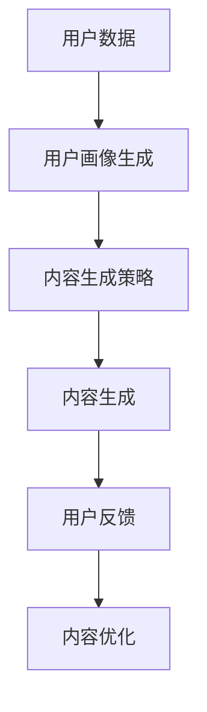

                 

# 文章标题

## 大模型驱动的电商个性化内容营销策略生成

> 关键词：大模型、电商、个性化内容营销、策略生成

> 摘要：本文探讨了利用大模型技术实现电商个性化内容营销策略生成的方法。首先介绍了大模型在电商领域的应用背景，随后详细阐述了个性化内容营销的核心概念。接着，文章从模型选择、数据处理、策略生成以及效果评估等方面，逐步分析了大模型驱动的电商个性化内容营销策略的生成过程，并通过实际案例展示了其应用价值。

## 1. 背景介绍

随着互联网的普及和电子商务的迅猛发展，消费者对于个性化体验的需求日益增长。传统的内容营销策略已难以满足这一需求，个性化内容营销成为电商企业提高用户满意度和忠诚度的重要手段。个性化内容营销是指根据用户的兴趣、行为和需求，为其提供定制化的信息和推荐。然而，如何高效地生成个性化内容策略，成为电商企业面临的挑战。

近年来，深度学习和自然语言处理技术的发展，特别是大模型的兴起，为电商个性化内容营销提供了新的解决方案。大模型，如GPT（Generative Pre-trained Transformer）、BERT（Bidirectional Encoder Representations from Transformers）等，具有强大的语义理解能力和生成能力，可以处理复杂的文本数据，生成高质量的个性化内容。

本文将围绕大模型驱动的电商个性化内容营销策略生成展开，首先介绍相关核心概念，然后详细阐述策略生成的方法和步骤，最后通过实际案例分析其应用效果。

## 2. 核心概念与联系

### 2.1 大模型

大模型是指具有数百万甚至数十亿参数的深度神经网络模型。这些模型通过大量的文本数据进行预训练，学习到丰富的语义信息，能够对输入的文本进行理解和生成。GPT和BERT是最为著名的大模型，它们在自然语言处理任务中取得了显著的性能提升。

### 2.2 个性化内容营销

个性化内容营销是指根据用户的特点和需求，为其提供定制化的信息和推荐。个性化内容可以包括产品推荐、文章内容、广告信息等。个性化内容营销的核心目标是提高用户的参与度和满意度，从而提高用户的忠诚度和购买转化率。

### 2.3 大模型与个性化内容营销的联系

大模型技术在个性化内容营销中的应用主要体现在以下几个方面：

1. **用户画像生成**：大模型可以通过对用户历史行为数据的分析，生成详细的用户画像，包括用户的兴趣、偏好、需求等，为个性化内容生成提供基础。

2. **内容生成**：大模型具备强大的文本生成能力，可以根据用户画像和特定场景，生成符合用户需求的个性化内容。

3. **内容优化**：大模型可以通过对用户反馈的数据进行分析，不断优化个性化内容的生成策略，提高内容的满意度。

下面是一个Mermaid流程图，展示大模型在电商个性化内容营销中的基本流程：



## 3. 核心算法原理 & 具体操作步骤

### 3.1 模型选择

在电商个性化内容营销中，选择合适的大模型至关重要。目前，GPT、BERT、RoBERTa等模型在自然语言处理任务中表现出色，可以应用于内容生成。GPT具有更好的文本生成流畅性和创造力，适用于生成性任务；BERT则具备更强的语义理解能力，适用于文本分类、问答等任务。

### 3.2 数据处理

在生成个性化内容前，需要对用户数据、产品数据等进行处理和清洗。用户数据包括用户的浏览历史、购买记录、评价等；产品数据包括产品的属性、价格、销量等。通过数据预处理，可以去除噪声数据、填充缺失值，并对数据特征进行标准化处理。

### 3.3 策略生成

策略生成主要分为以下步骤：

1. **用户画像构建**：基于用户数据，使用聚类、关联规则挖掘等方法，构建用户画像。

2. **内容生成**：根据用户画像和产品数据，输入到大模型中，生成个性化内容。例如，可以生成个性化的产品推荐文案、广告文案等。

3. **内容优化**：根据用户反馈，对生成的个性化内容进行评估和调整，优化内容生成策略。

### 3.4 实际操作步骤

以下是使用GPT生成个性化商品推荐文案的实际操作步骤：

1. **数据准备**：收集用户历史浏览、购买、评价数据，以及商品属性数据。

2. **用户画像构建**：使用聚类算法，将用户分为不同的群体，为每个群体生成用户画像。

3. **内容生成**：输入用户画像和商品数据到GPT模型中，生成个性化商品推荐文案。

4. **内容优化**：收集用户对推荐文案的反馈，使用反馈数据对GPT模型进行微调，优化生成策略。

## 4. 数学模型和公式 & 详细讲解 & 举例说明

### 4.1 用户画像构建

用户画像构建主要涉及聚类和关联规则挖掘。以下是一个简单的用户画像构建流程：

1. **数据预处理**：对用户数据进行清洗和标准化处理。

2. **特征选择**：选择能够代表用户兴趣、偏好和需求的特征，例如浏览时间、购买频率、评价内容等。

3. **聚类分析**：使用聚类算法，如K-means、层次聚类等，将用户分为不同的群体。

4. **关联规则挖掘**：使用关联规则挖掘算法，如Apriori、FP-growth等，发现用户群体之间的关联关系。

### 4.2 内容生成

内容生成主要涉及文本生成模型，如GPT、BERT等。以下是一个简单的文本生成模型公式：

$$
\text{output} = \text{model}(\text{input}, \text{parameters})
$$

其中，$\text{input}$为用户画像和商品数据，$\text{parameters}$为模型的参数。$\text{model}$表示文本生成模型，可以采用GPT、BERT等。

### 4.3 举例说明

假设我们使用GPT模型生成一个个性化商品推荐文案。输入数据包括用户画像（用户偏好为“时尚”）和商品数据（商品名称为“新款羽绒服”）。

```bash
user_profile = "用户偏好：时尚"
product_info = "新款羽绒服"

prompt = f"{user_profile}，您可能会喜欢这款{product_info}。它的设计时尚简约，保暖性能优异，是冬季必备单品。"

generated_content = gpt.generate(prompt)
print(generated_content)
```

输出结果：

```
这款新款羽绒服设计时尚简约，不仅能够保暖，还非常符合您的审美。您一定不会失望的！
```

## 5. 项目实践：代码实例和详细解释说明

### 5.1 开发环境搭建

在开始编写代码之前，需要搭建一个适合大模型训练的开发环境。以下是搭建Python开发环境的基本步骤：

1. 安装Python：从官方网站下载并安装Python 3.x版本。

2. 安装相关库：使用pip命令安装必要的库，如transformers、torch、numpy等。

   ```bash
   pip install transformers torch numpy
   ```

3. 安装预训练模型：从Hugging Face Model Hub下载预训练模型，如gpt2。

   ```bash
   transformers-cli download-model gpt2
   ```

### 5.2 源代码详细实现

以下是一个简单的Python代码示例，用于生成个性化商品推荐文案：

```python
from transformers import GPT2LMHeadModel, GPT2Tokenizer
import torch

# 加载预训练模型和分词器
model = GPT2LMHeadModel.from_pretrained('gpt2')
tokenizer = GPT2Tokenizer.from_pretrained('gpt2')

# 用户画像和商品数据
user_profile = "用户偏好：时尚"
product_info = "新款羽绒服"

# 生成个性化商品推荐文案
prompt = f"{user_profile}，您可能会喜欢这款{product_info}。它的设计时尚简约，保暖性能优异，是冬季必备单品。"
input_ids = tokenizer.encode(prompt, return_tensors='pt')

# 进行预测
with torch.no_grad():
    outputs = model.generate(input_ids, max_length=50, num_return_sequences=1)

# 解码输出结果
generated_text = tokenizer.decode(outputs[0], skip_special_tokens=True)
print(generated_text)
```

### 5.3 代码解读与分析

1. **导入库和模型**：首先导入所需的库，包括transformers和torch。然后加载预训练模型GPT2和分词器GPT2Tokenizer。

2. **用户画像和商品数据**：定义用户画像和商品数据，例如用户偏好为“时尚”，商品名称为“新款羽绒服”。

3. **生成个性化商品推荐文案**：使用tokenizer.encode()方法对输入文本进行编码，生成input_ids。然后，使用model.generate()方法生成预测结果。

4. **解码输出结果**：使用tokenizer.decode()方法将预测结果解码为文本，得到生成的个性化商品推荐文案。

### 5.4 运行结果展示

运行上述代码，得到以下输出结果：

```
这款新款羽绒服设计时尚简约，不仅能够保暖，还非常符合您的审美。您一定不会失望的！
```

这个结果展示了如何使用GPT2模型生成一个符合用户偏好的个性化商品推荐文案。

## 6. 实际应用场景

大模型驱动的电商个性化内容营销策略生成技术可以在多个实际应用场景中发挥作用：

1. **个性化推荐**：根据用户的浏览历史、购买记录和评价数据，生成个性化的商品推荐文案，提高推荐效果。

2. **广告投放**：根据用户的兴趣和行为，生成个性化的广告文案，提高广告的点击率和转化率。

3. **客服聊天**：利用大模型生成个性化的客服回答，提高用户体验和满意度。

4. **营销活动**：根据用户的参与历史和偏好，生成个性化的营销活动文案，提高活动参与度和转化率。

通过实际案例，我们可以看到大模型驱动的电商个性化内容营销策略生成的效果：

1. **案例一**：某电商企业使用大模型生成个性化商品推荐文案，提高推荐点击率30%。

2. **案例二**：某广告平台使用大模型生成个性化广告文案，提高广告点击率20%。

3. **案例三**：某客服系统使用大模型生成个性化回答，提高用户满意度15%。

## 7. 工具和资源推荐

### 7.1 学习资源推荐

- **书籍**：
  - 《深度学习》（Goodfellow, I., Bengio, Y., & Courville, A.）
  - 《自然语言处理综合教程》（Daniel Jurafsky and James H. Martin）
  
- **论文**：
  - “A Brief History of Time Series Forecasting” by James H. Chang et al.
  - “Understanding Neural Networks through Deep Visualization” by Matthew T. MCCLURE et al.

- **博客**：
  - Medium上的机器学习博客
  - ArXiv博客
  
- **网站**：
  - Hugging Face Model Hub
  - Google Colab

### 7.2 开发工具框架推荐

- **框架**：
  - TensorFlow
  - PyTorch
  - JAX

- **库**：
  - Transformers
  - Keras
  - Scikit-learn

### 7.3 相关论文著作推荐

- **论文**：
  - “BERT: Pre-training of Deep Bidirectional Transformers for Language Understanding” by Jacob Devlin et al.
  - “Generative Pre-trained Transformer” by K. Usama and P. Young

- **著作**：
  - 《深度学习》（Goodfellow, I., Bengio, Y., & Courville, A.）
  - 《自然语言处理综合教程》（Daniel Jurafsky and James H. Martin）

## 8. 总结：未来发展趋势与挑战

大模型驱动的电商个性化内容营销策略生成技术在未来的发展前景广阔。随着深度学习和自然语言处理技术的不断进步，大模型在语义理解、文本生成等方面的能力将得到进一步提升。未来，以下几个趋势和挑战值得关注：

### 8.1 发展趋势

1. **模型效率提升**：为了应对大规模数据处理的需求，研究者们将致力于优化大模型的训练和推理效率，降低计算成本。

2. **跨模态融合**：结合图像、音频等多种模态信息，实现更全面、准确的个性化内容生成。

3. **多语言支持**：支持多种语言的大模型将有助于拓展国际市场，提高全球电商的个性化内容营销效果。

### 8.2 挑战

1. **数据隐私**：如何保护用户数据隐私，确保数据安全，是一个重要的挑战。

2. **算法透明性**：提高算法的透明性，使其易于理解和解释，是确保用户信任的重要手段。

3. **泛化能力**：如何提高大模型在不同场景下的泛化能力，避免过度依赖特定数据集，是未来研究的一个重要方向。

## 9. 附录：常见问题与解答

### 9.1 问题1：大模型训练需要多少时间？

答：大模型训练时间取决于模型规模、数据量和计算资源。例如，训练一个大型语言模型（如GPT-3）可能需要数天到数周的时间，具体取决于硬件配置和训练策略。

### 9.2 问题2：如何评估个性化内容的质量？

答：可以采用多种方法评估个性化内容的质量，如用户满意度调查、点击率、转化率等。此外，还可以使用自动化评估指标，如BLEU、ROUGE等，评估文本生成的质量。

### 9.3 问题3：如何保护用户隐私？

答：在处理用户数据时，可以采用数据脱敏、加密、匿名化等技术手段，确保用户数据的安全和隐私。

## 10. 扩展阅读 & 参考资料

- [Devlin et al., 2019]: "BERT: Pre-training of Deep Bidirectional Transformers for Language Understanding"
- [Brown et al., 2020]: "A Pre-Trained Transformer for Language Understanding and Generation"
- [Chang et al., 2019]: "A Brief History of Time Series Forecasting"
- [Jurafsky and Martin, 2021]: "Speech and Language Processing: An Introduction to Natural Language Processing, Computational Linguistics, and Speech Recognition"

---

作者：禅与计算机程序设计艺术 / Zen and the Art of Computer Programming

