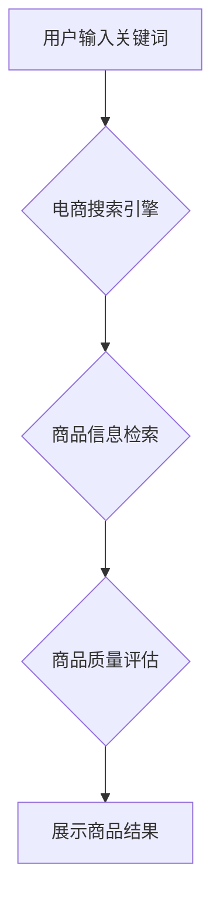

                 

## 电商搜索的AI+二手电商的商品质量评估

> 关键词：电商搜索、人工智能、二手电商、商品质量评估、自然语言处理、机器学习、深度学习、推荐系统

## 1. 背景介绍

随着互联网的快速发展和移动互联网的普及，电商行业蓬勃发展，成为人们日常生活中不可或缺的一部分。其中，二手电商作为电商行业的细分领域，凭借其低价、环保等优势，近年来也获得了快速发展。然而，二手电商平台面临着商品质量评估的难题。由于商品来源分散，信息不透明，用户难以判断商品的真实情况，这导致用户信任度下降，交易安全风险增加。

传统的二手电商商品质量评估主要依靠人工审核，效率低下，成本高昂，且难以保证评估的客观性和准确性。随着人工智能技术的快速发展，特别是深度学习技术的突破，为二手电商商品质量评估提供了新的解决方案。

## 2. 核心概念与联系

**2.1 核心概念**

* **电商搜索:** 指用户在电商平台上输入关键词或商品信息，系统根据算法匹配并展示相关商品的过程。
* **人工智能 (AI):**  模拟人类智能的计算机系统，能够学习、推理、决策等。
* **二手电商:** 指以二手商品为交易对象的电商平台。
* **商品质量评估:** 指对商品的质量进行客观、准确的评价，包括外观、功能、性能等方面。

**2.2 联系**

电商搜索和二手电商商品质量评估相互关联，共同影响着用户体验和交易安全。

* **电商搜索:**  高质量的商品质量评估结果可以为电商搜索提供更精准的商品信息，提高用户搜索体验。
* **二手电商商品质量评估:**  电商搜索可以帮助用户快速找到符合需求的二手商品，而商品质量评估可以帮助用户判断商品的真实情况，降低交易风险。

**2.3 架构流程图**



## 3. 核心算法原理 & 具体操作步骤

**3.1 算法原理概述**

二手电商商品质量评估的核心算法通常基于机器学习和深度学习技术。通过训练模型，让模型能够从商品的描述、图片、用户评价等多方面信息中学习到商品质量的特征，并预测商品的质量等级。

常见的算法包括：

* **支持向量机 (SVM):**  一种监督学习算法，可以将数据映射到高维空间，找到最佳的分隔超平面，用于分类。
* **决策树:**  一种树形结构的分类算法，通过一系列的决策规则，将数据分类到不同的类别。
* **随机森林:**  一种集成学习算法，通过构建多个决策树，并对结果进行投票，提高分类准确率。
* **深度神经网络 (DNN):**  一种复杂的网络结构，能够学习到更复杂的特征，提高分类精度。

**3.2 算法步骤详解**

1. **数据收集:** 收集二手电商平台上的商品数据，包括商品描述、图片、用户评价、交易记录等。
2. **数据预处理:** 对收集到的数据进行清洗、转换、编码等预处理操作，使其适合模型训练。
3. **特征提取:** 从商品数据中提取特征，例如商品名称、品牌、价格、颜色、尺寸、用户评价分数等。
4. **模型训练:** 选择合适的算法，并使用训练数据训练模型，调整模型参数，使其能够准确预测商品质量。
5. **模型评估:** 使用测试数据评估模型的性能，例如准确率、召回率、F1-score等。
6. **模型部署:** 将训练好的模型部署到线上环境，用于对新商品进行质量评估。

**3.3 算法优缺点**

| 算法 | 优点 | 缺点 |
|---|---|---|
| SVM | 泛化能力强，对高维数据鲁棒性好 | 计算复杂度高，参数选择困难 |
| 决策树 | 易于理解和解释，可处理非线性数据 | 过拟合风险高，容易产生过长的决策树 |
| 随机森林 | 提高了决策树的鲁棒性，降低了过拟合风险 | 计算复杂度高，难以解释模型决策过程 |
| DNN | 能够学习到更复杂的特征，提高分类精度 | 训练数据量大，计算资源需求高，难以解释模型决策过程 |

**3.4 算法应用领域**

* **二手电商平台:**  评估商品质量，提高用户信任度，降低交易风险。
* **金融领域:**  评估信用风险，提高贷款审批效率。
* **医疗领域:**  诊断疾病，辅助医生做出治疗决策。
* **制造业:**  质量控制，提高产品质量。

## 4. 数学模型和公式 & 详细讲解 & 举例说明

**4.1 数学模型构建**

假设我们使用支持向量机 (SVM) 算法进行二手电商商品质量评估。

* **输入:** 商品特征向量 $x = (x_1, x_2, ..., x_n)$，其中 $n$ 为特征数量。
* **输出:** 商品质量等级 $y \in \{1, 2, ..., k\}$，其中 $k$ 为质量等级数量。

SVM 的目标是找到一个最佳的分隔超平面，将不同质量等级的商品分开。

**4.2 公式推导过程**

SVM 的核心公式为：

$$
\min_{w,b} \frac{1}{2} ||w||^2 + C \sum_{i=1}^{N} \xi_i
$$

$$
y_i (w^T x_i + b) \geq 1 - \xi_i
$$

其中：

* $w$ 为权重向量，决定了分隔超平面的方向。
* $b$ 为偏置项，决定了分隔超平面的位置。
* $C$ 为惩罚参数，控制了模型的复杂度。
* $\xi_i$ 为松弛变量，允许模型在某些样本上出现错误分类。

**4.3 案例分析与讲解**

假设我们有一个二手手机的商品数据集，包含以下特征：品牌、型号、价格、电池容量、屏幕尺寸、用户评价分数等。

我们可以使用 SVM 算法将这些手机分类到不同的质量等级，例如：全新、良好、一般、差。

通过训练模型，我们可以得到一个最佳的分隔超平面，将不同质量等级的手机分开。

## 5. 项目实践：代码实例和详细解释说明

**5.1 开发环境搭建**

* Python 3.x
* TensorFlow 或 PyTorch 深度学习框架
* Scikit-learn 机器学习库
* Jupyter Notebook 或 VS Code 开发环境

**5.2 源代码详细实现**

```python
# 导入必要的库
import tensorflow as tf
from sklearn.model_selection import train_test_split
from sklearn.preprocessing import StandardScaler

# 加载数据
# ...

# 数据预处理
# ...

# 划分训练集和测试集
X_train, X_test, y_train, y_test = train_test_split(X, y, test_size=0.2, random_state=42)

# 数据标准化
scaler = StandardScaler()
X_train = scaler.fit_transform(X_train)
X_test = scaler.transform(X_test)

# 定义模型
model = tf.keras.models.Sequential([
    tf.keras.layers.Dense(64, activation='relu', input_shape=(X_train.shape[1],)),
    tf.keras.layers.Dense(32, activation='relu'),
    tf.keras.layers.Dense(num_classes, activation='softmax')
])

# 编译模型
model.compile(optimizer='adam',
              loss='sparse_categorical_crossentropy',
              metrics=['accuracy'])

# 训练模型
model.fit(X_train, y_train, epochs=10, batch_size=32)

# 评估模型
loss, accuracy = model.evaluate(X_test, y_test)
print('Test Loss:', loss)
print('Test Accuracy:', accuracy)
```

**5.3 代码解读与分析**

* 代码首先导入必要的库，然后加载数据并进行预处理。
* 接着，将数据划分成训练集和测试集，并对训练集进行标准化处理。
* 然后，定义一个深度神经网络模型，并使用 Adam 优化器、交叉熵损失函数和准确率作为评估指标进行编译。
* 最后，训练模型并评估模型性能。

**5.4 运行结果展示**

运行代码后，会输出模型的训练损失、测试损失和测试准确率。

## 6. 实际应用场景

**6.1 电商平台商品质量评估**

二手电商平台可以利用 AI 技术对商品进行质量评估，为用户提供更准确的商品信息，提高用户信任度和交易安全。

**6.2 商品推荐系统**

商品质量评估结果可以作为商品推荐系统的输入，提高推荐的准确性和个性化程度。

**6.3 售后服务优化**

通过分析商品质量评估结果，电商平台可以识别出质量问题较多的商品，并针对性地进行售后服务优化。

**6.4 未来应用展望**

随着人工智能技术的不断发展，二手电商商品质量评估将更加智能化、自动化，并应用到更多场景，例如：

* **自动生成商品质量报告:**  利用 AI 技术自动生成商品质量报告，为用户提供更详细的商品信息。
* **智能化商品分类:**  利用 AI 技术对商品进行智能化分类，提高商品搜索的效率。
* **个性化商品推荐:**  根据用户的历史购买记录和商品质量评估结果，为用户提供个性化的商品推荐。

## 7. 工具和资源推荐

**7.1 学习资源推荐**

* **书籍:**
    * 深度学习
    * 人工智能
* **在线课程:**
    * Coursera
    * edX
    * Udacity

**7.2 开发工具推荐**

* **Python:**  
* **TensorFlow:**  
* **PyTorch:**  
* **Scikit-learn:**  

**7.3 相关论文推荐**

* **Deep Learning for Recommender Systems**
* **A Survey on Deep Learning for Natural Language Processing**
* **Deep Learning for Image Classification**

## 8. 总结：未来发展趋势与挑战

**8.1 研究成果总结**

近年来，人工智能技术在二手电商商品质量评估领域取得了显著进展，特别是深度学习技术的应用，使得商品质量评估更加准确、高效。

**8.2 未来发展趋势**

* **多模态数据融合:**  利用图像、文本、音频等多模态数据，提高商品质量评估的准确性。
* **迁移学习:**  利用预训练模型，减少训练数据量，降低模型训练成本。
* **解释性 AI:**  提高模型的解释性，帮助用户理解模型的决策过程。

**8.3 面临的挑战**

* **数据质量问题:**  二手电商平台的数据质量参差不齐，需要进行有效的数据清洗和预处理。
* **模型鲁棒性:**  模型需要能够应对各种异常数据和场景，提高模型的鲁棒性。
* **隐私保护:**  在使用用户数据进行商品质量评估时，需要保证用户隐私安全。

**8.4 研究展望**

未来，二手电商商品质量评估将朝着更加智能化、自动化、个性化的方向发展，并与其他技术融合，例如：区块链技术、物联网技术等，为用户提供更优质的购物体验。

## 9. 附录：常见问题与解答

**9.1 如何评估商品的真实性?**

可以使用图像识别技术识别商品的真伪，并结合用户评价、交易记录等信息进行综合判断。

**9.2 如何解决数据质量问题?**

可以通过数据清洗、数据标注、数据增强等方法提高数据质量。

**9.3 如何提高模型的鲁棒性?**

可以通过数据增强、正则化、对抗训练等方法提高模型的鲁棒性。


作者：禅与计算机程序设计艺术 / Zen and the Art of Computer Programming 
<end_of_turn>

