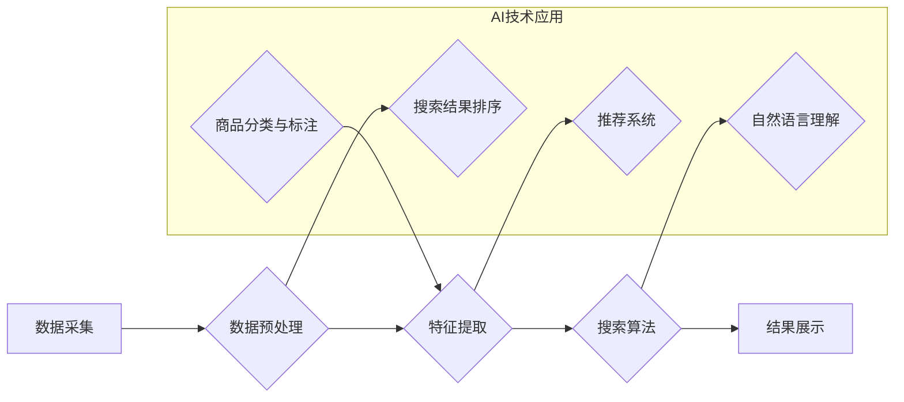

                 

## 电商搜索的AI性能优化与加速

> 关键词：电商搜索、AI优化、性能加速、推荐系统、深度学习、自然语言处理、搜索引擎

## 1. 背景介绍

在当今数字经济时代，电商平台已成为人们购物的首选方式。高效、精准的搜索体验是电商平台的核心竞争力之一，直接影响着用户粘性和转化率。传统基于关键词匹配的搜索算法难以满足用户日益复杂的搜索需求，例如长尾关键词、语义理解、个性化推荐等。

近年来，人工智能（AI）技术在电商搜索领域取得了显著进展，为提升搜索性能和用户体验提供了新的机遇。AI技术能够分析用户行为、商品特征、搜索意图等海量数据，构建更智能、更精准的搜索模型，从而实现搜索结果的个性化、智能化和精准化。

## 2. 核心概念与联系

### 2.1 电商搜索系统架构

电商搜索系统通常由以下几个核心模块组成：

* **数据采集与存储:** 收集商品信息、用户行为数据、搜索日志等数据，并将其存储在高效的数据库中。
* **数据预处理:** 对采集到的数据进行清洗、转换、格式化等处理，使其能够被搜索算法有效利用。
* **特征提取:** 从商品信息、用户行为数据等中提取特征，例如商品标题、描述、价格、用户评分、浏览历史等，用于构建商品的语义表示。
* **搜索算法:** 根据用户的搜索词和商品特征，进行匹配和排序，返回最相关的搜索结果。
* **结果展示:** 将搜索结果以用户友好的方式展示，例如列表、卡片、图文混排等。

### 2.2 AI技术在电商搜索中的应用

AI技术在电商搜索系统中主要应用于以下几个方面：

* **搜索结果排序:** 利用机器学习算法，根据用户的搜索历史、浏览记录、购买行为等信息，对搜索结果进行个性化排序，提升用户体验。
* **推荐系统:** 基于用户的兴趣偏好、购买历史等数据，推荐相关商品，提高用户转化率。
* **自然语言理解:** 理解用户的搜索意图，即使用户使用模糊或不规范的语言，也能准确返回相关结果。
* **商品分类与标注:** 利用深度学习算法，自动识别商品类别和属性，提高商品信息准确性和可搜索性。

### 2.3 AI优化与加速

AI技术本身对计算资源需求较高，因此在电商搜索系统中，需要进行AI性能优化和加速，以确保系统能够高效运行。

**Mermaid 流程图:**



## 3. 核心算法原理 & 具体操作步骤

### 3.1 算法原理概述

在电商搜索领域，常用的AI算法包括：

* **深度学习:** 利用多层神经网络，从海量数据中学习复杂的特征表示，用于搜索结果排序、推荐系统、自然语言理解等任务。
* **机器学习:** 利用统计学方法，从数据中学习模型，用于搜索结果排序、用户画像分析等任务。
* **图神经网络:** 利用图结构数据，学习商品之间的关系，用于商品推荐、搜索结果关联分析等任务。

### 3.2 算法步骤详解

以深度学习算法为例，其具体操作步骤如下：

1. **数据收集与预处理:** 收集电商平台的商品信息、用户行为数据、搜索日志等数据，并进行清洗、转换、格式化等预处理。
2. **特征工程:** 从数据中提取特征，例如商品标题、描述、价格、用户评分、浏览历史等，并将其转换为深度学习模型可以理解的格式。
3. **模型构建:** 选择合适的深度学习模型，例如深度神经网络、卷积神经网络、循环神经网络等，并根据任务需求进行模型设计和参数设置。
4. **模型训练:** 利用训练数据，训练深度学习模型，使其能够学习到商品特征和用户行为之间的关系。
5. **模型评估:** 利用测试数据，评估模型的性能，例如准确率、召回率、F1-score等。
6. **模型部署:** 将训练好的模型部署到电商搜索系统中，用于搜索结果排序、推荐系统等任务。

### 3.3 算法优缺点

**深度学习算法:**

* **优点:** 能够学习到复杂的特征表示，性能优于传统机器学习算法。
* **缺点:** 对数据需求量大，训练时间长，模型解释性差。

**机器学习算法:**

* **优点:** 数据需求量相对较小，训练时间短，模型解释性强。
* **缺点:** 难以学习到复杂的特征表示，性能不如深度学习算法。

### 3.4 算法应用领域

深度学习和机器学习算法广泛应用于电商搜索的各个环节，例如：

* **搜索结果排序:** 根据用户的搜索历史、浏览记录、购买行为等信息，对搜索结果进行个性化排序。
* **推荐系统:** 基于用户的兴趣偏好、购买历史等数据，推荐相关商品。
* **自然语言理解:** 理解用户的搜索意图，即使用户使用模糊或不规范的语言，也能准确返回相关结果。
* **商品分类与标注:** 利用深度学习算法，自动识别商品类别和属性，提高商品信息准确性和可搜索性。

## 4. 数学模型和公式 & 详细讲解 & 举例说明

### 4.1 数学模型构建

在电商搜索中，常用的数学模型包括：

* **余弦相似度:** 用于衡量商品特征向量之间的相似度。

$$
\text{cosine similarity}(A, B) = \frac{A \cdot B}{||A|| ||B||}
$$

其中，A和B是两个商品特征向量，$A \cdot B$是它们的点积，$||A||$和$||B||$分别是它们的模长。

* **BM25:** 用于衡量查询词和文档之间的相关性。

$$
\text{BM25}(Q, D) = \sum_{t \in Q} \frac{tf_{t, D} (k_1 + 1) }{tf_{t, D} + k_1 (1 - b + b \frac{dl}{avgdl})}
$$

其中，Q是查询词，D是文档，$tf_{t, D}$是文档D中词t的词频，$k_1$和$k_2$是BM25算法的参数，$dl$是文档D的长度，$avgdl$是所有文档的平均长度。

### 4.2 公式推导过程

余弦相似度的公式推导过程如下：

1. 两个向量A和B的点积表示为：

$$
A \cdot B = \sum_{i=1}^{n} a_i b_i
$$

2. 向量A和B的模长分别为：

$$
||A|| = \sqrt{\sum_{i=1}^{n} a_i^2}
$$

$$
||B|| = \sqrt{\sum_{i=1}^{n} b_i^2}
$$

3. 将点积和模长代入余弦相似度的公式：

$$
\text{cosine similarity}(A, B) = \frac{A \cdot B}{||A|| ||B||} = \frac{\sum_{i=1}^{n} a_i b_i}{\sqrt{\sum_{i=1}^{n} a_i^2} \sqrt{\sum_{i=1}^{n} b_i^2}}
$$

### 4.3 案例分析与讲解

假设有两个商品，商品A的特征向量为[1, 2, 3], 商品B的特征向量为[2, 3, 1]，则它们的余弦相似度为：

$$
\text{cosine similarity}(A, B) = \frac{1 \cdot 2 + 2 \cdot 3 + 3 \cdot 1}{\sqrt{1^2 + 2^2 + 3^2} \sqrt{2^2 + 3^2 + 1^2}} = \frac{11}{\sqrt{14} \sqrt{14}} = \frac{11}{14} \approx 0.79
$$

该结果表明，商品A和商品B之间的相似度较高。

## 5. 项目实践：代码实例和详细解释说明

### 5.1 开发环境搭建

* **操作系统:** Ubuntu 20.04
* **编程语言:** Python 3.8
* **深度学习框架:** TensorFlow 2.0
* **其他工具:** Jupyter Notebook、Git

### 5.2 源代码详细实现

```python
import tensorflow as tf

# 定义模型
model = tf.keras.Sequential([
    tf.keras.layers.Embedding(input_dim=10000, output_dim=128),
    tf.keras.layers.LSTM(units=64),
    tf.keras.layers.Dense(units=1, activation='sigmoid')
])

# 编译模型
model.compile(optimizer='adam', loss='binary_crossentropy', metrics=['accuracy'])

# 训练模型
model.fit(x_train, y_train, epochs=10)

# 评估模型
loss, accuracy = model.evaluate(x_test, y_test)
print('Loss:', loss)
print('Accuracy:', accuracy)
```

### 5.3 代码解读与分析

* **Embedding层:** 将词向量表示为稠密的向量，用于捕捉词语之间的语义关系。
* **LSTM层:** 利用循环神经网络结构，学习文本序列中的长短时依赖关系。
* **Dense层:** 全连接层，用于将LSTM层的输出映射到输出层。
* **sigmoid激活函数:** 用于将输出值映射到0到1之间，用于二分类任务。

### 5.4 运行结果展示

训练完成后，可以利用测试数据评估模型的性能，例如准确率、召回率等。

## 6. 实际应用场景

### 6.1 个性化搜索结果排序

根据用户的搜索历史、浏览记录、购买行为等数据，对搜索结果进行个性化排序，推荐用户感兴趣的商品。

### 6.2 智能商品推荐

利用用户的兴趣偏好、购买历史等数据，推荐相关商品，提高用户转化率。

### 6.3 语义理解与搜索

理解用户的搜索意图，即使用户使用模糊或不规范的语言，也能准确返回相关结果。

### 6.4 未来应用展望

* **多模态搜索:** 将文本、图像、视频等多种数据类型融合，实现更智能、更精准的搜索体验。
* **实时搜索:** 利用实时数据流，实现对搜索结果的实时更新，提供更及时、更准确的信息。
* **个性化搜索助手:** 基于用户的搜索习惯和偏好，提供个性化的搜索助手，帮助用户快速找到所需信息。

## 7. 工具和资源推荐

### 7.1 学习资源推荐

* **书籍:**
    * 《深度学习》
    * 《机器学习实战》
    * 《自然语言处理》
* **在线课程:**
    * Coursera
    * edX
    * Udacity

### 7.2 开发工具推荐

* **深度学习框架:** TensorFlow, PyTorch, Keras
* **数据处理工具:** Pandas, NumPy
* **云计算平台:** AWS, Azure, Google Cloud

### 7.3 相关论文推荐

* **BERT:** Devlin, J., Chang, M. W., Lee, K., & Toutanova, K. (2018). BERT: Pre-training of deep bidirectional transformers for language understanding. arXiv preprint arXiv:1810.04805.
* **Transformer:** Vaswani, A., Shazeer, N., Parmar, N., Uszkoreit, J., Jones, L., Gomez, A. N., ... & Polosukhin, I. (2017). Attention is all you need. In Advances in neural information processing systems (pp. 5998-6008).

## 8. 总结：未来发展趋势与挑战

### 8.1 研究成果总结

近年来，AI技术在电商搜索领域取得了显著进展，例如深度学习算法的应用、推荐系统的个性化、语义理解的提升等。这些成果为用户提供了更智能、更精准的搜索体验，提升了电商平台的竞争力。

### 8.2 未来发展趋势

* **多模态搜索:** 将文本、图像、视频等多种数据类型融合，实现更智能、更精准的搜索体验。
* **实时搜索:** 利用实时数据流，实现对搜索结果的实时更新，提供更及时、更准确的信息。
* **个性化搜索助手:** 基于用户的搜索习惯和偏好，提供个性化的搜索助手，帮助用户快速找到所需信息。

### 8.3 面临的挑战

* **数据质量:** AI算法对数据质量要求较高，需要高质量、丰富的数据支持。
* **模型解释性:** 深度学习模型的内部机制复杂，难以解释模型的决策过程，这可能会导致模型的不可信和不可控。
* **计算资源:** AI算法训练和部署需要大量的计算资源，这可能会导致成本高昂。

### 8.4 研究展望

未来，电商搜索领域的研究将继续围绕以下几个方面展开：

* **开发更有效的AI算法:** 探索新的算法模型，提高搜索性能和效率。
* **提升数据质量:** 开发新的数据采集、清洗和预处理方法，提高数据质量。
* **增强模型解释性:** 研究可解释AI技术，提高模型的透明度和可信度。
* **降低计算成本:** 研究高效的模型压缩和加速技术，降低AI算法的计算成本。

## 9. 附录：常见问题与解答

* **Q1: 如何选择合适的AI算法？**

A1: 选择合适的AI算法需要根据具体任务需求、数据特点和计算资源等因素综合考虑。

* **Q2: 如何评估AI模型的性能？**

A2: 可以利用测试数据评估模型的性能，例如准确率、召回率、F1-score等。

* **Q3: 如何解决数据质量问题？**

A3: 可以通过数据清洗、数据预处理、数据增强等方法提高数据质量。


作者：禅与计算机程序设计艺术 / Zen and the Art of Computer Programming<end_of_turn>

