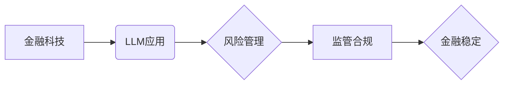

                 

## 监管合规：LLM 确保金融稳定

> 关键词：大型语言模型 (LLM)、金融稳定、监管合规、风险管理、人工智能伦理、反洗钱、欺诈检测、数据隐私

## 1. 背景介绍

金融科技的蓬勃发展，特别是大型语言模型 (LLM) 的出现，为金融行业带来了前所未有的机遇和挑战。LLM 凭借其强大的自然语言处理能力，在金融领域展现出广阔的应用前景，例如智能客服、风险评估、交易自动化等。然而，LLM 的应用也带来了新的监管合规问题，需要金融机构认真对待并采取有效措施确保金融稳定。

近年来，全球范围内对金融科技监管的关注度不断提高。监管机构致力于制定相应的法规和政策，引导金融科技发展，同时保障金融体系的稳定和安全。LLM 的应用涉及到大量敏感数据，如个人财务信息、交易记录等，其潜在的风险也更加突出。因此，监管合规成为 LLM 在金融领域的应用不可或缺的一部分。

## 2. 核心概念与联系

**2.1 核心概念**

* **大型语言模型 (LLM):** 训练数据量庞大，能够理解和生成人类语言的深度学习模型。
* **金融稳定:** 指金融体系能够有效地履行其职能，并抵抗各种冲击和风险的能力。
* **监管合规:** 指金融机构遵守相关法律法规和行业规范的行为。

**2.2 架构关系**



**2.3 联系分析**

LLM 的应用在金融科技领域具有巨大潜力，但同时也带来了新的风险。金融机构需要在利用 LLM 的优势的同时，有效地管理其带来的风险，并确保其应用符合监管要求，从而维护金融稳定。

## 3. 核心算法原理 & 具体操作步骤

**3.1 算法原理概述**

LLM 的核心算法原理是基于 Transformer 架构的深度神经网络。Transformer 模型通过自注意力机制，能够捕捉文本序列中的长距离依赖关系，从而实现更精准的语言理解和生成。

**3.2 算法步骤详解**

1. **数据预处理:** 收集和清洗金融数据，将其转换为模型可理解的格式。
2. **模型训练:** 使用 Transformer 架构的深度神经网络，对预处理后的数据进行训练，学习语言模式和金融知识。
3. **模型评估:** 使用测试数据评估模型的性能，并进行调优。
4. **模型部署:** 将训练好的模型部署到生产环境中，用于实际应用。

**3.3 算法优缺点**

* **优点:** 强大的语言理解和生成能力，能够处理复杂金融文本数据，提高效率和准确性。
* **缺点:** 训练数据量大，计算资源消耗高，模型解释性差，容易受到恶意攻击。

**3.4 算法应用领域**

* **智能客服:** 自动化处理客户咨询，提高服务效率。
* **风险评估:** 分析客户信用风险，帮助金融机构做出更明智的贷款决策。
* **交易自动化:** 自动化执行交易指令，提高交易效率和准确性。
* **欺诈检测:** 识别异常交易行为，防止金融欺诈。

## 4. 数学模型和公式 & 详细讲解 & 举例说明

**4.1 数学模型构建**

LLM 的训练过程本质上是一个优化问题，目标是找到模型参数，使得模型在训练数据上的预测结果与真实值尽可能接近。常用的损失函数是交叉熵损失函数，其公式如下：

$$
L = -\sum_{i=1}^{N} y_i \log(\hat{y}_i)
$$

其中：

* $L$ 为损失函数值
* $N$ 为样本数量
* $y_i$ 为真实标签
* $\hat{y}_i$ 为模型预测的概率

**4.2 公式推导过程**

交叉熵损失函数的推导过程基于信息论的原理。其本质是衡量模型预测结果与真实标签之间的信息差异。

**4.3 案例分析与讲解**

假设我们训练一个 LLM 用于识别金融欺诈交易。训练数据包含大量真实交易和欺诈交易的记录。模型的目标是学习识别欺诈交易的特征，并预测新交易是否为欺诈。

在训练过程中，模型会不断调整参数，使得预测结果与真实标签之间的差异最小化。当模型训练完成之后，它能够根据新的交易数据预测其是否为欺诈交易。

## 5. 项目实践：代码实例和详细解释说明

**5.1 开发环境搭建**

* Python 3.7+
* TensorFlow 或 PyTorch 深度学习框架
* CUDA 和 cuDNN (可选，用于 GPU 加速)

**5.2 源代码详细实现**

```python
# 使用 TensorFlow 框架实现 LLM 模型训练

import tensorflow as tf

# 定义模型结构
model = tf.keras.Sequential([
    tf.keras.layers.Embedding(input_dim=vocab_size, output_dim=embedding_dim),
    tf.keras.layers.LSTM(units=hidden_size),
    tf.keras.layers.Dense(units=1, activation='sigmoid')
])

# 编译模型
model.compile(optimizer='adam', loss='binary_crossentropy', metrics=['accuracy'])

# 训练模型
model.fit(x_train, y_train, epochs=10, batch_size=32)

# 评估模型
loss, accuracy = model.evaluate(x_test, y_test)
print('Loss:', loss)
print('Accuracy:', accuracy)
```

**5.3 代码解读与分析**

* 代码使用 TensorFlow 框架构建了一个简单的 LLM 模型。
* 模型结构包含 Embedding 层、LSTM 层和 Dense 层。
* Embedding 层将单词转换为向量表示。
* LSTM 层捕捉文本序列中的长距离依赖关系。
* Dense 层输出预测结果。
* 模型使用 Adam 优化器、交叉熵损失函数和准确率作为评估指标。

**5.4 运行结果展示**

训练完成后，模型能够根据新的交易数据预测其是否为欺诈交易。

## 6. 实际应用场景

**6.1 智能客服**

LLM 可以用于构建智能客服系统，自动处理客户咨询，例如查询账户余额、办理转账等。

**6.2 风险评估**

LLM 可以分析客户的信用历史、交易记录等数据，评估其信用风险，帮助金融机构做出更明智的贷款决策。

**6.3 交易自动化**

LLM 可以自动执行交易指令，例如股票交易、外汇交易等，提高交易效率和准确性。

**6.4 欺诈检测**

LLM 可以识别异常交易行为，例如高额交易、频繁交易等，帮助金融机构预防和打击金融欺诈。

**6.5 未来应用展望**

LLM 在金融领域的应用前景广阔，未来可能在以下方面得到进一步发展：

* 更精准的风险评估和预测
* 更智能的投资决策支持
* 更个性化的金融服务
* 更高效的金融监管

## 7. 工具和资源推荐

**7.1 学习资源推荐**

* **书籍:**
    * 《深度学习》
    * 《自然语言处理》
* **在线课程:**
    * Coursera: 深度学习
    * edX: 自然语言处理
* **开源项目:**
    * TensorFlow
    * PyTorch

**7.2 开发工具推荐**

* **IDE:** PyCharm, VS Code
* **深度学习框架:** TensorFlow, PyTorch
* **数据处理工具:** Pandas, NumPy

**7.3 相关论文推荐**

* **BERT:** Devlin et al. (2018)
* **GPT-3:** Brown et al. (2020)
* **LaMDA:** Google AI Blog (2021)

## 8. 总结：未来发展趋势与挑战

**8.1 研究成果总结**

LLM 在金融领域的应用取得了显著进展，例如智能客服、风险评估、交易自动化等。

**8.2 未来发展趋势**

LLM 的应用将更加广泛和深入，例如更精准的风险评估、更智能的投资决策支持、更个性化的金融服务等。

**8.3 面临的挑战**

* **数据安全和隐私保护:** LLM 的训练需要大量数据，如何确保数据安全和隐私保护是一个重要挑战。
* **模型解释性和可信度:** LLM 的决策过程往往难以解释，如何提高模型的解释性和可信度是一个关键问题。
* **算法公平性和偏见:** LLM 可能会受到训练数据中的偏见影响，导致不公平的决策结果，如何解决算法公平性和偏见问题是一个重要的研究方向。

**8.4 研究展望**

未来研究将重点关注以下几个方面：

* **开发更安全、更可靠的 LLM 模型**
* **提高模型的解释性和可信度**
* **解决算法公平性和偏见问题**
* **探索 LLM 在金融领域的更多应用场景**

## 9. 附录：常见问题与解答

**9.1 如何确保 LLM 模型的安全性？**

* 使用安全的训练数据，并进行数据脱敏处理。
* 对模型进行安全评估，识别潜在的漏洞。
* 使用安全机制，防止模型被恶意攻击。

**9.2 如何提高 LLM 模型的解释性和可信度？**

* 使用可解释的机器学习模型，例如规则模型、决策树等。
* 对模型进行可视化分析，帮助理解模型的决策过程。
* 使用人类专家进行模型评估和验证。

**9.3 如何解决 LLM 模型的算法公平性和偏见问题？**

* 使用公平性评估指标，监测模型的公平性。
* 使用公平性校正技术，减少模型的偏见。
* 构建更加多元化的训练数据，减少数据中的偏见。


作者：禅与计算机程序设计艺术 / Zen and the Art of Computer Programming 
<end_of_turn>

