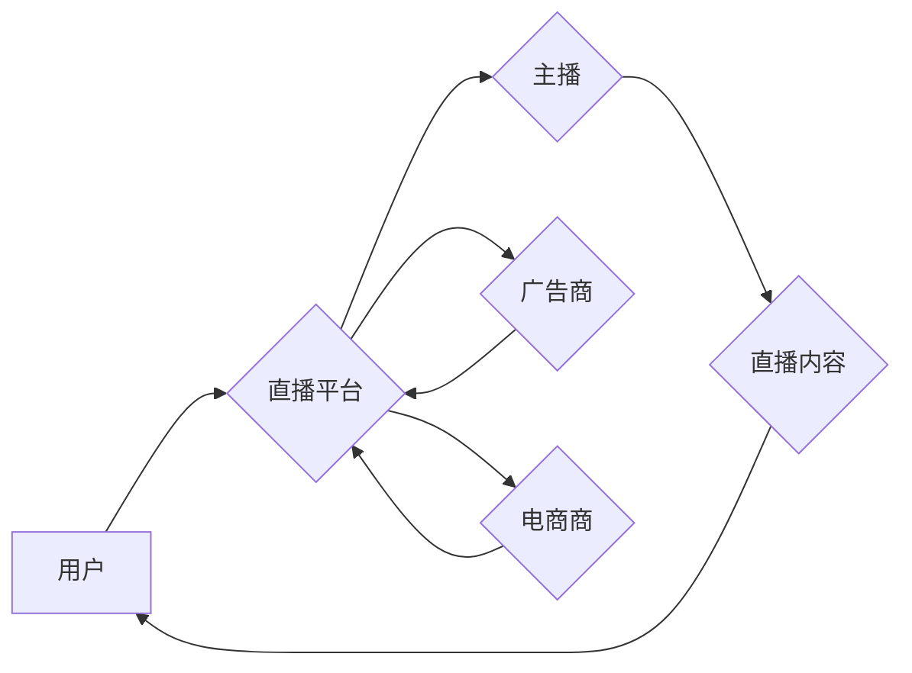

                 

## 直播经济创业：实时互动的商业模式

> 关键词：直播经济、实时互动、商业模式、技术架构、算法原理、项目实践、应用场景、未来趋势

## 1. 背景介绍

近年来，互联网技术的发展日新月异，移动互联网的普及更是催生了全新的商业模式。其中，直播经济作为一种以实时互动为核心的商业模式，迅速崛起，并取得了惊人的发展。直播经济涵盖了多种业务场景，例如直播购物、直播教育、直播娱乐等，其核心在于通过实时视频和音频传输，将主播与观众建立起直接的连接，实现信息传递、情感共鸣和商业交易。

直播经济的兴起，离不开以下几个因素的推动：

* **移动互联网的普及:** 智能手机的普及和高速网络的建设，为直播经济提供了坚实的基础设施。
* **短视频文化的兴起:** 短视频平台的火爆，培养了用户对实时内容的消费习惯。
* **社交媒体的融合:** 直播平台与社交媒体的深度融合，使得用户更容易参与和传播直播内容。
* **电商的升级:** 直播电商的模式创新，为用户提供了更便捷、更直观的购物体验。

## 2. 核心概念与联系

直播经济的核心概念包括：

* **主播:** 直播内容的生产者，通过实时视频和音频向观众展示内容。
* **观众:** 直播内容的消费者，可以通过观看、互动、评论等方式参与直播。
* **平台:** 提供直播技术支持和服务的基础设施，连接主播和观众。
* **内容:** 直播的主题和形式，例如游戏直播、美食直播、知识分享等。
* **互动:** 主播与观众之间的实时交流，例如聊天、问答、投票等。
* **商业化:** 直播平台通过广告、电商、会员等方式实现盈利。

直播经济的商业模式主要围绕着以下几个环节：

* **内容生产:** 主播创作优质的直播内容，吸引观众观看。
* **用户运营:** 平台通过各种活动和推广手段，吸引和留住用户。
* **广告投放:** 平台为商家提供广告投放机会，实现广告收入。
* **电商交易:** 平台为商家提供直播带货服务，实现电商交易收入。
* **会员服务:** 平台提供付费会员服务，例如观看独家内容、享受优先服务等。

**Mermaid 流程图**



## 3. 核心算法原理 & 具体操作步骤

### 3.1  算法原理概述

直播经济的核心算法主要围绕着以下几个方面：

* **内容推荐算法:** 根据用户的观看历史、兴趣偏好等信息，推荐用户感兴趣的直播内容。
* **互动推荐算法:** 根据用户的互动行为，例如点赞、评论、分享等，推荐与用户互动活跃的主播和内容。
* **直播匹配算法:** 根据主播和观众的地域、兴趣等信息，匹配合适的直播房间。
* **直播质量控制算法:** 通过检测直播内容的质量，例如画面清晰度、音频质量等，确保直播体验的流畅性和稳定性。

### 3.2  算法步骤详解

**内容推荐算法**

1. **数据收集:** 收集用户的观看历史、点赞、评论、分享等行为数据。
2. **特征提取:** 从用户行为数据中提取用户的兴趣偏好、观看习惯等特征。
3. **模型训练:** 使用机器学习算法，训练一个内容推荐模型。
4. **内容推荐:** 根据用户的特征，预测用户可能感兴趣的直播内容，并进行推荐。

**互动推荐算法**

1. **互动行为数据收集:** 收集用户的互动行为数据，例如点赞、评论、分享、打赏等。
2. **互动关系分析:** 分析用户之间的互动关系，例如谁点赞了谁的直播、谁评论了谁的直播等。
3. **互动推荐模型训练:** 使用机器学习算法，训练一个互动推荐模型。
4. **互动推荐:** 根据用户的互动行为，推荐与用户互动活跃的主播和内容。

### 3.3  算法优缺点

**优点:**

* **个性化推荐:** 能够根据用户的兴趣偏好，推荐更符合用户需求的内容。
* **提高用户粘性:** 通过精准推荐，提高用户观看直播的兴趣和粘性。
* **提升商业价值:** 为商家提供精准的广告投放机会，提升广告效果。

**缺点:**

* **数据依赖:** 需要大量的用户行为数据进行训练，否则推荐效果会下降。
* **算法偏差:** 算法可能会存在偏差，导致推荐结果不准确。
* **用户隐私:** 用户行为数据收集和使用可能会引发用户隐私问题。

### 3.4  算法应用领域

* **直播平台:** 内容推荐、互动推荐、直播匹配等。
* **电商平台:** 直播带货、商品推荐等。
* **教育平台:** 在线课程推荐、互动学习等。
* **娱乐平台:** 游戏直播、音乐直播等。

## 4. 数学模型和公式 & 详细讲解 & 举例说明

### 4.1  数学模型构建

**内容推荐模型:**

我们可以使用协同过滤算法构建内容推荐模型。协同过滤算法基于用户的历史行为数据，预测用户对未观看内容的兴趣。

**用户-物品交互矩阵:**

我们可以用一个用户-物品交互矩阵来表示用户的观看历史。矩阵中，行代表用户，列代表直播内容，矩阵元素表示用户对该内容的观看行为。例如，如果用户 A 观看过直播内容 B，则矩阵中 A 行 B 列的元素为 1，否则为 0。

**相似度计算:**

我们可以使用余弦相似度来计算用户之间的相似度。余弦相似度表示两个向量的夹角，夹角越小，相似度越高。

**推荐算法:**

根据用户的相似用户，推荐用户可能感兴趣的直播内容。

### 4.2  公式推导过程

**余弦相似度公式:**

$$
\text{相似度} = \frac{\mathbf{u} \cdot \mathbf{v}}{\|\mathbf{u}\| \|\mathbf{v}\|}
$$

其中，

* $\mathbf{u}$ 和 $\mathbf{v}$ 是两个用户的观看历史向量。
* $\mathbf{u} \cdot \mathbf{v}$ 是两个向量的点积。
* $\|\mathbf{u}\|$ 和 $\|\mathbf{v}\|$ 是两个向量的模长。

### 4.3  案例分析与讲解

假设有两个用户 A 和 B，他们的观看历史向量分别为：

* $\mathbf{u} = [1, 0, 1, 0, 1]$
* $\mathbf{v} = [0, 1, 1, 1, 0]$

我们可以计算出 A 和 B 的余弦相似度为：

$$
\text{相似度} = \frac{(1 \times 0) + (0 \times 1) + (1 \times 1) + (0 \times 1) + (1 \times 0)}{\sqrt{1^2 + 0^2 + 1^2 + 0^2 + 1^2} \sqrt{0^2 + 1^2 + 1^2 + 1^2 + 0^2}} = \frac{1}{\sqrt{3} \sqrt{3}} = \frac{1}{3}
$$

由于相似度为 0.33，说明 A 和 B 的观看历史有一定的相似性。因此，我们可以推荐 B 观看 A 观看过的直播内容。

## 5. 项目实践：代码实例和详细解释说明

### 5.1  开发环境搭建

* **操作系统:** Linux/macOS/Windows
* **编程语言:** Python
* **框架:** Flask/Django
* **数据库:** MySQL/MongoDB
* **直播技术:** RTMP/WebRTC

### 5.2  源代码详细实现

```python
# Flask 框架示例代码

from flask import Flask, render_template

app = Flask(__name__)

@app.route('/')
def index():
    return render_template('index.html')

if __name__ == '__main__':
    app.run(debug=True)
```

**代码解读:**

* 首先，我们使用 Flask 框架创建了一个简单的 Web 应用。
* `app.route('/')` 定义了根路径的路由，当访问根路径时，会调用 `index()` 函数。
* `index()` 函数渲染 `index.html` 模板文件。

### 5.3  代码解读与分析

* 该代码示例展示了如何使用 Flask 框架创建简单的 Web 应用。
* 实际的直播平台需要实现更多的功能，例如直播流的处理、用户管理、互动功能等。

### 5.4  运行结果展示

运行该代码后，访问 `http://127.0.0.1:5000/`，即可看到 Flask 应用的首页。

## 6. 实际应用场景

### 6.1  直播电商

直播电商是直播经济最成功的应用场景之一。通过直播的方式，商家可以向用户展示商品，并与用户进行实时互动，提高用户购买意愿。

### 6.2  直播教育

直播教育利用直播技术，将优质的教育资源传递给更多用户。用户可以通过直播的方式，参与在线课程、观看讲座、与老师互动等。

### 6.3  直播娱乐

直播娱乐包括游戏直播、音乐直播、舞蹈直播等。用户可以通过直播的方式，观看主播的表演，与主播和观众互动，享受娱乐体验。

### 6.4  未来应用展望

直播经济的应用场景还在不断拓展，未来可能会出现更多创新应用，例如：

* **虚拟现实直播:** 用户可以通过虚拟现实设备，沉浸式体验直播内容。
* **增强现实直播:** 用户可以通过增强现实技术，将直播内容叠加到现实世界中。
* **元宇宙直播:** 用户可以在虚拟世界中进行直播，与其他用户互动。

## 7. 工具和资源推荐

### 7.1  学习资源推荐

* **书籍:** 《直播经济》
* **网站:** 直播经济研究中心、直播平台开发者文档

### 7.2  开发工具推荐

* **直播平台:** OBS Studio、XSplit Broadcaster
* **编码工具:** Visual Studio Code、Sublime Text
* **数据库:** MySQL、MongoDB

### 7.3  相关论文推荐

* **直播推荐算法研究**
* **直播互动机制设计**
* **直播平台商业模式创新**

## 8. 总结：未来发展趋势与挑战

### 8.1  研究成果总结

直播经济的发展取得了显著成果，为用户提供了全新的娱乐、购物、学习等体验。

### 8.2  未来发展趋势

* **技术创新:** 直播技术将不断发展，例如虚拟现实直播、增强现实直播等。
* **内容多元化:** 直播内容将更加丰富多样，例如虚拟偶像直播、元宇宙直播等。
* **商业模式升级:** 直播平台将探索新的商业模式，例如订阅制、会员制等。

### 8.3  面临的挑战

* **内容监管:** 直播平台需要加强内容监管，防止不良内容传播。
* **用户隐私:** 直播平台需要保护用户的隐私信息，防止数据泄露。
* **算法公平性:** 直播推荐算法需要保证公平性，避免算法偏差导致的歧视。

### 8.4  研究展望

未来，直播经济的研究将更加深入，例如：

* **直播内容生成:** 研究如何利用人工智能技术，自动生成高质量的直播内容。
* **直播互动增强:** 研究如何利用人工智能技术，增强直播间的互动体验。
* **直播经济伦理:** 研究直播经济的发展对社会的影响，探讨直播经济的伦理问题。

## 9. 附录：常见问题与解答

* **什么是直播经济？** 直播经济是指以实时互动为核心的商业模式，通过直播平台连接主播和观众，实现信息传递、情感共鸣和商业交易。
* **直播经济有哪些应用场景？** 直播经济的应用场景包括直播电商、直播教育、直播娱乐等。
* **直播经济的未来发展趋势是什么？** 直播经济的未来发展趋势包括技术创新、内容多元化、商业模式升级等。


作者：禅与计算机程序设计艺术 / Zen and the Art of Computer Programming 
<end_of_turn>

