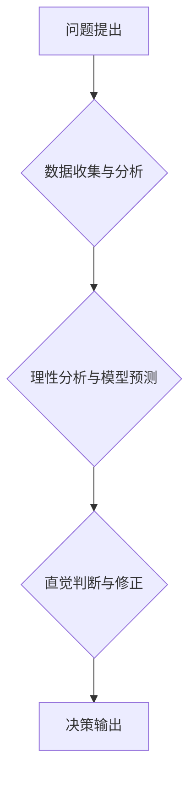

                 

## 直觉决策与理性分析的平衡

> 关键词：直觉决策、理性分析、人工智能、机器学习、深度学习、算法、决策支持系统、数据驱动

## 1. 背景介绍

在当今数据爆炸的时代，人工智能（AI）技术飞速发展，为我们提供了前所未有的决策支持工具。然而，在面对复杂、多变的现实问题时，单纯依靠数据分析和算法计算往往难以给出最佳解决方案。直觉决策，即基于经验、情感和潜意识的快速判断，在许多情况下也扮演着至关重要的角色。如何平衡直觉决策与理性分析，成为人工智能发展和应用中亟待解决的关键问题。

传统人工智能系统主要依赖于明确的规则和逻辑推理，缺乏对复杂情境和模糊信息的处理能力。而深度学习等机器学习技术，通过海量数据训练，能够学习到更复杂的模式和关系，在某些领域展现出强大的预测和决策能力。然而，深度学习模型的决策过程往往是“黑箱”式的，难以解释其背后的逻辑，这使得人们难以信任其决策结果，尤其是在高风险、高责任的领域。

直觉决策则更依赖于个人的经验、知识和情感判断，能够快速应对瞬息万变的复杂环境。然而，直觉决策也容易受到个人偏见、情绪影响，缺乏客观性和可重复性。

因此，如何将直觉决策和理性分析相结合，构建更加智能、可靠的人工智能系统，是人工智能领域的重要研究方向。

## 2. 核心概念与联系

### 2.1 直觉决策

直觉决策是指基于个人经验、直觉和情感判断，快速做出决策的过程。它通常不需要经过复杂的逻辑推理和数据分析，而是依赖于个人的潜意识和直觉感受。

直觉决策的优势在于：

* **快速高效：** 可以快速做出决策，应对瞬息万变的复杂环境。
* **灵活适应：** 可以根据具体情境灵活调整决策，处理模糊和不确定信息。
* **创造性思维：** 可以激发创造性思维，提出新的解决方案。

直觉决策的劣势在于：

* **主观性强：** 易受个人偏见、情绪影响，缺乏客观性和可重复性。
* **难以解释：** 决策过程难以解释，难以获得信任和接受。
* **容易出错：** 在缺乏经验或面对复杂情境时，容易做出错误决策。

### 2.2 理性分析

理性分析是指基于逻辑推理、数据分析和模型预测，做出客观、合理的决策的过程。它通常遵循一定的规则和步骤，并以数据为基础，进行量化分析和评估。

理性分析的优势在于：

* **客观理性：** 决策过程基于数据和逻辑，减少主观判断的影响。
* **可解释性强：** 决策过程可以清晰地解释，提高决策的可信度和接受度。
* **可重复性高：** 决策过程可以重复执行，保证决策的稳定性和一致性。

理性分析的劣势在于：

* **效率较低：** 需要收集、分析大量数据，决策过程相对较慢。
* **难以处理复杂情境：** 对于复杂、多变的现实问题，难以给出最佳解决方案。
* **缺乏灵活性：** 难以适应突发事件和变化的市场环境。

### 2.3 直觉与理性决策的结合

直觉决策和理性分析各有优缺点，两者并非完全对立，而是可以相互补充和促进的。

**直觉决策可以提供快速、灵活的决策，而理性分析可以提供客观、可靠的决策依据。** 将两者结合，可以构建更加智能、可靠的人工智能系统。

**以下是一个简单的流程图，展示了直觉决策和理性分析的结合：**



## 3. 核心算法原理 & 具体操作步骤

### 3.1 算法原理概述

结合直觉决策和理性分析的算法通常基于以下原理：

* **数据驱动：** 利用数据分析和模型预测，提供理性决策的依据。
* **经验学习：** 基于历史数据和专家经验，构建直觉决策模型。
* **反馈机制：** 通过反馈机制，不断调整和优化决策模型。

### 3.2 算法步骤详解

1. **问题定义：** 明确决策目标和问题范围。
2. **数据收集与预处理：** 收集相关数据，并进行清洗、转换和特征提取。
3. **理性分析模型构建：** 利用机器学习算法，构建预测模型，例如回归模型、分类模型等。
4. **直觉决策模型构建：** 利用神经网络等深度学习算法，构建直觉决策模型，例如情感分析模型、专家系统等。
5. **决策融合：** 将理性分析结果和直觉决策结果进行融合，权衡两者之间的影响，最终做出决策。
6. **反馈与优化：** 收集决策结果反馈，并根据反馈信息，调整和优化决策模型。

### 3.3 算法优缺点

**优点：**

* 能够结合数据驱动和经验学习，提高决策的准确性和可靠性。
* 能够处理复杂、多变的现实问题，提供更加灵活和智能的决策方案。
* 能够不断学习和优化，提高决策的效率和效果。

**缺点：**

* 算法复杂度较高，需要大量的计算资源和数据支持。
* 难以解释决策过程，缺乏透明度和可信度。
* 需要不断收集和更新数据，才能保证决策的准确性和有效性。

### 3.4 算法应用领域

* **金融领域：** 风险评估、信用评分、投资决策等。
* **医疗领域：** 疾病诊断、治疗方案推荐、药物研发等。
* **制造业：** 质量控制、生产优化、设备维护等。
* **交通领域：** 交通流量预测、路线规划、自动驾驶等。

## 4. 数学模型和公式 & 详细讲解 & 举例说明

### 4.1 数学模型构建

直觉决策与理性分析的结合可以构建一个混合决策模型，该模型将理性分析结果和直觉决策结果进行加权融合。

假设：

* $R$ 为理性分析模型的预测结果。
* $I$ 为直觉决策模型的预测结果。
* $\alpha$ 为理性分析结果的权重。
* $\beta$ 为直觉决策结果的权重。

则混合决策模型的输出结果为：

$$D = \alpha R + \beta I$$

其中，$\alpha + \beta = 1$。

### 4.2 公式推导过程

权重 $\alpha$ 和 $\beta$ 的确定可以通过多种方法，例如：

* **专家经验：** 根据专家对不同决策因素的判断，设定权重。
* **数据分析：** 利用历史数据，分析理性分析和直觉决策的准确率，并根据准确率进行权重调整。
* **用户反馈：** 通过用户反馈，调整权重，使决策结果更符合用户的期望。

### 4.3 案例分析与讲解

例如，在医疗诊断领域，理性分析模型可以根据患者的症状、检查结果等数据，预测疾病的可能性。而直觉决策模型可以根据医生的经验和直觉，判断患者的病情。

在混合决策模型中，可以根据专家经验，设定理性分析结果的权重为 0.7，直觉决策结果的权重为 0.3。

当理性分析模型预测患者患有某种疾病的可能性为 80%，而直觉决策模型也认为患者患有这种疾病时，混合决策模型的输出结果将倾向于诊断为该疾病。

## 5. 项目实践：代码实例和详细解释说明

### 5.1 开发环境搭建

本项目使用 Python 语言进行开发，并利用以下开源库：

* **Scikit-learn:** 机器学习库，用于构建理性分析模型。
* **TensorFlow:** 深度学习库，用于构建直觉决策模型。

### 5.2 源代码详细实现

```python
import numpy as np
from sklearn.linear_model import LogisticRegression
from tensorflow.keras.models import Sequential
from tensorflow.keras.layers import Dense

# 数据加载和预处理
# ...

# 理性分析模型构建
model_rational = LogisticRegression()
model_rational.fit(X_train, y_train)

# 直觉决策模型构建
model_intuitive = Sequential()
model_intuitive.add(Dense(128, activation='relu', input_shape=(X_train.shape[1],)))
model_intuitive.add(Dense(64, activation='relu'))
model_intuitive.add(Dense(1, activation='sigmoid'))
model_intuitive.compile(loss='binary_crossentropy', optimizer='adam', metrics=['accuracy'])
model_intuitive.fit(X_train, y_train, epochs=10)

# 决策融合
def make_decision(X):
    rational_prediction = model_rational.predict(X)
    intuitive_prediction = model_intuitive.predict(X)
    alpha = 0.7
    beta = 0.3
    decision = alpha * rational_prediction + beta * intuitive_prediction
    return decision > 0.5

# 预测结果
predictions = make_decision(X_test)
```

### 5.3 代码解读与分析

* 代码首先加载数据并进行预处理。
* 然后构建理性分析模型和直觉决策模型。
* 决策融合函数将理性分析结果和直觉决策结果进行加权融合，并根据阈值输出决策结果。
* 最后，使用训练好的模型对测试数据进行预测。

### 5.4 运行结果展示

运行结果展示包括预测准确率、混淆矩阵等指标，可以评估模型的性能。

## 6. 实际应用场景

### 6.1 金融领域

* **信用评分：** 将客户的财务数据、信用历史等信息作为输入，结合理性分析模型和直觉决策模型，评估客户的信用风险，为贷款审批提供决策支持。
* **欺诈检测：** 利用交易数据、用户行为等信息，识别异常交易，并结合直觉决策模型，判断交易是否为欺诈行为。

### 6.2 医疗领域

* **疾病诊断：** 将患者的症状、检查结果等信息作为输入，结合理性分析模型和直觉决策模型，辅助医生诊断疾病。
* **个性化治疗：** 根据患者的基因信息、生活习惯等信息，结合理性分析模型和直觉决策模型，推荐个性化的治疗方案。

### 6.3 其他领域

* **自动驾驶：** 利用传感器数据、地图信息等，结合理性分析模型和直觉决策模型，帮助车辆做出驾驶决策。
* **客户服务：** 利用聊天机器人技术，结合理性分析模型和直觉决策模型，提供更加智能、人性化的客户服务。

### 6.4 未来应用展望

随着人工智能技术的不断发展，直觉决策与理性分析的结合将应用于更多领域，例如：

* **科学研究：** 辅助科学家发现新的规律和知识。
* **艺术创作：** 帮助艺术家创作更加富有创意的作品。
* **教育教学：** 提供更加个性化、智能化的教育服务。

## 7. 工具和资源推荐

### 7.1 学习资源推荐

* **书籍：**
    * 《深度学习》
    * 《机器学习》
    * 《人工智能：一种现代方法》
* **在线课程：**
    * Coursera
    * edX
    * Udacity

### 7.2 开发工具推荐

* **Python:** 
* **Scikit-learn:** 机器学习库
* **TensorFlow:** 深度学习库
* **PyTorch:** 深度学习库

### 7.3 相关论文推荐

* **Attention Is All You Need:** https://arxiv.org/abs/1706.03762
* **Deep Reinforcement Learning:** https://arxiv.org/abs/1602.09477
* **Generative Adversarial Networks:** https://arxiv.org/abs/1406.2661

## 8. 总结：未来发展趋势与挑战

### 8.1 研究成果总结

直觉决策与理性分析的结合为人工智能发展提供了新的思路和方向。该方法能够有效地利用数据驱动和经验学习，提高决策的准确性和可靠性。

### 8.2 未来发展趋势

未来，直觉决策与理性分析的结合将朝着以下方向发展：

* **更加智能的决策模型：** 利用更先进的机器学习算法和深度学习模型，构建更加智能、高效的决策模型。
* **更加透明的决策过程：** 研究如何解释和可视化决策过程，提高决策的透明度和可信度。
* **更加个性化的决策服务：** 根据用户的需求和偏好，提供更加个性化的决策服务。

### 8.3 面临的挑战

直觉决策与理性分析的结合也面临着一些挑战：

* **数据获取和处理：** 需要收集和处理大量的复杂数据，并进行有效的特征提取和预处理。
* **模型训练和优化：** 需要设计有效的训练策略和优化算法，才能训练出高性能的决策模型。
* **伦理和安全问题：** 需要解决人工智能决策的伦理和安全问题，确保决策结果公平、公正、安全可靠。

### 8.4 研究展望

直觉决策与理性分析的结合是一个充满挑战和机遇的领域，未来研究将继续探索以下方向：

* **融合不同类型决策模型：** 将理性分析模型、直觉决策模型和其他类型决策模型进行融合，构建更加强大的决策系统。
* **开发新的决策算法：** 研究新的决策算法，提高决策的效率、准确性和鲁棒性。
* **探索人类直觉决策机制：** 研究人类直觉决策的机制，为人工智能决策提供启示。


## 9. 附录：常见问题与解答

### 9.1 如何确定理性分析结果和直觉决策结果的权重？

权重可以通过专家经验、数据分析和用户反馈等方式确定。

### 9.2 如何解释直觉决策模型的决策结果？

直觉决策模型的决策结果通常是“黑箱”式的，难以解释。未来研究将探索如何解释和可视化直觉决策模型的决策过程。

### 9.3 直觉决策与理性分析的结合是否会降低决策的客观性？

直觉决策本身存在主观性，但通过与理性分析结果进行融合，可以有效地降低决策的偏见和错误率。

### 9.4 直觉决策与理性分析的结合是否适用于所有领域？

直觉决策与理性分析的结合适用于许多领域，但并非适用于所有领域。例如，在需要高度精确性的领域，例如医疗诊断，需要更加谨慎地使用直觉决策。


作者：禅与计算机程序设计艺术 / Zen and the Art of Computer Programming<end_of_turn>

