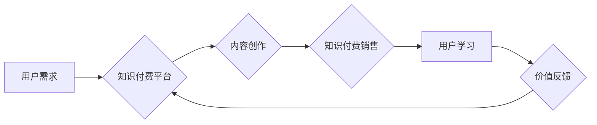

                 

## 知识付费:程序员实现财富自由的新途径

> 关键词：知识付费、程序员、财富自由、在线教育、技术分享、内容创作、个人品牌

### 1. 背景介绍

在当今数字时代，技术日新月异，程序员的需求量持续增长。然而，传统的职业发展路径往往面临着瓶颈，例如薪资增长缓慢、晋升机会有限等。在这种背景下，知识付费应运而生，为程序员提供了实现财富自由的新途径。

知识付费是指通过提供有价值的知识和技能，向付费用户收取费用的一种商业模式。它以其灵活、高效、低成本等特点，迅速成为一种备受关注的商业模式，尤其是在技术领域。

对于程序员来说，知识付费不仅可以帮助他们提升技术水平，获得更高的薪资回报，更重要的是，它可以帮助他们建立个人品牌，打造独立的知识经济体系，实现财富自由。

### 2. 核心概念与联系

**2.1 知识付费的核心概念**

知识付费的核心概念是“价值交换”。知识付费平台提供者通过创作高质量的知识内容，例如课程、教程、书籍、博客文章等，为付费用户提供价值，而付费用户则通过支付费用获得这些价值。

**2.2 程序员与知识付费的联系**

程序员拥有丰富的技术经验和技能，他们可以将自己的知识和技能转化为有价值的知识内容，通过知识付费平台向其他程序员提供服务。

**2.3 知识付费的商业模式**

知识付费的商业模式主要包括以下几种：

* **订阅制:** 用户支付一定的费用，可以持续访问平台上的所有知识内容。
* **课程销售:** 平台提供各种主题的课程，用户购买课程后可以学习相关知识。
* **会员制:** 用户支付一定的费用，可以享受平台提供的各种会员权益，例如优先获取课程、参加线下活动等。
* **付费咨询:** 用户可以付费咨询平台上的专家，解决技术问题。

**2.4 知识付费的流程图**



### 3. 核心算法原理 & 具体操作步骤

**3.1 算法原理概述**

知识付费平台的运营需要依靠一系列算法来实现内容推荐、用户匹配、付费转化等功能。这些算法通常基于机器学习、数据挖掘等技术，通过分析用户行为数据、内容特征数据等，实现精准推荐和个性化服务。

**3.2 算法步骤详解**

1. **数据收集:** 收集用户行为数据、内容特征数据等。
2. **数据预处理:** 对收集到的数据进行清洗、转换、特征提取等处理。
3. **模型训练:** 利用机器学习算法，训练模型以预测用户兴趣、内容受欢迎程度等。
4. **模型评估:** 对训练好的模型进行评估，调整模型参数以提高模型性能。
5. **模型部署:** 将训练好的模型部署到生产环境中，实现实时推荐和个性化服务。

**3.3 算法优缺点**

* **优点:** 能够实现精准推荐、个性化服务，提高用户体验和付费转化率。
* **缺点:** 需要大量的训练数据和计算资源，模型训练和维护成本较高。

**3.4 算法应用领域**

* 内容推荐
* 用户匹配
* 付费转化
* 个性化学习

### 4. 数学模型和公式 & 详细讲解 & 举例说明

**4.1 数学模型构建**

知识付费平台的推荐算法通常基于协同过滤模型，该模型假设用户对相似的物品具有相似的偏好。

**4.2 公式推导过程**

协同过滤模型的核心公式是用户-物品评分矩阵的预测公式。

$$
\hat{r}_{u,i} = \bar{r}_u + \frac{\sum_{j \in N(u)} (r_{u,j} - \bar{r}_u) \cdot (r_{j,i} - \bar{r}_j)}{\sum_{j \in N(u)} (r_{u,j} - \bar{r}_u)^2}
$$

其中：

* $\hat{r}_{u,i}$: 用户 $u$ 对物品 $i$ 的预测评分
* $\bar{r}_u$: 用户 $u$ 的平均评分
* $r_{u,j}$: 用户 $u$ 对物品 $j$ 的真实评分
* $N(u)$: 用户 $u$ 评分过的物品集合

**4.3 案例分析与讲解**

假设有一个用户 $u$ 评分了电影 $A$ 和 $B$，评分分别为 4 和 5。另一个用户 $v$ 评分了电影 $B$ 和 $C$，评分分别为 5 和 4。如果我们想要预测用户 $u$ 对电影 $C$ 的评分，可以使用协同过滤模型。

根据公式，我们可以计算出用户 $u$ 对电影 $C$ 的预测评分。

### 5. 项目实践：代码实例和详细解释说明

**5.1 开发环境搭建**

* Python 3.x
* TensorFlow 或 PyTorch
* Jupyter Notebook

**5.2 源代码详细实现**

```python
import tensorflow as tf

# 定义模型
model = tf.keras.Sequential([
    tf.keras.layers.Dense(64, activation='relu'),
    tf.keras.layers.Dense(10, activation='softmax')
])

# 编译模型
model.compile(optimizer='adam',
              loss='sparse_categorical_crossentropy',
              metrics=['accuracy'])

# 训练模型
model.fit(x_train, y_train, epochs=10)

# 预测结果
predictions = model.predict(x_test)
```

**5.3 代码解读与分析**

这段代码实现了基于 TensorFlow 的一个简单的深度学习模型。

* `tf.keras.Sequential` 定义了一个顺序模型，即层级结构的模型。
* `tf.keras.layers.Dense` 定义了一个全连接层，该层将输入数据映射到输出数据。
* `activation='relu'` 指定了激活函数为 ReLU 函数。
* `optimizer='adam'` 指定了优化器为 Adam 算法。
* `loss='sparse_categorical_crossentropy'` 指定了损失函数为稀疏类别交叉熵损失函数。
* `metrics=['accuracy']` 指定了评估指标为准确率。
* `model.fit()` 函数用于训练模型。
* `model.predict()` 函数用于预测结果。

**5.4 运行结果展示**

训练完成后，我们可以使用 `model.evaluate()` 函数评估模型的性能，并使用 `model.predict()` 函数预测新的数据。

### 6. 实际应用场景

**6.1 在线课程平台**

知识付费平台可以提供各种主题的在线课程，例如编程、设计、写作等。用户可以通过付费学习这些课程，提升自己的技能和知识水平。

**6.2 技术博客和社区**

程序员可以利用技术博客和社区平台，分享自己的技术经验和知识，并通过付费咨询、会员服务等方式获得收入。

**6.3 个人品牌建设**

程序员可以通过知识付费平台，建立自己的个人品牌，打造独立的知识经济体系，实现财富自由。

**6.4 未来应用展望**

随着人工智能、大数据等技术的不断发展，知识付费平台将更加智能化、个性化，为用户提供更精准、更有效的学习体验。

### 7. 工具和资源推荐

**7.1 学习资源推荐**

* **Coursera:** https://www.coursera.org/
* **Udemy:** https://www.udemy.com/
* **edX:** https://www.edx.org/

**7.2 开发工具推荐**

* **Python:** https://www.python.org/
* **TensorFlow:** https://www.tensorflow.org/
* **PyTorch:** https://pytorch.org/

**7.3 相关论文推荐**

* **Collaborative Filtering for Implicit Feedback Datasets**
* **Deep Learning for Recommender Systems**

### 8. 总结：未来发展趋势与挑战

**8.1 研究成果总结**

知识付费为程序员提供了实现财富自由的新途径，并推动了技术领域的知识传播和创新。

**8.2 未来发展趋势**

* **个性化学习:** 知识付费平台将更加注重用户个性化需求，提供定制化的学习方案。
* **人工智能驱动:** 人工智能技术将被更加广泛地应用于知识付费平台，实现内容推荐、学习评估等功能。
* **元宇宙融合:** 知识付费平台将与元宇宙技术融合，提供沉浸式学习体验。

**8.3 面临的挑战**

* **内容质量:** 知识付费平台需要不断提升内容质量，才能吸引和留住用户。
* **用户信任:** 知识付费平台需要建立用户的信任，才能获得用户的付费支持。
* **知识产权保护:** 知识付费平台需要加强知识产权保护，防止知识盗版和侵权行为。

**8.4 研究展望**

未来，知识付费平台将朝着更加智能化、个性化、沉浸式的方向发展，为程序员提供更优质的学习体验和财富增长机会。

### 9. 附录：常见问题与解答

**9.1 如何选择合适的知识付费平台？**

选择知识付费平台时，需要考虑平台的口碑、内容质量、价格、服务等因素。

**9.2 如何提高知识付费的转化率？**

提高知识付费的转化率需要注重内容质量、用户体验、营销推广等方面。

**9.3 如何保护知识产权？**

知识付费平台需要采取措施保护知识产权，例如版权登记、技术加密等。


作者：禅与计算机程序设计艺术 / Zen and the Art of Computer Programming 
<end_of_turn>

