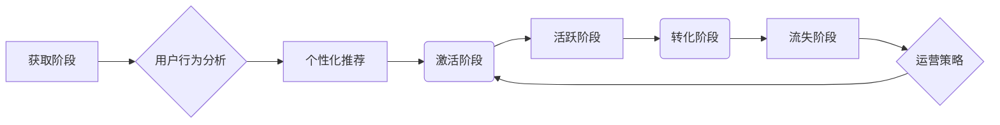

                 

## 知识付费产品的用户激活与转化策略

> 关键词：知识付费、用户激活、用户转化、策略、算法、数学模型、实践案例

## 1. 背景介绍

知识付费行业近年来发展迅速，从线上课程、在线咨询到付费会员，各种形式的知识付费产品层出不穷。然而，用户获取知识付费产品的门槛相对较低，而用户留存和转化率却普遍偏低。如何有效提升用户激活和转化率，成为知识付费平台和创作者面临的共同挑战。

**1.1 知识付费行业现状与痛点**

* **市场规模庞大，竞争激烈:** 知识付费市场规模持续增长，但同时涌现出大量平台和创作者，竞争日益激烈。
* **用户获取成本高，留存率低:** 知识付费产品的推广和营销成本较高，而用户体验和内容质量难以保证，导致用户留存率低。
* **转化率低，收益不稳定:** 许多用户只是试用或购买部分课程，最终未完成付费转化，导致创作者收益不稳定。

**1.2 用户激活与转化策略的重要性**

用户激活是指引导用户首次使用知识付费产品，并完成基本功能操作，例如注册、登录、浏览课程等。用户转化是指引导用户从试用阶段升级为付费用户，持续消费知识付费产品。

有效的用户激活和转化策略可以帮助知识付费平台和创作者：

* **提升用户留存率:** 通过引导用户积极使用产品，增强用户粘性，提高用户留存率。
* **增加付费转化率:** 通过优化用户体验和内容推荐，引导用户完成付费转化，提升收益。
* **建立用户口碑:** 通过提供优质的产品和服务，获得用户认可和推荐，扩大用户群体。

## 2. 核心概念与联系

**2.1 用户生命周期模型**

用户生命周期模型将用户从获取到产品、使用到最终流失的整个过程划分为多个阶段，包括：

* **获取阶段:** 用户首次接触知识付费产品，例如通过搜索引擎、社交媒体或广告等渠道。
* **激活阶段:** 用户完成注册、登录等基本操作，开始使用产品。
* **活跃阶段:** 用户持续使用产品，完成课程学习、互动交流等行为。
* **转化阶段:** 用户升级为付费用户，持续消费产品。
* **流失阶段:** 用户停止使用产品，不再付费。

**2.2 用户行为分析**

用户行为分析是指通过收集和分析用户在知识付费平台上的行为数据，例如浏览记录、学习进度、互动行为等，以了解用户需求、兴趣和行为模式。

**2.3 个性化推荐**

个性化推荐是指根据用户的兴趣、学习进度、行为偏好等信息，推荐与其相关的课程、内容和服务。

**2.4 运营策略**

运营策略是指通过一系列活动和措施，引导用户完成激活、活跃、转化等行为，提升用户生命周期价值。

**2.5 流程图**



## 3. 核心算法原理 & 具体操作步骤

**3.1 算法原理概述**

用户激活和转化策略通常基于以下核心算法原理：

* **协同过滤算法:** 根据用户的历史行为数据，推荐与用户兴趣相似的其他用户或内容。
* **内容基准算法:** 根据用户的兴趣标签、学习进度等信息，推荐与用户需求相符的内容。
* **深度学习算法:** 利用深度神经网络，分析用户的行为数据，预测用户的兴趣和行为模式。

**3.2 算法步骤详解**

**协同过滤算法:**

1. **数据收集:** 收集用户的行为数据，例如课程浏览记录、学习进度、互动行为等。
2. **用户相似度计算:** 计算用户之间的相似度，例如基于余弦相似度、皮尔逊相关系数等。
3. **推荐内容:** 根据用户的相似用户，推荐他们喜欢的课程或内容。

**内容基准算法:**

1. **内容特征提取:** 将课程内容进行特征提取，例如关键词、主题、难度等。
2. **用户兴趣建模:** 根据用户的学习历史和行为数据，构建用户的兴趣模型。
3. **推荐内容:** 根据用户的兴趣模型，推荐与用户兴趣相符的课程内容。

**深度学习算法:**

1. **数据预处理:** 对用户行为数据进行预处理，例如特征工程、数据归一化等。
2. **模型训练:** 利用深度神经网络，训练用户行为预测模型。
3. **推荐内容:** 根据用户的行为数据，预测用户的兴趣和行为模式，推荐相应的课程内容。

**3.3 算法优缺点**

**协同过滤算法:**

* **优点:** 可以推荐用户可能感兴趣但未接触过的内容。
* **缺点:** 数据稀疏性问题，当用户行为数据不足时，推荐效果会下降。

**内容基准算法:**

* **优点:** 不依赖于用户行为数据，可以推荐与用户需求相符的内容。
* **缺点:** 内容特征提取需要人工标注，且难以捕捉用户隐性需求。

**深度学习算法:**

* **优点:** 可以学习用户复杂的兴趣和行为模式，推荐效果更精准。
* **缺点:** 需要大量的训练数据，模型训练成本较高。

**3.4 算法应用领域**

* **电商推荐:** 推荐商品、优惠券等。
* **视频平台推荐:** 推荐视频、电视剧等。
* **音乐平台推荐:** 推荐歌曲、音乐人等。
* **社交媒体推荐:** 推荐好友、话题等。

## 4. 数学模型和公式 & 详细讲解 & 举例说明

**4.1 数学模型构建**

用户激活和转化率可以看作是一个二元分类问题，可以使用逻辑回归模型进行建模。

**逻辑回归模型:**

$$
P(y=1|x) = \frac{1}{1 + e^{-(w^T x + b)}}
$$

其中:

* $P(y=1|x)$ 是用户激活或转化的概率。
* $x$ 是用户的特征向量，例如年龄、性别、学习时长、课程评价等。
* $w$ 是模型参数向量。
* $b$ 是模型偏置项。

**4.2 公式推导过程**

逻辑回归模型的损失函数是交叉熵损失函数，其目标是最小化模型预测结果与真实结果之间的差异。

$$
Loss = -\frac{1}{N} \sum_{i=1}^{N} [y_i \log(P(y_i=1|x_i)) + (1-y_i) \log(1-P(y_i=1|x_i))]
$$

其中:

* $N$ 是样本数量。
* $y_i$ 是第 $i$ 个样本的真实标签，0 表示未激活或未转化，1 表示已激活或已转化。

**4.3 案例分析与讲解**

假设我们有一个知识付费平台，想要预测用户是否会购买付费课程。我们可以收集用户的特征数据，例如年龄、性别、学习时长、课程评价等，并使用逻辑回归模型进行训练。

训练完成后，我们可以使用模型预测新用户的购买概率。例如，如果一个用户的特征向量为 $[25, 1, 10, 4]$, 则模型预测其购买付费课程的概率为 $0.75$。

## 5. 项目实践：代码实例和详细解释说明

**5.1 开发环境搭建**

* Python 3.x
* Jupyter Notebook
* scikit-learn

**5.2 源代码详细实现**

```python
from sklearn.linear_model import LogisticRegression
from sklearn.model_selection import train_test_split
from sklearn.metrics import accuracy_score

# 加载数据
data = ...

# 将数据分为特征和标签
X = data.drop('label', axis=1)
y = data['label']

# 将数据分为训练集和测试集
X_train, X_test, y_train, y_test = train_test_split(X, y, test_size=0.2, random_state=42)

# 创建逻辑回归模型
model = LogisticRegression()

# 训练模型
model.fit(X_train, y_train)

# 预测测试集结果
y_pred = model.predict(X_test)

# 计算准确率
accuracy = accuracy_score(y_test, y_pred)
print(f'准确率: {accuracy}')
```

**5.3 代码解读与分析**

* 首先，我们加载数据并将其分为特征和标签。
* 然后，我们将数据分为训练集和测试集，用于训练和评估模型。
* 接下来，我们创建逻辑回归模型并使用训练集进行训练。
* 最后，我们使用测试集预测结果并计算模型的准确率。

**5.4 运行结果展示**

运行代码后，会输出模型的准确率。

## 6. 实际应用场景

**6.1 在线教育平台**

* **用户激活:** 通过个性化推荐课程、发送新手引导邮件、提供免费试听等方式，引导用户完成注册和登录。
* **用户转化:** 通过提供优惠活动、会员权益、课程打折等方式，引导用户升级为付费用户。

**6.2 知识付费社区**

* **用户激活:** 通过邀请好友、分享优质内容、举办线上活动等方式，吸引用户加入社区。
* **用户转化:** 通过提供付费会员服务、举办付费讲座、提供专属资源等方式，引导用户付费参与社区活动。

**6.3 个人知识付费产品**

* **用户激活:** 通过社交媒体推广、内容营销、付费试用等方式，吸引用户关注产品。
* **用户转化:** 通过提供优惠活动、会员权益、内容更新通知等方式，引导用户购买产品。

**6.4 未来应用展望**

随着人工智能技术的不断发展，用户激活和转化策略将更加智能化和个性化。例如，

* **基于深度学习的个性化推荐:** 利用深度神经网络，更精准地预测用户的兴趣和行为模式，推荐更符合用户需求的内容。
* **实时用户行为分析:** 利用实时数据分析技术，及时了解用户的行为变化，并根据变化调整运营策略。
* **多渠道用户触达:** 利用多种渠道，例如社交媒体、邮件营销、短信推送等，进行全方位用户触达。

## 7. 工具和资源推荐

**7.1 学习资源推荐**

* **书籍:**
    * 《推荐系统实践》
    * 《深度学习》
* **在线课程:**
    * Coursera: 机器学习
    * Udacity: 深度学习工程师

**7.2 开发工具推荐**

* **Python:** 
    * scikit-learn: 机器学习库
    * TensorFlow: 深度学习库
    * PyTorch: 深度学习库
* **数据可视化工具:**
    * Tableau
    * Power BI

**7.3 相关论文推荐**

* 《Collaborative Filtering for Implicit Feedback Datasets》
* 《Deep Learning for Recommender Systems》

## 8. 总结：未来发展趋势与挑战

**8.1 研究成果总结**

用户激活和转化策略的研究取得了显著进展，例如协同过滤算法、内容基准算法、深度学习算法等都取得了很好的应用效果。

**8.2 未来发展趋势**

* **更精准的个性化推荐:** 利用更先进的机器学习算法和数据分析技术，实现更精准的个性化推荐。
* **更智能的运营策略:** 利用人工智能技术，自动分析用户行为数据，并根据数据调整运营策略。
* **更丰富的用户体验:** 利用增强现实、虚拟现实等技术，提供更丰富的用户体验。

**8.3 面临的挑战**

* **数据隐私保护:** 用户数据隐私保护是一个重要的挑战，需要开发更安全的数据处理和分析技术。
* **算法公平性:** 算法模型可能存在偏见，导致不公平的结果，需要开发更公平的算法模型。
* **用户信任问题:** 用户对算法推荐的信任度仍然较低，需要开发更透明、可解释的算法模型。

**8.4 研究展望**

未来，用户激活和转化策略的研究将更加注重用户体验、数据隐私保护和算法公平性。


## 9. 附录：常见问题与解答

**9.1 如何提高用户激活率？**

* 提供新手引导，帮助用户快速上手产品。
* 发送个性化推荐邮件，引导用户探索产品功能。
* 提供免费试用，让用户体验产品价值。

**9.2 如何提高用户转化率？**

* 提供优惠活动，降低用户购买门槛。
* 提供会员权益，提升用户粘性。
* 提供优质内容，增强用户价值感。

**9.3 如何评估用户激活和转化策略的有效性？**

* 跟踪用户行为数据，例如注册率、登录率、付费率等。
* 使用 A/B 测试，比较不同策略的效果。
* 收集用户反馈，了解用户需求和痛点。


作者：禅与计算机程序设计艺术 / Zen and the Art of Computer Programming 
<end_of_turn>

