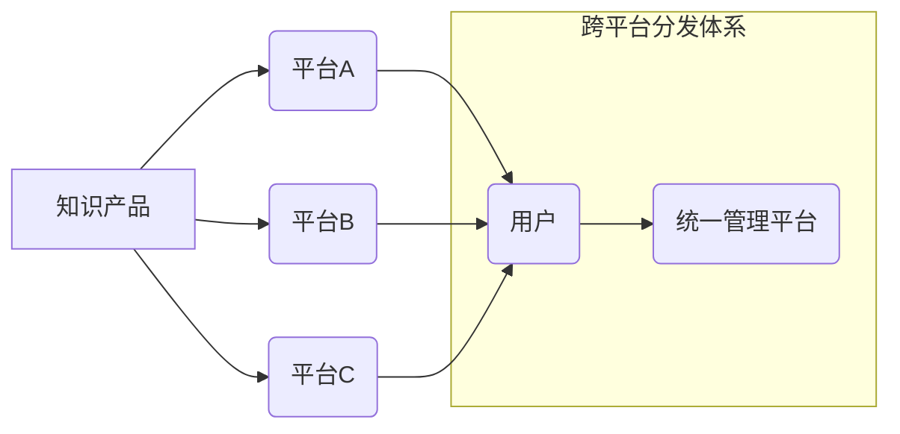

                 

## 知识付费产品、跨平台分发、策略、技术架构、用户体验

## 1. 背景介绍

知识付费产业近年来蓬勃发展，涌现出众多优质的知识产品，涵盖了从专业技能培训到兴趣爱好学习的各个领域。然而，知识付费产品的成功离不开有效的分发策略。传统的单一平台分发模式已难以满足用户多元化需求和内容创作者拓展市场规模的愿望。跨平台分发策略应运而生，旨在通过整合多平台资源，扩大知识付费产品的触达范围，提升用户获取和消费效率。

### 1.1 知识付费市场现状

知识付费市场规模持续增长，用户群体也日益扩大。从教育培训、职业技能到兴趣爱好，各种类型的知识产品都获得了市场认可。然而，市场竞争日益激烈，优质内容的涌现也带来了新的挑战。

### 1.2 跨平台分发策略的必要性

随着移动互联网的普及，用户碎片化时间和多元化需求日益突出。单一平台分发模式难以满足用户在不同场景下获取知识的需求。跨平台分发策略可以帮助知识付费产品：

* **扩大用户触达范围:** 通过整合多个平台资源，将知识产品推向更广泛的用户群体。
* **提升用户获取效率:** 用户可以在不同平台上便捷地搜索、发现和购买知识产品。
* **增强内容创作者影响力:** 内容创作者可以借助跨平台分发，提升品牌知名度和用户粘性。

## 2. 核心概念与联系

跨平台分发策略的核心在于构建一个统一的知识产品分发体系，将多个平台整合在一起，实现内容的无缝衔接和用户体验的优化。

### 2.1 核心概念

* **知识产品:** 包括但不限于在线课程、电子书、音频课程、视频教程等各种形式的知识内容。
* **平台:** 指提供知识产品分发和交易服务的网络平台，例如微信公众号、抖音、B站、知识付费平台等。
* **分发体系:** 指整合多个平台资源，实现知识产品跨平台分发的整体架构和机制。

### 2.2 架构图



## 3. 核心算法原理 & 具体操作步骤

跨平台分发策略的核心算法在于实现内容的智能匹配和用户个性化推荐。

### 3.1 算法原理概述

基于用户行为数据、知识产品标签和平台特性，采用机器学习算法进行内容推荐和分发。

* **用户画像:** 通过分析用户浏览历史、购买记录、点赞评论等行为数据，构建用户画像，识别用户兴趣偏好和知识需求。
* **内容标签:** 为知识产品赋予标签，描述其主题、内容类型、难度等级等信息，方便用户搜索和平台推荐。
* **平台特性:** 每个平台的用户群体、内容风格和推荐机制存在差异，需要根据平台特性进行内容适配和分发策略调整。

### 3.2 算法步骤详解

1. **数据采集:** 收集用户行为数据、知识产品信息和平台特性数据。
2. **数据预处理:** 对数据进行清洗、转换和特征提取，构建机器学习模型所需的输入数据。
3. **模型训练:** 利用机器学习算法，训练内容推荐和分发模型。
4. **模型评估:** 对模型进行评估，调整模型参数和算法策略，提升推荐效果。
5. **内容分发:** 根据模型预测结果，将知识产品推荐给目标用户，并根据平台特性进行分发策略调整。

### 3.3 算法优缺点

* **优点:** 能够实现个性化推荐，提升用户体验，提高知识产品转化率。
* **缺点:** 需要大量数据进行训练，算法模型需要不断优化，存在推荐偏差和信息茧房问题。

### 3.4 算法应用领域

* **知识付费平台:** 为用户提供个性化课程推荐，提升用户粘性和付费意愿。
* **社交媒体平台:** 将知识产品嵌入社交内容，引导用户学习和分享。
* **搜索引擎:** 为用户提供更精准的知识产品搜索结果。

## 4. 数学模型和公式 & 详细讲解 & 举例说明

跨平台分发策略的算法模型可以基于协同过滤、内容基准和深度学习等技术。

### 4.1 数学模型构建

协同过滤算法的核心是基于用户行为数据，预测用户对特定知识产品的喜好。

* **用户-物品评分矩阵:** 将用户和知识产品作为矩阵的行和列，用户对知识产品的评分作为矩阵元素。
* **相似度计算:** 计算用户之间或知识产品之间的相似度，例如余弦相似度或皮尔逊相关系数。
* **预测评分:** 根据相似用户或相似知识产品的评分，预测用户对特定知识产品的评分。

### 4.2 公式推导过程

**余弦相似度:**

$$
\text{相似度} = \frac{\mathbf{u} \cdot \mathbf{v}}{\|\mathbf{u}\| \|\mathbf{v}\|}
$$

其中，$\mathbf{u}$ 和 $\mathbf{v}$ 分别表示两个用户的评分向量，$\cdot$ 表示点积，$\|\mathbf{u}\|$ 和 $\|\mathbf{v}\|$ 分别表示两个向量的模长。

### 4.3 案例分析与讲解

假设用户A和用户B都对编程课程感兴趣，用户A对课程1评分为5，课程2评分为4，用户B对课程1评分为4，课程2评分为5。

* 计算用户A和用户B的评分向量：$\mathbf{u} = [5, 4]$，$\mathbf{v} = [4, 5]$。
* 计算用户A和用户B的余弦相似度：

$$
\text{相似度} = \frac{5 \cdot 4 + 4 \cdot 5}{\sqrt{5^2 + 4^2} \sqrt{4^2 + 5^2}} = \frac{40}{\sqrt{41} \sqrt{41}} = \frac{40}{41}
$$

相似度接近1，表明用户A和用户B的兴趣偏好相似，可以推荐用户A喜欢的课程给用户B。

## 5. 项目实践：代码实例和详细解释说明

以下是一个基于Python的跨平台分发策略的代码实例，使用协同过滤算法进行内容推荐。

### 5.1 开发环境搭建

* Python 3.x
* Pandas
* Scikit-learn

### 5.2 源代码详细实现

```python
import pandas as pd
from sklearn.metrics.pairwise import cosine_similarity

# 加载用户-物品评分矩阵
ratings_data = pd.read_csv('ratings.csv')

# 计算用户之间的余弦相似度
user_similarity = cosine_similarity(ratings_data)

# 获取用户ID
user_id = 1

# 获取用户相似用户
similar_users = user_similarity[user_id].argsort()[:-10:-1]

# 获取相似用户喜欢的知识产品
recommended_products = ratings_data.iloc[similar_users, :].mean().sort_values(ascending=False)

# 打印推荐结果
print(recommended_products)
```

### 5.3 代码解读与分析

* 代码首先加载用户-物品评分矩阵，并使用Scikit-learn库中的`cosine_similarity`函数计算用户之间的余弦相似度。
* 然后，根据用户ID获取用户相似用户，并根据相似用户的评分，计算出用户可能喜欢的知识产品的平均评分。
* 最后，将推荐结果按照评分排序，并打印出来。

### 5.4 运行结果展示

运行结果将显示出用户可能喜欢的知识产品列表，以及每个产品的平均评分。

## 6. 实际应用场景

跨平台分发策略在知识付费领域有着广泛的应用场景。

### 6.1 知识付费平台

知识付费平台可以利用跨平台分发策略，将优质课程推向更多用户，提升平台用户活跃度和付费转化率。

### 6.2 社交媒体平台

社交媒体平台可以将知识产品嵌入社交内容，引导用户学习和分享，提升平台内容价值和用户粘性。

### 6.3 搜索引擎

搜索引擎可以根据用户搜索关键词和行为数据，推荐相关知识产品，提升用户搜索体验和知识获取效率。

### 6.4 未来应用展望

随着人工智能技术的不断发展，跨平台分发策略将更加智能化和个性化。未来，我们可以期待：

* 更精准的个性化推荐，根据用户兴趣和需求，推荐更符合其偏好的知识产品。
* 更丰富的跨平台互动，用户可以在不同平台上分享学习心得，与其他用户互动交流。
* 更智能的知识产品创作，人工智能可以辅助内容创作者创作更优质的知识产品。

## 7. 工具和资源推荐

### 7.1 学习资源推荐

* **机器学习算法:**

    * 《机器学习》 - 周志华
    * 《Python机器学习实战》 - 塞缪尔·阿布拉姆斯

* **跨平台分发技术:**

    *  [微信开放平台](https://developers.weixin.qq.com/)
    *  [抖音开放平台](https://op.douyin.com/)
    *  [B站开发者平台](https://developer.bilibili.com/)

### 7.2 开发工具推荐

* **Python:**

    *  [Anaconda](https://www.anaconda.com/)
    *  [PyCharm](https://www.jetbrains.com/pycharm/)

* **数据分析工具:**

    *  [Pandas](https://pandas.pydata.org/)
    *  [Scikit-learn](https://scikit-learn.org/stable/)

### 7.3 相关论文推荐

* **协同过滤算法:**

    *  [Collaborative Filtering for Implicit Feedback Datasets](https://dl.acm.org/doi/10.1145/2925313.2925320)

* **跨平台分发策略:**

    *  [Cross-Platform Content Distribution Strategies for Mobile Learning](https://ieeexplore.ieee.org/document/8834473)

## 8. 总结：未来发展趋势与挑战

跨平台分发策略是知识付费产业发展的重要趋势，能够有效提升用户体验和内容创作者影响力。然而，跨平台分发策略也面临着一些挑战，例如数据安全、用户隐私保护、算法公平性等。

### 8.1 研究成果总结

* 跨平台分发策略能够有效提升知识付费产品的触达范围和用户获取效率。
* 协同过滤算法和深度学习算法是跨平台分发策略的核心技术。
* 跨平台分发策略的应用场景日益广泛，涵盖知识付费平台、社交媒体平台、搜索引擎等。

### 8.2 未来发展趋势

* **更精准的个性化推荐:** 利用人工智能技术，更加精准地推荐用户感兴趣的知识产品。
* **更丰富的跨平台互动:** 打破平台壁垒，实现用户在不同平台上的 seamless 交互。
* **更智能的知识产品创作:** 利用人工智能辅助内容创作者创作更优质的知识产品。

### 8.3 面临的挑战

* **数据安全和用户隐私保护:** 跨平台分发策略需要处理大量用户数据，需要加强数据安全和隐私保护措施。
* **算法公平性:** 算法模型需要避免存在偏见，确保推荐结果公平公正。
* **平台生态建设:** 需要构建一个开放、共享的跨平台生态系统，促进知识付费产业的健康发展。

### 8.4 研究展望

未来，跨平台分发策略的研究将更加注重以下方面：

* **更有效的算法模型:** 开发更精准、更智能的算法模型，提升推荐效果和用户体验。
* **更完善的跨平台生态:** 建立一个更加开放、共享的跨平台生态系统，促进知识付费产业的协同发展。
* **更深入的用户研究:** 深入了解用户需求和行为模式，为跨平台分发策略提供更精准的指导。

## 9. 附录：常见问题与解答

### 9.1 如何选择合适的跨平台分发策略？

选择合适的跨平台分发策略需要根据知识产品的特点、目标用户群体和平台特性进行综合考虑。

### 9.2 如何保证跨平台分发策略的有效性？

需要不断收集用户数据，分析用户行为，优化算法模型，并根据市场变化进行策略调整。

### 9.3 如何解决跨平台分发策略带来的数据安全和隐私问题？

需要采取严格的数据安全和隐私保护措施，例如数据加密、匿名化处理等。

### 9.4 如何构建一个开放、共享的跨平台生态系统？

需要鼓励平台之间的数据互通和资源共享，建立行业标准和规范，促进跨平台合作。


作者：禅与计算机程序设计艺术 / Zen and the Art of Computer Programming 
<end_of_turn>

