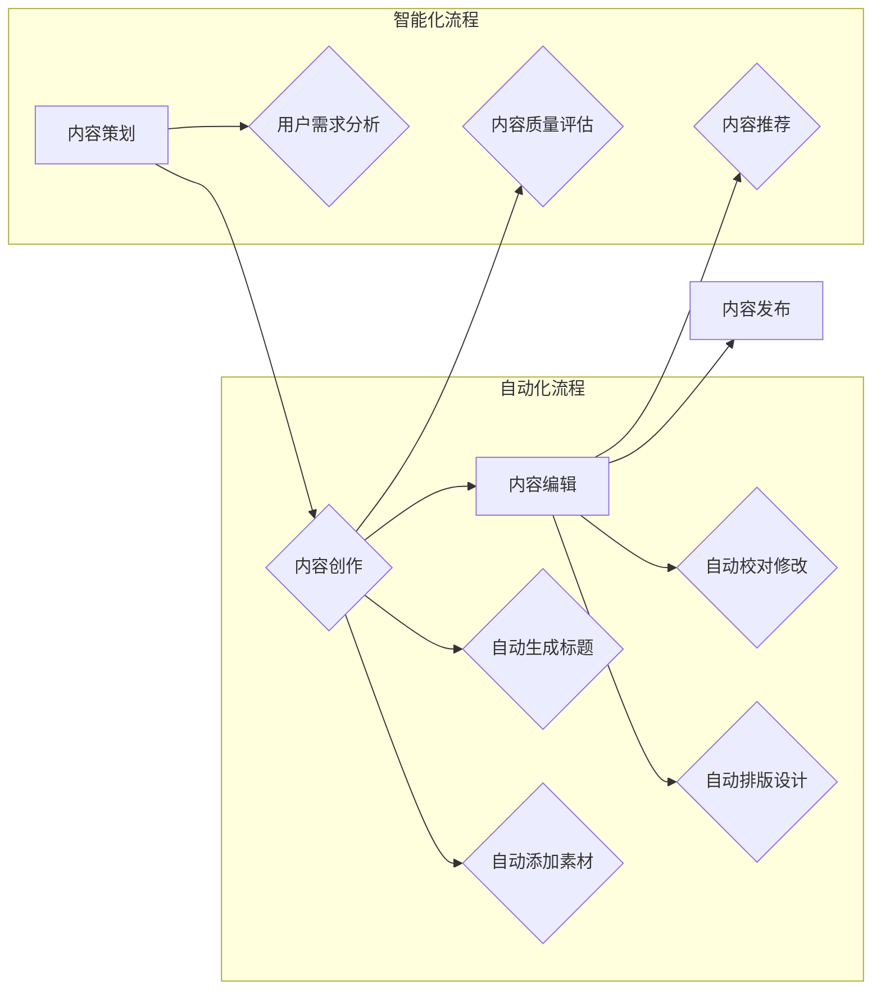

                 

## 知识付费创业中的内容生产流程优化

> 关键词：知识付费、内容生产、流程优化、自动化、效率提升、机器学习、人工智能

## 1. 背景介绍

知识付费行业近年来蓬勃发展，越来越多的专家学者和创作者通过线上平台分享知识和技能，并获得收益。然而，内容生产是一个耗时耗力的过程，对于创业者来说，如何高效地生产高质量的内容，是实现可持续发展的重要课题。

传统的知识付费内容生产流程通常包括以下几个步骤：

* **内容策划:** 确定目标受众、选定主题、撰写大纲等。
* **内容创作:**  撰写文章、录制视频、制作音频等。
* **内容编辑:**  校对修改、排版设计、添加素材等。
* **内容发布:**  上传至平台、进行推广宣传等。

这些步骤往往需要大量的重复劳动和人工干预，导致效率低下，难以满足快速发展的市场需求。

## 2. 核心概念与联系

为了解决知识付费内容生产的痛点，我们需要引入自动化和智能化技术，优化整个流程。

**核心概念:**

* **自动化:** 通过脚本、工具和平台，将重复性任务自动化，例如内容格式化、图片处理、视频剪辑等。
* **智能化:** 利用机器学习和人工智能技术，辅助内容创作、编辑和推荐，例如自动生成标题、摘要、关键词，识别内容质量，预测用户需求等。

**流程图:**



## 3. 核心算法原理 & 具体操作步骤

### 3.1  算法原理概述

**自动化流程:**

* **文本处理算法:**  用于自动生成标题、摘要、关键词等，例如TF-IDF、LDA主题模型等。
* **图像处理算法:** 用于自动添加素材、调整图片尺寸、格式转换等，例如OpenCV、Pillow等。
* **视频处理算法:** 用于自动剪辑视频、添加字幕、生成缩略图等，例如FFmpeg、MoviePy等。

**智能化流程:**

* **机器学习算法:** 用于用户需求分析、内容质量评估、内容推荐等，例如协同过滤、内容基准算法等。

### 3.2  算法步骤详解

**自动化流程:**

1. **文本处理:** 使用自然语言处理技术对文本进行分析，提取关键词、主题等信息，生成标题、摘要等。
2. **图像处理:** 使用图像处理技术对图片进行处理，例如调整尺寸、格式转换、添加水印等。
3. **视频处理:** 使用视频处理技术对视频进行剪辑、添加字幕、生成缩略图等。

**智能化流程:**

1. **用户需求分析:**  分析用户浏览记录、评论反馈等数据，预测用户对哪些内容感兴趣。
2. **内容质量评估:**  使用机器学习算法对内容进行评估，例如语法错误检测、逻辑错误检测、原创性检测等。
3. **内容推荐:**  根据用户需求和内容质量，推荐用户感兴趣的内容。

### 3.3  算法优缺点

**自动化流程:**

* **优点:**  提高效率，减少人工成本，保证内容质量的一致性。
* **缺点:**  难以处理复杂的任务，缺乏创意和个性化。

**智能化流程:**

* **优点:**  能够根据用户需求提供个性化推荐，提高用户体验。
* **缺点:**  算法需要大量数据训练，存在误判风险，需要不断优化和改进。

### 3.4  算法应用领域

* **自动生成课程大纲和学习材料**
* **自动生成知识付费课程的视频脚本和字幕**
* **自动生成知识付费课程的配套练习题和答案**
* **自动推荐用户感兴趣的知识付费课程**
* **自动分析用户对知识付费课程的反馈，并进行改进**

## 4. 数学模型和公式 & 详细讲解 & 举例说明

### 4.1  数学模型构建

**用户需求预测模型:**

我们可以使用协同过滤算法来预测用户对哪些知识付费课程感兴趣。协同过滤算法基于用户的历史行为数据，例如用户购买过的课程、浏览过的课程、评论过的课程等，来推荐用户可能感兴趣的课程。

**公式:**

$$
P(u, i) = \frac{\sum_{v \in N(u)} \frac{r(v, i)}{\sigma(v)}}{\sum_{v \in N(u)} \frac{1}{\sigma(v)}}
$$

其中:

* $P(u, i)$ 表示用户 $u$ 对课程 $i$ 的预测评分。
* $r(v, i)$ 表示用户 $v$ 对课程 $i$ 的真实评分。
* $N(u)$ 表示与用户 $u$ 具有相似行为的用户集合。
* $\sigma(v)$ 表示用户 $v$ 的评分数量。

**举例说明:**

假设用户 $A$ 和用户 $B$ 都购买了课程 $X$ 和课程 $Y$，用户 $A$ 对课程 $X$ 的评分为 5 分，对课程 $Y$ 的评分为 4 分，用户 $B$ 对课程 $X$ 的评分为 4 分，对课程 $Y$ 的评分为 5 分。

如果我们使用协同过滤算法来预测用户 $A$ 对课程 $Z$ 的评分，我们可以将用户 $B$ 作为相似用户，并使用上述公式计算预测评分。

### 4.2  公式推导过程

协同过滤算法的公式推导过程比较复杂，涉及到矩阵分解、线性回归等数学概念。

### 4.3  案例分析与讲解

我们可以通过分析实际案例，例如某知识付费平台的用户行为数据，来验证协同过滤算法的有效性。

## 5. 项目实践：代码实例和详细解释说明

### 5.1  开发环境搭建

* Python 3.x
* TensorFlow 或 PyTorch
* Jupyter Notebook

### 5.2  源代码详细实现

```python
# 导入必要的库
import pandas as pd
from sklearn.metrics.pairwise import cosine_similarity

# 加载用户行为数据
data = pd.read_csv('user_behavior.csv')

# 计算用户-课程之间的相似度矩阵
user_item_matrix = data.pivot_table(index='user_id', columns='course_id', values='rating')
similarity_matrix = cosine_similarity(user_item_matrix)

# 预测用户对课程的评分
def predict_rating(user_id, course_id):
    # 获取用户与其他用户的相似度
    user_similarity = similarity_matrix[user_id]
    # 获取用户已评分的课程
    rated_courses = user_item_matrix.loc[user_id].index
    # 计算预测评分
    prediction = sum(user_similarity * user_item_matrix.loc[rated_courses, course_id]) / sum(user_similarity)
    return prediction

# 预测用户对课程的评分
user_id = 1
course_id = 10
predicted_rating = predict_rating(user_id, course_id)
print(f'用户 {user_id} 对课程 {course_id} 的预测评分为: {predicted_rating}')
```

### 5.3  代码解读与分析

* 首先，我们加载用户行为数据，并将其转换为用户-课程评分矩阵。
* 然后，我们使用余弦相似度计算用户之间的相似度矩阵。
* 最后，我们定义了一个函数 `predict_rating` 来预测用户对课程的评分。该函数根据用户与其他用户的相似度，以及用户已评分的课程，计算预测评分。

### 5.4  运行结果展示

运行上述代码，可以得到用户对课程的预测评分。

## 6. 实际应用场景

* **知识付费平台:**  自动生成课程大纲和学习材料，自动推荐用户感兴趣的课程，提高用户学习效率和体验。
* **在线教育机构:**  自动生成教学视频脚本和字幕，自动批改作业，提高教学效率和质量。
* **企业培训:**  自动生成员工培训材料，自动评估员工培训效果，提高培训效率和效果。

### 6.4  未来应用展望

随着人工智能技术的不断发展，知识付费内容生产流程将更加智能化和自动化。未来，我们可以期待以下应用场景:

* **个性化内容生成:**  根据用户的学习风格、兴趣爱好等信息，自动生成个性化的学习内容。
* **智能化内容审核:**  利用人工智能技术自动审核内容质量，确保内容的准确性和可靠性。
* **虚拟导师:**  利用人工智能技术模拟真人导师，为用户提供个性化的学习指导和答疑服务。

## 7. 工具和资源推荐

### 7.1  学习资源推荐

* **机器学习课程:**  Coursera、edX、Udacity 等平台提供丰富的机器学习课程。
* **自然语言处理教程:**  Stanford NLP Group、NLTK 等资源提供自然语言处理教程和代码示例。
* **图像处理库:**  OpenCV、Pillow 等库提供图像处理功能。

### 7.2  开发工具推荐

* **Python:**  Python 是机器学习和人工智能开发的常用语言。
* **Jupyter Notebook:**  Jupyter Notebook 是一个交互式编程环境，方便进行机器学习和数据分析。
* **TensorFlow 或 PyTorch:**  TensorFlow 和 PyTorch 是流行的深度学习框架。

### 7.3  相关论文推荐

* **Collaborative Filtering for Implicit Feedback Datasets**
* **Deep Learning for Natural Language Processing**
* **Computer Vision: Algorithms and Applications**

## 8. 总结：未来发展趋势与挑战

### 8.1  研究成果总结

知识付费内容生产流程的优化是一个重要的研究方向，已经取得了一些成果。自动化和智能化技术可以有效提高内容生产效率和质量，为知识付费行业的发展提供支持。

### 8.2  未来发展趋势

未来，知识付费内容生产流程将更加智能化和个性化。人工智能技术将进一步应用于内容创作、编辑、推荐等环节，为用户提供更加定制化的学习体验。

### 8.3  面临的挑战

* **数据质量:**  人工智能算法的性能依赖于数据质量，需要不断收集和清洗高质量的数据。
* **算法解释性:**  许多人工智能算法的决策过程难以解释，需要开发更可解释的算法。
* **伦理问题:**  人工智能技术在知识付费领域应用需要考虑伦理问题，例如内容原创性、用户隐私等。

### 8.4  研究展望

未来研究方向包括:

* 开发更智能、更个性化的内容生成算法。
* 研究更可解释的机器学习算法。
* 探索人工智能技术在知识付费领域的伦理应用。


## 9. 附录：常见问题与解答

* **Q: 如何选择合适的自动化工具？**
* **A:**  需要根据具体的需求选择合适的工具，例如文本处理、图像处理、视频处理等。
* **Q: 如何评估人工智能算法的性能？**
* **A:**  可以使用准确率、召回率、F1-score 等指标评估算法的性能。
* **Q: 如何解决人工智能算法的误判问题？**
* **A:**  可以通过增加训练数据、改进算法模型、引入人工审核等方式解决误判问题。


作者：禅与计算机程序设计艺术 / Zen and the Art of Computer Programming 
<end_of_turn>

