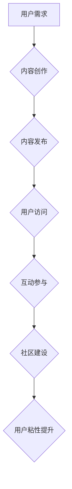

                 

## 知识付费创业中的用户参与度提升策略

> 关键词：知识付费、用户参与度、社区建设、互动机制、内容运营、数据分析、用户画像

## 1. 背景介绍

知识付费行业近年来发展迅速，从在线课程、付费文章到直播带货等多种形式呈现出蓬勃的生机。然而，随着市场竞争的加剧，如何提升用户参与度，打造用户粘性，成为知识付费创业者面临的共同挑战。

用户参与度是指用户在知识付费平台上主动参与、互动和贡献的程度。高用户参与度意味着用户对平台内容的认可和喜爱，也意味着更高的用户留存率和转化率。

## 2. 核心概念与联系

### 2.1 用户参与度提升的本质

用户参与度提升的核心在于构建一个用户活跃、互动、粘性的社区氛围。 

用户参与度提升是一个多维度的概念，涉及到用户体验、内容质量、互动机制、社区运营等多个方面。

**用户参与度提升的要素：**

* **内容质量：** 提供优质、有价值、符合用户需求的内容是提升用户参与度的基础。
* **互动机制：** 设计有效的互动机制，鼓励用户参与讨论、分享、提问等行为。
* **社区氛围：** 营造一个友善、包容、互助的社区氛围，让用户感受到归属感和价值感。
* **平台运营：**  持续优化平台功能，提供良好的用户体验，并积极引导用户参与。

**Mermaid 流程图：**



### 2.2 知识付费平台与社区建设

知识付费平台可以借鉴社区建设的理念，通过构建用户社区，提升用户参与度。

**社区建设的优势：**

* **增强用户粘性：** 社区氛围可以增强用户对平台的归属感和粘性。
* **促进用户互动：** 社区提供了一个平台，让用户可以互相交流、学习和分享。
* **提升内容价值：** 用户参与可以为内容创作提供反馈和灵感，提升内容的价值。

## 3. 核心算法原理 & 具体操作步骤

### 3.1 算法原理概述

用户参与度提升算法的核心是通过数据分析和机器学习，识别用户行为模式，并针对性地推送内容和互动机会。

**主要算法：**

* **推荐算法：** 基于用户历史行为、兴趣偏好等数据，推荐相关内容，提高用户参与度。
* **内容分级算法：** 根据内容主题、难度、用户评价等因素，对内容进行分级，匹配不同用户需求。
* **互动机制算法：** 设计个性化互动机制，例如点赞、评论、分享、问答等，鼓励用户参与。

### 3.2 算法步骤详解

1. **数据收集：** 收集用户行为数据，例如访问记录、浏览时长、点赞数、评论内容等。
2. **数据清洗：** 对收集到的数据进行清洗和处理，去除无效数据和噪声。
3. **特征提取：** 从用户行为数据中提取特征，例如用户兴趣、学习习惯、参与度等。
4. **模型训练：** 使用机器学习算法，训练推荐、分级和互动机制模型。
5. **模型评估：** 对模型进行评估，调整模型参数，提高模型精度。
6. **个性化推荐：** 根据用户特征，个性化推荐内容和互动机会。

### 3.3 算法优缺点

**优点：**

* **精准推荐：** 算法可以根据用户行为模式，精准推荐用户感兴趣的内容。
* **个性化体验：** 算法可以根据用户特征，提供个性化的学习体验。
* **提升用户参与度：** 算法可以设计有效的互动机制，鼓励用户参与。

**缺点：**

* **数据依赖：** 算法需要大量用户行为数据进行训练，数据质量直接影响算法效果。
* **算法复杂度：** 算法模型可能比较复杂，需要专业的技术人员进行维护和优化。
* **用户隐私：** 数据收集和分析需要考虑用户隐私问题。

### 3.4 算法应用领域

用户参与度提升算法广泛应用于知识付费平台、社交媒体、电商平台等领域。

**应用场景：**

* **知识付费平台：** 推荐课程、文章、直播等内容，提高用户学习兴趣和参与度。
* **社交媒体：** 推荐好友、话题、群组等内容，增强用户互动和粘性。
* **电商平台：** 推荐商品、优惠券、活动等信息，提高用户购买意愿和转化率。

## 4. 数学模型和公式 & 详细讲解 & 举例说明

### 4.1 数学模型构建

用户参与度可以被量化，并通过数学模型进行分析和预测。

**用户参与度模型：**

$$
U = f(C, I, S, O)
$$

其中：

* **U**：用户参与度
* **C**：内容质量
* **I**：互动机制
* **S**：社区氛围
* **O**：平台运营

### 4.2 公式推导过程

用户参与度模型是一个复杂的非线性模型，其推导过程需要考虑多个因素的相互影响。

**公式推导：**

* **内容质量 (C)：** 可以通过用户评价、浏览时长、分享率等指标进行量化。
* **互动机制 (I)：** 可以通过点赞数、评论数、问答互动等指标进行量化。
* **社区氛围 (S)：** 可以通过用户活跃度、用户评论的积极性、用户之间的互动频率等指标进行量化。
* **平台运营 (O)：** 可以通过平台功能的完善程度、用户体验的优化程度、平台活动的数量和质量等指标进行量化。

### 4.3 案例分析与讲解

假设一个知识付费平台，其内容质量较高，互动机制完善，社区氛围活跃，平台运营良好。根据用户参与度模型，我们可以推断该平台的用户参与度较高。

**案例分析：**

* **内容质量：** 平台提供高质量的课程和文章，用户评价较高。
* **互动机制：** 平台设计了丰富的互动机制，例如点赞、评论、分享、问答等，用户积极参与。
* **社区氛围：** 平台用户之间互相交流、学习和分享，形成了良好的社区氛围。
* **平台运营：** 平台不断优化功能，提升用户体验，并定期举办活动，吸引用户参与。

## 5. 项目实践：代码实例和详细解释说明

### 5.1 开发环境搭建

* **操作系统：** Ubuntu 20.04 LTS
* **编程语言：** Python 3.8
* **框架：** Django 3.2
* **数据库：** PostgreSQL 13

### 5.2 源代码详细实现

```python
# models.py
from django.db import models

class User(models.Model):
    username = models.CharField(max_length=255)
    # ... 其他用户字段

class Content(models.Model):
    title = models.CharField(max_length=255)
    # ... 其他内容字段

class Interaction(models.Model):
    user = models.ForeignKey(User, on_delete=models.CASCADE)
    content = models.ForeignKey(Content, on_delete=models.CASCADE)
    type = models.CharField(max_length=255)  # 点赞、评论、分享等
    # ... 其他互动字段

# views.py
from django.shortcuts import render
from .models import User, Content, Interaction

def user_profile(request, username):
    user = User.objects.get(username=username)
    # ... 获取用户参与度数据
    return render(request, 'user_profile.html', {'user': user})

def content_detail(request, content_id):
    content = Content.objects.get(id=content_id)
    # ... 获取内容参与度数据
    return render(request, 'content_detail.html', {'content': content})

# ... 其他视图函数

```

### 5.3 代码解读与分析

* **模型定义：** 代码定义了用户、内容和互动三个模型，分别存储用户、内容和用户与内容的互动信息。
* **视图函数：** 代码定义了用户个人资料页面和内容详情页面的视图函数，用于展示用户参与度和内容参与度数据。
* **数据获取：** 视图函数中需要根据用户ID或内容ID，从数据库中获取相关数据，并进行计算和展示。

### 5.4 运行结果展示

运行上述代码后，用户可以访问个人资料页面和内容详情页面，查看自己的参与度和内容的参与度数据。

## 6. 实际应用场景

### 6.1 知识付费平台

知识付费平台可以利用用户参与度提升策略，提高用户粘性，提升转化率。

**应用场景：**

* **个性化推荐：** 根据用户学习习惯和兴趣偏好，推荐相关课程和文章。
* **互动学习：** 设计互动机制，例如在线答疑、小组讨论、项目合作等，增强用户参与度。
* **社区建设：** 建立用户社区，鼓励用户交流学习，分享经验。

### 6.2 在线教育平台

在线教育平台可以利用用户参与度提升策略，提高用户学习效果，提升平台口碑。

**应用场景：**

* **实时互动：** 利用直播、在线问答等功能，提高课堂互动性。
* **个性化辅导：** 根据用户学习进度和情况，提供个性化辅导和答疑服务。
* **学习成果展示：** 提供学习成果展示平台，鼓励用户积极参与学习，提升学习动力。

### 6.3 企业培训平台

企业培训平台可以利用用户参与度提升策略，提高员工培训效果，提升员工技能水平。

**应用场景：**

* **在线培训：** 提供在线课程和学习资源，方便员工随时随地学习。
* **知识库建设：** 建立企业知识库，方便员工查找和共享知识。
* **技能评估：** 定期进行技能评估，帮助员工了解自身能力，并制定学习计划。

### 6.4 未来应用展望

随着人工智能技术的不断发展，用户参与度提升策略将更加智能化、个性化。

**未来应用展望：**

* **更精准的推荐：** 利用深度学习算法，对用户行为进行更精准的分析，推荐更符合用户需求的内容。
* **更个性化的互动：** 利用自然语言处理技术，实现更自然的用户与平台互动。
* **更智能的社区运营：** 利用机器学习算法，自动识别社区活跃用户，并提供个性化服务。

## 7. 工具和资源推荐

### 7.1 学习资源推荐

* **书籍：**
    * 《推荐系统实践》
    * 《深度学习》
    * 《自然语言处理》
* **在线课程：**
    * Coursera
    * edX
    * Udemy

### 7.2 开发工具推荐

* **编程语言：** Python
* **框架：** Django, Flask
* **数据库：** PostgreSQL, MySQL
* **机器学习库：** scikit-learn, TensorFlow, PyTorch

### 7.3 相关论文推荐

* **推荐系统：**
    * Collaborative Filtering for Implicit Feedback Datasets
    * Matrix Factorization Techniques for Recommender Systems
* **自然语言处理：**
    * BERT: Pre-training of Deep Bidirectional Transformers for Language Understanding
    * GPT-3: Language Models are Few-Shot Learners

## 8. 总结：未来发展趋势与挑战

### 8.1 研究成果总结

用户参与度提升策略的研究取得了显著成果，为知识付费平台、在线教育平台、企业培训平台等领域的发展提供了新的思路和方法。

### 8.2 未来发展趋势

未来，用户参与度提升策略将更加智能化、个性化、数据化。

**未来发展趋势：**

* **更精准的推荐：** 利用深度学习算法，对用户行为进行更精准的分析，推荐更符合用户需求的内容。
* **更个性化的互动：** 利用自然语言处理技术，实现更自然的用户与平台互动。
* **更智能的社区运营：** 利用机器学习算法，自动识别社区活跃用户，并提供个性化服务。

### 8.3 面临的挑战

用户参与度提升策略也面临着一些挑战。

**挑战：**

* **数据隐私：** 用户数据收集和分析需要考虑用户隐私问题。
* **算法公平性：** 算法模型需要避免歧视和偏见，确保公平性。
* **用户体验：** 算法优化需要兼顾用户体验，避免过度推荐和打扰用户。

### 8.4 研究展望

未来，我们需要继续深入研究用户参与度提升策略，探索更有效、更智能、更公平的算法模型，为知识付费行业的发展提供更强大的技术支撑。

## 9. 附录：常见问题与解答

**常见问题：**

* **如何提高用户参与度？**

**解答：**

* 提供优质、有价值的内容。
* 设计有效的互动机制。
* 营造友善、包容的社区氛围。
* 持续优化平台功能，提升用户体验。

* **如何评估用户参与度？**

**解答：**

* 用户访问频率
* 用户停留时间
* 用户互动次数
* 用户评价和反馈

* **如何利用数据分析提升用户参与度？**

**解答：**

* 分析用户行为数据，识别用户兴趣和需求。
* 利用机器学习算法，预测用户行为，进行精准推荐。
* 根据用户反馈，优化内容和互动机制。


作者：禅与计算机程序设计艺术 / Zen and the Art of Computer Programming 
<end_of_turn>

