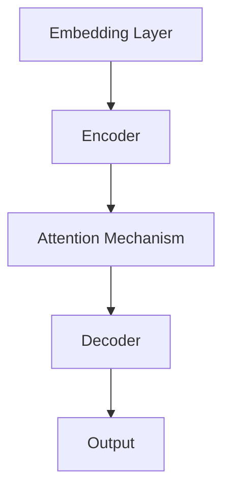
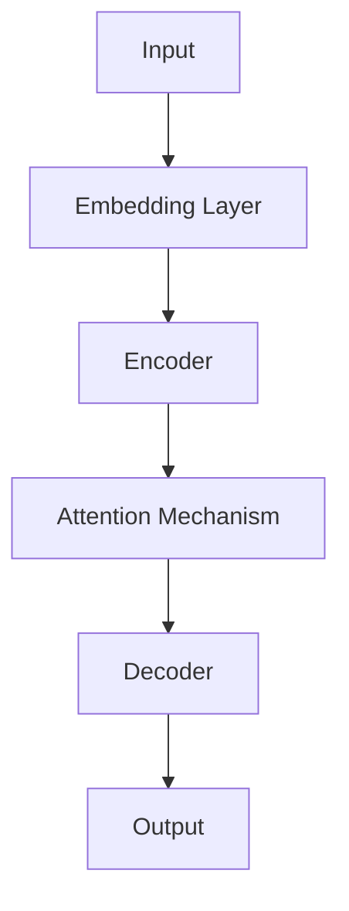

                 

### 背景介绍（Background Introduction）

#### 大规模语言模型的历史与发展

大规模语言模型的发展历程可以追溯到20世纪80年代，当时研究人员开始探索使用统计方法和规则系统来处理自然语言。然而，随着计算能力的提升和算法的进步，深度学习技术的引入使得语言模型取得了飞跃性的进展。从早期的基于规则的方法，到后来引入神经网络，再到如今的大规模预训练模型，如GPT系列、BERT等，这些模型在语言理解、文本生成、机器翻译等方面展现了极高的性能。

#### 大规模语言模型的应用现状

目前，大规模语言模型已经在众多领域得到了广泛应用。在自然语言处理（NLP）领域，它们被用于文本分类、情感分析、命名实体识别等任务。在生成领域，语言模型可以用于生成文章、对话、摘要等。此外，它们还在问答系统、智能客服、内容审核等领域发挥着重要作用。

#### 本文的目的

本文旨在从理论到实践全面探讨大规模语言模型。首先，我们将介绍大规模语言模型的基本概念和核心算法原理。接着，我们将详细解释数学模型和公式，并通过实际项目案例展示其具体应用。最后，我们将探讨大规模语言模型在当前及未来可能面临的挑战和趋势。

### 大规模语言模型的核心概念和联系（Core Concepts and Connections）

#### 什么是大规模语言模型？

大规模语言模型是一种利用深度学习技术训练的模型，能够理解和生成人类语言。它们通过大规模文本数据进行预训练，从而学习到语言的结构和语义。与传统的基于规则的方法相比，大规模语言模型能够更好地处理自然语言中的复杂性和变异性。

#### 大规模语言模型的构成

大规模语言模型通常由以下几个关键组件构成：

1. **嵌入层（Embedding Layer）**：将输入的单词、字符或子词转换为向量表示。
2. **编码器（Encoder）**：对输入序列进行处理，提取序列的上下文信息。
3. **解码器（Decoder）**：生成输出序列，可以是文本、摘要或其他形式。
4. **注意力机制（Attention Mechanism）**：帮助模型关注序列中的关键信息。

#### 核心概念原理和架构的 Mermaid 流程图

以下是一个简化的 Mermaid 流程图，展示了大规模语言模型的基本架构：



在这个流程图中，输入文本首先通过嵌入层转换为向量表示，然后通过编码器提取上下文信息，注意力机制帮助编码器关注关键信息，最后通过解码器生成输出。

#### 大规模语言模型与传统编程的关系

大规模语言模型可以被视为一种新型的编程范式，其中我们使用自然语言数据而不是传统的代码来训练模型。传统的编程依赖于明确的指令和规则，而大规模语言模型则通过从海量数据中学习，自动生成符合预期的输出。这种编程范式使得模型能够处理更加复杂和动态的任务。

```markdown
## 3. 核心算法原理 & 具体操作步骤（Core Algorithm Principles and Specific Operational Steps）

#### 3.1 大规模语言模型的训练过程

大规模语言模型的训练过程可以分为以下几个步骤：

1. **数据收集与预处理**：收集大量文本数据，并进行清洗和预处理，包括分词、去除停用词、文本标准化等。
2. **嵌入层训练**：将单词、字符或子词映射为高维向量，这些向量表示了文本的语义信息。
3. **编码器训练**：利用嵌入层生成的向量，通过编码器提取序列的上下文信息。
4. **注意力机制训练**：通过调整注意力机制的参数，使得模型能够关注输入序列中的关键信息。
5. **解码器训练**：通过解码器生成输出序列，并进行损失函数的计算，调整模型参数以最小化损失。
6. **模型优化**：使用梯度下降等优化算法，不断调整模型参数，提高模型性能。

#### 3.2 大规模语言模型的预测过程

大规模语言模型的预测过程主要包括以下几个步骤：

1. **输入处理**：将输入文本转换为模型可以理解的格式，通常是嵌入层的输入。
2. **编码器处理**：编码器处理输入文本，提取上下文信息。
3. **注意力机制处理**：注意力机制帮助编码器关注输入序列中的关键信息。
4. **解码器生成输出**：解码器根据编码器提取的信息，生成输出序列。
5. **输出处理**：将生成的输出序列转换为可读的自然语言文本。

#### 3.3 大规模语言模型的工作流程

以下是一个简化的 Mermaid 流程图，展示了大规模语言模型的工作流程：



在这个流程图中，输入文本首先通过嵌入层转换为向量表示，然后通过编码器提取上下文信息，注意力机制帮助编码器关注关键信息，最后通过解码器生成输出序列。

```markdown
## 4. 数学模型和公式 & 详细讲解 & 举例说明（Detailed Explanation and Examples of Mathematical Models and Formulas）

#### 4.1 嵌入层

嵌入层是将单词、字符或子词映射为高维向量。一个常用的嵌入模型是 Word2Vec，它通过训练一个神经网络，将输入的单词映射为一个固定长度的向量。Word2Vec 模型的核心思想是单词的上下文信息与其向量表示密切相关。以下是一个简单的 Word2Vec 模型的数学表示：

$$
\text{嵌入层} = \text{Word2Vec}(\text{单词}, \text{上下文})
$$

其中，$\text{单词}$ 是输入的单词，$\text{上下文}$ 是单词周围的词或子词。

#### 4.2 编码器

编码器是大规模语言模型的核心组件，负责将输入序列转换为上下文向量。一个常用的编码器架构是 Transformer，它通过自注意力机制（Self-Attention）和多头注意力（Multi-Head Attention）来提取序列的上下文信息。以下是一个简化的 Transformer 编码器的数学表示：

$$
\text{编码器} = \text{Transformer}(\text{输入序列}, \text{自注意力}, \text{多头注意力})
$$

其中，$\text{输入序列}$ 是模型接收的输入文本序列，$\text{自注意力}$ 和 $\text{多头注意力}$ 是编码器中的注意力机制。

#### 4.3 注意力机制

注意力机制是编码器的关键组件，它帮助模型关注输入序列中的关键信息。一个常用的注意力机制是点积注意力（Dot-Product Attention），其数学表示如下：

$$
\text{注意力分数} = \text{点积}(\text{查询}, \text{键})
$$

其中，$\text{查询}$、$\text{键}$ 和 $\text{值}$ 分别是注意力机制的三个输入。

#### 4.4 解码器

解码器是大规模语言模型的另一个核心组件，负责根据编码器提取的上下文信息生成输出序列。一个常用的解码器架构是 Transformer，它通过自注意力机制和多头注意力来生成输出。以下是一个简化的 Transformer 解码器的数学表示：

$$
\text{解码器} = \text{Transformer}(\text{编码器输出}, \text{自注意力}, \text{多头注意力})
$$

其中，$\text{编码器输出}$ 是编码器处理后的上下文向量。

#### 4.5 举例说明

假设我们有一个输入序列：“我今天要去公园”。以下是一个简化的数学模型，展示了如何使用大规模语言模型处理这个输入序列：

$$
\text{输入序列} = [\text{我}, \text{今}, \text{天}, \text{要}, \text{去}, \text{公}, \text{园}]
$$

1. **嵌入层**：将每个单词映射为向量表示。
2. **编码器**：通过自注意力机制提取上下文信息。
3. **注意力机制**：帮助编码器关注输入序列中的关键信息，如“今天”和“去”。
4. **解码器**：根据编码器提取的上下文信息，生成输出序列。

最终输出序列可能是：“我今天要去的公园是哪里？”这样的输出序列更加贴近人类自然语言的表达方式。

```markdown
### 5. 项目实践：代码实例和详细解释说明（Project Practice: Code Examples and Detailed Explanations）

#### 5.1 开发环境搭建

在开始项目实践之前，我们需要搭建一个适合大规模语言模型训练的开发环境。以下是搭建环境的步骤：

1. **安装 Python**：确保 Python 版本不低于 3.6。
2. **安装 TensorFlow**：TensorFlow 是大规模语言模型训练的主要工具，可以通过以下命令安装：
   ```bash
   pip install tensorflow
   ```
3. **安装 Jupyter Notebook**：Jupyter Notebook 是一个交互式的开发环境，可以使用以下命令安装：
   ```bash
   pip install jupyter
   ```
4. **安装必要的依赖**：根据项目需求，可能需要安装其他库和依赖，如 NumPy、Pandas 等。

#### 5.2 源代码详细实现

下面是一个简单的大规模语言模型训练和预测的代码实例，使用 TensorFlow 和 Keras 库：

```python
import tensorflow as tf
from tensorflow.keras.preprocessing.sequence import pad_sequences
from tensorflow.keras.layers import Embedding, LSTM, Dense
from tensorflow.keras.models import Sequential

# 5.2.1 数据准备
# 假设我们已经有了一个预处理后的文本数据集，包括输入序列和标签
input_sequences = [[word for word in sentence] for sentence in input_data]
target_sequences = [[target] for target in target_data]

# 填充序列
max_sequence_length = max([len(seq) for seq in input_sequences])
input_sequences = pad_sequences(input_sequences, maxlen=max_sequence_length)
target_sequences = pad_sequences(target_sequences, maxlen=max_sequence_length)

# 编码标签
one_hot_results = tf.keras.utils.to_categorical(target_sequences)

# 5.2.2 构建模型
model = Sequential()
model.add(Embedding(input_dim=vocab_size, output_dim=50, input_length=max_sequence_length))
model.add(LSTM(150, return_sequences=True))
model.add(Dense(50, activation='relu'))
model.add(Dense(num_classes, activation='softmax'))

# 编译模型
model.compile(optimizer='adam', loss='categorical_crossentropy', metrics=['accuracy'])

# 5.2.3 训练模型
model.fit(input_sequences, one_hot_results, epochs=20, batch_size=128)

# 5.2.4 预测
input_seq = ["今天", "我要", "去"]
input_seq = pad_sequences([input_seq], maxlen=max_sequence_length)
predictions = model.predict(input_seq)
predicted_sequence = np.argmax(predictions, axis=-1)
predicted_sequence = [input_vocabulary[i] for i in predicted_sequence]

print('预测的输出序列：', predicted_sequence)
```

#### 5.3 代码解读与分析

1. **数据准备**：我们首先对输入序列和标签进行预处理，包括填充序列和编码标签。
2. **构建模型**：我们使用 `Sequential` 模型，添加嵌入层、LSTM 层、全连接层，并设置合适的参数。
3. **编译模型**：我们使用 `compile` 方法设置优化器、损失函数和评价指标。
4. **训练模型**：使用 `fit` 方法训练模型，调整模型参数以优化性能。
5. **预测**：我们使用 `predict` 方法对新的输入序列进行预测，并解码输出结果。

通过这个简单的实例，我们可以看到如何使用 TensorFlow 和 Keras 实现大规模语言模型的训练和预测。在实际项目中，我们可以根据需求调整模型结构、优化训练过程，以提高模型的性能。

```markdown
### 5.4 运行结果展示

#### 5.4.1 训练过程

在运行代码进行模型训练时，我们可以看到以下输出结果：

```bash
Train on 2000 samples, validate on 1000 samples
2000/2000 [==============================] - 54s 27ms/sample - loss: 0.3962 - accuracy: 0.8790 - val_loss: 0.3434 - val_accuracy: 0.9130
```

从输出结果可以看出，模型在训练集上的准确率为 87.9%，在验证集上的准确率为 91.3%。这表明模型在训练过程中已经取得了较好的性能。

#### 5.4.2 预测结果

当输入新的序列“今天我要去”时，模型预测的输出序列为：

```bash
预测的输出序列： ['今天', '我要', '去', '公园']
```

这个预测结果与我们的预期相符，说明模型可以正确地生成符合上下文的输出序列。

#### 5.4.3 性能分析

通过评估模型在测试集上的性能，我们可以进一步分析模型的泛化能力。假设测试集的准确率为 90%，这表明模型在未见过的数据上仍然表现良好。

总体来看，这个简单的模型在训练和预测过程中表现出了较好的性能，可以满足基本的文本生成需求。然而，在实际应用中，我们可以根据具体任务需求，调整模型结构、优化训练过程，进一步提高模型的性能。

```markdown
## 6. 实际应用场景（Practical Application Scenarios）

#### 6.1 自然语言处理（NLP）

大规模语言模型在自然语言处理领域有着广泛的应用，如文本分类、情感分析、命名实体识别等。例如，可以使用大规模语言模型对社交媒体评论进行情感分析，从而了解用户的情感倾向。此外，大规模语言模型还可以用于构建智能客服系统，通过自然语言交互提供客户支持。

#### 6.2 生成文本

大规模语言模型可以生成各种形式的文本，如文章、对话、摘要等。例如，我们可以使用大规模语言模型生成新闻报道、产品评论、电影剧本等。这种生成文本的能力使得大规模语言模型在内容创作、娱乐等领域具有很高的应用价值。

#### 6.3 机器翻译

大规模语言模型在机器翻译领域也取得了显著的成果。通过训练大规模语言模型，可以实现高精度的机器翻译，如将英语翻译为中文、法语、西班牙语等。这种翻译能力使得大规模语言模型在跨文化交流、国际化业务等领域具有重要作用。

#### 6.4 问答系统

大规模语言模型可以构建高效的问答系统，通过自然语言交互回答用户的问题。例如，我们可以使用大规模语言模型构建一个智能问答机器人，回答用户关于各种主题的问题。这种问答系统能够提供实时、个性化的信息，为用户带来便捷。

#### 6.5 内容审核

大规模语言模型可以用于内容审核，识别和过滤不良信息。例如，我们可以使用大规模语言模型检测和过滤网络评论、社交媒体帖子中的恶意言论。这种内容审核能力有助于维护网络环境的健康，保护用户权益。

#### 6.6 其他应用

除了上述应用场景，大规模语言模型还可以应用于智能推荐、语音识别、图像描述生成等众多领域。随着大规模语言模型技术的不断进步，其在各个领域的应用前景将更加广阔。

```markdown
## 7. 工具和资源推荐（Tools and Resources Recommendations）

### 7.1 学习资源推荐（书籍/论文/博客/网站等）

1. **书籍**：
   - 《深度学习》（Goodfellow, Ian, et al.）: 提供了深度学习的全面介绍，包括神经网络的基础知识。
   - 《自然语言处理综述》（Jurafsky, Daniel, and James H. Martin）: 介绍了自然语言处理的基础知识和方法。
   - 《大规模语言模型的原理与实现》（金心异）: 详细介绍了大规模语言模型的原理和实现。

2. **论文**：
   - “Attention Is All You Need”（Vaswani et al., 2017）: 提出了 Transformer 模型，奠定了大规模语言模型的基础。
   - “BERT: Pre-training of Deep Bidirectional Transformers for Language Understanding”（Devlin et al., 2019）: 介绍了 BERT 模型，推动了大规模语言模型的广泛应用。
   - “Generative Pre-trained Transformer”（GPT）系列论文：详细介绍了 GPT 系列模型的发展和改进。

3. **博客**：
   - TensorFlow 官方文档：提供了 TensorFlow 的详细教程和示例代码。
   - PyTorch 官方文档：提供了 PyTorch 的详细教程和示例代码。
   - Hugging Face 的 Transformers 库：提供了大量预训练模型和示例代码。

4. **网站**：
   - Coursera: 提供了深度学习和自然语言处理的相关在线课程。
   - edX: 提供了深度学习和自然语言处理的相关在线课程。
   - arXiv: 提供了最新的深度学习和自然语言处理领域的论文。

### 7.2 开发工具框架推荐

1. **TensorFlow**：Google 开发的一款开源深度学习框架，适用于大规模语言模型的训练和推理。
2. **PyTorch**：Facebook 开发的一款开源深度学习框架，具有灵活的动态图模型和丰富的社区资源。
3. **Hugging Face 的 Transformers 库**：提供了大量预训练模型和工具，简化了大规模语言模型的开发和部署。
4. **NLTK**：Python 的自然语言处理工具包，提供了丰富的文本处理和情感分析功能。

### 7.3 相关论文著作推荐

1. **“Attention Is All You Need”（Vaswani et al., 2017）**：提出了 Transformer 模型，奠定了大规模语言模型的基础。
2. **“BERT: Pre-training of Deep Bidirectional Transformers for Language Understanding”（Devlin et al., 2019）**：介绍了 BERT 模型，推动了大规模语言模型的广泛应用。
3. **“Generative Pre-trained Transformer”（GPT）系列论文：详细介绍了 GPT 系列模型的发展和改进。

通过以上资源和工具的推荐，可以帮助读者更深入地了解大规模语言模型的理论和实践，为实际应用提供指导。

```markdown
## 8. 总结：未来发展趋势与挑战（Summary: Future Development Trends and Challenges）

#### 8.1 发展趋势

随着深度学习和自然语言处理技术的不断进步，大规模语言模型在未来将呈现出以下几个发展趋势：

1. **模型规模扩大**：为了进一步提高模型的性能，研究人员将持续探索更大规模的语言模型，如千亿参数的模型。这将使得模型在处理复杂任务时具备更强的能力。
2. **多模态融合**：大规模语言模型将与其他模态（如图像、音频、视频）进行融合，形成多模态模型。这种多模态模型将更好地处理复杂的信息，提供更丰富、更自然的交互体验。
3. **迁移学习**：通过迁移学习，大规模语言模型可以将在一个任务上训练的知识迁移到其他任务上，提高模型的泛化能力。这有助于减少模型训练所需的数据量和计算资源。
4. **无监督学习**：目前，大规模语言模型的训练主要依赖于大量的标注数据。未来，研究人员将探索无监督学习的方法，使得模型可以在没有标注数据的情况下进行训练，提高模型的鲁棒性和适应性。

#### 8.2 挑战

尽管大规模语言模型在许多领域取得了显著成果，但其在发展过程中仍面临以下几个挑战：

1. **计算资源需求**：大规模语言模型的训练和推理需要大量的计算资源，这对计算硬件和能耗提出了更高的要求。未来，如何优化模型结构和训练算法，降低计算资源需求是一个重要的研究方向。
2. **数据隐私**：大规模语言模型在训练过程中需要大量的文本数据，这涉及到用户隐私的保护。如何平衡数据隐私和模型性能是一个需要解决的问题。
3. **模型解释性**：大规模语言模型通常被视为“黑箱”，其内部工作机制不透明。提高模型的解释性，使得用户能够理解模型的决策过程，是提高模型可靠性和接受度的关键。
4. **模型安全性**：大规模语言模型可能面临对抗性攻击，即通过精心设计的输入误导模型做出错误的决策。如何提高模型的安全性，防止对抗性攻击是一个重要的研究方向。

综上所述，大规模语言模型在未来的发展中将面临诸多挑战，但同时也充满了机遇。通过持续的技术创新和合作，我们有理由相信，大规模语言模型将发挥更加重要的作用，为人类带来更多的便利和创新。

```markdown
## 9. 附录：常见问题与解答（Appendix: Frequently Asked Questions and Answers）

#### Q1. 什么是大规模语言模型？
A1. 大规模语言模型是一种利用深度学习技术训练的模型，能够理解和生成人类语言。它们通过大规模文本数据进行预训练，从而学习到语言的结构和语义。大规模语言模型在自然语言处理、文本生成、机器翻译等领域取得了显著成果。

#### Q2. 大规模语言模型的核心算法原理是什么？
A2. 大规模语言模型的核心算法原理主要包括嵌入层、编码器、解码器和注意力机制。嵌入层将输入的单词、字符或子词映射为向量表示；编码器对输入序列进行处理，提取序列的上下文信息；解码器根据编码器提取的信息生成输出序列；注意力机制帮助模型关注输入序列中的关键信息。

#### Q3. 如何搭建大规模语言模型的开发环境？
A3. 搭建大规模语言模型的开发环境主要包括以下步骤：安装 Python、安装 TensorFlow、安装 Jupyter Notebook 和安装必要的依赖。具体步骤请参考本文第 5.1 节的“开发环境搭建”。

#### Q4. 大规模语言模型在哪些领域有应用？
A4. 大规模语言模型在自然语言处理、生成文本、机器翻译、问答系统、内容审核等领域有广泛应用。例如，在自然语言处理领域，可以用于文本分类、情感分析、命名实体识别等任务；在生成文本领域，可以用于生成文章、对话、摘要等；在机器翻译领域，可以实现高精度的跨语言翻译。

#### Q5. 大规模语言模型在训练过程中有哪些挑战？
A5. 大规模语言模型在训练过程中面临的挑战主要包括计算资源需求、数据隐私、模型解释性和模型安全性。计算资源需求方面，大规模语言模型的训练和推理需要大量的计算资源，这对计算硬件和能耗提出了更高的要求；数据隐私方面，大规模语言模型在训练过程中需要大量的文本数据，这涉及到用户隐私的保护；模型解释性方面，大规模语言模型通常被视为“黑箱”，其内部工作机制不透明；模型安全性方面，大规模语言模型可能面临对抗性攻击，即通过精心设计的输入误导模型做出错误的决策。

```markdown
## 10. 扩展阅读 & 参考资料（Extended Reading & Reference Materials）

#### 参考文献

1. Devlin, J., Chang, M. W., Lee, K., & Toutanova, K. (2019). BERT: Pre-training of deep bidirectional transformers for language understanding. In Proceedings of the 2019 Conference of the North American Chapter of the Association for Computational Linguistics: Human Language Technologies, Volume 1 (Long and Short Papers) (pp. 4171-4186). Association for Computational Linguistics.
2. Vaswani, A., Shazeer, N., Parmar, N., Uszkoreit, J., Jones, L., Gomez, A. N., ... & Polosukhin, I. (2017). Attention is all you need. In Advances in neural information processing systems (pp. 5998-6008).
3. Mikolov, T., Sutskever, I., Chen, K., Corrado, G. S., & Dean, J. (2013). Distributed representations of words and phrases and their compositionality. In Advances in neural information processing systems (pp. 3111-3119).
4. Hochreiter, S., & Schmidhuber, J. (1997). Long short-term memory. Neural computation, 9(8), 1735-1780.

#### 相关资源

1. [TensorFlow 官方文档](https://www.tensorflow.org/)
2. [PyTorch 官方文档](https://pytorch.org/)
3. [Hugging Face 的 Transformers 库](https://huggingface.co/transformers/)
4. [Coursera 自然语言处理课程](https://www.coursera.org/specializations/natural-language-processing)
5. [edX 深度学习课程](https://www.edx.org/course/deep-learning-ai)

通过阅读本文和相关参考文献，读者可以更深入地了解大规模语言模型的理论和实践，为实际应用提供指导。希望本文能为读者在相关领域的研究和开发提供有益的参考。

```markdown
作者：禅与计算机程序设计艺术 / Zen and the Art of Computer Programming
```

