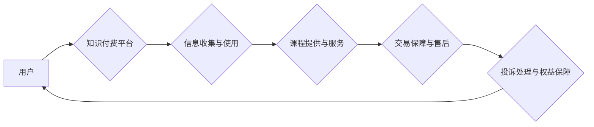

                 

## 知识付费创业中的用户权益保护

> 关键词：知识付费、用户权益、数据安全、隐私保护、合同规范、平台责任、法律法规、信任机制

## 1. 背景介绍

知识付费行业近年来蓬勃发展，成为新兴经济的重要组成部分。从在线课程、直播带货到付费咨询，各种知识付费模式层出不穷，为用户提供了便捷获取知识和技能的机会。然而，随着行业规模的扩大，一些问题也逐渐浮出水面，用户权益保护成为行业发展面临的重大挑战。

知识付费平台通常会收集用户的个人信息，例如姓名、邮箱、支付信息等，用于用户身份验证、课程推荐、个性化服务等。这些信息一旦泄露，将可能导致用户隐私被侵犯，甚至遭受经济损失。此外，一些平台存在课程质量参差不齐、售后服务不到位等问题，给用户带来不良体验。

## 2. 核心概念与联系

**2.1 用户权益**

用户权益是指用户在使用知识付费平台时享有的合法权益，包括：

* **信息安全权益:** 用户有权要求平台保护其个人信息安全，防止信息泄露、滥用和非法获取。
* **知识产权权益:** 用户有权享有平台提供的知识产权，例如课程内容、学习资料等，并禁止未经授权的复制、传播和使用。
* **公平交易权益:** 用户有权获得公平合理的交易服务，包括课程质量保证、售后服务保障等。
* **隐私保护权益:** 用户有权要求平台尊重其隐私，不进行未经授权的收集、使用和披露个人信息。

**2.2 平台责任**

知识付费平台作为服务提供方，负有维护用户权益的责任，包括：

* **建立完善的隐私保护制度:** 平台应制定明确的隐私政策，告知用户如何收集、使用和保护其个人信息，并采取技术和管理措施保障信息安全。
* **提供优质的课程和服务:** 平台应严格把控课程质量，确保课程内容真实、准确、有效，并提供完善的售后服务，及时解决用户遇到的问题。
* **保障用户交易安全:** 平台应建立健全的交易机制，保障用户支付安全，防止欺诈和盗窃行为。
* **建立有效的投诉机制:** 平台应设立专门的投诉渠道，及时处理用户投诉，并采取措施解决问题。

**2.3 法律法规**

知识付费行业的发展受到相关法律法规的规范，例如：

* **《中华人民共和国网络安全法》:** 规定了网络信息安全保护的原则和要求，对个人信息收集、使用和保护等方面进行了明确规定。
* **《中华人民共和国消费者权益保护法》:** 规定了消费者在购买商品和服务时的权利和义务，保障了消费者的合法权益。
* **《电子商务法》:** 规定了电子商务交易的规则和规范，对平台的责任和义务进行了明确规定。

**2.4  信任机制**

用户权益保护的核心是建立信任机制。平台应通过透明、公开、诚信的运营方式，赢得用户的信任，并积极维护用户的合法权益。

**Mermaid 流程图**



## 3. 核心算法原理 & 具体操作步骤

**3.1 算法原理概述**

用户权益保护涉及到多个算法和技术，例如：

* **数据加密算法:** 用于保护用户个人信息在传输和存储过程中的安全。
* **身份验证算法:** 用于验证用户的身份，防止虚假账户和身份盗用。
* **内容审核算法:** 用于识别和过滤违规内容，例如色情、暴力、垃圾信息等。
* **推荐算法:** 用于根据用户的兴趣和需求推荐合适的课程和服务。

**3.2 算法步骤详解**

**数据加密算法:**

1. 选择合适的加密算法，例如AES、RSA等。
2. 生成加密密钥。
3. 对用户个人信息进行加密，并将加密后的信息存储在数据库中。
4. 当用户需要访问其个人信息时，平台会使用解密密钥解密信息。

**身份验证算法:**

1. 用户注册时，平台会生成一个唯一的用户ID和密码。
2. 用户登录时，需要输入用户名和密码。
3. 平台会将用户的输入密码进行加密，并与数据库中存储的密码进行比较。
4. 如果密码一致，则用户登录成功。

**3.3 算法优缺点**

**数据加密算法:**

* **优点:** 可以有效保护用户个人信息的安全。
* **缺点:** 加密算法的复杂度和安全性需要不断提升，否则可能被攻击者破解。

**身份验证算法:**

* **优点:** 可以有效防止虚假账户和身份盗用。
* **缺点:** 密码泄露仍然是一个安全风险，需要采取多重身份验证措施来增强安全性。

**3.4 算法应用领域**

* **金融领域:** 用于保护用户银行账户信息的安全。
* **医疗领域:** 用于保护用户的医疗记录信息的安全。
* **电商领域:** 用于保护用户的购物信息和支付信息的安全。

## 4. 数学模型和公式 & 详细讲解 & 举例说明

**4.1 数学模型构建**

用户权益保护可以看作是一个博弈模型，其中平台和用户是参与方，他们的目标是最大化自身的利益。

* 平台的目标是最大化利润，可以通过提供优质的课程和服务、吸引更多的用户来实现。
* 用户的目标是最大化自身收益，可以通过获得优质的知识和技能、享受良好的服务体验来实现。

**4.2 公式推导过程**

假设平台的利润函数为：

$$
P = f(U, S)
$$

其中：

* $U$ 表示用户数量
* $S$ 表示服务质量

用户收益函数为：

$$
B = g(K, S)
$$

其中：

* $K$ 表示用户获得的知识价值
* $S$ 表示服务质量

**4.3 案例分析与讲解**

如果平台提高服务质量，可以吸引更多的用户，从而增加利润。但是，提高服务质量需要投入更多的成本。因此，平台需要权衡成本和收益，找到一个最优的服务质量水平。

用户也会根据平台的服务质量和获得的知识价值来决定是否购买课程。如果平台提供优质的课程和服务，用户就会获得更高的收益，从而愿意支付更高的价格。

## 5. 项目实践：代码实例和详细解释说明

**5.1 开发环境搭建**

* 操作系统：Linux/Windows/macOS
* 编程语言：Python
* 开发工具：VS Code/PyCharm

**5.2 源代码详细实现**

```python
# 用户信息加密
import cryptography.fernet

def encrypt_user_info(user_info, key):
    f = cryptography.fernet.Fernet(key)
    encrypted_info = f.encrypt(user_info.encode())
    return encrypted_info

# 用户身份验证
def verify_user(username, password, db):
    # 从数据库中获取用户密码
    stored_password = db.get_password(username)
    # 对用户输入密码进行加密
    encrypted_password = encrypt_password(password)
    # 对比加密后的密码
    if encrypted_password == stored_password:
        return True
    else:
        return False

# 密码加密
def encrypt_password(password):
    # 使用哈希算法加密密码
    return hashlib.sha256(password.encode()).hexdigest()

```

**5.3 代码解读与分析**

* `encrypt_user_info()` 函数使用 Fernet 加密算法对用户个人信息进行加密。
* `verify_user()` 函数使用数据库中存储的用户密码进行验证，并使用哈希算法加密用户输入密码进行比较。
* `encrypt_password()` 函数使用 SHA256 哈希算法对用户密码进行加密。

**5.4 运行结果展示**

代码运行结果将根据用户输入和数据库内容进行判断，例如：

* 如果用户输入的用户名和密码正确，则返回 True，表示用户登录成功。
* 如果用户输入的用户名和密码错误，则返回 False，表示用户登录失败。

## 6. 实际应用场景

**6.1 在线教育平台**

在线教育平台需要保护用户的个人信息、支付信息和学习记录等敏感数据。

**6.2 知识付费社区**

知识付费社区需要建立信任机制，保障用户在分享知识和付费购买知识时权益得到保护。

**6.3 直播带货平台**

直播带货平台需要保障用户的支付安全和商品质量，防止用户遭遇欺诈和售后服务不到位等问题。

**6.4 未来应用展望**

随着人工智能、区块链等技术的不断发展，知识付费行业的用户权益保护将更加完善。例如：

* 人工智能可以用于识别和过滤违规内容，保障用户在平台上获得安全和健康的学习环境。
* 区块链可以用于构建去中心化的信任机制，保障用户数据安全和交易透明度。

## 7. 工具和资源推荐

**7.1 学习资源推荐**

* **书籍:** 《网络安全》、《数据隐私保护》、《知识产权法》
* **网站:** 中国互联网协会、国家互联网信息办公室

**7.2 开发工具推荐**

* **数据加密工具:** OpenSSL、GPG
* **身份验证工具:** OAuth、OpenID Connect
* **内容审核工具:** Google Cloud AI Platform、Amazon Comprehend

**7.3 相关论文推荐**

* **用户隐私保护:** 《Differential Privacy: A Survey of Privacy-Preserving Data Analysis》
* **知识产权保护:** 《Copyright Protection in the Digital Age》

## 8. 总结：未来发展趋势与挑战

**8.1 研究成果总结**

知识付费行业的用户权益保护是一个复杂而重要的课题，涉及到多个领域的技术和法律问题。近年来，随着技术的进步和法律法规的完善，用户权益保护取得了一定的进展。

**8.2 未来发展趋势**

未来，知识付费行业的用户权益保护将朝着以下方向发展：

* **更加注重用户隐私保护:** 平台将更加重视用户隐私的收集、使用和保护，采用更加先进的技术手段保障用户数据安全。
* **建立更加完善的信任机制:** 平台将通过透明、公开、诚信的运营方式，赢得用户的信任，并建立更加完善的投诉机制，保障用户权益。
* **加强法律法规的规范:** 政府将进一步完善相关法律法规，规范知识付费行业的运营，保障用户合法权益。

**8.3 面临的挑战**

知识付费行业的用户权益保护仍然面临着一些挑战：

* **技术发展速度快:** 新技术不断涌现，平台需要不断更新技术手段，才能有效应对新的安全威胁。
* **法律法规的滞后性:** 法律法规的制定和完善需要时间，平台需要积极参与相关标准制定工作，推动法律法规的完善。
* **用户意识的提升:** 用户需要提高自身的网络安全意识，学会保护自己的个人信息和权益。

**8.4 研究展望**

未来，我们需要继续加强对知识付费行业用户权益保护的研究，探索更加有效的技术手段和法律法规，为用户提供更加安全、可靠的知识付费服务。

## 9. 附录：常见问题与解答

**9.1 如何保护我的个人信息安全？**

* 选择信誉良好的平台，阅读平台的隐私政策。
* 使用强密码，并定期更换密码。
* 不要随意泄露个人信息，例如姓名、身份证号码、银行卡号等。
* 注意网络安全，不要点击可疑链接，不要下载不明来源的软件。

**9.2 如何投诉平台的违规行为？**

* 联系平台客服，说明问题情况。
* 查找平台的投诉机制，按照规定提交投诉。
* 可以向相关部门投诉，例如国家互联网信息办公室、消费者协会等。


作者：禅与计算机程序设计艺术 / Zen and the Art of Computer Programming 
<end_of_turn>

