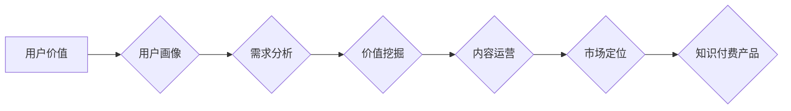

                 

## 知识付费创业的用户价值挖掘技巧

> 关键词：知识付费、用户价值、用户画像、需求分析、价值挖掘、内容运营、市场定位

### 1. 背景介绍

知识付费行业近年来发展迅速，从线上课程、付费咨询到会员体系，各种模式层出不穷。然而，在激烈的市场竞争中，如何精准定位用户需求，挖掘用户价值，并将其转化为商业价值，成为知识付费创业者面临的重大挑战。

传统商业模式往往注重产品本身的价值，而知识付费更强调用户对知识和技能的渴求。因此，深入了解用户的学习目标、痛点和需求，是知识付费创业成功的关键。

### 2. 核心概念与联系

**2.1 用户价值**

用户价值是指用户在使用知识付费产品或服务后获得的实际或潜在利益，包括：

* **知识提升:** 掌握新的技能、知识和洞察力。
* **能力提升:** 提升解决问题、创造价值的能力。
* **个人成长:** 促进个人发展、实现自我价值。
* **社交价值:** 拓展人脉、获得认可和归属感。
* **经济价值:** 提升收入、创造财富。

**2.2 用户画像**

用户画像是指对目标用户群体进行细致描述，包括其年龄、性别、职业、兴趣爱好、教育背景、生活方式、价值观等方面。

**2.3 需求分析**

需求分析是指通过市场调研、用户访谈、数据分析等方式，深入了解用户对知识付费产品的需求，包括其痛点、期望、使用场景等。

**2.4 价值挖掘**

价值挖掘是指通过分析用户价值和需求，开发出能够满足用户需求、创造用户价值的知识付费产品或服务。

**2.5 内容运营**

内容运营是指围绕用户需求，持续创作、更新和推广优质知识付费内容，以吸引和留住用户。

**2.6 市场定位**

市场定位是指根据用户需求和竞争环境，确定知识付费产品的目标用户群体、产品定位和竞争优势。

**Mermaid 流程图**



### 3. 核心算法原理 & 具体操作步骤

**3.1 算法原理概述**

用户价值挖掘的核心算法原理是基于数据分析和机器学习，通过分析用户行为数据、偏好数据和社会关系数据，识别用户价值特征，并将其转化为可操作的 insights。

**3.2 算法步骤详解**

1. **数据收集:** 收集用户行为数据、偏好数据和社会关系数据，例如用户浏览记录、购买记录、评论数据、社交关系网络等。
2. **数据清洗:** 对收集到的数据进行清洗和预处理，去除无效数据、缺失数据和重复数据，确保数据质量。
3. **特征提取:** 从用户数据中提取特征，例如用户年龄、性别、职业、兴趣爱好、学习时长、学习进度、评价分数等。
4. **模型训练:** 使用机器学习算法，例如聚类算法、分类算法和推荐算法，对用户特征进行分析，构建用户价值模型。
5. **价值评估:** 根据用户价值模型，评估用户的价值等级，并将其转化为可操作的 insights，例如用户学习潜力、付费意愿、内容偏好等。
6. **价值挖掘:** 基于用户价值评估结果，开发出能够满足用户需求、创造用户价值的知识付费产品或服务。

**3.3 算法优缺点**

**优点:**

* **精准度高:** 基于数据分析和机器学习，能够更精准地识别用户价值特征。
* **可量化:** 用户价值可以被量化，方便进行评估和比较。
* **可迭代:** 模型可以根据用户反馈和数据更新进行迭代优化。

**缺点:**

* **数据依赖:** 算法的准确性依赖于数据质量和数量。
* **算法复杂:** 需要一定的机器学习知识和技术能力。
* **隐私问题:** 需要谨慎处理用户隐私数据。

**3.4 算法应用领域**

* **知识付费平台:** 识别用户价值，推荐个性化课程和服务。
* **在线教育:** 评估用户学习潜力，提供个性化学习方案。
* **内容创作:** 了解用户内容偏好，创作更受欢迎的内容。
* **市场营销:** 识别潜在客户，进行精准营销。

### 4. 数学模型和公式 & 详细讲解 & 举例说明

**4.1 数学模型构建**

用户价值模型可以构建为一个多维向量，每个维度代表一个用户价值特征，例如：

* **知识价值:** 用户学习到的知识量和深度。
* **能力价值:** 用户掌握的技能和能力水平。
* **个人成长价值:** 用户获得的个人成长和自我提升。
* **社交价值:** 用户获得的社交认可和归属感。
* **经济价值:** 用户获得的收入和财富增长。

**4.2 公式推导过程**

用户价值可以根据以下公式进行计算：

$$
Value = w_1 * Knowledge + w_2 * Ability + w_3 * Growth + w_4 * Social + w_5 * Economy
$$

其中：

* $Value$ 表示用户的总价值。
* $Knowledge$ 表示用户的知识价值。
* $Ability$ 表示用户的能力价值。
* $Growth$ 表示用户的个人成长价值。
* $Social$ 表示用户的社交价值。
* $Economy$ 表示用户的经济价值。
* $w_1$, $w_2$, $w_3$, $w_4$, $w_5$ 分别表示每个价值特征的权重。

**4.3 案例分析与讲解**

假设一个用户学习了编程技能，获得了更高的薪资，并结识了更多同行，我们可以根据上述公式计算其用户价值：

* $Knowledge$: 较高
* $Ability$: 较高
* $Growth$: 较高
* $Social$: 较高
* $Economy$: 较高

根据用户的价值特征和权重，我们可以得出该用户的总价值较高。

### 5. 项目实践：代码实例和详细解释说明

**5.1 开发环境搭建**

* Python 3.x
* Jupyter Notebook
* pandas
* scikit-learn

**5.2 源代码详细实现**

```python
import pandas as pd
from sklearn.cluster import KMeans

# 加载用户数据
data = pd.read_csv('user_data.csv')

# 提取用户特征
features = data[['age', 'gender', 'occupation', 'interest', 'learning_time', 'learning_progress', 'evaluation_score']]

# 训练 KMeans 聚类模型
kmeans = KMeans(n_clusters=5)
kmeans.fit(features)

# 获取用户聚类结果
labels = kmeans.labels_

# 将聚类结果添加到用户数据中
data['cluster'] = labels

# 分析每个聚类的用户特征
for i in range(5):
    cluster_data = data[data['cluster'] == i]
    print(f'Cluster {i} User Features:')
    print(cluster_data.describe())
```

**5.3 代码解读与分析**

* 代码首先加载用户数据，并提取用户特征。
* 然后使用 KMeans 聚类算法将用户分成 5 个聚类。
* 最后，代码分析每个聚类的用户特征，例如年龄、性别、职业、兴趣爱好、学习时长、学习进度和评价分数。

**5.4 运行结果展示**

运行代码后，会输出每个聚类的用户特征描述，例如平均年龄、性别比例、职业分布等。

### 6. 实际应用场景

**6.1 知识付费平台**

* 根据用户价值模型，推荐个性化课程和服务。
* 针对不同用户群体的价值特征，开发不同类型的知识付费产品。
* 优化用户体验，提高用户留存率和转化率。

**6.2 在线教育**

* 评估用户的学习潜力，提供个性化学习方案。
* 根据用户的学习进度和反馈，调整教学内容和方法。
* 提高学习效率，促进用户学习成果。

**6.3 内容创作**

* 了解用户内容偏好，创作更受欢迎的内容。
* 根据用户的价值特征，定制化内容推荐。
* 提高内容的吸引力和价值。

**6.4 市场营销**

* 识别潜在客户，进行精准营销。
* 根据用户的价值特征，制定个性化营销策略。
* 提高营销效率，降低营销成本。

**6.5 未来应用展望**

随着人工智能技术的不断发展，用户价值挖掘将更加精准、智能化。未来，我们可以期待：

* 更细致的用户画像，更精准的用户价值评估。
* 更个性化的知识付费产品和服务，满足用户多样化的需求。
* 更智能化的内容运营，提高内容的价值和传播效果。
* 更有效的市场营销，精准触达目标用户。

### 7. 工具和资源推荐

**7.1 学习资源推荐**

* **书籍:**
    * 《数据挖掘: 概念与技术》
    * 《机器学习》
    * 《Python数据科学手册》
* **在线课程:**
    * Coursera: 数据科学、机器学习
    * edX: 数据分析、人工智能
    * Udemy: Python编程、数据分析

**7.2 开发工具推荐**

* **Python:** 数据分析、机器学习
* **Jupyter Notebook:** 数据分析、代码调试
* **pandas:** 数据处理、分析
* **scikit-learn:** 机器学习算法

**7.3 相关论文推荐**

* 《基于用户行为特征的用户价值挖掘》
* 《用户价值模型构建与应用研究》
* 《知识付费平台用户价值挖掘与个性化推荐》

### 8. 总结：未来发展趋势与挑战

**8.1 研究成果总结**

本文介绍了用户价值挖掘的原理、算法、应用场景以及未来发展趋势。通过数据分析和机器学习，我们可以更精准地识别用户价值特征，开发出能够满足用户需求、创造用户价值的知识付费产品或服务。

**8.2 未来发展趋势**

* **更精准的用户画像:** 利用大数据和人工智能技术，构建更细致、更精准的用户画像。
* **更智能化的价值评估:** 开发更智能的算法模型，能够更准确地评估用户的价值。
* **更个性化的产品和服务:** 根据用户的价值特征，提供更个性化的知识付费产品和服务。
* **更有效的市场营销:** 利用用户价值数据，进行精准的市场营销，提高营销效率。

**8.3 面临的挑战**

* **数据质量:** 用户价值挖掘依赖于高质量的数据，数据清洗和预处理是关键环节。
* **算法复杂性:** 构建用户价值模型需要一定的机器学习知识和技术能力。
* **隐私问题:** 需要谨慎处理用户隐私数据，确保数据安全和用户权益。

**8.4 研究展望**

未来，用户价值挖掘将继续朝着更精准、更智能化的方向发展。随着人工智能技术的不断进步，我们可以期待更强大的用户价值挖掘工具和技术，为知识付费行业带来更大的发展机遇。

### 9. 附录：常见问题与解答

**9.1 如何收集用户数据？**

* 用户注册信息
* 用户行为数据 (浏览记录、购买记录、评论数据)
* 用户反馈数据 (问卷调查、用户评论)
* 社交关系数据 (用户关注、粉丝、互动)

**9.2 如何处理用户隐私数据？**

*  anonymize 用户数据，去除个人识别信息。
* 获得用户同意后，才收集和使用用户数据。
* 加强数据安全防护，防止数据泄露。

**9.3 如何评估用户价值？**

* 使用机器学习算法，构建用户价值模型。
* 根据用户价值模型，计算用户的总价值。
* 结合用户反馈和行为数据，进行动态评估。


作者：禅与计算机程序设计艺术 / Zen and the Art of Computer Programming 
<end_of_turn>

