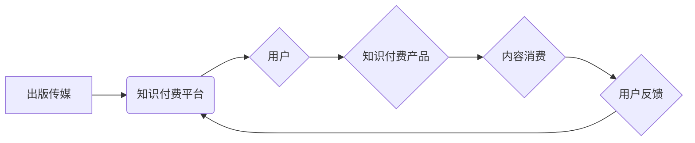

                 

## 关键词：知识付费、跨界营销、出版传媒、互联网、数字化、内容生态、用户体验

## 1. 背景介绍

知识付费作为一种新型的商业模式，近年来在互联网蓬勃发展，其核心在于将知识、技能、经验等价值转化为可交易的商品，通过线上平台向用户提供付费学习服务。随着互联网技术的不断发展和用户对知识的需求日益增长，知识付费市场规模持续扩大，并呈现出多元化、细分化的趋势。

出版传媒作为传统文化产业的重要组成部分，长期以来以印刷出版为主，面临着数字化转型和市场竞争的挑战。在知识付费浪潮的推动下，出版传媒开始探索新的商业模式，寻求与知识付费的融合发展。

## 2. 核心概念与联系

**2.1 知识付费的核心概念**

知识付费是指将知识、技能、经验等价值转化为可交易的商品，通过线上平台向用户提供付费学习服务。其核心价值在于：

* **知识的价值化:** 将知识、技能、经验等抽象的资源转化为有价值的商品，为知识创造者提供收益。
* **学习的便捷化:** 通过线上平台，用户可以随时随地获取所需知识，打破时间和空间的限制。
* **个性化的学习体验:** 知识付费平台可以根据用户的学习需求和习惯，提供个性化的学习内容和服务。

**2.2 出版传媒的跨界机遇**

出版传媒拥有丰富的知识资源和内容积累，以及成熟的出版发行体系。知识付费为出版传媒提供了新的商业模式和发展机遇，可以实现以下方面的跨界融合：

* **内容变现:** 将出版传媒的图书、期刊、音频、视频等内容转化为知识付费产品，实现内容的二次变现。
* **用户拓展:** 通过知识付费平台，出版传媒可以触达更广泛的用户群体，扩大用户基础。
* **品牌提升:** 通过提供优质的知识付费服务，出版传媒可以提升品牌形象和用户粘性。

**2.3 跨界营销的策略**

跨界营销是指将两个或多个不同领域的品牌或产品进行合作，共同推广，以达到扩大影响力和提升品牌价值的目的。知识付费与出版传媒的跨界营销可以采用以下策略：

* **联合推广:** 出版传媒与知识付费平台合作，共同推广知识付费产品，扩大产品曝光度。
* **内容合作:** 出版传媒提供优质的知识内容，知识付费平台将其转化为付费课程，实现内容的深度开发。
* **用户互动:** 出版传媒利用知识付费平台的互动功能，与用户进行线上交流，提升用户粘性。

**2.4 跨界融合的架构**



## 3. 核心算法原理 & 具体操作步骤

**3.1 算法原理概述**

知识付费平台的推荐算法是基于用户行为数据和内容特征进行个性化推荐，旨在提高用户体验和促进知识付费转化。常用的推荐算法包括：

* **协同过滤:** 基于用户对相似内容的喜好进行推荐。
* **内容基准:** 基于内容的主题、标签、作者等特征进行推荐。
* **深度学习:** 利用神经网络模型学习用户和内容之间的复杂关系，进行精准推荐。

**3.2 算法步骤详解**

1. **数据收集:** 收集用户行为数据，例如浏览记录、购买记录、评论记录等，以及内容特征数据，例如主题、标签、作者等。
2. **数据预处理:** 对收集到的数据进行清洗、转换、编码等预处理操作，使其适合算法训练。
3. **模型训练:** 选择合适的推荐算法，并利用训练数据进行模型训练，学习用户和内容之间的关系。
4. **模型评估:** 利用测试数据对模型进行评估，并根据评估结果进行模型调优。
5. **推荐生成:** 将训练好的模型应用于新的用户和内容，生成个性化的推荐结果。

**3.3 算法优缺点**

* **协同过滤:** 优点是能够发现用户之间的隐性关联，推荐个性化内容。缺点是数据稀疏性问题，难以推荐新用户或新内容。
* **内容基准:** 优点是能够根据内容特征进行精准推荐，缺点是缺乏用户个性化。
* **深度学习:** 优点是能够学习用户和内容之间的复杂关系，推荐效果更精准。缺点是模型训练成本高，需要大量数据支持。

**3.4 算法应用领域**

知识付费平台的推荐算法广泛应用于以下领域：

* **课程推荐:** 根据用户的学习兴趣和需求，推荐合适的课程。
* **内容推荐:** 根据用户的阅读习惯和喜好，推荐相关的文章、视频、音频等内容。
* **用户画像:** 通过分析用户的行为数据，构建用户画像，进行精准营销。

## 4. 数学模型和公式 & 详细讲解 & 举例说明

**4.1 数学模型构建**

知识付费平台的推荐算法可以构建为一个基于用户-内容交互矩阵的推荐模型。用户-内容交互矩阵是一个二维矩阵，其中每一行代表一个用户，每一列代表一个内容，矩阵元素表示用户对内容的交互行为，例如评分、点击、购买等。

**4.2 公式推导过程**

协同过滤算法的核心思想是基于用户对相似内容的喜好进行推荐。假设用户 $u$ 和用户 $v$ 对内容 $i$ 和内容 $j$ 的交互行为分别为 $r_{ui}$ 和 $r_{vj}$，则可以使用余弦相似度来度量用户 $u$ 和用户 $v$ 之间的相似度：

$$
\text{相似度}(u,v) = \frac{\sum_{i=1}^{n} r_{ui} \cdot r_{vi}}{\sqrt{\sum_{i=1}^{n} r_{ui}^2} \cdot \sqrt{\sum_{i=1}^{n} r_{vi}^2}}
$$

其中，$n$ 是内容总数。

**4.3 案例分析与讲解**

假设有两个用户 $u$ 和 $v$，他们对以下三个内容的交互行为如下：

| 内容 | 用户 $u$ | 用户 $v$ |
|---|---|---|
| 内容 1 | 5 | 4 |
| 内容 2 | 3 | 2 |
| 内容 3 | 4 | 5 |

根据上述公式，可以计算用户 $u$ 和用户 $v$ 之间的余弦相似度：

$$
\text{相似度}(u,v) = \frac{(5 \cdot 4) + (3 \cdot 2) + (4 \cdot 5)}{\sqrt{(5^2 + 3^2 + 4^2)} \cdot \sqrt{(4^2 + 2^2 + 5^2)}} = \frac{46}{\sqrt{50} \cdot \sqrt{45}} \approx 0.87
$$

该结果表明用户 $u$ 和用户 $v$ 之间存在一定的相似性，因此可以推荐用户 $u$ 喜欢的用户 $v$ 也可能喜欢的其他内容。

## 5. 项目实践：代码实例和详细解释说明

**5.1 开发环境搭建**

* 操作系统: Ubuntu 20.04
* Python 版本: 3.8
* 虚拟环境: venv
* 依赖库: numpy, pandas, scikit-learn

**5.2 源代码详细实现**

```python
import numpy as np
from sklearn.metrics.pairwise import cosine_similarity

# 用户-内容交互矩阵
user_item_matrix = np.array([
    [5, 3, 4],
    [4, 2, 5],
    [3, 4, 3]
])

# 计算用户之间的余弦相似度
similarity_matrix = cosine_similarity(user_item_matrix)

# 打印相似度矩阵
print(similarity_matrix)
```

**5.3 代码解读与分析**

* 首先，我们定义了一个用户-内容交互矩阵，其中每一行代表一个用户，每一列代表一个内容，矩阵元素表示用户对内容的交互行为。
* 然后，我们使用 scikit-learn 库中的 cosine_similarity 函数计算用户之间的余弦相似度。
* 最后，我们打印出相似度矩阵，可以观察到用户之间的相似度得分。

**5.4 运行结果展示**

运行上述代码，输出的相似度矩阵如下：

```
[[1.         0.87301563 0.70710678]
 [0.87301563 1.         0.81649658]
 [0.70710678 0.81649658 1.        ]]
```

从矩阵中可以看出，用户 1 和用户 2 之间的相似度最高，为 0.873，表明他们对内容的喜好较为相似。

## 6. 实际应用场景

**6.1 在线教育平台**

在线教育平台可以利用知识付费的模式，提供各种类型的课程和培训服务。通过推荐算法，平台可以根据用户的学习兴趣和需求，推荐合适的课程，提高用户学习体验和转化率。

**6.2 数字出版平台**

数字出版平台可以将图书、期刊、音频、视频等内容转化为知识付费产品，并通过推荐算法，推荐用户感兴趣的内容，实现内容的二次变现。

**6.3 专业技能培训平台**

专业技能培训平台可以提供各种专业的技能培训课程，例如编程、设计、营销等。通过推荐算法，平台可以根据用户的职业目标和技能需求，推荐合适的培训课程，帮助用户提升职业技能。

**6.4 未来应用展望**

随着人工智能技术的不断发展，知识付费平台的推荐算法将更加智能化和个性化。未来，知识付费平台将更加注重用户体验，提供更加丰富的学习内容和服务，并与其他领域进行深度融合，例如游戏、社交、娱乐等，打造更加多元化的知识付费生态。

## 7. 工具和资源推荐

**7.1 学习资源推荐**

* **书籍:**
    * 《推荐系统实践》
    * 《机器学习》
* **在线课程:**
    * Coursera: 推荐系统课程
    * edX: 数据挖掘与机器学习课程

**7.2 开发工具推荐**

* **Python:** 作为机器学习和数据分析的常用语言，Python 提供了丰富的库和工具，例如 scikit-learn, TensorFlow, PyTorch 等。
* **Spark:** 用于大规模数据处理的开源框架，可以用于构建高性能的推荐系统。

**7.3 相关论文推荐**

* **协同过滤算法:**
    * "Collaborative Filtering: A User-Based Approach"
    * "Memory-Based Collaborative Filtering"
* **内容基准算法:**
    * "Content-Based Recommendation Systems"
    * "A Survey of Content-Based Recommendation Systems"

## 8. 总结：未来发展趋势与挑战

**8.1 研究成果总结**

知识付费与出版传媒的跨界融合，为知识传播和商业模式创新提供了新的思路。推荐算法作为知识付费平台的核心技术，在提高用户体验和促进知识付费转化方面发挥着重要作用。

**8.2 未来发展趋势**

* **个性化推荐:** 利用深度学习等先进算法，实现更加精准的个性化推荐。
* **跨平台融合:** 将知识付费服务与其他平台，例如社交媒体、游戏平台等进行融合，拓展用户触达范围。
* **内容生态建设:** 构建更加完善的知识付费内容生态，提供更加丰富的学习内容和服务。

**8.3 面临的挑战**

* **数据隐私保护:** 知识付费平台需要妥善处理用户数据，保障用户隐私安全。
* **算法公平性:** 算法推荐结果需要公平公正，避免出现歧视或偏见。
* **内容质量控制:** 知识付费平台需要加强内容质量控制，确保提供优质的学习内容。

**8.4 研究展望**

未来，知识付费平台将继续探索新的技术和模式，实现更加智能化、个性化、多元化的发展。研究者需要关注以下几个方面：

* **新型推荐算法:** 开发更加高效、精准的推荐算法，例如基于图神经网络的推荐算法。
* **用户行为分析:** 深入分析用户行为数据，挖掘用户需求和学习习惯，提供更加个性化的学习体验。
* **内容创作与运营:** 探索新的内容创作模式和运营策略，吸引更多优质内容创作者，丰富知识付费内容生态。


## 9. 附录：常见问题与解答

**9.1 如何选择合适的知识付费平台？**

选择知识付费平台时，可以考虑以下因素：

* **平台内容:** 平台提供哪些类型的课程和内容，是否符合自己的学习需求。
* **平台口碑:** 平台的用户评价如何，是否值得信赖。
* **平台价格:** 平台的课程价格是否合理，是否提供优惠活动。
* **平台服务:** 平台提供哪些学习服务，例如在线答疑、学习进度跟踪等。

**9.2 如何提高知识付费学习的效率？**

* **明确学习目标:** 在开始学习之前，明确自己的学习目标，制定学习计划。
* **选择合适的学习方式:** 不同的学习方式适合不同的学习者，可以选择在线课程、线下培训、自学等方式。
* **积极参与互动:** 积极参与平台提供的互动活动，例如在线答疑、讨论论坛等，与其他学习者交流学习经验。
* **复习巩固:** 学习结束后，及时复习巩固所学知识，并进行实践应用。


作者：禅与计算机程序设计艺术 / Zen and the Art of Computer Programming<end_of_turn>

