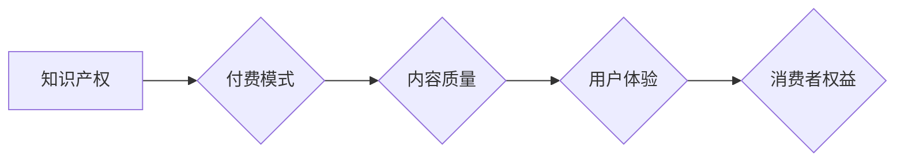

                 

## 知识付费要重视消费者权益保护和纠纷解决

> 关键词：知识付费、消费者权益、纠纷解决、平台责任、合同规范、数据安全、退款机制、用户体验

## 1. 背景介绍

知识付费作为一种新型的商业模式，近年来发展迅速，涌现出众多平台和内容创作者。它为知识产权的传播和分享提供了新的途径，也为个人学习和提升提供了便捷的方式。然而，随着知识付费市场的快速扩张，一些问题也逐渐浮出水面，其中消费者权益保护和纠纷解决尤为重要。

### 1.1 知识付费市场现状

知识付费市场规模持续增长，涵盖了各个领域，从专业技能培训到兴趣爱好课程，从在线教育到咨询服务，应有尽有。平台如网易云课堂、腾讯课堂、Udemy等，以及众多独立创作者，都在为用户提供丰富的知识内容。

### 1.2 消费者权益面临的挑战

尽管知识付费市场发展迅速，但消费者权益保护仍存在一些不足：

* **信息不对称:** 消费者在选择课程时，难以全面了解课程内容、质量和授课老师的水平，容易受到虚假宣传和夸大其词的影响。
* **售后服务缺失:** 一些平台和创作者缺乏完善的售后服务机制，消费者遇到问题难以得到及时解决，权益难以得到保障。
* **退款机制不完善:** 知识付费产品大多为虚拟商品，退款机制不完善，消费者退费困难，权益难以维护。
* **数据安全隐患:** 知识付费平台收集用户大量个人信息，存在数据泄露和滥用风险，需要加强数据安全保护。

## 2. 核心概念与联系

知识付费的核心概念包括：

* **知识产权:** 知识付费的核心是知识产权的交易，包括但不限于著作权、专利权、商标权等。
* **付费模式:** 知识付费采用多种付费模式，如订阅制、课程购买、会员制等。
* **内容质量:** 知识付费产品的核心价值在于内容质量，需要保证内容的准确性、实用性和原创性。
* **用户体验:** 知识付费平台需要提供良好的用户体验，包括课程学习、互动交流、售后服务等方面。

**Mermaid 流程图:**

## 3. 核心算法原理 & 具体操作步骤

知识付费平台的运营涉及到许多算法，例如推荐算法、内容审核算法、用户画像算法等。这些算法的原理和操作步骤都非常复杂，需要专业的技术人员进行设计和开发。

### 3.1  算法原理概述

推荐算法的核心是根据用户的历史行为、兴趣偏好等信息，预测用户可能感兴趣的内容，并将其推荐给用户。常用的推荐算法包括协同过滤、内容过滤、基于知识的推荐等。

### 3.2  算法步骤详解

**协同过滤算法步骤:**

1. 收集用户行为数据，例如用户浏览过的课程、购买过的课程、评分过的课程等。
2. 计算用户之间的相似度，例如根据用户对课程的评分进行相似度计算。
3. 找到与目标用户相似度高的用户，并推荐目标用户可能感兴趣的课程。

**内容过滤算法步骤:**

1. 对课程内容进行特征提取，例如课程标题、课程描述、课程标签等。
2. 计算用户对课程特征的偏好度。
3. 根据用户对课程特征的偏好度，推荐用户可能感兴趣的课程。

### 3.3  算法优缺点

**协同过滤算法:**

* **优点:** 可以发现用户之间的隐性关联，推荐个性化内容。
* **缺点:** 数据稀疏性问题，新用户和新课程难以推荐。

**内容过滤算法:**

* **优点:** 不需要用户历史行为数据，可以推荐新课程。
* **缺点:** 难以捕捉用户之间的隐性关联，推荐内容可能不够个性化。

### 3.4  算法应用领域

推荐算法广泛应用于电商、社交媒体、在线教育等领域，帮助平台提高用户粘性、促进交易和内容传播。

## 4. 数学模型和公式 & 详细讲解 & 举例说明

推荐算法的数学模型和公式非常复杂，涉及到线性代数、概率统计、机器学习等多个领域。

### 4.1  数学模型构建

协同过滤算法的数学模型通常基于矩阵分解，将用户-课程交互矩阵分解成用户特征矩阵和课程特征矩阵的乘积。

### 4.2  公式推导过程

假设用户-课程交互矩阵为R，用户特征矩阵为U，课程特征矩阵为V，则有：

$$R \approx U V^T$$

其中，$R_{ui}$表示用户$u$对课程$i$的评分，$U_{u}$表示用户$u$的特征向量，$V_{i}$表示课程$i$的特征向量。

### 4.3  案例分析与讲解

通过矩阵分解，可以得到用户和课程的特征向量，然后根据特征向量的相似度进行推荐。例如，如果用户$u$和用户$v$的特征向量相似度较高，则用户$u$可能对用户$v$喜欢的课程感兴趣。

## 5. 项目实践：代码实例和详细解释说明

知识付费平台的开发需要使用多种技术，例如前端技术、后端技术、数据库技术、云计算技术等。

### 5.1  开发环境搭建

开发环境需要包括操作系统、编程语言、数据库、云服务等。

### 5.2  源代码详细实现

源代码实现涉及到多个模块，例如用户模块、课程模块、支付模块、推荐模块等。

### 5.3  代码解读与分析

代码解读需要分析代码的逻辑结构、算法实现、数据处理等方面。

### 5.4  运行结果展示

运行结果展示需要验证代码的功能是否正常，数据是否准确，用户体验是否良好等。

## 6. 实际应用场景

知识付费平台的应用场景非常广泛，例如在线教育、职业培训、兴趣爱好学习等。

### 6.4  未来应用展望

未来，知识付费平台将更加智能化、个性化、互动化。

## 7. 工具和资源推荐

### 7.1  学习资源推荐

* 在线课程平台：Coursera、edX、Udemy等
* 技术博客：Medium、Hacker News、Stack Overflow等
* 书籍：

### 7.2  开发工具推荐

* 前端框架：React、Vue、Angular等
* 后端框架：Node.js、Django、Flask等
* 数据库：MySQL、MongoDB、PostgreSQL等
* 云服务：AWS、Azure、GCP等

### 7.3  相关论文推荐

* 推荐算法相关论文：

## 8. 总结：未来发展趋势与挑战

### 8.1  研究成果总结

知识付费平台的发展取得了显著成果，为知识传播和学习提供了新的途径。

### 8.2  未来发展趋势

未来，知识付费平台将更加智能化、个性化、互动化。

### 8.3  面临的挑战

知识付费平台面临着数据安全、用户隐私、内容质量等挑战。

### 8.4  研究展望

未来研究方向包括：

* 更智能的推荐算法
* 更完善的消费者权益保护机制
* 更安全的知识付费平台

## 9. 附录：常见问题与解答

* **常见问题:**

* **解答:**

作者：禅与计算机程序设计艺术 / Zen and the Art of Computer Programming 
<end_of_turn>

