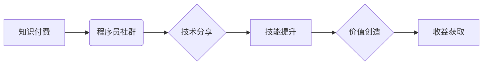

                 

## 知识付费：程序员的社群运营诀窍

> 关键词：知识付费、程序员社群、运营策略、内容创作、社区建设、技术分享、商业模式

### 1. 背景介绍

在当今数字化时代，知识已成为最宝贵的资源之一。程序员作为科技发展的重要力量，拥有丰富的技术经验和专业技能。知识付费模式的兴起为程序员提供了展示专业能力、分享技术经验、获取收益的平台。同时，程序员社群的蓬勃发展为知识付费提供了广阔的市场空间。

程序员社群的活跃度高，成员之间互相学习、交流、探讨技术问题，形成了浓厚的学习氛围。而知识付费则可以有效地满足程序员对专业技能提升和技术知识获取的需求。通过线上课程、付费文档、技术咨询等形式，程序员可以将自己的知识和经验转化为价值，并获得相应的回报。

### 2. 核心概念与联系

**2.1 知识付费**

知识付费是指通过提供有价值的知识和技能，向用户收取费用的一种商业模式。它打破了传统教育模式的限制，让知识的获取更加灵活、便捷和个性化。

**2.2 程序员社群**

程序员社群是指由程序员组成，以共同学习、交流、分享技术经验为目的的网络或线下组织。它为程序员提供了互相学习、互相帮助、共同进步的平台。

**2.3 关系图**



**2.4 核心联系**

知识付费模式与程序员社群之间存在着密切的联系。程序员社群为知识付费提供了用户群体和传播渠道，而知识付费则为程序员社群提供了新的价值创造模式和盈利机会。

### 3. 核心算法原理 & 具体操作步骤

**3.1 算法原理概述**

知识付费的成功运营需要遵循一定的算法原理，包括内容创作、用户运营、社区建设等方面。

**3.2 算法步骤详解**

1. **内容创作：** 

   * 确定目标用户群体和他们的需求。
   * 选择具有价值和吸引力的知识点进行创作。
   * 采用多种形式进行内容输出，例如视频课程、文章、直播等。
   * 保证内容质量和原创性。

2. **用户运营：**

   * 构建用户画像，了解用户的兴趣、需求和行为习惯。
   * 提供个性化的内容推荐和服务。
   * 鼓励用户参与互动，建立社区氛围。
   * 进行用户反馈收集和分析，不断优化内容和服务。

3. **社区建设：**

   * 建立线上或线下社群平台，方便用户交流互动。
   * 组织线上线下活动，增强用户粘性。
   * 培养社区活跃度和用户参与度。
   * 建立社区规则和管理机制，维护良好的社区秩序。

**3.3 算法优缺点**

* **优点：**

   * 能够有效地满足程序员对专业技能提升和技术知识获取的需求。
   * 为程序员提供了展示专业能力、分享技术经验、获取收益的平台。
   * 能够促进程序员之间的交流和合作，共同进步。

* **缺点：**

   * 需要投入大量的时间和精力进行内容创作和用户运营。
   * 需要建立完善的社区管理机制，维护良好的社区秩序。
   * 需要不断更新内容和服务，才能保持用户兴趣和粘性。

**3.4 算法应用领域**

* **技术培训：** 提供编程语言、框架、工具等方面的培训课程。
* **技术咨询：** 为程序员提供技术问题解答和解决方案。
* **技术文档：** 提供技术文档、教程、案例等资源。
* **技术交流：** 建立技术论坛、在线社区等平台，方便程序员交流学习。

### 4. 数学模型和公式 & 详细讲解 & 举例说明

**4.1 数学模型构建**

知识付费的成功运营可以看作是一个复杂的系统，我们可以用数学模型来描述其内部的运作机制。例如，我们可以用以下公式来描述用户参与度：

$$
U = f(C, S, I)
$$

其中：

* $U$ 表示用户参与度
* $C$ 表示内容质量
* $S$ 表示社区活跃度
* $I$ 表示用户互动频率

**4.2 公式推导过程**

这个公式的推导过程可以基于用户行为分析和心理学研究。

* **内容质量 (C):** 高质量的内容能够吸引用户，提高用户参与度。
* **社区活跃度 (S):** 活跃的社区能够提供良好的互动体验，增强用户粘性。
* **用户互动频率 (I):** 频繁的互动能够促进用户之间的交流和学习，提高用户参与度。

**4.3 案例分析与讲解**

例如，一个技术论坛的参与度较高，是因为其内容质量高，社区活跃度高，用户互动频率高。

### 5. 项目实践：代码实例和详细解释说明

**5.1 开发环境搭建**

* 选择合适的编程语言和框架，例如 Python 和 Django。
* 安装必要的软件和工具，例如数据库、Web服务器等。
* 配置开发环境，例如设置虚拟环境、数据库连接等。

**5.2 源代码详细实现**

```python
# 用户模型
class User(models.Model):
    username = models.CharField(max_length=255)
    password = models.CharField(max_length=255)
    email = models.EmailField()

# 内容模型
class Content(models.Model):
    title = models.CharField(max_length=255)
    description = models.TextField()
    price = models.DecimalField(max_digits=10, decimal_places=2)
    author = models.ForeignKey(User, on_delete=models.CASCADE)

# 购买记录模型
class Purchase(models.Model):
    user = models.ForeignKey(User, on_delete=models.CASCADE)
    content = models.ForeignKey(Content, on_delete=models.CASCADE)
    purchase_time = models.DateTimeField(auto_now_add=True)
```

**5.3 代码解读与分析**

以上代码实现了用户、内容和购买记录三个模型，可以用于存储用户数据、内容信息和购买记录。

**5.4 运行结果展示**

运行上述代码可以搭建一个简单的知识付费平台，用户可以注册登录、浏览内容、购买课程等。

### 6. 实际应用场景

**6.1 在线课程平台**

程序员可以利用知识付费模式创建在线课程平台，教授编程语言、框架、工具等方面的知识。

**6.2 技术博客**

程序员可以将自己的技术文章、案例、经验分享等内容发布到技术博客，并通过付费订阅的方式获取收益。

**6.3 技术咨询服务**

程序员可以提供技术咨询服务，帮助其他程序员解决技术问题，并收取相应的咨询费用。

**6.4 代码库和工具包**

程序员可以开发高质量的代码库和工具包，并通过付费下载的方式提供给其他程序员使用。

**6.5 社群运营**

程序员可以建立技术社群，提供技术交流、学习、分享等服务，并通过会员制度或付费活动获取收益。

**6.6 未来应用展望**

随着人工智能、大数据等技术的不断发展，知识付费模式将更加智能化、个性化、多元化。程序员可以利用这些技术，开发更加创新的知识付费产品和服务，满足用户日益增长的需求。

### 7. 工具和资源推荐

**7.1 学习资源推荐**

* **在线课程平台：** Udemy、Coursera、Udacity
* **技术博客：** Medium、Hacker News、Stack Overflow
* **开源社区：** GitHub、GitLab、Bitbucket

**7.2 开发工具推荐**

* **编程语言：** Python、Java、C++
* **Web框架：** Django、Flask、Spring Boot
* **数据库：** MySQL、PostgreSQL、MongoDB

**7.3 相关论文推荐**

* **The Economics of Online Education**
* **The Sharing Economy: Peer-to-Peer Accommodation and the Future of Hospitality**
* **The Impact of Social Media on Knowledge Sharing**

### 8. 总结：未来发展趋势与挑战

**8.1 研究成果总结**

知识付费模式为程序员提供了新的价值创造和盈利机会，同时也为用户提供了更加便捷、高效的学习方式。

**8.2 未来发展趋势**

* **个性化定制：** 根据用户的学习需求和习惯，提供个性化的学习内容和服务。
* **人工智能驱动：** 利用人工智能技术，自动生成学习内容、推荐学习资源、评估学习效果等。
* **沉浸式体验：** 通过虚拟现实、增强现实等技术，提供更加沉浸式的学习体验。

**8.3 面临的挑战**

* **内容质量控制：** 确保知识付费内容的质量和原创性，避免低质量内容泛滥。
* **用户信任问题：** 建立用户对知识付费平台的信任，保证用户权益。
* **商业模式创新：** 探索更加可持续的商业模式，实现平台的长期发展。

**8.4 研究展望**

未来，知识付费模式将继续发展和完善，为程序员和用户带来更多价值。


### 9. 附录：常见问题与解答

**9.1 如何选择合适的知识付费平台？**

* 考虑平台的用户群体、内容质量、服务水平、收费标准等因素。
* 可以参考其他用户的评价和反馈，选择口碑较好的平台。

**9.2 如何保护知识产权？**

* 在发布知识付费内容时，应做好版权登记和知识产权保护工作。
* 可以使用加密技术等手段，防止内容被盗版和传播。

**9.3 如何提高知识付费内容的吸引力？**

* 内容要实用、有价值、符合用户需求。
* 可以采用多种形式进行内容输出，例如视频、音频、文字等。
* 可以与用户互动，收集反馈，不断优化内容。


作者：禅与计算机程序设计艺术 / Zen and the Art of Computer Programming 
<end_of_turn>

