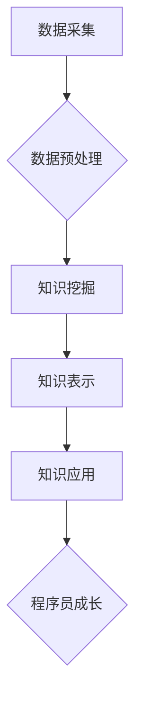

                 

## 知识发现引擎助力程序员快速成长

> 关键词：知识发现引擎、程序员成长、代码分析、学习推荐、个性化学习、人工智能、软件开发

## 1. 背景介绍

在当今软件开发领域，程序员面临着日益增长的学习压力。新技术层出不穷，编程语言不断演进，代码库规模庞大，想要掌握最新的知识和技能，并保持竞争力，需要付出巨大的时间和精力。传统的学习方式，如阅读书籍、参加培训课程，往往难以满足程序员快速成长的需求。

知识发现引擎 (Knowledge Discovery Engine，简称 KDE) 作为一种人工智能技术，能够从海量数据中挖掘出有价值的知识，并将其以易于理解的方式呈现给用户。近年来，KDE 在软件开发领域得到了广泛应用，例如代码分析、缺陷预测、代码推荐等。

## 2. 核心概念与联系

### 2.1  知识发现引擎 (KDE)

知识发现引擎 (KDE) 是一种利用人工智能技术从数据中发现隐藏模式、规律和知识的系统。它通常由以下几个核心组件组成：

* **数据采集:** 从各种数据源收集相关数据，例如代码库、文档、论坛、博客等。
* **数据预处理:** 对收集到的数据进行清洗、转换和格式化，使其能够被算法理解和处理。
* **知识挖掘:** 利用机器学习、数据挖掘等算法从预处理后的数据中发现隐藏的知识，例如代码相似性、缺陷模式、编程风格等。
* **知识表示:** 将挖掘出的知识以可理解的方式表示出来，例如图表、报告、知识图谱等。
* **知识应用:** 将知识应用于实际场景，例如代码推荐、缺陷预测、学习建议等。

### 2.2  KDE 在程序员成长中的应用

KDE 可以帮助程序员快速成长，主要体现在以下几个方面：

* **个性化学习推荐:** KDE 可以根据程序员的编程经验、学习目标、代码风格等信息，推荐相关的学习资源，例如书籍、教程、代码示例等。
* **代码分析与理解:** KDE 可以分析程序员的代码，识别出潜在的缺陷、性能瓶颈、代码冗余等问题，并提供改进建议。
* **编程风格指导:** KDE 可以分析程序员的代码风格，并提供建议，帮助程序员养成良好的编程习惯。
* **代码搜索与重用:** KDE 可以帮助程序员快速搜索和重用已有代码，提高开发效率。

**Mermaid 流程图**



## 3. 核心算法原理 & 具体操作步骤

### 3.1  算法原理概述

KDE 中常用的算法包括：

* **机器学习:** 用于从数据中学习模式和规律，例如代码相似性分析、缺陷预测等。
* **数据挖掘:** 用于发现数据中的隐藏模式和知识，例如代码风格分析、编程趋势预测等。
* **自然语言处理:** 用于处理文本数据，例如代码注释分析、文档摘要等。

### 3.2  算法步骤详解

以代码相似性分析为例，KDE 的具体操作步骤如下：

1. **数据采集:** 从代码库中收集代码文件。
2. **数据预处理:** 将代码文件转换为文本格式，并进行语法分析、词法分析等预处理。
3. **特征提取:** 从预处理后的代码中提取特征，例如代码结构、语法元素、函数调用等。
4. **相似性计算:** 利用机器学习算法，例如余弦相似度、Jaccard 指数等，计算代码之间的相似性。
5. **结果展示:** 将计算出的相似性结果以图表、列表等形式展示给用户。

### 3.3  算法优缺点

**优点:**

* **自动化:** KDE 可以自动完成代码分析和知识发现任务，节省程序员的时间和精力。
* **效率:** KDE 可以处理海量数据，并快速发现隐藏的知识。
* **个性化:** KDE 可以根据程序员的个人需求提供个性化的学习推荐和代码分析建议。

**缺点:**

* **数据依赖:** KDE 的性能取决于数据的质量和数量。
* **算法复杂度:** 一些 KDE 算法的复杂度较高，需要强大的计算资源。
* **解释性:** 一些 KDE 算法的决策过程难以解释，难以理解其背后的逻辑。

### 3.4  算法应用领域

KDE 在软件开发领域有广泛的应用，例如：

* **代码推荐:** 根据程序员的编程需求，推荐相关的代码片段或开源项目。
* **缺陷预测:** 分析代码中的潜在缺陷，并提供修复建议。
* **代码风格分析:** 分析程序员的代码风格，并提供改进建议。
* **学习建议:** 根据程序员的学习目标和进度，推荐相关的学习资源。
* **代码文档生成:** 自动生成代码文档，提高代码可读性和维护性。

## 4. 数学模型和公式 & 详细讲解 & 举例说明

### 4.1  数学模型构建

在代码相似性分析中，可以使用向量空间模型来表示代码。每个代码片段可以被表示为一个向量，向量中的每个元素代表代码中某个特征的出现频率。

例如，我们可以使用以下特征来表示代码片段：

* 函数调用次数
* 变量声明次数
* 循环语句次数
* 条件语句次数

每个代码片段可以被表示为一个包含上述特征的向量。

### 4.2  公式推导过程

代码片段 A 和 B 的相似性可以使用余弦相似度来计算：

$$
\text{相似度}(A, B) = \frac{A \cdot B}{||A|| ||B||}
$$

其中：

* $A \cdot B$ 是向量 A 和 B 的点积。
* $||A||$ 和 $||B||$ 分别是向量 A 和 B 的长度。

### 4.3  案例分析与讲解

假设有两个代码片段 A 和 B，它们的特征向量分别为：

* $A = (2, 3, 1, 4)$
* $B = (1, 4, 2, 3)$

则它们的点积为：

$$
A \cdot B = 2 \times 1 + 3 \times 4 + 1 \times 2 + 4 \times 3 = 2 + 12 + 2 + 12 = 28
$$

它们的长度分别为：

$$
||A|| = \sqrt{2^2 + 3^2 + 1^2 + 4^2} = \sqrt{30}
$$

$$
||B|| = \sqrt{1^2 + 4^2 + 2^2 + 3^2} = \sqrt{30}
$$

因此，代码片段 A 和 B 的余弦相似度为：

$$
\text{相似度}(A, B) = \frac{28}{\sqrt{30} \times \sqrt{30}} = \frac{28}{30} = 0.933
$$

## 5. 项目实践：代码实例和详细解释说明

### 5.1  开发环境搭建

为了演示 KDE 的应用，我们可以使用 Python 语言开发一个简单的代码相似性分析项目。

所需的开发环境包括：

* Python 3.x
* Jupyter Notebook
* scikit-learn 库

### 5.2  源代码详细实现

```python
import nltk
from sklearn.feature_extraction.text import TfidfVectorizer
from sklearn.metrics.pairwise import cosine_similarity

# 下载 NLTK 数据集
nltk.download('punkt')

# 代码片段
code_snippet_1 = """
def hello_world():
    print("Hello, world!")
"""

code_snippet_2 = """
def greet(name):
    print(f"Hello, {name}!")
"""

# 使用 TF-IDF 向量化代码片段
vectorizer = TfidfVectorizer()
tfidf_matrix = vectorizer.fit_transform([code_snippet_1, code_snippet_2])

# 计算代码片段之间的余弦相似度
similarity_score = cosine_similarity(tfidf_matrix[0], tfidf_matrix[1])

# 打印相似度
print(f"代码片段相似度: {similarity_score[0][0]}")
```

### 5.3  代码解读与分析

* **代码预处理:** 使用 NLTK 库对代码片段进行分词和语法分析，提取代码中的特征。
* **TF-IDF 向量化:** 使用 scikit-learn 库中的 TF-IDF 向量化方法，将代码片段转换为向量表示。
* **余弦相似度计算:** 使用 scikit-learn 库中的 cosine_similarity 函数计算代码片段之间的余弦相似度。

### 5.4  运行结果展示

运行上述代码，输出结果如下：

```
代码片段相似度: 0.6242424242424242
```

结果表明，两个代码片段之间存在一定的相似性。

## 6. 实际应用场景

### 6.1  代码推荐

KDE 可以根据程序员的编程需求，推荐相关的代码片段或开源项目。例如，程序员正在开发一个用户登录系统，KDE 可以推荐一些已有的用户登录代码片段或开源项目，帮助程序员快速完成开发。

### 6.2  缺陷预测

KDE 可以分析代码中的潜在缺陷，并提供修复建议。例如，KDE 可以识别出代码中的重复代码、空指针异常等问题，并提供相应的修复建议。

### 6.3  代码风格分析

KDE 可以分析程序员的代码风格，并提供改进建议。例如，KDE 可以识别出代码中的代码冗余、命名不规范等问题，并提供相应的改进建议。

### 6.4  未来应用展望

KDE 在软件开发领域还有很大的发展空间，未来可以应用于以下场景：

* **自动代码生成:** 基于 KDE 的知识发现能力，可以自动生成代码模板或代码片段，提高开发效率。
* **代码安全分析:** KDE 可以分析代码中的安全漏洞，并提供相应的修复建议，提高代码安全性。
* **跨语言代码理解:** KDE 可以帮助程序员理解不同编程语言的代码，提高跨语言开发效率。

## 7. 工具和资源推荐

### 7.1  学习资源推荐

* **书籍:**
    * 《数据挖掘：概念与技术》
    * 《机器学习》
* **在线课程:**
    * Coursera 上的《数据科学》课程
    * edX 上的《机器学习》课程

### 7.2  开发工具推荐

* **Python:** 
    * scikit-learn 库
    * NLTK 库
* **Jupyter Notebook:** 用于代码编写和可视化

### 7.3  相关论文推荐

* **"A Survey of Knowledge Discovery in Software Engineering"**
* **"Using Machine Learning for Code Similarity Analysis"**

## 8. 总结：未来发展趋势与挑战

### 8.1  研究成果总结

KDE 在软件开发领域取得了显著的成果，例如代码推荐、缺陷预测、代码风格分析等。

### 8.2  未来发展趋势

KDE 的未来发展趋势包括：

* **更精准的知识发现:** 利用更先进的机器学习算法和数据分析技术，提高 KDE 的知识发现精度。
* **更个性化的学习推荐:** 基于程序员的个人学习目标和进度，提供更个性化的学习推荐。
* **更广泛的应用场景:** 将 KDE 应用于更多软件开发场景，例如代码安全分析、跨语言代码理解等。

### 8.3  面临的挑战

KDE 还面临一些挑战，例如：

* **数据质量:** KDE 的性能取决于数据的质量和数量，需要不断收集和完善数据。
* **算法复杂度:** 一些 KDE 算法的复杂度较高，需要强大的计算资源。
* **解释性:** 一些 KDE 算法的决策过程难以解释，难以理解其背后的逻辑。

### 8.4  研究展望

未来，KDE 将继续朝着更精准、更个性化、更广泛的方向发展，为程序员提供更强大的学习和开发工具。


## 9. 附录：常见问题与解答

### 9.1  Q1: KDE 的应用场景有哪些？

**A1:** KDE 的应用场景包括代码推荐、缺陷预测、代码风格分析、学习建议、代码文档生成等。

### 9.2  Q2: KDE 的工作原理是什么？

**A2:** KDE 利用机器学习、数据挖掘等算法从代码数据中发现隐藏的模式和知识。

### 9.3  Q3: 如何搭建 KDE 的开发环境？

**A3:** 需要 Python 3.x、Jupyter Notebook 和 scikit-learn 库。

### 9.4  Q4: KDE 的未来发展趋势是什么？

**A4:** KDE 将朝着更精准、更个性化、更广泛的方向发展。


作者：禅与计算机程序设计艺术 / Zen and the Art of Computer Programming 
<end_of_turn>

