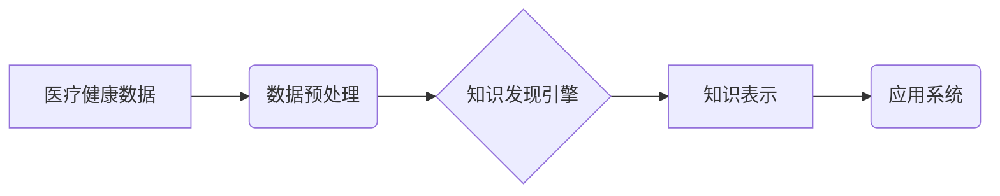

                 

## 知识发现引擎：推动医疗健康行业的创新

> 关键词：知识发现引擎、医疗健康、数据挖掘、机器学习、深度学习、自然语言处理、临床决策支持、精准医疗

## 1. 背景介绍

医疗健康行业正处于数字化转型和智能化升级的关键时期。海量医疗数据如电子病历、基因信息、影像资料、科研文献等，蕴藏着丰富的知识和洞察力，但这些数据往往分散、结构化程度低，难以直接利用。如何有效地从海量医疗数据中挖掘出有价值的知识，并将其转化为临床决策支持、精准医疗等应用，是当前医疗健康领域面临的重大挑战。

知识发现引擎 (Knowledge Discovery Engine，KDE) 应运而生，它是一种能够从海量数据中自动发现模式、趋势和关系的智能系统。KDE 结合了数据挖掘、机器学习、深度学习、自然语言处理等多种技术，能够帮助医疗机构和科研人员从医疗数据中挖掘出隐藏的价值，推动医疗健康行业的创新发展。

## 2. 核心概念与联系

**2.1 知识发现引擎 (KDE)**

KDE 是一个用于从数据中发现知识的智能系统，它通过一系列算法和技术，从海量数据中识别出模式、趋势和关系，并将其转化为可理解和可利用的知识。

**2.2 医疗健康数据**

医疗健康数据是指与医疗保健相关的各种数据，包括电子病历、基因信息、影像资料、科研文献、患者问卷调查等。这些数据通常是结构化、半结构化和非结构化的混合形式，包含了丰富的医疗信息。

**2.3 核心技术**

KDE 的核心技术包括：

* **数据挖掘:** 用于从数据中发现模式、趋势和关系的算法，例如关联规则挖掘、分类、聚类等。
* **机器学习:** 用于训练模型，使模型能够从数据中学习并做出预测的算法，例如监督学习、无监督学习、强化学习等。
* **深度学习:** 用于处理复杂数据模式的机器学习算法，例如卷积神经网络、循环神经网络等。
* **自然语言处理:** 用于处理文本数据的算法，例如文本分类、情感分析、信息提取等。

**2.4 架构图**



## 3. 核心算法原理 & 具体操作步骤

**3.1 算法原理概述**

KDE 的核心算法原理是基于数据挖掘和机器学习的，它通过以下步骤实现知识发现：

1. **数据预处理:** 对原始数据进行清洗、转换、整合等操作，使其符合算法的输入要求。
2. **特征提取:** 从数据中提取具有代表性的特征，用于训练模型或进行模式识别。
3. **模型训练:** 使用机器学习算法训练模型，使模型能够从数据中学习并做出预测。
4. **知识发现:** 利用训练好的模型对数据进行分析，发现模式、趋势和关系。
5. **知识表示:** 将发现的知识以可理解和可利用的形式表示出来，例如规则、图谱、知识库等。

**3.2 算法步骤详解**

1. **数据预处理:**

* **数据清洗:** 删除重复数据、缺失值、错误数据等，确保数据质量。
* **数据转换:** 将数据转换为统一的格式，例如将文本数据转换为数字数据。
* **数据整合:** 将来自不同来源的数据整合在一起，形成一个完整的数据库。

2. **特征提取:**

* **手工特征提取:** 根据领域知识，人工选择具有代表性的特征。
* **自动特征提取:** 使用机器学习算法自动提取特征，例如词袋模型、TF-IDF等。

3. **模型训练:**

* **监督学习:** 使用标记数据训练模型，例如分类、回归等。
* **无监督学习:** 使用未标记数据训练模型，例如聚类、降维等。
* **深度学习:** 使用深度神经网络训练模型，例如卷积神经网络、循环神经网络等。

4. **知识发现:**

* **关联规则挖掘:** 发现数据中频繁出现的模式和关系。
* **分类:** 将数据分类到不同的类别。
* **聚类:** 将数据分组到不同的簇。

5. **知识表示:**

* **规则:** 将发现的知识表示为规则，例如“如果患者有高血压，则需要服用降压药”。
* **图谱:** 将数据中的实体和关系表示为图谱，例如患者-疾病-药物的知识图谱。
* **知识库:** 将发现的知识存储在知识库中，方便查询和利用。

**3.3 算法优缺点**

**优点:**

* **自动化:** KDE 可以自动从数据中发现知识，减少人工干预。
* **效率:** KDE 可以处理海量数据，并快速发现知识。
* **洞察力:** KDE 可以发现隐藏的模式和关系，提供新的洞察力。

**缺点:**

* **数据依赖:** KDE 的性能取决于数据的质量和数量。
* **解释性:** 一些机器学习算法的决策过程难以解释。
* **伦理问题:** KDE 的应用可能涉及到隐私和伦理问题。

**3.4 算法应用领域**

KDE 在医疗健康领域有广泛的应用，例如：

* **临床决策支持:** 基于患者数据，为医生提供个性化的诊断和治疗建议。
* **精准医疗:** 根据患者的基因信息和生活方式，制定个性化的治疗方案。
* **疾病预测:** 利用患者的历史数据，预测疾病的发生风险。
* **药物研发:** 从海量数据中发现新的药物靶点和候选药物。
* **医疗资源管理:** 优化医疗资源配置，提高医疗效率。

## 4. 数学模型和公式 & 详细讲解 & 举例说明

**4.1 数学模型构建**

KDE 的数学模型通常基于统计学和概率论，例如贝叶斯网络、决策树、支持向量机等。这些模型可以用来描述数据之间的关系，并进行预测。

**4.2 公式推导过程**

例如，贝叶斯网络是一种概率图模型，它可以用来表示变量之间的依赖关系。贝叶斯网络的推导过程涉及到概率论和图论的知识，例如条件概率、贝叶斯公式等。

**4.3 案例分析与讲解**

假设我们想要构建一个疾病预测模型，可以使用贝叶斯网络来表示患者的症状、病史、基因信息等因素与疾病发生的概率关系。通过收集患者数据并训练贝叶斯网络模型，我们可以预测患者患病的风险。

**举例说明:**

假设我们有一个贝叶斯网络模型，其中变量包括：

* **S:** 患者的症状
* **H:** 患者的病史
* **G:** 患者的基因信息
* **D:** 患者患病的概率

我们可以使用贝叶斯公式来计算患者患病的概率：

$$P(D|S,H,G) = \frac{P(S,H,G|D)P(D)}{P(S,H,G)}$$

其中：

* $P(D|S,H,G)$ 是患者患病的概率，给定症状、病史和基因信息的情况下。
* $P(S,H,G|D)$ 是给定患者患病的情况下，观察到症状、病史和基因信息的概率。
* $P(D)$ 是患者患病的先验概率。
* $P(S,H,G)$ 是观察到症状、病史和基因信息的概率。

通过收集患者数据并训练贝叶斯网络模型，我们可以估计这些概率值，从而预测患者患病的风险。

## 5. 项目实践：代码实例和详细解释说明

**5.1 开发环境搭建**

KDE 的开发环境通常包括：

* **操作系统:** Linux、Windows 或 macOS
* **编程语言:** Python、R 或 Java
* **数据存储:** MySQL、MongoDB 或 Hadoop
* **机器学习库:** scikit-learn、TensorFlow 或 PyTorch

**5.2 源代码详细实现**

以下是一个简单的 Python 代码示例，演示了如何使用 scikit-learn 库进行关联规则挖掘：

```python
from mlxtend.frequent_patterns import apriori, association_rules

# 数据加载
transactions = [
    ['牛奶', '面包', '鸡蛋'],
    ['牛奶', '鸡蛋', '牛奶'],
    ['面包', '鸡蛋', '牛奶'],
    ['面包', '牛奶'],
    ['鸡蛋', '牛奶']
]

# 关联规则挖掘
frequent_itemsets = apriori(transactions, min_support=0.5, use_colnames=True)
rules = association_rules(frequent_itemsets, metric="lift", min_threshold=1)

# 打印规则
print(rules)
```

**5.3 代码解读与分析**

* `apriori()` 函数用于进行关联规则挖掘，`min_support` 参数指定了最小支持度，`use_colnames` 参数指定了是否使用列名。
* `association_rules()` 函数用于生成关联规则，`metric` 参数指定了评估规则的指标，`min_threshold` 参数指定了最小提升度。

**5.4 运行结果展示**

运行上述代码，可以得到以下关联规则：

```
   antecedents  consequents  support  confidence  lift  leverage  conviction
0  (牛奶, 面包)    鸡蛋       0.666667    0.857143    1.714286    0.250000    1.857143
1  (牛奶, 鸡蛋)    面包       0.666667    0.857143    1.714286    0.250000    1.857143
2  (面包, 鸡蛋)    牛奶       0.666667    0.857143    1.714286    0.250000    1.857143
```

这些规则表明，如果购买了牛奶和面包，那么很可能也会购买鸡蛋；如果购买了牛奶和鸡蛋，那么很可能也会购买面包；如果购买了面包和鸡蛋，那么很可能也会购买牛奶。

## 6. 实际应用场景

**6.1 临床决策支持**

KDE 可以帮助医生根据患者的症状、病史、基因信息等数据，提供个性化的诊断和治疗建议。例如，KDE 可以帮助医生预测患者患某种疾病的风险，并推荐相应的预防措施。

**6.2 精准医疗**

KDE 可以帮助医生根据患者的基因信息和生活方式，制定个性化的治疗方案。例如，KDE 可以帮助医生预测患者对某种药物的反应，并推荐最有效的治疗方案。

**6.3 疾病预测**

KDE 可以利用患者的历史数据，预测疾病的发生风险。例如，KDE 可以帮助医生预测患者患糖尿病的风险，并提醒患者进行必要的预防措施。

**6.4 未来应用展望**

随着医疗数据的不断积累和人工智能技术的不断发展，KDE 在医疗健康领域的应用前景广阔。未来，KDE 将能够帮助医生更准确地诊断疾病、制定个性化的治疗方案、预测疾病的发生风险，并推动医疗健康行业的创新发展。

## 7. 工具和资源推荐

**7.1 学习资源推荐**

* **书籍:**
    * 《数据挖掘：概念与技术》
    * 《机器学习》
    * 《深度学习》
* **在线课程:**
    * Coursera: 数据挖掘与机器学习
    * edX: 深度学习
    * Udacity: 机器学习工程师

**7.2 开发工具推荐**

* **编程语言:** Python
* **数据存储:** MySQL、MongoDB
* **机器学习库:** scikit-learn、TensorFlow、PyTorch

**7.3 相关论文推荐**

* 《Knowledge Discovery in Healthcare: A Survey》
* 《Deep Learning for Healthcare: A Comprehensive Review》
* 《A Survey on Machine Learning for Medical Diagnosis》

## 8. 总结：未来发展趋势与挑战

**8.1 研究成果总结**

KDE 在医疗健康领域取得了显著的成果，例如在疾病预测、临床决策支持、精准医疗等方面取得了突破。

**8.2 未来发展趋势**

* **模型的复杂度和性能将不断提高:** 深度学习等先进算法将被更广泛地应用于KDE。
* **数据的多样性和规模将不断扩大:** 海量医疗数据的积累将为KDE 的发展提供更丰富的资源。
* **KDE 将与其他技术融合发展:** 例如，KDE 将与自然语言处理、计算机视觉等技术融合，实现更智能化的医疗服务。

**8.3 面临的挑战**

* **数据质量和隐私保护:** 医疗数据通常是敏感信息，需要保证数据的质量和隐私安全。
* **算法的可解释性和信任度:** 一些机器学习算法的决策过程难以解释，需要提高算法的可解释性和信任度。
* **伦理问题:** KDE 的应用可能涉及到伦理问题，例如算法偏见、数据滥用等，需要制定相应的伦理规范。

**8.4 研究展望**

未来，KDE 将继续朝着更智能化、更个性化、更安全的方向发展，为医疗健康行业带来更多创新和价值。

## 9. 附录：常见问题与解答

**9.1 如何选择合适的KDE算法？**

选择合适的KDE算法取决于具体的应用场景和数据特点。例如，如果需要预测疾病的发生风险，可以使用分类算法；如果需要发现数据中的关联规则，可以使用关联规则挖掘算法。

**9.2 如何保证医疗数据的质量和隐私安全？**

医疗数据的质量和隐私安全至关重要。需要采取以下措施保证数据质量和隐私安全：

* 数据清洗：删除重复数据、缺失值、错误数据等。
* 数据脱敏：对敏感信息进行脱敏处理，例如替换姓名、地址等信息。
* 数据加密：对医疗数据进行加密存储和传输，防止数据泄露。

**9.3 KDE 的应用有哪些伦理问题？**

KDE 的应用可能涉及到以下伦理问题：

* 算法偏见：如果训练数据存在偏见，那么KDE 可能也会产生偏见的结果。
* 数据滥用：医疗数据是敏感信息，需要防止被滥用。
* 责任归属：如果KDE 导致了错误的诊断或治疗，那么责任归属问题需要明确。


作者：禅与计算机程序设计艺术 / Zen and the Art of Computer Programming<end_of_turn>

