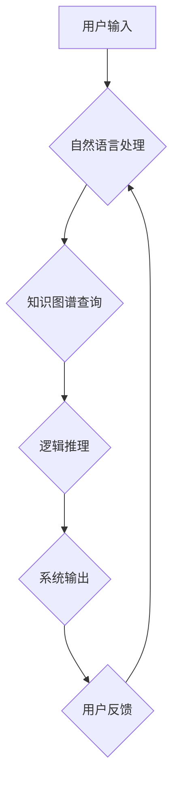

                 

## 知识的交互性：对话与辩论中的真理探索

> 关键词：人工智能、对话系统、辩论系统、知识图谱、逻辑推理、交互学习、真理探索

## 1. 背景介绍

在信息爆炸的时代，知识的获取和理解变得越来越重要。传统的单向信息传递模式已难以满足人们对知识深度挖掘和批判性思考的需求。因此，探索新的知识交互模式，激发知识的生成和演化，成为人工智能领域的重要研究方向。

对话和辩论作为人类交流和认知的重要方式，蕴含着丰富的知识交互潜力。对话系统能够与用户进行自然语言交互，引导用户探索知识，并根据用户的反馈进行知识更新和完善。而辩论系统则通过模拟人类辩论过程，帮助用户从多角度分析问题，形成更深刻的理解。

## 2. 核心概念与联系

### 2.1  知识图谱

知识图谱是一种基于知识表示的结构化数据模型，它将知识表示为实体、关系和属性的网络结构。知识图谱能够有效地存储、组织和检索知识，为对话和辩论系统提供知识基础。

### 2.2  逻辑推理

逻辑推理是人工智能的核心技术之一，它能够根据已有的知识和规则，推导出新的知识。在对话和辩论系统中，逻辑推理可以帮助系统理解用户的意图，生成合理的回复，并进行知识论证。

### 2.3  自然语言处理

自然语言处理 (NLP) 是指使计算机能够理解、生成和处理人类语言的技术。在对话和辩论系统中，NLP技术用于理解用户的自然语言输入，生成自然语言输出，以及进行文本分析和语义理解。

**Mermaid 流程图**



## 3. 核心算法原理 & 具体操作步骤

### 3.1  算法原理概述

对话和辩论系统的核心算法通常基于图神经网络 (GNN) 和强化学习 (RL) 的结合。GNN 可以用于学习知识图谱中的知识关系，并进行知识推理。RL 可以用于训练对话和辩论代理，使其能够生成更符合人类期望的回复。

### 3.2  算法步骤详解

1. **知识图谱构建:** 收集和整理相关领域的知识，构建知识图谱。
2. **GNN模型训练:** 使用GNN模型学习知识图谱中的知识关系和模式。
3. **RL代理训练:** 使用RL算法训练对话和辩论代理，使其能够根据用户的输入和知识图谱中的信息，生成合理的回复。
4. **对话/辩论系统运行:** 用户与对话/辩论系统交互，系统根据用户的输入和知识图谱中的信息，生成回复并进行知识更新。

### 3.3  算法优缺点

**优点:**

* 能够进行复杂知识推理和逻辑论证。
* 可以根据用户的反馈进行知识更新和完善。
* 可以模拟人类对话和辩论过程，提高交互体验。

**缺点:**

* 需要大量的训练数据和计算资源。
* 知识图谱的构建和维护需要专业知识和时间。
* 仍然存在一些挑战，例如如何更好地理解用户的意图和生成更自然流畅的回复。

### 3.4  算法应用领域

* **教育领域:** 辅助教学、个性化学习、知识问答。
* **科研领域:** 文献综述、知识发现、科学推理。
* **法律领域:** 法律咨询、案例分析、法律推理。
* **商业领域:** 客户服务、市场调研、决策支持。

## 4. 数学模型和公式 & 详细讲解 & 举例说明

### 4.1  数学模型构建

在对话和辩论系统中，可以使用图神经网络 (GNN) 来构建知识表示模型。GNN 可以将知识图谱中的实体和关系表示为图结构，并通过图卷积操作学习知识关系和模式。

**图神经网络模型**

```
H_l = σ(A * W_l * H_{l-1} + b_l)
```

其中：

* $H_l$ 是第 $l$ 层的节点隐藏状态。
* $A$ 是图的邻接矩阵。
* $W_l$ 是第 $l$ 层的权重矩阵。
* $b_l$ 是第 $l$ 层的偏置向量。
* $σ$ 是激活函数。

### 4.2  公式推导过程

GNN 的核心思想是通过图卷积操作学习知识关系。图卷积操作可以将相邻节点的信息聚合起来，学习节点之间的关系表示。

**图卷积操作**

```
h_i^{(l)} = σ(∑_{j∈N(i)} W^{(l)} * h_j^{(l-1)} + b^{(l)})
```

其中：

* $h_i^{(l)}$ 是第 $l$ 层节点 $i$ 的隐藏状态。
* $N(i)$ 是节点 $i$ 的邻居节点集合。
* $W^{(l)}$ 是第 $l$ 层的权重矩阵。
* $b^{(l)}$ 是第 $l$ 层的偏置向量。
* $σ$ 是激活函数。

### 4.3  案例分析与讲解

假设我们有一个知识图谱，包含实体 "苹果"、"香蕉"、"水果"，以及关系 "是"。我们可以使用 GNN 模型学习到 "苹果" 和 "香蕉" 都是 "水果" 的关系。

## 5. 项目实践：代码实例和详细解释说明

### 5.1  开发环境搭建

* Python 3.x
* TensorFlow 或 PyTorch
* Jupyter Notebook

### 5.2  源代码详细实现

```python
import tensorflow as tf

# 定义图神经网络模型
class GNN(tf.keras.Model):
    def __init__(self, num_features, num_classes):
        super(GNN, self).__init__()
        self.conv1 = tf.keras.layers.GraphConv(units=16, activation='relu')
        self.conv2 = tf.keras.layers.GraphConv(units=8, activation='relu')
        self.fc = tf.keras.layers.Dense(units=num_classes)

    def call(self, inputs):
        x = self.conv1(inputs)
        x = self.conv2(x)
        x = tf.keras.layers.Flatten()(x)
        return self.fc(x)

# 构建知识图谱数据
# ...

# 创建 GNN 模型实例
model = GNN(num_features=..., num_classes=...)

# 训练模型
model.compile(optimizer='adam', loss='sparse_categorical_crossentropy', metrics=['accuracy'])
model.fit(x_train, y_train, epochs=10)

# 评估模型
loss, accuracy = model.evaluate(x_test, y_test)
print('Loss:', loss)
print('Accuracy:', accuracy)
```

### 5.3  代码解读与分析

* 代码首先定义了一个 GNN 模型类，包含两个图卷积层和一个全连接层。
* 然后，构建了知识图谱数据，并创建了 GNN 模型实例。
* 最后，使用 Adam 优化器和交叉熵损失函数训练模型，并评估模型性能。

### 5.4  运行结果展示

训练完成后，可以将模型应用于新的知识图谱数据，进行知识推理和预测。

## 6. 实际应用场景

### 6.1  教育领域

* **个性化学习:** 根据学生的知识水平和学习风格，推荐个性化的学习内容和路径。
* **知识问答:** 构建知识问答系统，帮助学生解答知识问题，并引导学生进行深入思考。
* **虚拟导师:** 开发虚拟导师系统，模拟老师的教学方式，为学生提供个性化的指导和帮助。

### 6.2  科研领域

* **文献综述:** 自动生成文献综述，帮助科研人员快速了解某个领域的最新研究进展。
* **知识发现:** 从海量数据中发现新的知识和模式，推动科研创新。
* **科学推理:** 帮助科研人员进行科学推理和实验设计，提高科研效率。

### 6.3  法律领域

* **法律咨询:** 构建法律咨询系统，帮助用户解答法律问题，并提供法律建议。
* **案例分析:** 自动分析法律案例，提取关键信息，并进行法律推理。
* **法律法规解读:** 自动解读法律法规，帮助用户理解法律内容。

### 6.4  未来应用展望

随着人工智能技术的不断发展，对话和辩论系统将有更广泛的应用场景。例如，可以用于医疗诊断、金融风险评估、城市规划等领域。

## 7. 工具和资源推荐

### 7.1  学习资源推荐

* **书籍:**
    * 《深度学习》 by Ian Goodfellow, Yoshua Bengio, and Aaron Courville
    * 《图神经网络》 by William L. Hamilton, Rex Ying, and Jure Leskovec
* **在线课程:**
    * Coursera: Deep Learning Specialization
    * Udacity: Intro to Deep Learning
* **博客和论坛:**
    * Towards Data Science
    * Reddit: r/MachineLearning

### 7.2  开发工具推荐

* **TensorFlow:** 开源深度学习框架
* **PyTorch:** 开源深度学习框架
* **Keras:** 高级深度学习API

### 7.3  相关论文推荐

* 《Graph Convolutional Networks》 by Thomas N. Kipf and Max Welling
* 《Attention Is All You Need》 by Ashish Vaswani et al.
* 《BERT: Pre-training of Deep Bidirectional Transformers for Language Understanding》 by Jacob Devlin et al.

## 8. 总结：未来发展趋势与挑战

### 8.1  研究成果总结

近年来，对话和辩论系统取得了显著进展，能够进行更复杂和自然的交互。GNN 和 RL 技术的结合为知识交互提供了新的思路和方法。

### 8.2  未来发展趋势

* **更强大的知识表示:** 开发更强大的知识表示模型，能够更好地捕捉知识之间的复杂关系。
* **更自然的人机交互:** 研究更自然的人机交互方式，例如语音和多模态交互。
* **更个性化的学习体验:** 开发更个性化的学习体验，根据用户的学习风格和需求提供定制化的学习内容。

### 8.3  面临的挑战

* **数据稀缺性:** 训练对话和辩论系统需要大量的训练数据，而高质量的训练数据往往稀缺。
* **知识更新:** 知识是不断变化的，对话和辩论系统需要能够及时更新知识库。
* **伦理问题:** 随着对话和辩论系统的智能化程度提高，需要关注其潜在的伦理问题，例如偏见和误导。

### 8.4  研究展望

未来，对话和辩论系统将继续朝着更智能、更自然、更个性化的方向发展。研究人员将继续探索新的算法和技术，解决当前面临的挑战，并推动对话和辩论系统在更多领域得到应用。

## 9. 附录：常见问题与解答

**Q1: 如何构建知识图谱？**

**A1:** 构建知识图谱需要收集和整理相关领域的知识，并将其表示为实体、关系和属性的网络结构。可以使用文本挖掘、知识抽取、人工标注等方法进行知识获取。

**Q2: 如何训练对话和辩论系统？**

**A2:** 可以使用强化学习算法训练对话和辩论系统，使其能够根据用户的输入和知识图谱中的信息，生成合理的回复。

**Q3: 如何评估对话和辩论系统的性能？**

**A3:** 可以使用准确率、召回率、F1-score等指标评估对话和辩论系统的性能。


作者：禅与计算机程序设计艺术 / Zen and the Art of Computer Programming 
<end_of_turn>

