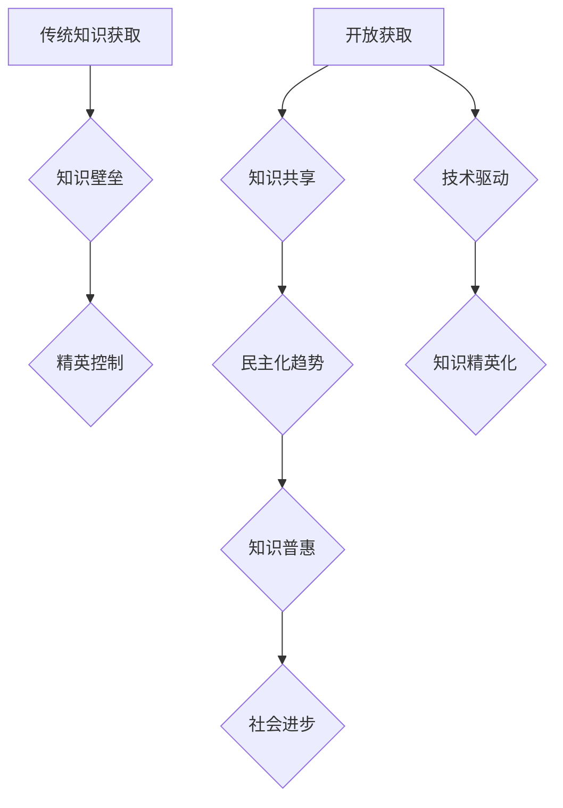

                 

## 知识的开放获取：民主化与精英化的博弈

> 关键词：开放获取、知识民主化、精英化、知识共享、人工智能、数据驱动、技术伦理

## 1. 背景介绍

在信息时代，知识已成为最宝贵的资源。其获取、传播和应用直接关系到个体、社会和国家的发展。开放获取（Open Access，OA）作为一种知识共享模式，旨在打破知识壁垒，让知识更易于获取和利用。然而，OA的普及也引发了关于知识民主化与精英化博弈的讨论。

一方面，OA可以促进知识的民主化，打破传统知识垄断，让更多人平等地获取信息，参与知识创造和传播。它为教育、科研、创新等领域提供了更广阔的平台，推动社会进步。

另一方面，OA也可能加剧知识精英化的趋势。由于知识的质量和价值参差不齐，优质知识的生产和传播仍然需要依靠专业人才和机构。在OA环境下，优质知识更容易被集中，形成新的知识精英群体，加剧社会资源分配的不平等。

## 2. 核心概念与联系

**2.1  开放获取（Open Access）**

开放获取是指任何人都可以免费获取、使用、复制、传播和修改知识产权作品的模式。它包括两种主要形式：

* **绿色开放获取:** 作者将论文发表在传统期刊上，同时将其免费发布在开放获取的平台上，例如arXiv、BioRxiv等。
* **金开放获取:** 作者在发表论文时支付一定的费用，使其在开放获取的期刊或平台上免费发表。

**2.2  知识民主化**

知识民主化是指知识的获取、传播和应用更加平等、公正、包容的社会状态。它强调知识的普惠性、参与性、协作性和可持续性。

**2.3  知识精英化**

知识精英化是指知识生产、传播和应用集中在少数精英群体手中的现象。它反映了社会资源分配的不平等，以及知识生产和传播的专业化趋势。

**2.4  技术与知识获取**

人工智能、大数据、云计算等新兴技术正在深刻地改变着知识获取的方式。它们可以帮助我们更有效地搜索、分析和利用知识，但也可能加剧知识精英化的趋势。

**Mermaid 流程图**



## 3. 核心算法原理 & 具体操作步骤

**3.1  算法原理概述**

开放获取的实现依赖于多种算法和技术，例如：

* **信息检索算法:** 用于帮助用户快速找到所需的信息，例如关键词搜索、文本相似度匹配等。
* **知识图谱算法:** 用于构建和管理知识的结构化表示，例如节点链接、关系推理等。
* **机器学习算法:** 用于分析和理解知识，例如文本分类、情感分析、知识发现等。

**3.2  算法步骤详解**

以信息检索算法为例，其具体操作步骤如下：

1. **用户输入关键词:** 用户输入需要查找的信息关键词。
2. **关键词分词:** 将用户输入的关键词进行分词，提取出每个关键词的语义单元。
3. **关键词匹配:** 将关键词与数据库中的文档进行匹配，找到包含相关关键词的文档。
4. **文档排序:** 根据匹配度、文档权重等因素对匹配结果进行排序，将最相关的文档排在前面。
5. **结果展示:** 将排序后的文档结果展示给用户。

**3.3  算法优缺点**

* **优点:** 信息检索算法可以快速高效地查找信息，提高用户获取知识的效率。
* **缺点:** 信息检索算法的准确性依赖于关键词的质量和数据库的完整性，存在信息偏差和检索盲点的风险。

**3.4  算法应用领域**

信息检索算法广泛应用于搜索引擎、图书馆数据库、学术文献检索等领域。

## 4. 数学模型和公式 & 详细讲解 & 举例说明

**4.1  数学模型构建**

信息检索算法的核心是计算文档与查询的相似度。常用的相似度度量方法包括余弦相似度、Jaccard系数等。

**4.2  公式推导过程**

**余弦相似度:**

$$
\text{相似度} = \frac{\mathbf{A} \cdot \mathbf{B}}{||\mathbf{A}|| ||\mathbf{B}||}
$$

其中：

* $\mathbf{A}$ 和 $\mathbf{B}$ 分别表示文档和查询的词向量。
* $\cdot$ 表示向量点积。
* $||\mathbf{A}||$ 和 $||\mathbf{B}||$ 分别表示文档和查询的词向量的模长。

**4.3  案例分析与讲解**

假设有两个文档和一个查询：

* 文档 1: “人工智能、机器学习、深度学习”
* 文档 2: “机器学习、自然语言处理、计算机视觉”
* 查询: “机器学习、深度学习”

我们可以将文档和查询转换为词向量，然后使用余弦相似度计算其相似度。

## 5. 项目实践：代码实例和详细解释说明

**5.1  开发环境搭建**

* Python 3.x
* scikit-learn
* NLTK

**5.2  源代码详细实现**

```python
from sklearn.feature_extraction.text import TfidfVectorizer
from sklearn.metrics.pairwise import cosine_similarity

# 文档和查询
documents = [
    "人工智能、机器学习、深度学习",
    "机器学习、自然语言处理、计算机视觉",
]
query = "机器学习、深度学习"

# TF-IDF 向量化
vectorizer = TfidfVectorizer()
document_vectors = vectorizer.fit_transform(documents)
query_vector = vectorizer.transform([query])

# 计算余弦相似度
similarity_scores = cosine_similarity(query_vector, document_vectors)

# 打印相似度
print(similarity_scores)
```

**5.3  代码解读与分析**

* 使用 `TfidfVectorizer` 将文本转换为 TF-IDF 向量，可以更好地反映词语的重要性。
* 使用 `cosine_similarity` 计算文档和查询的余弦相似度。
* 打印相似度得分，可以判断文档与查询的相关性。

**5.4  运行结果展示**

运行代码后，会输出两个文档与查询的相似度得分。

## 6. 实际应用场景

开放获取在教育、科研、创新等领域有着广泛的应用场景：

* **教育:** 开放获取的教材、课程资源可以降低教育成本，提高教育质量，促进教育公平。
* **科研:** 开放获取的学术论文、数据资源可以加速科研进展，促进学术交流和合作。
* **创新:** 开放获取的知识和技术可以促进技术创新，推动产业发展。

**6.4  未来应用展望**

随着人工智能、大数据等技术的不断发展，开放获取将更加智能化、个性化、交互化。

## 7. 工具和资源推荐

**7.1  学习资源推荐**

* 开放获取联盟 (OA Alliance): https://www.oalliance.org/
* 维基百科: https://en.wikipedia.org/wiki/Open_access

**7.2  开发工具推荐**

* Apache Solr: https://solr.apache.org/
* Elasticsearch: https://www.elastic.co/elasticsearch/

**7.3  相关论文推荐**

* The Open Access Scholarly Publishing Association (OASPA)

## 8. 总结：未来发展趋势与挑战

**8.1  研究成果总结**

开放获取已经取得了显著的成果，推动了知识的民主化和普惠化。

**8.2  未来发展趋势**

* 智能化开放获取: 利用人工智能技术，实现更智能、更精准的知识检索和推荐。
* 个性化开放获取: 根据用户的需求和兴趣，提供个性化的知识服务。
* 交互化开放获取: 打破传统的单向信息传播模式，实现知识的双向互动和协作。

**8.3  面临的挑战**

* 知识质量控制: 如何保证开放获取的知识质量和可靠性。
* 知识版权保护: 如何平衡知识共享和知识产权保护。
* 数字鸿沟: 如何缩小数字鸿沟，让更多人能够平等地获取知识。

**8.4  研究展望**

未来，开放获取的研究需要更加关注知识质量、知识版权、数字鸿沟等问题，并探索更有效的解决方案，推动知识的民主化和普惠化。

## 9. 附录：常见问题与解答

**9.1  开放获取和付费订阅有什么区别？**

开放获取是指任何人都可以免费获取、使用、复制、传播和修改知识产权作品的模式，而付费订阅是指用户需要支付一定的费用才能访问特定知识资源的模式。

**9.2  开放获取会损害知识产权吗？**

开放获取并不损害知识产权，它只是改变了知识传播的方式。作者仍然拥有知识产权，但他们可以选择将知识公开共享，让更多人能够受益。

**9.3  如何参与开放获取？**

您可以通过以下方式参与开放获取：

* 将您的作品发表在开放获取的期刊或平台上。
* 积极使用和分享开放获取的知识资源。
* 支持开放获取的政策和倡议。


作者：禅与计算机程序设计艺术 / Zen and the Art of Computer Programming 
<end_of_turn>

