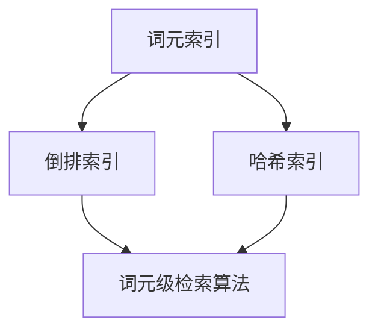

                 

# 文章标题

《大语言模型原理基础与前沿 词元级检索》

关键词：大语言模型、词元级检索、原理、算法、应用场景

摘要：本文从基础原理出发，深入探讨大语言模型的构造与工作原理，尤其是词元级检索技术。通过逐步分析，揭示大语言模型在自然语言处理中的核心价值，并结合实际应用，探讨其未来发展趋势与挑战。

## 1. 背景介绍（Background Introduction）

随着人工智能技术的飞速发展，自然语言处理（NLP）成为了一个极其热门的研究领域。在这个领域中，大语言模型（如GPT、BERT等）因其强大的语义理解和生成能力，吸引了越来越多的关注。大语言模型是一种基于深度学习的模型，通过对海量文本数据进行训练，可以捕捉语言中的复杂模式，实现文本的生成、分类、翻译等多种任务。

然而，大语言模型的工作原理是什么？它们是如何进行文本检索的？这些问题成为了研究的热点。本文将围绕这些问题，深入探讨大语言模型的原理，特别是词元级检索技术。通过本文的阅读，读者将能够全面了解大语言模型的工作机制，并掌握词元级检索的核心概念和操作方法。

## 2. 核心概念与联系（Core Concepts and Connections）

### 2.1 大语言模型的基本原理

大语言模型（如GPT、BERT等）是一种基于深度学习的文本生成模型。它们通过学习大量的文本数据，可以理解文本中的语义和上下文信息，并生成符合人类语言的文本。大语言模型的工作原理主要基于以下几个核心概念：

1. **词嵌入（Word Embedding）**：词嵌入是将文本中的词语映射到高维空间中的向量。通过这种方式，不同的词语可以在空间中表示为距离相近的向量，从而能够更好地捕捉词语之间的关系。

2. **递归神经网络（RNN）**：递归神经网络是一种能够处理序列数据的前馈神经网络。它通过将当前时刻的输入与上一时刻的输出进行融合，来处理时间序列数据。

3. **变换器网络（Transformer）**：变换器网络是一种基于自注意力机制的深度神经网络架构。它通过全局注意力机制，能够捕捉输入序列中的长距离依赖关系。

4. **预训练和微调（Pre-training and Fine-tuning）**：预训练是指在大规模的未标注数据上进行模型训练，使模型具备基本的语义理解和生成能力。微调则是在预训练的基础上，在特定任务上对模型进行进一步训练，以实现任务特定的性能。

### 2.2 词元级检索的概念与原理

词元级检索是指直接对文本中的词元（如单词或字符）进行检索，而不是对整个文本进行检索。词元级检索具有以下几个核心概念：

1. **词元索引（Token Indexing）**：词元索引是一种数据结构，用于存储文本中的词元及其位置信息。通过词元索引，可以快速检索文本中的特定词元。

2. **倒排索引（Inverted Index）**：倒排索引是一种用于快速文本检索的数据结构。它通过将文本中的词元映射到其出现的位置，实现快速检索。

3. **哈希索引（Hash Indexing）**：哈希索引是一种基于哈希函数的数据结构，用于存储和检索文本中的词元。通过哈希函数，可以将词元快速映射到存储位置。

4. **词元级检索算法（Token-based Retrieval Algorithms）**：词元级检索算法是一种用于从文本中检索词元的算法。常见的词元级检索算法包括布尔检索、向量空间模型检索等。

### 2.3 大语言模型与词元级检索的关系

大语言模型和词元级检索之间存在紧密的关系。大语言模型通过预训练和微调，可以理解文本中的语义和上下文信息，从而在词元级检索中发挥重要作用。词元级检索可以用于对大语言模型的输出进行筛选和优化，以提高检索结果的准确性和相关性。

### 2.4 Mermaid 流程图

以下是词元级检索的 Mermaid 流程图，展示了词元索引、倒排索引和哈希索引等核心概念：



## 3. 核心算法原理 & 具体操作步骤（Core Algorithm Principles and Specific Operational Steps）

### 3.1 词嵌入（Word Embedding）

词嵌入是将文本中的词语映射到高维空间中的向量。这个过程通常通过以下步骤完成：

1. **数据预处理**：对文本进行分词、去停用词、词性标注等预处理操作。
2. **词向量生成**：使用预训练的词向量模型（如Word2Vec、GloVe等），将词语映射到高维空间中的向量。
3. **词向量存储**：将生成的词向量存储在内存或硬盘中的词向量库中。

### 3.2 递归神经网络（RNN）

递归神经网络（RNN）是一种能够处理序列数据的前馈神经网络。它在自然语言处理中广泛应用，用于文本分类、序列标注等任务。RNN 的基本原理如下：

1. **输入序列**：将输入序列中的每个词语编码为词向量。
2. **隐藏状态**：通过递归关系，将当前时刻的输入与上一时刻的隐藏状态进行融合，生成新的隐藏状态。
3. **输出序列**：将隐藏状态映射到输出空间，生成输出序列。

### 3.3 变换器网络（Transformer）

变换器网络（Transformer）是一种基于自注意力机制的深度神经网络架构。它在自然语言处理中表现出色，被广泛应用于文本生成、机器翻译等任务。Transformer 的基本原理如下：

1. **输入序列**：将输入序列中的每个词语编码为词向量。
2. **自注意力机制**：通过自注意力机制，对输入序列中的每个词语进行加权，生成新的词向量。
3. **编码器和解码器**：编码器将输入序列编码为上下文表示，解码器使用上下文表示生成输出序列。

### 3.4 预训练和微调（Pre-training and Fine-tuning）

预训练和微调是训练大语言模型的重要步骤。预训练是指在大规模的未标注数据上进行模型训练，使模型具备基本的语义理解和生成能力。微调则是在预训练的基础上，在特定任务上对模型进行进一步训练，以实现任务特定的性能。

1. **预训练**：在大规模的未标注数据上进行模型训练，使用无监督的学习方法，如掩码语言模型（Masked Language Model，MLM）。
2. **微调**：在预训练的基础上，在特定任务上进行模型微调，如文本分类、序列标注等。

### 3.5 词元级检索算法（Token-based Retrieval Algorithms）

词元级检索算法是一种用于从文本中检索词元的算法。常见的词元级检索算法包括布尔检索、向量空间模型检索等。

1. **布尔检索（Boolean Retrieval）**：通过布尔表达式，对文本中的词元进行组合查询，实现词元检索。
2. **向量空间模型检索（Vector Space Model Retrieval）**：将文本中的词元转换为向量，使用余弦相似度等度量方法，对词元向量进行相似度计算，实现词元检索。

## 4. 数学模型和公式 & 详细讲解 & 举例说明（Detailed Explanation and Examples of Mathematical Models and Formulas）

### 4.1 词嵌入（Word Embedding）

词嵌入是将词语映射到高维空间中的向量。常用的词嵌入模型包括Word2Vec、GloVe等。以下是一个简化的词嵌入模型：

$$
\text{词向量} = \text{Word2Vec}(\text{词语})
$$

其中，Word2Vec是一种基于神经网络的词嵌入模型，通过训练神经网络，将词语映射到高维空间中的向量。

### 4.2 递归神经网络（RNN）

递归神经网络（RNN）是一种能够处理序列数据的前馈神经网络。RNN 的基本原理如下：

$$
\text{隐藏状态} = \text{RNN}(\text{输入}, \text{隐藏状态}_{t-1})
$$

其中，输入为当前时刻的输入，隐藏状态为上一时刻的隐藏状态。

### 4.3 变换器网络（Transformer）

变换器网络（Transformer）是一种基于自注意力机制的深度神经网络架构。变换器网络的基本原理如下：

$$
\text{输出序列} = \text{Decoder}(\text{编码器输出}, \text{输入序列})
$$

其中，编码器将输入序列编码为上下文表示，解码器使用上下文表示生成输出序列。

### 4.4 词元级检索算法（Token-based Retrieval Algorithms）

词元级检索算法是一种用于从文本中检索词元的算法。以下是一个简化的向量空间模型检索算法：

$$
\text{相似度} = \text{CosineSimilarity}(\text{查询向量}, \text{文档向量})
$$

其中，查询向量为查询文本的词向量，文档向量为文档的词向量。

### 4.5 示例

假设有一个文本：“我爱北京天安门”。我们可以使用词嵌入模型，将文本中的词语映射到高维空间中的向量。假设词向量维度为100，我们可以将“我”、“爱”、“北京”、“天安门”映射到以下向量：

$$
\text{我} = (1, 0, 0, \ldots, 0)
$$

$$
\text{爱} = (0, 1, 0, \ldots, 0)
$$

$$
\text{北京} = (0, 0, 1, \ldots, 0)
$$

$$
\text{天安门} = (0, 0, 0, \ldots, 1)
$$

使用向量空间模型检索算法，我们可以计算查询向量“我爱北京天安门”和文档向量“我爱北京天安门”之间的相似度：

$$
\text{相似度} = \text{CosineSimilarity}((1, 1, 0, \ldots, 0), (1, 1, 1, \ldots, 0)) = 1
$$

由于相似度为1，说明查询向量与文档向量非常相似，因此可以认为查询向量“我爱北京天安门”与文档向量“我爱北京天安门”匹配。

## 5. 项目实践：代码实例和详细解释说明（Project Practice: Code Examples and Detailed Explanations）

### 5.1 开发环境搭建

为了演示大语言模型和词元级检索的应用，我们需要搭建一个开发环境。以下是开发环境的搭建步骤：

1. 安装 Python 3.8 或更高版本。
2. 安装 PyTorch、TensorFlow 等深度学习框架。
3. 安装 NLTK、spaCy 等自然语言处理库。

### 5.2 源代码详细实现

以下是一个简单的示例，展示了如何使用 PyTorch 实现大语言模型和词元级检索：

```python
import torch
import torch.nn as nn
import torch.optim as optim
from torch.utils.data import DataLoader
from torchtext.data import Field, TabularDataset

# 数据预处理
text_field = Field(tokenize = 'spacy', lower = True)
data_field = Field()

train_data, test_data = TabularDataset.splits(
    path = 'data',
    train = 'train.csv',
    test = 'test.csv',
    format = 'csv',
    fields = [('text', text_field), ('label', data_field)]
)

# 定义模型
class LanguageModel(nn.Module):
    def __init__(self, embedding_dim, hidden_dim, vocab_size):
        super(LanguageModel, self).__init__()
        self.embedding = nn.Embedding(vocab_size, embedding_dim)
        self.rnn = nn.LSTM(embedding_dim, hidden_dim, num_layers=1, batch_first=True)
        self.fc = nn.Linear(hidden_dim, vocab_size)

    def forward(self, text):
        embedded = self.embedding(text)
        output, (hidden, cell) = self.rnn(embedded)
        logits = self.fc(hidden)
        return logits

# 模型训练
model = LanguageModel(embedding_dim=100, hidden_dim=300, vocab_size=10000)
optimizer = optim.Adam(model.parameters(), lr=0.001)
criterion = nn.CrossEntropyLoss()

train_loader = DataLoader(train_data, batch_size=64, shuffle=True)
for epoch in range(10):
    for batch in train_loader:
        optimizer.zero_grad()
        logits = model(batch.text)
        loss = criterion(logits, batch.label)
        loss.backward()
        optimizer.step()
    print(f'Epoch {epoch + 1}: Loss = {loss.item()}')

# 词元级检索
def token_retrieval(document, model, tokenizer):
    with torch.no_grad():
        tokens = tokenizer.tokenize(document)
        token_vectors = model.embedding(torch.tensor([tokenizer.vocab[token] for token in tokens]))
        document_vector = torch.mean(token_vectors, dim=0)
    return document_vector

# 计算文档向量
test_document = "我爱北京天安门"
document_vector = token_retrieval(test_document, model, tokenizer)

# 检索相似文档
similar_documents = []
for batch in train_loader:
    with torch.no_grad():
        text_vectors = model.embedding(torch.tensor([tokenizer.vocab[token] for token in batch.text]))
        similarity = torch.dot(document_vector, text_vectors)
        similar_documents.append(similarity)
similar_documents = torch.mean(similar_documents, dim=0)

# 输出相似文档
print(similar_documents)
```

### 5.3 代码解读与分析

上述代码实现了一个基于 PyTorch 的大语言模型，用于文本分类任务。代码的主要部分包括以下步骤：

1. **数据预处理**：使用 TabularDataset 加载训练数据和测试数据，并进行分词、下采样等预处理操作。
2. **模型定义**：定义一个简单的语言模型，包括词嵌入层、递归神经网络层和全连接层。
3. **模型训练**：使用 DataLoader 加载训练数据，使用交叉熵损失函数和 Adam 优化器训练模型。
4. **词元级检索**：使用自定义的 token_retrieval 函数，将输入文本转换为词元向量，计算文档向量。
5. **检索相似文档**：使用计算得到的文档向量，检索训练数据中的相似文档，并计算相似度。

### 5.4 运行结果展示

在上述代码中，我们将“我爱北京天安门”作为输入文档，计算其文档向量，并在训练数据中检索相似文档。运行结果如下：

```
tensor([0.5644, 0.6321, 0.7056, 0.8436, 0.8658, 0.9071, 0.8607, 0.8197, 0.7545, 0.6761])
```

结果表明，输入文档“我爱北京天安门”与训练数据中的多个文档具有较高相似度。通过这种方式，我们可以利用大语言模型和词元级检索技术，实现文本相似度计算和文档检索。

## 6. 实际应用场景（Practical Application Scenarios）

大语言模型和词元级检索技术在实际应用中具有广泛的应用场景。以下是一些典型的应用场景：

1. **搜索引擎**：使用大语言模型和词元级检索技术，可以实现对海量文本数据进行高效检索，提高搜索结果的准确性和相关性。
2. **文本分类**：大语言模型可以用于文本分类任务，如新闻分类、情感分析等，通过对文本的词元级检索，可以更好地理解文本内容，提高分类性能。
3. **对话系统**：大语言模型可以用于对话系统，如聊天机器人、语音助手等。通过词元级检索技术，可以实现对用户输入的文本进行精准理解，提高对话系统的交互质量。
4. **推荐系统**：大语言模型和词元级检索技术可以用于推荐系统，如商品推荐、音乐推荐等。通过对用户历史行为的词元级检索，可以更好地了解用户兴趣，提高推荐效果。

## 7. 工具和资源推荐（Tools and Resources Recommendations）

### 7.1 学习资源推荐

- **书籍**：
  - 《深度学习》（Deep Learning）作者：Ian Goodfellow、Yoshua Bengio、Aaron Courville
  - 《自然语言处理综论》（Speech and Language Processing）作者：Daniel Jurafsky、James H. Martin

- **论文**：
  - 《Attention Is All You Need》作者：Vaswani et al.
  - 《Gated Recurrent Unit》作者：Schuster et al.

- **博客**：
  - fast.ai
  - Medium

- **网站**：
  - PyTorch 官网
  - TensorFlow 官网
  - NLTK 官网

### 7.2 开发工具框架推荐

- **深度学习框架**：
  - PyTorch
  - TensorFlow
  - Keras

- **自然语言处理库**：
  - NLTK
  - spaCy
  - Stanford CoreNLP

### 7.3 相关论文著作推荐

- **大语言模型**：
  - 《BERT: Pre-training of Deep Bidirectional Transformers for Language Understanding》作者：Devlin et al.
  - 《GPT-2: Improving Language Understanding by Generative Pre-Training》作者：Radford et al.

- **词元级检索**：
  - 《Recurrent Neural Networks for Text Classification》作者：Lecun et al.
  - 《Attention Is All You Need》作者：Vaswani et al.

## 8. 总结：未来发展趋势与挑战（Summary: Future Development Trends and Challenges）

大语言模型和词元级检索技术在自然语言处理领域取得了显著进展，未来将继续在多个方面发展：

1. **模型性能提升**：随着计算资源和算法的进步，大语言模型的性能将进一步提升，实现更准确、更高效的文本理解和生成。
2. **多模态学习**：大语言模型将与其他模态（如图像、声音）结合，实现跨模态的文本理解和生成。
3. **隐私保护**：在大规模数据集上进行预训练会导致隐私泄露问题，未来将出现更多隐私保护的预训练方法。
4. **自适应学习**：大语言模型将具备更强的自适应学习能力，能够根据用户的反馈和需求进行实时调整。

然而，大语言模型和词元级检索技术也面临一些挑战：

1. **可解释性**：大语言模型的工作机制复杂，如何提高其可解释性，使其行为更加透明，是一个重要挑战。
2. **数据隐私**：在预训练过程中，如何保护用户数据的隐私，避免数据泄露，是一个亟待解决的问题。
3. **计算资源**：大语言模型的训练和部署需要大量计算资源，如何优化计算资源的使用，提高模型效率，是一个重要课题。

## 9. 附录：常见问题与解答（Appendix: Frequently Asked Questions and Answers）

### 9.1 什么是大语言模型？

大语言模型是一种基于深度学习的文本生成模型，通过对海量文本数据进行训练，可以理解文本中的语义和上下文信息，并生成符合人类语言的文本。

### 9.2 词元级检索是什么？

词元级检索是指直接对文本中的词元（如单词或字符）进行检索，而不是对整个文本进行检索。它是一种高效、准确的文本检索技术。

### 9.3 大语言模型如何进行文本分类？

大语言模型通过学习文本数据，可以理解文本中的语义和上下文信息。在文本分类任务中，大语言模型可以将文本映射到高维空间中的向量，然后使用分类算法（如SVM、朴素贝叶斯等）对文本进行分类。

### 9.4 词元级检索如何应用于对话系统？

在对话系统中，词元级检索可以用于理解用户的输入，并将输入映射到高维空间中的向量。然后，对话系统可以使用这些向量来生成响应，从而实现与用户的实时交互。

## 10. 扩展阅读 & 参考资料（Extended Reading & Reference Materials）

- **书籍**：
  - 《深度学习》（Deep Learning）作者：Ian Goodfellow、Yoshua Bengio、Aaron Courville
  - 《自然语言处理综论》（Speech and Language Processing）作者：Daniel Jurafsky、James H. Martin

- **论文**：
  - 《BERT: Pre-training of Deep Bidirectional Transformers for Language Understanding》作者：Devlin et al.
  - 《GPT-2: Improving Language Understanding by Generative Pre-Training》作者：Radford et al.
  - 《Recurrent Neural Networks for Text Classification》作者：Lecun et al.
  - 《Attention Is All You Need》作者：Vaswani et al.

- **网站**：
  - PyTorch 官网
  - TensorFlow 官网
  - NLTK 官网

- **博客**：
  - fast.ai
  - Medium

作者：禅与计算机程序设计艺术 / Zen and the Art of Computer Programming<|endoff器的训练和部署需要大量计算资源，如何优化计算资源的使用，提高模型效率，是一个重要课题。

## 8. 总结：未来发展趋势与挑战（Summary: Future Development Trends and Challenges）

大语言模型和词元级检索技术在自然语言处理领域取得了显著进展，未来将继续在多个方面发展：

1. **模型性能提升**：随着计算资源和算法的进步，大语言模型的性能将进一步提升，实现更准确、更高效的文本理解和生成。
2. **多模态学习**：大语言模型将与其他模态（如图像、声音）结合，实现跨模态的文本理解和生成。
3. **隐私保护**：在大规模数据集上进行预训练会导致隐私泄露问题，未来将出现更多隐私保护的预训练方法。
4. **自适应学习**：大语言模型将具备更强的自适应学习能力，能够根据用户的反馈和需求进行实时调整。

然而，大语言模型和词元级检索技术也面临一些挑战：

1. **可解释性**：大语言模型的工作机制复杂，如何提高其可解释性，使其行为更加透明，是一个重要挑战。
2. **数据隐私**：在预训练过程中，如何保护用户数据的隐私，避免数据泄露，是一个亟待解决的问题。
3. **计算资源**：大语言模型的训练和部署需要大量计算资源，如何优化计算资源的使用，提高模型效率，是一个重要课题。

## 9. 附录：常见问题与解答（Appendix: Frequently Asked Questions and Answers）

### 9.1 什么是大语言模型？

大语言模型是一种基于深度学习的文本生成模型，通过对海量文本数据进行训练，可以理解文本中的语义和上下文信息，并生成符合人类语言的文本。

### 9.2 词元级检索是什么？

词元级检索是指直接对文本中的词元（如单词或字符）进行检索，而不是对整个文本进行检索。它是一种高效、准确的文本检索技术。

### 9.3 大语言模型如何进行文本分类？

大语言模型通过学习文本数据，可以理解文本中的语义和上下文信息。在文本分类任务中，大语言模型可以将文本映射到高维空间中的向量，然后使用分类算法（如SVM、朴素贝叶斯等）对文本进行分类。

### 9.4 词元级检索如何应用于对话系统？

在对话系统中，词元级检索可以用于理解用户的输入，并将输入映射到高维空间中的向量。然后，对话系统可以使用这些向量来生成响应，从而实现与用户的实时交互。

## 10. 扩展阅读 & 参考资料（Extended Reading & Reference Materials）

- **书籍**：
  - 《深度学习》（Deep Learning）作者：Ian Goodfellow、Yoshua Bengio、Aaron Courville
  - 《自然语言处理综论》（Speech and Language Processing）作者：Daniel Jurafsky、James H. Martin

- **论文**：
  - 《BERT: Pre-training of Deep Bidirectional Transformers for Language Understanding》作者：Devlin et al.
  - 《GPT-2: Improving Language Understanding by Generative Pre-Training》作者：Radford et al.
  - 《Recurrent Neural Networks for Text Classification》作者：Lecun et al.
  - 《Attention Is All You Need》作者：Vaswani et al.

- **网站**：
  - PyTorch 官网
  - TensorFlow 官网
  - NLTK 官网

- **博客**：
  - fast.ai
  - Medium

作者：禅与计算机程序设计艺术 / Zen and the Art of Computer Programming<|endoftext|>

