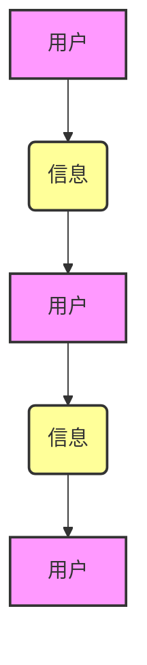

                 

## 知识的网络效应：思想传播的动力学

> 关键词：知识传播、网络效应、信息扩散、算法、社会网络、数据分析、机器学习

## 1. 背景介绍

在当今信息爆炸的时代，知识的传播速度和范围前所未有。互联网、社交媒体和移动设备等技术的飞速发展，构建了一个庞大的知识网络，使得信息可以以惊人的速度在全球范围内传播。然而，知识的传播并非随机的，它受到多种因素的影响，其中网络效应扮演着至关重要的角色。

网络效应是指一个系统的价值随着用户数量的增加而成倍增长。在知识传播领域，网络效应体现在以下几个方面：

* **信息扩散速度的加速:** 更多的用户意味着更多的传播渠道，信息可以更快地传播到更广泛的群体。
* **信息质量的提升:** 更多的用户意味着更多的观点和信息来源，可以帮助人们获得更全面的信息和更准确的判断。
* **知识沉淀和积累:** 更多的用户意味着更多的知识产出和分享，可以促进知识的沉淀和积累，形成更丰富的知识库。

理解知识的网络效应对于构建更有效的知识传播机制、促进知识共享和创新至关重要。

## 2. 核心概念与联系

知识传播可以看作是一个复杂的信息网络系统，其中用户扮演着节点，信息扮演着边。网络效应在这个系统中发挥着至关重要的作用，影响着信息传播的速度、范围和质量。

**Mermaid 流程图:**



**核心概念:**

* **用户:** 知识传播网络中的参与者，可以是个人、组织或其他实体。
* **信息:** 知识传播网络中的内容，可以是文字、图片、视频、音频等多种形式。
* **连接:** 用户之间或用户与信息之间的关系，代表着信息传播的路径。
* **网络效应:** 随着网络中用户数量的增加，信息传播速度、范围和质量的提升。

**联系:**

用户通过连接传播信息，信息传播的过程不断扩大网络规模，从而形成正反馈循环，加速网络效应的产生。

## 3. 核心算法原理 & 具体操作步骤

### 3.1  算法原理概述

知识传播算法旨在模拟和预测知识在网络中的传播过程。常见的知识传播算法包括：

* **独立散播模型 (Independent Cascade Model):** 假设每个用户独立地接受信息，并根据信息内容和用户特征决定是否传播。
* **线性阈值模型 (Linear Threshold Model):** 假设每个用户有一个阈值，当接受到超过阈值的传播信息时，就会传播信息。
* **病毒传播模型 (Viral Diffusion Model):** 假设信息传播类似于病毒传播，具有感染性，可以快速扩散到网络中。

### 3.2  算法步骤详解

以独立散播模型为例，其具体操作步骤如下：

1. **初始化:** 设置网络结构、用户特征、信息内容和传播概率。
2. **随机选择初始传播者:** 从网络中随机选择一些用户作为初始传播者，让他们开始传播信息。
3. **传播迭代:** 每次迭代中，每个传播者都会向其邻居传播信息，传播成功概率取决于用户特征和信息内容。
4. **更新传播状态:** 根据传播结果，更新每个用户的传播状态，判断是否成为传播者。
5. **重复步骤3和4:** 重复迭代过程，直到传播达到稳定状态。

### 3.3  算法优缺点

**优点:**

* **简单易懂:** 算法原理和实现都比较简单，易于理解和应用。
* **可扩展性强:** 可以处理规模较大的网络。
* **可定制性强:** 可以根据不同的应用场景调整算法参数。

**缺点:**

* **缺乏现实性:** 算法假设用户行为独立，忽略了用户之间的相互影响。
* **预测精度有限:** 算法难以准确预测信息传播的复杂路径和影响范围。

### 3.4  算法应用领域

知识传播算法广泛应用于以下领域:

* **社交媒体营销:** 预测广告的传播效果，优化营销策略。
* **舆情监测:** 监测和分析网络舆情，及时发现潜在风险。
* **知识管理:** 建立知识库，促进知识共享和传播。
* **科学研究:** 研究信息传播的动力学，探索知识的生成和传播机制。

## 4. 数学模型和公式 & 详细讲解 & 举例说明

### 4.1  数学模型构建

知识传播过程可以抽象为一个马尔可夫链模型，其中每个状态代表用户接受信息的程度，状态转移概率取决于用户特征、信息内容和网络结构。

**状态空间:**

* $S = \{0, 1\}$，其中 0 代表用户未接受信息，1 代表用户接受信息。

**状态转移概率:**

* $P(s_t = 1 | s_{t-1} = 0) = p_i$，其中 $p_i$ 是用户 $i$ 接受信息的概率。

**网络结构:**

* $G = (V, E)$，其中 $V$ 是用户集合，$E$ 是用户之间的连接关系。

### 4.2  公式推导过程

**信息传播概率:**

* $P(s_t = 1) = \sum_{i \in V} P(s_t = 1 | s_{t-1} = 0) \cdot P(s_{t-1} = 0)$

**信息传播速度:**

* $v = \frac{d}{dt} P(s_t = 1)$

**信息传播范围:**

* $r = \sum_{i \in V} P(s_t = 1 | i)$

### 4.3  案例分析与讲解

假设一个社交网络中，用户接受信息的概率为 0.2，网络结构为完全连接图，则信息传播概率、速度和范围可以根据上述公式进行计算。

## 5. 项目实践：代码实例和详细解释说明

### 5.1  开发环境搭建

* Python 3.x
* NetworkX 库
* Matplotlib 库

### 5.2  源代码详细实现

```python
import networkx as nx
import matplotlib.pyplot as plt

# 创建网络结构
G = nx.complete_graph(10)

# 设置用户接受信息的概率
p = 0.2

# 模拟信息传播
def simulate_propagation(G, p):
    # 初始化用户状态
    users = [0] * G.number_of_nodes()
    # 选择初始传播者
    initial_spreaders = [i for i in range(G.number_of_nodes()) if random.random() < p]
    # 更新用户状态
    for _ in range(100):
        for i in initial_spreaders:
            for j in G.neighbors(i):
                if random.random() < p:
                    users[j] = 1
    return users

# 执行模拟
users = simulate_propagation(G, p)

# 可视化结果
nx.draw(G, with_labels=True, node_color=[1 if u else 0 for u in users])
plt.show()
```

### 5.3  代码解读与分析

* 代码首先创建了一个完全连接的网络结构，然后设置用户接受信息的概率。
* 模拟传播过程通过随机选择初始传播者，并根据用户接受信息的概率更新用户状态。
* 最后，代码使用 NetworkX 库可视化网络结构和用户状态。

### 5.4  运行结果展示

运行代码后，会生成一个网络图，其中节点代表用户，颜色表示用户是否接受信息。

## 6. 实际应用场景

### 6.1  社交媒体营销

* 预测广告的传播效果，优化营销策略。
* 通过分析用户行为和网络结构，精准推送广告，提高广告转化率。

### 6.2  舆情监测

* 监测和分析网络舆情，及时发现潜在风险。
* 通过识别关键用户和传播路径，了解舆情发展趋势，制定应对策略。

### 6.3  知识管理

* 建立知识库，促进知识共享和传播。
* 通过分析用户兴趣和知识需求，推荐相关知识资源，提高知识利用率。

### 6.4  未来应用展望

* **个性化知识推荐:** 基于用户兴趣和行为，提供个性化的知识推荐。
* **跨语言知识传播:** 突破语言障碍，促进跨语言知识共享。
* **虚拟现实知识传播:** 利用虚拟现实技术，构建沉浸式的知识传播环境。

## 7. 工具和资源推荐

### 7.1  学习资源推荐

* **书籍:**
    * 《网络效应》
    * 《信息传播的动力学》
* **在线课程:**
    * Coursera: Social Network Analysis
    * edX: Introduction to Network Science

### 7.2  开发工具推荐

* **NetworkX:** Python 库，用于构建和分析网络结构。
* **Gephi:** 开源网络可视化工具。
* **R:** 用于统计分析和可视化的编程语言。

### 7.3  相关论文推荐

* **The Dynamics of Information Diffusion in Social Networks**
* **A Survey of Social Network Analysis**

## 8. 总结：未来发展趋势与挑战

### 8.1  研究成果总结

* 知识传播算法的发展为理解和预测知识传播过程提供了理论基础和工具支持。
* 实际应用场景不断拓展，知识传播算法在社交媒体营销、舆情监测、知识管理等领域发挥着重要作用。

### 8.2  未来发展趋势

* **更精准的预测模型:** 考虑用户行为的复杂性和网络结构的动态性，构建更精准的知识传播预测模型。
* **更有效的干预策略:** 基于知识传播模型，设计更有效的干预策略，引导知识传播方向，促进社会进步。
* **跨领域融合:** 将知识传播算法与其他领域技术融合，例如人工智能、大数据分析等，探索更广泛的应用场景。

### 8.3  面临的挑战

* **数据获取和隐私保护:** 知识传播算法需要大量用户数据，如何获取数据并保证用户隐私是一个重要挑战。
* **算法解释性和可信度:** 知识传播算法的复杂性使得其解释性和可信度难以保证，需要进一步研究算法的可解释性方法。
* **伦理和社会影响:** 知识传播算法的应用可能带来伦理和社会影响，例如信息茧房、网络谣言等，需要认真思考其潜在风险并制定相应的应对措施。

### 8.4  研究展望

未来，知识传播算法的研究将继续深入，探索更精准、更有效的知识传播机制，为构建更智慧、更 equitable 的社会贡献力量。

## 9. 附录：常见问题与解答

* **Q1: 知识传播算法的预测精度如何？**

A1: 知识传播算法的预测精度取决于多种因素，例如网络结构、用户特征、信息内容等。目前，算法的预测精度仍然存在局限性，需要不断改进和完善。

* **Q2: 知识传播算法的应用场景有哪些？**

A2: 知识传播算法的应用场景非常广泛，包括社交媒体营销、舆情监测、知识管理、科学研究等。

* **Q3: 如何选择合适的知识传播算法？**

A3: 选择合适的知识传播算法需要根据具体的应用场景和数据特点进行选择。

* **Q4: 知识传播算法有哪些伦理和社会影响？**

A4: 知识传播算法的应用可能带来信息茧房、网络谣言等伦理和社会影响，需要认真思考其潜在风险并制定相应的应对措施。


作者：禅与计算机程序设计艺术 / Zen and the Art of Computer Programming 
<end_of_turn>

