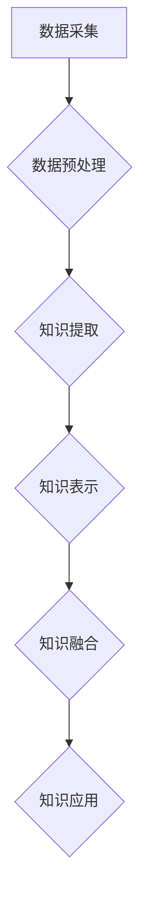

                 

## 知识的融合：跨领域创新的源泉

> 关键词：跨领域创新、知识融合、人工智能、机器学习、深度学习、数据科学、算法设计

### 1. 背景介绍

在当今科技日新月异的时代，跨领域创新已成为推动社会进步和经济发展的关键驱动力。传统科技发展模式往往局限于单一领域，而跨领域创新则打破了学科壁垒，将不同领域的知识、技术和经验有机融合，从而催生出全新的概念、产品和服务。

人工智能（AI）作为近年来发展最迅速的科技领域之一，正以其强大的学习和推理能力，深刻地改变着各个行业。然而，AI的发展也面临着新的挑战，即如何更好地融合来自不同领域的知识，以提升其泛化能力和应用范围。

### 2. 核心概念与联系

**2.1 知识融合的概念**

知识融合是指将来自不同来源、不同形式、不同领域的知识进行整合、转换和重组，形成新的、更丰富、更完整的知识体系的过程。

**2.2 跨领域创新的驱动因素**

* **技术进步**:  人工智能、大数据、云计算等技术的快速发展，为跨领域创新提供了强大的技术支撑。
* **社会需求**:  社会对个性化、智能化、可持续发展的需求日益增长，推动着跨领域创新的探索和实践。
* **人才流动**:  人才的跨领域流动和交流，促进了不同领域的知识碰撞和融合。

**2.3 知识融合的架构**



**2.4 跨领域创新的案例**

* **医疗保健**: 将人工智能技术与医学影像、基因组学等领域知识融合，实现疾病诊断、治疗方案个性化定制等。
* **金融科技**: 将机器学习算法与金融数据、市场分析等领域知识融合，实现风险管理、投资决策等方面的智能化。
* **教育科技**: 将自然语言处理技术与教育资源、学习模式等领域知识融合，实现个性化学习、智能辅导等。

### 3. 核心算法原理 & 具体操作步骤

**3.1 算法原理概述**

知识融合的核心算法通常基于机器学习和深度学习技术，通过训练模型，学习不同领域知识之间的关系和映射，实现知识的整合和转换。常见的算法包括：

* **多模态学习**: 将来自不同模态（如文本、图像、音频）的知识进行融合，提升模型的理解能力和泛化能力。
* **迁移学习**: 将已训练好的模型在源领域知识的基础上，迁移到目标领域，实现知识的跨领域应用。
* **知识图谱**: 建立知识图谱，将不同领域知识进行结构化表示，方便知识的检索、推理和融合。

**3.2 算法步骤详解**

1. **数据收集和预处理**: 从不同领域收集相关数据，并进行清洗、转换、格式化等预处理操作。
2. **特征提取**: 利用自然语言处理、计算机视觉等技术，从数据中提取特征，表示不同领域知识。
3. **模型训练**: 选择合适的机器学习或深度学习算法，训练模型，学习不同领域知识之间的关系和映射。
4. **知识融合**: 利用训练好的模型，将不同领域知识进行融合，形成新的、更完整的知识体系。
5. **知识应用**: 将融合后的知识应用于实际场景，例如智能问答、个性化推荐、疾病诊断等。

**3.3 算法优缺点**

* **优点**: 能够有效地整合不同领域知识，提升模型的理解能力和泛化能力，为跨领域创新提供新的思路和方法。
* **缺点**: 需要大量的训练数据和计算资源，算法设计和模型训练较为复杂，对数据质量和特征提取方法要求较高。

**3.4 算法应用领域**

* **医疗保健**: 疾病诊断、治疗方案个性化定制、药物研发等。
* **金融科技**: 风险管理、投资决策、欺诈检测等。
* **教育科技**: 个性化学习、智能辅导、教育资源推荐等。
* **智能制造**: 产品设计、生产过程优化、质量控制等。

### 4. 数学模型和公式 & 详细讲解 & 举例说明

**4.1 数学模型构建**

知识融合可以抽象为一个图论问题，其中节点代表知识实体，边代表知识关系。

* **知识图谱**: 使用图结构表示知识，节点为实体，边为关系。
* **知识表示**: 使用向量或嵌入表示知识实体，向量之间的距离表示实体之间的相似度。

**4.2 公式推导过程**

* **相似度计算**: 使用余弦相似度或欧氏距离计算知识实体之间的相似度。

$$
\text{余弦相似度} = \frac{\mathbf{a} \cdot \mathbf{b}}{\|\mathbf{a}\| \|\mathbf{b}\|},
$$

$$
\text{欧氏距离} = \sqrt{(\mathbf{a}_1 - \mathbf{b}_1)^2 + (\mathbf{a}_2 - \mathbf{b}_2)^2 + ... + (\mathbf{a}_n - \mathbf{b}_n)^2},
$$

其中，$\mathbf{a}$ 和 $\mathbf{b}$ 为两个知识实体的向量表示，$\cdot$ 为点积，$\|\mathbf{a}\|$ 为向量 $\mathbf{a}$ 的模长。

* **知识融合**: 使用加权平均或注意力机制融合不同领域知识。

**4.3 案例分析与讲解**

假设我们想要融合医疗和金融领域的知识，实现疾病风险评估。

* **数据**: 收集患者的医疗记录（如病史、检查结果）和金融数据（如收入、支出）。
* **特征提取**: 从医疗记录中提取疾病特征，从金融数据中提取风险特征。
* **模型训练**: 使用深度学习模型，学习医疗和金融特征之间的关系，预测患者的疾病风险。
* **知识融合**: 使用注意力机制，赋予不同领域知识不同的权重，融合医疗和金融知识，提升模型的预测精度。

### 5. 项目实践：代码实例和详细解释说明

**5.1 开发环境搭建**

* 操作系统：Ubuntu 20.04
* Python 版本：3.8
* 必要的库：TensorFlow、PyTorch、Scikit-learn、Numpy、Pandas

**5.2 源代码详细实现**

```python
import tensorflow as tf

# 定义模型结构
model = tf.keras.Sequential([
    tf.keras.layers.Dense(64, activation='relu', input_shape=(100,)),
    tf.keras.layers.Dense(32, activation='relu'),
    tf.keras.layers.Dense(1, activation='sigmoid')
])

# 编译模型
model.compile(optimizer='adam', loss='binary_crossentropy', metrics=['accuracy'])

# 训练模型
model.fit(X_train, y_train, epochs=10, batch_size=32)

# 评估模型
loss, accuracy = model.evaluate(X_test, y_test)
print('Loss:', loss)
print('Accuracy:', accuracy)
```

**5.3 代码解读与分析**

* 该代码示例展示了使用 TensorFlow 库构建一个简单的深度学习模型进行知识融合的流程。
* 模型输入为来自不同领域的数据特征，输出为预测结果。
* 模型结构包括多个全连接层，激活函数为 ReLU，输出层使用 sigmoid 函数进行二分类。
* 模型使用 Adam 优化器进行训练，损失函数为二分类交叉熵，评价指标为准确率。

**5.4 运行结果展示**

* 训练完成后，模型的损失值和准确率将被打印出来，可以评估模型的性能。
* 还可以使用测试数据对模型进行评估，并进行可视化分析，例如绘制 ROC 曲线等。

### 6. 实际应用场景

**6.1 医疗保健**

* **疾病诊断**: 将患者的症状、病史、检查结果等医疗数据与疾病知识库进行融合，辅助医生进行疾病诊断。
* **个性化治疗**: 根据患者的基因信息、生活习惯、病史等数据，与药物知识库进行融合，制定个性化的治疗方案。

**6.2 金融科技**

* **风险评估**: 将客户的信用记录、交易行为、社会关系等金融数据与风险模型进行融合，评估客户的信用风险。
* **投资决策**: 将市场数据、公司财务信息、行业趋势等数据与投资策略进行融合，辅助投资者进行投资决策。

**6.3 教育科技**

* **个性化学习**: 根据学生的学习进度、知识掌握情况、学习风格等数据，与教育资源库进行融合，提供个性化的学习内容和学习路径。
* **智能辅导**: 利用自然语言处理技术，将学生的学习问题与知识库进行融合，提供智能化的学习辅导。

**6.4 未来应用展望**

随着人工智能技术的不断发展，知识融合将在更多领域得到应用，例如：

* **智能制造**: 将产品设计、生产过程、质量控制等数据与制造知识库进行融合，实现智能化制造。
* **城市管理**: 将城市交通、环境监测、公共服务等数据与城市规划知识库进行融合，实现智慧城市建设。
* **科学研究**: 将科研数据、实验结果、理论模型等进行融合，加速科学发现和技术创新。

### 7. 工具和资源推荐

**7.1 学习资源推荐**

* **书籍**:
    * 《深度学习》
    * 《机器学习》
    * 《知识图谱》
* **在线课程**:
    * Coursera
    * edX
    * Udacity

**7.2 开发工具推荐**

* **Python**: 广泛应用于人工智能领域，拥有丰富的库和工具。
* **TensorFlow**: 开源深度学习框架，提供强大的模型构建和训练能力。
* **PyTorch**: 开源深度学习框架，以其灵活性和易用性而闻名。

**7.3 相关论文推荐**

* **知识融合**:
    * "A Survey on Knowledge Fusion"
    * "Knowledge Fusion: A Survey"
* **跨领域学习**:
    * "Transfer Learning"
    * "Domain Adaptation"

### 8. 总结：未来发展趋势与挑战

**8.1 研究成果总结**

知识融合技术取得了显著的进展，在医疗保健、金融科技、教育科技等领域取得了成功应用。

**8.2 未来发展趋势**

* **更强大的模型**: 发展更强大的深度学习模型，提升知识融合的精度和效率。
* **更丰富的知识源**: 探索更多类型的知识源，例如专家知识、文本语义、图像理解等。
* **更智能的应用**: 将知识融合技术应用于更智能化的场景，例如自动驾驶、机器人、个性化服务等。

**8.3 面临的挑战**

* **数据质量**: 不同领域数据质量参差不齐，需要进行有效的数据清洗和预处理。
* **知识表示**: 如何有效地表示不同领域知识，使其能够相互融合，仍然是一个挑战。
* **模型解释性**: 深度学习模型的决策过程往往难以解释，需要提高模型的透明度和可解释性。

**8.4 研究展望**

未来，知识融合技术将继续朝着更智能、更泛化、更可解释的方向发展，为跨领域创新提供更强大的支撑。


### 9. 附录：常见问题与解答

**9.1 如何选择合适的知识融合算法？**

选择合适的知识融合算法需要根据具体应用场景和数据特点进行考虑。

* **数据类型**: 不同算法适用于不同的数据类型，例如文本数据、图像数据、时间序列数据等。
* **知识关系**: 不同算法适用于不同的知识关系，例如分类关系、属性关系、时间关系等。
* **计算资源**: 不同算法的计算复杂度不同，需要根据计算资源进行选择。

**9.2 如何评估知识融合模型的性能？**

评估知识融合模型的性能可以使用多种指标，例如准确率、召回率、F1-score、AUC等。

* **分类任务**: 使用准确率、召回率、F1-score等指标评估模型的分类性能。
* **回归任务**: 使用均方误差、平均绝对误差等指标评估模型的回归性能。

**9.3 如何解决知识融合中的数据质量问题？**

解决知识融合中的数据质量问题需要进行数据清洗、预处理和整合。

* **数据清洗**: 去除数据中的噪声、缺失值和重复数据。
* **数据预处理**: 将数据转换为模型可理解的格式，例如文本向量化、图像特征提取等。
* **数据整合**: 将来自不同来源的数据进行整合，形成统一的数据格式和语义。


作者：禅与计算机程序设计艺术 / Zen and the Art of Computer Programming 
<end_of_turn>

