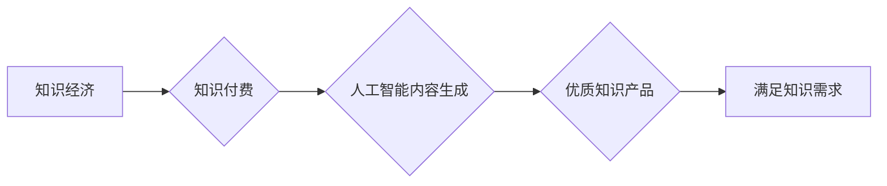

                 

## 关键词：人工智能，内容生成，知识付费，知识经济，深度学习，自然语言处理

## 1. 背景介绍

随着互联网的普及和信息爆炸，知识已成为最宝贵的资源。知识经济时代，知识的获取、传播和应用成为经济发展和社会进步的驱动力。知识付费作为一种新的商业模式，应运而生，它以知识为核心，通过付费的方式提供优质的知识产品和服务，满足人们对知识的需求。

人工智能（AI）技术的快速发展为知识付费提供了强大的技术支撑。人工智能内容生成技术能够自动生成高质量的文本、图像、音频等内容，极大地降低了知识生产的成本和门槛，为知识付费模式的推广提供了新的可能性。

## 2. 核心概念与联系

### 2.1 知识付费

知识付费是指以知识为核心，通过付费的方式提供知识产品和服务的商业模式。它包括但不限于在线课程、付费文章、知识分享会、咨询服务等。

### 2.2 人工智能内容生成

人工智能内容生成是指利用人工智能技术，自动生成高质量的文本、图像、音频等内容。它涵盖了自然语言处理（NLP）、计算机视觉（CV）、语音合成等多个领域。

### 2.3 知识经济

知识经济是指以知识、技术和创新为主要驱动的经济模式。它强调知识的创造、传播和应用，以提高生产效率、创造新的价值。

**核心概念与联系流程图**



## 3. 核心算法原理 & 具体操作步骤

### 3.1 算法原理概述

人工智能内容生成技术主要基于深度学习算法，例如：

* **生成式对抗网络（GAN）：** GAN由两个网络组成：生成器和鉴别器。生成器试图生成逼真的内容，而鉴别器试图区分真实内容和生成内容。通过不断的对抗训练，生成器能够生成越来越逼真的内容。
* **变分自编码器（VAE）：** VAE通过学习数据的潜在表示来生成新的内容。它将输入数据编码成一个低维的潜在空间，然后解码成新的内容。
* **Transformer：** Transformer是一种基于注意力机制的深度学习模型，能够处理序列数据，例如文本。它在自然语言处理领域取得了显著的成果，例如机器翻译、文本摘要、对话系统等。

### 3.2 算法步骤详解

以文本生成为例，使用Transformer模型进行内容生成，具体步骤如下：

1. **数据预处理：** 将文本数据进行清洗、分词、词嵌入等预处理操作，以便模型能够理解和处理数据。
2. **模型训练：** 使用预处理后的数据训练Transformer模型，通过反向传播算法优化模型参数。
3. **文本生成：** 将待生成的文本输入到训练好的模型中，模型根据输入信息和训练数据生成新的文本。

### 3.3 算法优缺点

**优点：**

* 自动化生成内容，提高效率。
* 生成内容质量高，逼真度高。
* 可生成多种类型的文本内容，例如文章、故事、诗歌等。

**缺点：**

* 训练数据量大，需要大量的数据进行训练。
* 模型训练复杂，需要专业的技术人员进行操作。
* 生成内容缺乏原创性，容易出现重复或低质量的内容。

### 3.4 算法应用领域

人工智能内容生成技术广泛应用于以下领域：

* **教育：** 自动生成学习材料、练习题、个性化学习方案等。
* **新闻：** 自动生成新闻报道、新闻摘要、新闻评论等。
* **营销：** 自动生成广告文案、产品描述、社交媒体内容等。
* **娱乐：** 自动生成故事、剧本、游戏剧情等。

## 4. 数学模型和公式 & 详细讲解 & 举例说明

### 4.1 数学模型构建

Transformer模型的核心是注意力机制，它能够学习文本中不同词语之间的关系，并赋予每个词语不同的权重。注意力机制的数学模型可以表示为：

$$
Attention(Q, K, V) = softmax(\frac{QK^T}{\sqrt{d_k}})V
$$

其中：

* $Q$：查询矩阵
* $K$：键矩阵
* $V$：值矩阵
* $d_k$：键向量的维度
* $softmax$：softmax函数

### 4.2 公式推导过程

注意力机制的公式推导过程如下：

1. 计算查询矩阵 $Q$ 和键矩阵 $K$ 的点积，然后除以 $\sqrt{d_k}$。
2. 对点积结果应用softmax函数，得到每个词语的注意力权重。
3. 将注意力权重与值矩阵 $V$ 相乘，得到最终的注意力输出。

### 4.3 案例分析与讲解

例如，在翻译句子“The cat sat on the mat”时，注意力机制可以学习到“cat”和“sat”之间的关系，并赋予它们更高的权重，从而更好地理解句子的含义。

## 5. 项目实践：代码实例和详细解释说明

### 5.1 开发环境搭建

* Python 3.6+
* TensorFlow/PyTorch
* CUDA/cuDNN

### 5.2 源代码详细实现

```python
import tensorflow as tf

# 定义Transformer模型
class Transformer(tf.keras.Model):
    def __init__(self, vocab_size, embedding_dim, num_heads, num_layers):
        super(Transformer, self).__init__()
        self.embedding = tf.keras.layers.Embedding(vocab_size, embedding_dim)
        self.transformer_layers = tf.keras.layers.StackedRNNCells([
            tf.keras.layers.MultiHeadAttention(num_heads=num_heads, key_dim=embedding_dim)
            for _ in range(num_layers)
        ])

    def call(self, inputs):
        # Embedding
        embedded = self.embedding(inputs)
        # Transformer layers
        output = self.transformer_layers(embedded)
        return output

# 实例化模型
model = Transformer(vocab_size=10000, embedding_dim=128, num_heads=8, num_layers=6)

# 训练模型
# ...

# 生成文本
# ...
```

### 5.3 代码解读与分析

* 模型定义：定义了一个Transformer模型，包含嵌入层、多头注意力层和堆叠的RNN单元。
* 嵌入层：将输入的词语ID转换为词向量。
* 多头注意力层：学习文本中不同词语之间的关系，并赋予每个词语不同的权重。
* 堆叠的RNN单元：将多头注意力层的输出进行进一步处理，生成最终的文本输出。

### 5.4 运行结果展示

* 生成文本的例子
* 文本生成质量的评估指标

## 6. 实际应用场景

### 6.1 在线教育平台

* 自动生成个性化学习方案
* 自动生成习题和练习

### 6.2 新闻媒体

* 自动生成新闻报道
* 自动生成新闻摘要

### 6.3 营销推广

* 自动生成广告文案
* 自动生成产品描述

### 6.4 未来应用展望

* 更智能、更个性化的内容生成
* 内容生成与其他AI技术融合，例如图像生成、视频生成等
* 内容生成在更多领域应用，例如医疗、法律、金融等

## 7. 工具和资源推荐

### 7.1 学习资源推荐

* **书籍：**
    * 《深度学习》
    * 《自然语言处理》
* **在线课程：**
    * Coursera
    * edX
    * fast.ai

### 7.2 开发工具推荐

* **TensorFlow:** https://www.tensorflow.org/
* **PyTorch:** https://pytorch.org/
* **Hugging Face Transformers:** https://huggingface.co/transformers/

### 7.3 相关论文推荐

* **Attention Is All You Need:** https://arxiv.org/abs/1706.03762
* **BERT: Pre-training of Deep Bidirectional Transformers for Language Understanding:** https://arxiv.org/abs/1810.04805

## 8. 总结：未来发展趋势与挑战

### 8.1 研究成果总结

人工智能内容生成技术取得了显著的进展，能够生成高质量的文本、图像、音频等内容。

### 8.2 未来发展趋势

* 更智能、更个性化的内容生成
* 内容生成与其他AI技术融合
* 内容生成在更多领域应用

### 8.3 面临的挑战

* 生成内容的原创性和可信度
* 模型训练数据量的需求
* 模型的解释性和可控性

### 8.4 研究展望

* 研究更先进的生成模型算法
* 开发更有效的训练方法
* 探索内容生成与伦理、法律等方面的相关问题

## 9. 附录：常见问题与解答

* **Q：如何评估人工智能内容生成的质量？**
* **A：** 可以使用BLEU、ROUGE等指标评估文本生成的质量，也可以通过人工评估来判断内容的质量和可信度。
* **Q：人工智能内容生成会取代人类的创作吗？**
* **A：** 人工智能内容生成可以辅助人类创作，提高效率，但它无法完全取代人类的创造力。

作者：禅与计算机程序设计艺术 / Zen and the Art of Computer Programming


<end_of_turn>

