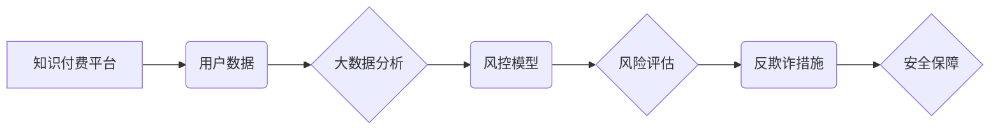

                 

## 关键词：知识付费、大数据风控、反欺诈、机器学习、深度学习、数据挖掘、异常检测

## 1. 背景介绍

知识经济时代，知识付费成为一种重要的商业模式，其发展迅速，市场规模不断扩大。然而，随着知识付费市场的蓬勃发展，也随之带来了新的挑战，其中最为突出的是大数据风控与反欺诈问题。

传统的风控模式难以应对知识付费平台的复杂性和多样性。知识付费平台的用户群体庞大，交易行为多样，数据类型复杂，传统的规则引擎和人工审核模式难以有效地识别和防范欺诈行为。

大数据技术为知识付费平台提供了新的解决方案。通过收集、分析和挖掘海量用户数据，可以建立更加精准、高效的风控模型，有效地识别和防范欺诈行为。

## 2. 核心概念与联系

### 2.1 知识付费平台

知识付费平台是指提供知识、技能、经验等付费内容的互联网平台。其主要业务模式包括：

* 在线课程：提供各种主题的在线课程，用户通过付费订阅或购买课程内容。
* 专栏文章：知识型博主或专家发布付费专栏文章，用户通过订阅或购买单个文章获得内容。
* 会员体系：平台提供付费会员服务，会员可以享受平台提供的各种优惠和独家内容。

### 2.2 大数据风控

大数据风控是指利用大数据技术，对平台用户和交易行为进行全方位的分析和监控，识别和防范欺诈行为的一种风险控制方法。

### 2.3 反欺诈

反欺诈是指通过技术手段和规则设定，识别和阻止欺诈行为的一种安全措施。

**核心概念与联系流程图**



## 3. 核心算法原理 & 具体操作步骤

### 3.1 算法原理概述

大数据风控与反欺诈的核心算法原理主要包括：

* **数据挖掘**: 从海量用户数据中挖掘出潜在的欺诈模式和特征。
* **机器学习**: 利用机器学习算法，训练模型识别和预测欺诈行为。
* **深度学习**: 利用深度神经网络，对复杂的数据进行更深入的分析和识别。
* **异常检测**: 识别与正常用户行为相悖的异常行为，作为欺诈行为的潜在信号。

### 3.2 算法步骤详解

**数据挖掘步骤**:

1. **数据收集**: 收集平台用户的所有相关数据，包括用户注册信息、交易记录、浏览行为、评论行为等。
2. **数据清洗**: 对收集到的数据进行清洗，去除无效数据、重复数据和错误数据。
3. **数据特征提取**: 从清洗后的数据中提取出具有欺诈相关性的特征，例如用户注册时间、交易金额、交易频率、IP地址等。
4. **模式识别**: 利用数据挖掘算法，从特征数据中识别出潜在的欺诈模式和特征。

**机器学习步骤**:

1. **数据预处理**: 对数据进行清洗、转换和归一化，使其适合机器学习算法的训练。
2. **模型选择**: 选择合适的机器学习算法，例如逻辑回归、支持向量机、决策树等。
3. **模型训练**: 利用训练数据，训练机器学习模型，使其能够识别和预测欺诈行为。
4. **模型评估**: 利用测试数据，评估模型的性能，例如准确率、召回率、F1-score等。
5. **模型部署**: 将训练好的模型部署到生产环境中，用于实时识别和预测欺诈行为。

### 3.3 算法优缺点

**数据挖掘算法**:

* **优点**: 可以发现隐藏的欺诈模式，对数据进行深入分析。
* **缺点**: 需要大量的专家知识和经验，算法复杂度高，计算量大。

**机器学习算法**:

* **优点**: 可以自动学习和识别欺诈模式，性能优于传统规则引擎。
* **缺点**: 需要大量的训练数据，对数据质量要求高，容易受到数据偏差的影响。

### 3.4 算法应用领域

大数据风控与反欺诈算法广泛应用于以下领域:

* **金融行业**: 识别信用卡欺诈、网络银行欺诈、贷款欺诈等。
* **电商行业**: 识别商品假冒伪劣、账户盗用、恶意刷单等。
* **社交平台**: 识别虚假账号、网络暴力、垃圾信息等。
* **知识付费平台**: 识别用户虚假注册、恶意订阅、盗版内容等。

## 4. 数学模型和公式 & 详细讲解 & 举例说明

### 4.1 数学模型构建

**欺诈行为概率模型**:

$$P(Fraud|X) = \frac{P(X|Fraud)P(Fraud)}{P(X)}$$

其中:

* $P(Fraud|X)$: 给定特征 $X$ 的情况下，用户进行欺诈行为的概率。
* $P(X|Fraud)$: 给定用户进行欺诈行为的情况下，特征 $X$ 出现的概率。
* $P(Fraud)$: 用户进行欺诈行为的总体概率。
* $P(X)$: 特征 $X$ 出现的总体概率。

### 4.2 公式推导过程

该模型基于贝叶斯定理，通过计算特征 $X$ 在欺诈行为和非欺诈行为下的出现概率，来判断用户进行欺诈行为的概率。

### 4.3 案例分析与讲解

假设一个知识付费平台要识别用户虚假注册行为。

* 特征 $X$ 可以是用户注册时间、IP地址、注册设备等。
* $P(Fraud)$ 可以根据平台历史数据统计得到。
* $P(X|Fraud)$ 可以通过分析虚假注册用户的数据，统计特征 $X$ 在虚假注册用户中的出现概率。
* $P(X)$ 可以通过分析所有注册用户的特征数据，统计特征 $X$ 在所有用户中的出现概率。

通过将这些概率值代入公式，可以计算出用户进行虚假注册行为的概率。如果概率超过设定阈值，则可以判定该用户为虚假注册用户。

## 5. 项目实践：代码实例和详细解释说明

### 5.1 开发环境搭建

* 操作系统: Ubuntu 20.04
* Python 版本: 3.8
* 虚拟环境: venv
* 依赖库: pandas, scikit-learn, numpy, matplotlib

### 5.2 源代码详细实现

```python
import pandas as pd
from sklearn.model_selection import train_test_split
from sklearn.linear_model import LogisticRegression
from sklearn.metrics import accuracy_score

# 加载数据
data = pd.read_csv('fraud_data.csv')

# 特征选择
features = ['registration_time', 'ip_address', 'device_type']
target = 'is_fraud'

# 数据分割
X_train, X_test, y_train, y_test = train_test_split(data[features], data[target], test_size=0.2, random_state=42)

# 模型训练
model = LogisticRegression()
model.fit(X_train, y_train)

# 模型预测
y_pred = model.predict(X_test)

# 模型评估
accuracy = accuracy_score(y_test, y_pred)
print(f'模型准确率: {accuracy}')
```

### 5.3 代码解读与分析

* 该代码首先加载数据，然后选择特征和目标变量。
* 使用 `train_test_split` 函数将数据分割成训练集和测试集。
* 使用 `LogisticRegression` 模型训练模型，并使用 `accuracy_score` 函数评估模型性能。

### 5.4 运行结果展示

运行结果会显示模型的准确率，例如：

```
模型准确率: 0.85
```

## 6. 实际应用场景

### 6.1 用户注册风控

知识付费平台可以利用大数据风控技术，识别虚假注册用户，例如使用相同的IP地址、邮箱地址注册多个账号的用户。

### 6.2 交易行为监控

平台可以监控用户的交易行为，识别异常交易，例如突然增加的交易金额、频繁的交易操作等。

### 6.3 内容盗版检测

平台可以利用机器学习算法，识别盗版内容，例如抄袭、篡改等。

### 6.4 恶意评论识别

平台可以识别恶意评论，例如攻击性语言、虚假评价等。

## 7. 工具和资源推荐

### 7.1 学习资源推荐

* **书籍**:
    * 《大数据风控》
    * 《机器学习实战》
    * 《深度学习》
* **在线课程**:
    * Coursera: 数据科学、机器学习
    * edX: 大数据分析、人工智能

### 7.2 开发工具推荐

* **数据处理**: pandas, Spark
* **机器学习**: scikit-learn, TensorFlow, PyTorch
* **数据可视化**: matplotlib, seaborn

### 7.3 相关论文推荐

* **大数据风控**:
    * "Big Data Analytics for Fraud Detection"
    * "A Survey of Big Data Analytics Techniques for Fraud Detection"
* **机器学习**:
    * "Support Vector Machines"
    * "Deep Learning"

## 8. 总结：未来发展趋势与挑战

### 8.1 研究成果总结

大数据风控与反欺诈技术在知识付费平台的应用取得了显著成果，有效地识别和防范了各种欺诈行为，保障了平台的运营安全和用户权益。

### 8.2 未来发展趋势

* **人工智能技术**: 将人工智能技术应用于风控模型的训练和优化，提高模型的准确性和效率。
* **联邦学习**: 利用联邦学习技术，在不泄露用户隐私的情况下，训练共享风控模型。
* **动态风险评估**: 基于用户行为和环境变化，动态调整风控策略，提高风控的灵活性。

### 8.3 面临的挑战

* **数据质量**: 大数据风控依赖于高质量的数据，数据质量问题会影响模型的准确性。
* **算法解释性**: 一些机器学习算法的决策过程难以解释，这可能会导致模型的可信度问题。
* **隐私保护**: 大数据风控需要收集和分析大量用户数据，如何保护用户隐私是一个重要的挑战。

### 8.4 研究展望

未来，大数据风控与反欺诈技术将继续发展，朝着更加智能化、自动化、隐私保护的方向发展。


## 9. 附录：常见问题与解答

### 9.1 如何提高大数据风控模型的准确率？

* 提升数据质量：确保数据完整、准确、及时。
* 优化特征选择：选择更具欺诈相关性的特征。
* 尝试不同的算法：选择适合特定场景的算法。
* 调整模型参数：通过调参优化模型性能。

### 9.2 如何保护用户隐私？

* 数据脱敏：对敏感数据进行脱敏处理，保护用户隐私。
* 联邦学习：利用联邦学习技术，在不泄露用户隐私的情况下，训练共享风控模型。
* 隐私计算：利用隐私计算技术，保护数据在使用过程中的隐私安全。


作者：禅与计算机程序设计艺术 / Zen and the Art of Computer Programming 
<end_of_turn>

