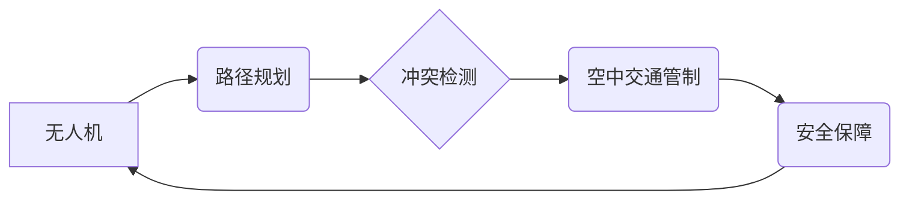

                 

## 硅谷无人机监管:空中交通管理体系

> 关键词：无人机、空中交通管理、UTM、人工智能、路径规划、冲突检测、安全保障、监管体系

## 1. 背景介绍

随着无人机技术的飞速发展，它们在物流、农业、摄影、监控等领域得到了广泛应用。然而，随着无人机数量的激增，空中交通安全问题日益突出。为了保障空中交通安全和有序发展，各国纷纷开始探索建立完善的无人机监管体系。

硅谷作为全球科技创新的中心，在无人机领域也涌现出众多优秀企业和研究机构。为了应对无人机监管的挑战，硅谷正在积极探索基于人工智能和先进算法的空中交通管理 (UTM) 系统，旨在实现无人机空中交通的自动化、安全和高效。

## 2. 核心概念与联系

### 2.1  无人机空中交通管理 (UTM)

无人机空中交通管理 (UTM) 是指为无人机飞行提供安全、高效、有序的空中交通管理体系。它涵盖了无人机飞行规划、冲突检测、空中交通管制、安全保障等多个方面。

### 2.2  核心概念

* **空中交通管制 (ATC):** 指对空中交通流量进行管理和控制，确保飞行安全和效率。
* **冲突检测:** 通过分析无人机的位置、速度和飞行路径，识别潜在的空中碰撞风险。
* **路径规划:** 为无人机规划安全、高效的飞行路径，避免冲突和障碍。
* **无人机识别与跟踪:** 利用传感器和通信技术识别和跟踪无人机，掌握其实时状态。
* **安全保障:** 建立安全机制，防止无人机被恶意操控或攻击。

### 2.3  架构图



## 3. 核心算法原理 & 具体操作步骤

### 3.1  算法原理概述

无人机空中交通管理系统的核心算法主要包括路径规划算法、冲突检测算法和空中交通管制算法。

* **路径规划算法:** 目标是为无人机规划一条安全、高效的飞行路径，避免障碍物和冲突。常用的路径规划算法包括A*算法、Dijkstra算法和RRT算法。

* **冲突检测算法:** 目标是实时检测无人机之间的潜在冲突风险。常用的冲突检测算法包括基于距离的算法、基于轨迹的算法和基于预测的算法。

* **空中交通管制算法:** 目标是根据无人机的位置、速度和飞行计划，协调无人机之间的飞行，确保空中交通安全和效率。常用的空中交通管制算法包括基于规则的算法和基于人工智能的算法。

### 3.2  算法步骤详解

**路径规划算法 (A*算法为例)**

1. **构建地图:** 将飞行区域的障碍物和感兴趣点信息转化为地图数据。
2. **定义起始点和目标点:** 设置无人机的起飞点和目的地。
3. **计算路径代价:** 根据地图数据和无人机的飞行特性，计算从起始点到目标点的不同路径的代价。
4. **选择最优路径:** 选择代价最低的路径作为无人机的飞行路径。

**冲突检测算法 (基于距离的算法为例)**

1. **获取无人机位置信息:** 通过传感器或通信技术获取无人机的实时位置信息。
2. **计算无人机之间的距离:** 计算两架无人机之间的距离。
3. **判断冲突风险:** 如果距离小于预设的安全距离，则判断存在冲突风险。

**空中交通管制算法 (基于规则的算法为例)**

1. **定义飞行规则:** 制定一系列规则，例如飞行高度、速度限制、禁止区域等。
2. **监控无人机飞行状态:** 实时监控无人机的飞行状态，包括位置、速度、高度等。
3. **根据规则进行管制:** 如果无人机违反飞行规则，则进行警告或引导，确保空中交通安全。

### 3.3  算法优缺点

**A*算法:**

* **优点:** 效率高，能够找到最优路径。
* **缺点:** 需要预先构建地图，对地图数据精度要求高。

**基于距离的冲突检测算法:**

* **优点:** 简单易实现，实时性强。
* **缺点:** 无法预测未来冲突，对环境变化敏感。

**基于规则的空中交通管制算法:**

* **优点:** 易于理解和实施，能够有效控制无人机飞行。
* **缺点:** 规则难以覆盖所有场景，缺乏灵活性。

### 3.4  算法应用领域

* **路径规划算法:** 自动驾驶汽车、机器人导航、无人机航线规划等。
* **冲突检测算法:** 交通安全监控、航空航天控制、无人机编队飞行等。
* **空中交通管制算法:** 无人机空中交通管理、空中交通流量控制、航空安全保障等。

## 4. 数学模型和公式 & 详细讲解 & 举例说明

### 4.1  数学模型构建

无人机空中交通管理系统可以使用数学模型来描述无人机之间的关系和飞行行为。例如，可以使用以下模型来描述无人机之间的距离:

$$d = \sqrt{(x_2 - x_1)^2 + (y_2 - y_1)^2}$$

其中：

* $d$ 表示两架无人机之间的距离。
* $(x_1, y_1)$ 表示第一架无人机的坐标。
* $(x_2, y_2)$ 表示第二架无人机的坐标。

### 4.2  公式推导过程

冲突检测算法可以使用数学公式来判断两架无人机之间的冲突风险。例如，可以使用以下公式来计算两架无人机之间的相对速度:

$$v_{rel} = \sqrt{(v_{2x} - v_{1x})^2 + (v_{2y} - v_{1y})^2}$$

其中：

* $v_{rel}$ 表示两架无人机之间的相对速度。
* $(v_{1x}, v_{1y})$ 表示第一架无人机的速度。
* $(v_{2x}, v_{2y})$ 表示第二架无人机的速度。

如果相对速度大于预设的安全阈值，则判断存在冲突风险。

### 4.3  案例分析与讲解

假设两架无人机A和B，A的坐标为(10, 10)，B的坐标为(20, 20)，A的速度为(1, 1)，B的速度为(2, 2)。

根据公式，我们可以计算出：

* 两架无人机之间的距离：$d = \sqrt{(20 - 10)^2 + (20 - 10)^2} = 14.14$
* 两架无人机之间的相对速度：$v_{rel} = \sqrt{(2 - 1)^2 + (2 - 1)^2} = 1.41$

由于距离大于预设的安全距离，并且相对速度小于安全阈值，因此判断两架无人机之间不存在冲突风险。

## 5. 项目实践：代码实例和详细解释说明

### 5.1  开发环境搭建

* 操作系统: Ubuntu 20.04
* 编程语言: Python 3.8
* 开发工具: PyCharm

### 5.2  源代码详细实现

```python
import numpy as np

class Drone:
    def __init__(self, x, y, vx, vy):
        self.x = x
        self.y = y
        self.vx = vx
        self.vy = vy

    def update_position(self, dt):
        self.x += self.vx * dt
        self.y += self.vy * dt

    def distance_to(self, other_drone):
        return np.sqrt((self.x - other_drone.x)**2 + (self.y - other_drone.y)**2)

# 创建两架无人机
drone1 = Drone(10, 10, 1, 1)
drone2 = Drone(20, 20, 2, 2)

# 模拟时间步长
dt = 0.1

# 更新无人机位置
for _ in range(10):
    drone1.update_position(dt)
    drone2.update_position(dt)

# 计算两架无人机之间的距离
distance = drone1.distance_to(drone2)

# 打印距离
print(f"两架无人机之间的距离为: {distance}")
```

### 5.3  代码解读与分析

这段代码实现了两个无人机的基本位置更新和距离计算功能。

* `Drone` 类定义了无人机的基本属性和方法，包括位置坐标、速度和更新位置的方法。
* `distance_to` 方法计算了两个无人机之间的距离。
* 代码循环模拟了无人机在一段时间内的飞行，并计算了每次时间步长后的距离。

### 5.4  运行结果展示

运行代码后，会输出两架无人机之间的距离。

## 6. 实际应用场景

### 6.1  物流配送

无人机可以用于快速、高效地配送货物，例如药品、快递等。UTM系统可以帮助管理无人机飞行路径，避免冲突，确保安全配送。

### 6.2  农业监测

无人机可以用于监测农田的生长情况，喷洒农药等。UTM系统可以帮助规划无人机飞行路径，提高效率，减少农药浪费。

### 6.3  灾害救援

无人机可以用于灾害救援，例如搜救人员、传递物资等。UTM系统可以帮助协调无人机飞行，提高救援效率。

### 6.4  未来应用展望

随着无人机技术的不断发展，UTM系统将在更多领域得到应用，例如：

* **城市空中交通:** 无人机可以用于城市空中交通，例如空中出租车、空中货运等。
* **空中巡逻:** 无人机可以用于空中巡逻，例如边境巡逻、海上巡逻等。
* **环境监测:** 无人机可以用于环境监测，例如大气污染监测、森林火灾监测等。

## 7. 工具和资源推荐

### 7.1  学习资源推荐

* **无人机空中交通管理 (UTM) 相关书籍:**

* **无人机技术入门指南:** https://www.amazon.com/Drone-Technology-Beginner-Guide-Unmanned/dp/1790997983

* **无人机飞行控制:** https://www.amazon.com/Drone-Flight-Control-Principles-Applications/dp/1466589479

* **无人机空中交通管理 (UTM) 相关论文:**

* **UTM: A Framework for Unmanned Aircraft System Integration into the National Airspace System:** https://ieeexplore.ieee.org/document/8091979

### 7.2  开发工具推荐

* **ROS (Robot Operating System):** https://www.ros.org/
* **MAVLink:** https://mavlink.io/

### 7.3  相关论文推荐

* **A Survey of Unmanned Aerial Vehicle (UAV) Trajectory Planning Algorithms:** https://ieeexplore.ieee.org/document/8909463
* **Conflict Detection and Resolution for Unmanned Aerial Vehicles:** https://ieeexplore.ieee.org/document/8830397

## 8. 总结：未来发展趋势与挑战

### 8.1  研究成果总结

硅谷在无人机空中交通管理领域取得了显著成果，例如：

* 开发了基于人工智能的冲突检测和路径规划算法。
* 建立了基于云计算的无人机空中交通管理平台。
* 推动了无人机空中交通管理标准的制定。

### 8.2  未来发展趋势

* **人工智能技术:** 人工智能技术将进一步应用于无人机空中交通管理，例如自动决策、预测性维护等。
* **5G 网络:** 5G 网络的高带宽和低延迟特性将支持无人机空中交通管理系统的实时性和可靠性。
* **无人机协同:** 无人机协同技术将使无人机能够更有效地完成任务，例如编队飞行、协同运输等。

### 8.3  面临的挑战

* **安全保障:** 确保无人机空中交通的安全性和可靠性是最大的挑战。
* **监管体系:** 建立完善的无人机监管体系是必要的，以确保无人机空中交通的秩序和安全。
* **技术标准:** 需要制定统一的技术标准，以促进无人机空中交通管理系统的互操作性和可扩展性。

### 8.4  研究展望

未来，无人机空中交通管理将朝着更加智能化、自动化、安全化的方向发展。研究者将继续探索新的算法、技术和应用场景，以推动无人机空中交通的健康发展。

## 9. 附录：常见问题与解答

**Q1: 无人机空中交通管理 (UTM) 和空中交通管制 (ATC) 的区别是什么？**

**A1:** UTM 和 ATC 都是为了管理空中交通，但它们的目标对象和范围不同。ATC 主要针对的是大型飞机，负责管理整个国家或地区的空中交通，而 UTM 主要针对的是无人机，负责管理无人机在特定区域内的飞行。

**Q2: 无人机空中交通管理 (UTM) 的核心技术是什么？**

**A2:** 无人机空中交通管理 (UTM) 的核心技术包括路径规划、冲突检测、空中交通管制、安全保障等。

**Q3: 无人机空中交通管理 (UTM) 的未来发展趋势是什么？**

**A3:** 无人机空中交通管理 (UTM) 的未来发展趋势包括人工智能技术、5G 网络、无人机协同等。


作者：禅与计算机程序设计艺术 / Zen and the Art of Computer Programming 
<end_of_turn>

