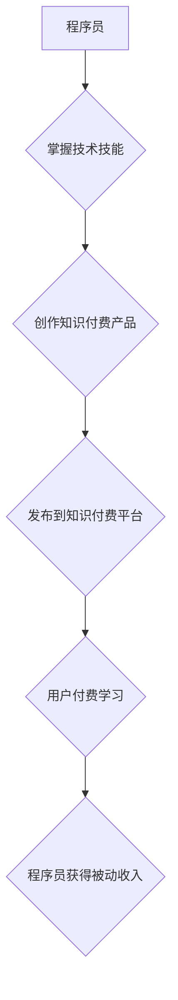

                 

## 程序员如何利用知识付费实现被动收入

> 关键词：知识付费、程序员、被动收入、在线课程、技术博客、电子书、开源项目

### 1. 背景介绍

在当今数字时代，程序员的需求量持续增长，技术技能成为炙手可热的人才。然而，程序员的职业发展之路并非一帆风顺，竞争激烈，收入不稳定。越来越多的程序员开始寻求新的收入来源，以实现财务自由和职业发展。知识付费，作为一种新型的商业模式，为程序员提供了实现被动收入的绝佳机会。

知识付费是指通过线上平台，将个人知识、技能、经验等打包成产品，向付费用户提供学习和提升的机会。对于程序员来说，他们拥有丰富的技术经验和开发技能，可以通过知识付费将这些宝贵资源转化为可持续的收入。

### 2. 核心概念与联系

**2.1 知识付费模式**

知识付费模式的核心是将知识和技能作为商品，通过线上平台进行交易。程序员可以通过以下几种方式进行知识付费：

* **在线课程:**  录制视频课程，教授编程语言、框架、算法等技术知识。
* **技术博客:**  撰写高质量的技术文章，分享编程经验、开发技巧、行业趋势等内容。
* **电子书:**  编写编程书籍，深入讲解特定技术领域或开发项目经验。
* **开源项目:**  开发开源软件，并提供付费支持服务，例如代码定制、技术咨询、培训等。

**2.2 程序员知识付费的优势**

* **被动收入:**  知识付费产品一旦上线，可以持续为作者带来收入，无需重复劳动。
* **知识积累:**  创作知识付费产品需要深入学习和总结，可以帮助程序员巩固知识，提升技能。
* **品牌建设:**  通过高质量的知识付费产品，程序员可以建立个人品牌，提升行业影响力。
* **社区建设:**  知识付费平台可以帮助程序员建立学习社区，与其他开发者交流学习，共同进步。

**2.3 知识付费平台**

目前，国内外涌现了许多知识付费平台，例如：

* **国内:**  Udemy、Coursera、慕课网、知识星球、B站等。
* **国外:**  Skillshare、Teachable、Thinkific等。

程序员可以选择适合自己的平台进行知识付费。

**2.4  Mermaid 流程图**



### 3. 核心算法原理 & 具体操作步骤

**3.1 算法原理概述**

知识付费的核心算法原理是基于用户需求和内容匹配。平台会根据用户的学习兴趣、技能水平、学习目标等信息，推荐相关的知识付费产品。同时，平台也会根据产品的质量、用户评价、销售额等指标，对产品进行排序和推荐。

**3.2 算法步骤详解**

1. **用户数据采集:** 平台会收集用户的学习行为数据，例如浏览记录、搜索历史、购买记录、评价反馈等。
2. **用户画像构建:**  根据用户的学习行为数据，平台会构建用户的学习画像，包括用户的学习兴趣、技能水平、学习目标等信息。
3. **产品信息获取:** 平台会收集产品的相关信息，例如产品标题、描述、课程内容、价格、用户评价等。
4. **内容匹配:** 平台会根据用户的学习画像和产品的相关信息，进行内容匹配，推荐用户可能感兴趣的产品。
5. **排序推荐:** 平台会根据产品的质量、用户评价、销售额等指标，对匹配的产品进行排序和推荐，展示给用户。

**3.3 算法优缺点**

* **优点:**  能够精准推荐用户感兴趣的产品，提高用户学习体验和转化率。
* **缺点:**  算法可能会受到数据偏差的影响，导致推荐结果不准确。

**3.4 算法应用领域**

* **在线教育:**  推荐课程、学习资源、学习计划等。
* **电商平台:**  推荐商品、促销活动、个性化服务等。
* **社交媒体:**  推荐好友、内容、活动等。

### 4. 数学模型和公式 & 详细讲解 & 举例说明

**4.1 数学模型构建**

知识付费平台的推荐算法通常基于协同过滤或内容过滤等数学模型。

* **协同过滤:**  根据用户的历史行为数据，预测用户对特定产品的兴趣。
* **内容过滤:**  根据产品的特征信息，预测用户对特定产品的兴趣。

**4.2 公式推导过程**

协同过滤算法常用的公式是基于用户-物品评分矩阵的协同过滤算法，例如基于用户的协同过滤算法。

$$
\hat{r}_{u,i} = \bar{r}_u + \frac{\sum_{v \in N(u)} (r_{v,i} - \bar{r}_v) * sim(u,v)}{\sum_{v \in N(u)} sim(u,v)}
$$

其中：

* $\hat{r}_{u,i}$: 用户 $u$ 对物品 $i$ 的预测评分。
* $\bar{r}_u$: 用户 $u$ 的平均评分。
* $r_{v,i}$: 用户 $v$ 对物品 $i$ 的真实评分。
* $sim(u,v)$: 用户 $u$ 和用户 $v$ 之间的相似度。
* $N(u)$: 用户 $u$ 的邻居用户集合。

**4.3 案例分析与讲解**

假设有一个用户 $u$ 想要学习 Python 编程，平台根据用户的历史行为数据和用户的兴趣偏好，推荐了以下几门 Python 课程：

* 课程 A: Python 基础入门
* 课程 B: Python Web 开发
* 课程 C: Python 数据分析

平台会根据用户的历史评分数据和与其他用户的相似度，预测用户对每门课程的评分，并推荐用户最有可能感兴趣的课程。

### 5. 项目实践：代码实例和详细解释说明

**5.1 开发环境搭建**

* Python 3.x
* Flask 或 Django 框架
* 数据库 (例如 MySQL 或 PostgreSQL)
* 前端框架 (例如 React 或 Vue.js)

**5.2 源代码详细实现**

以下是一个简单的 Python 知识付费平台的代码示例，使用 Flask 框架实现：

```python
from flask import Flask, render_template

app = Flask(__name__)

@app.route('/')
def index():
    return render_template('index.html')

if __name__ == '__main__':
    app.run(debug=True)
```

**5.3 代码解读与分析**

* `Flask` 是一个轻量级的 Python Web 框架。
* `render_template` 函数用于渲染 HTML 模板。
* `index.html` 是网站的首页模板。

**5.4 运行结果展示**

运行上述代码，访问 `http://127.0.0.1:5000/`，即可看到简单的知识付费平台首页。

### 6. 实际应用场景

**6.1 在线课程平台**

程序员可以录制视频课程，教授编程语言、框架、算法等技术知识，通过在线课程平台进行销售。

**6.2 技术博客**

程序员可以撰写高质量的技术文章，分享编程经验、开发技巧、行业趋势等内容，通过博客平台进行知识付费。

**6.3 电子书出版**

程序员可以编写编程书籍，深入讲解特定技术领域或开发项目经验，通过电子书平台进行出版销售。

**6.4 开源项目支持**

程序员可以开发开源软件，并提供付费支持服务，例如代码定制、技术咨询、培训等。

**6.5 未来应用展望**

随着人工智能、大数据等技术的不断发展，知识付费模式将更加智能化、个性化。程序员可以利用这些技术，开发更加精准、高效的知识付费产品，满足用户多样化的学习需求。

### 7. 工具和资源推荐

**7.1 学习资源推荐**

* **在线课程平台:** Udemy、Coursera、慕课网、知识星球、B站等。
* **技术博客:** CSDN、博客园、掘金等。
* **电子书平台:** Amazon Kindle、豆瓣读书等。

**7.2 开发工具推荐**

* **Python 框架:** Flask、Django。
* **数据库:** MySQL、PostgreSQL。
* **前端框架:** React、Vue.js。

**7.3 相关论文推荐**

* **协同过滤算法:** "Collaborative Filtering: A User-Based Approach" by Goldberg et al. (1992)
* **内容过滤算法:** "Content-Based Recommendation Systems" by Ricci et al. (2011)

### 8. 总结：未来发展趋势与挑战

**8.1 研究成果总结**

知识付费模式为程序员提供了实现被动收入的有效途径，并推动了技术知识的传播和共享。

**8.2 未来发展趋势**

* **个性化推荐:** 利用人工智能技术，提供更加精准、个性化的知识付费推荐。
* **沉浸式学习:** 利用虚拟现实、增强现实等技术，打造更加沉浸式的学习体验。
* **社区化学习:** 鼓励用户之间互动交流，构建更加活跃的学习社区。

**8.3 面临的挑战**

* **内容质量:** 确保知识付费产品的质量，避免低质量内容的泛滥。
* **用户信任:** 建立用户对知识付费平台的信任，保障用户权益。
* **商业模式创新:** 探索更加可持续的知识付费商业模式。

**8.4 研究展望**

未来，知识付费模式将继续发展壮大，并与其他技术融合，创造更加丰富的学习体验和商业价值。程序员需要不断学习和提升，才能在知识付费领域获得成功。

### 9. 附录：常见问题与解答

**9.1 如何选择合适的知识付费平台？**

选择知识付费平台时，需要考虑平台的流量、用户群体、收费模式、服务支持等因素。

**9.2 如何创作高质量的知识付费产品？**

创作高质量的知识付费产品需要深入学习和总结，并注重用户体验和互动性。

**9.3 如何推广自己的知识付费产品？**

可以通过社交媒体、技术社区、博客等渠道推广自己的知识付费产品。


作者：禅与计算机程序设计艺术 / Zen and the Art of Computer Programming 
<end_of_turn>

