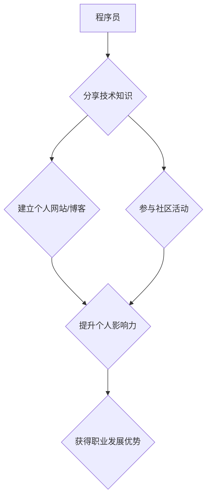

                 

## 程序员如何利用知识付费打造个人品牌

> 关键词：知识付费、程序员、个人品牌、技术博客、在线课程、内容营销、社区建设

### 1. 背景介绍

在当今数字化时代，技术人才需求日益增长，程序员作为科技发展的重要力量，拥有着巨大的职业发展潜力。然而，随着编程技能的普及，程序员之间的竞争也日益激烈。如何脱颖而出，建立个人品牌，并获得持续的职业发展机遇，成为众多程序员关注的焦点。

知识付费作为一种新型的商业模式，为程序员提供了打造个人品牌、分享知识、获取收益的全新途径。通过创作高质量的技术内容，建立在线课程、技术博客、社群等平台，程序员可以将自身的技术经验和专业知识转化为价值，并与广大开发者建立连接，从而提升个人影响力，获得职业发展上的突破。

### 2. 核心概念与联系

**2.1 知识付费**

知识付费是指通过提供有价值的知识、技能和服务，向用户收取费用的一种商业模式。它打破了传统知识传播的壁垒，赋予了知识生产者更大的自主性和收益权。

**2.2 个人品牌**

个人品牌是指个人在特定领域或行业内建立的独特形象和声誉。它代表着个人的价值观、专业技能、经验积累和个人魅力，能够帮助个人在竞争激烈的环境中脱颖而出，获得认可和信任。

**2.3 程序员个人品牌建设**

程序员个人品牌建设是指程序员通过分享技术知识、参与社区活动、打造个人网站或博客等方式，在技术领域建立自身独特的形象和声誉，提升个人影响力，并获得职业发展上的优势。

**Mermaid 流程图**



### 3. 核心算法原理 & 具体操作步骤

**3.1 算法原理概述**

程序员个人品牌建设的核心算法可以概括为“内容生产 + 社交传播 + 价值输出”。

* **内容生产:**  程序员需要持续创作高质量的技术内容，例如博客文章、视频教程、开源项目等，并将其发布到线上平台，吸引目标用户的关注。
* **社交传播:**  程序员需要积极参与技术社区，与其他开发者交流互动，分享自己的技术经验，并推广自己的内容，扩大内容的传播范围。
* **价值输出:**  程序员需要不断提升自身的技术水平，并将其转化为有价值的服务，例如技术咨询、定制开发等，为用户提供实际帮助，建立信任关系。

**3.2 算法步骤详解**

1. **确定目标用户:**  程序员需要明确自己的目标用户群体，例如初学者、经验丰富的开发者、特定行业的用户等，并根据用户的需求和兴趣方向创作内容。
2. **选择内容平台:**  程序员可以根据目标用户群体和自身特点选择合适的平台，例如技术博客、视频网站、社交媒体平台等。
3. **创作高质量内容:**  程序员需要创作原创、有价值、易于理解的内容，并注重内容的结构、排版和视觉效果。
4. **进行内容推广:**  程序员需要利用社交媒体、邮件营销等方式推广自己的内容，并与其他开发者合作，扩大内容的传播范围。
5. **与用户互动:**  程序员需要积极回复用户的评论和提问，并与用户建立良好的互动关系，增强用户粘性。
6. **提供价值服务:**  程序员可以根据用户的需求提供技术咨询、定制开发等服务，并建立付费模式，获得收益。

**3.3 算法优缺点**

* **优点:**  
    * 能够有效提升个人影响力，建立个人品牌。
    * 能够获得持续的职业发展机遇，并获得经济收益。
    * 能够与其他开发者建立联系，学习和交流技术经验。
* **缺点:**  
    * 需要投入大量的时间和精力进行内容创作和推广。
    * 需要不断学习和提升自身的技术水平，才能创作出有价值的内容。
    * 需要具备一定的营销和推广能力，才能有效地推广自己的内容。

**3.4 算法应用领域**

* **技术博客:**  程序员可以通过技术博客分享自己的技术经验和见解，并建立个人品牌。
* **在线课程:**  程序员可以通过录制视频课程，教授编程知识和技能，并获得收益。
* **开源项目:**  程序员可以通过开源项目展示自己的技术能力，并与其他开发者合作，共同开发软件。
* **技术社区:**  程序员可以通过积极参与技术社区，与其他开发者交流互动，并分享自己的技术经验。

### 4. 数学模型和公式 & 详细讲解 & 举例说明

**4.1 数学模型构建**

程序员个人品牌建设可以看作是一个动态的系统，其核心要素包括：

* **内容质量 (Q):**  内容的原创性、价值性和易读性。
* **传播范围 (R):**  内容的曝光量和传播速度。
* **用户互动 (I):**  用户对内容的评论、点赞和分享等行为。
* **个人影响力 (P):**  程序员在技术领域内的声誉和影响力。

我们可以构建一个简单的数学模型来描述这些要素之间的关系：

$$P = f(Q, R, I)$$

其中，f()是一个非线性函数，表示个人影响力受内容质量、传播范围和用户互动等因素的影响。

**4.2 公式推导过程**

我们可以进一步推导这个函数的具体形式，例如：

$$P = a * Q^b * R^c * I^d$$

其中，a、b、c、d是常数，可以通过数据分析和模型训练来确定。

**4.3 案例分析与讲解**

假设有两个程序员，A和B，他们都创作了高质量的技术内容，但A的传播范围和用户互动都比B高很多。根据上述模型，我们可以推断出A的个人影响力应该高于B。

### 5. 项目实践：代码实例和详细解释说明

**5.1 开发环境搭建**

程序员可以利用常见的开发环境搭建自己的个人品牌平台，例如：

* **本地开发环境:**  使用文本编辑器、版本控制系统等工具，搭建自己的博客网站或技术论坛。
* **云平台:**  利用云平台提供的服务，例如AWS、Azure、GCP等，快速搭建自己的网站或应用程序。

**5.2 源代码详细实现**

以下是一个简单的博客网站的源代码示例，使用Python和Flask框架实现：

```python
from flask import Flask, render_template

app = Flask(__name__)

@app.route('/')
def index():
    return render_template('index.html')

if __name__ == '__main__':
    app.run(debug=True)
```

**5.3 代码解读与分析**

* `from flask import Flask, render_template`:  导入Flask框架的必要模块。
* `app = Flask(__name__)`:  创建Flask应用程序实例。
* `@app.route('/')`:  定义路由规则，当访问根路径时，执行`index()`函数。
* `def index()`:  定义首页函数，返回`index.html`模板文件。
* `if __name__ == '__main__':`:  判断是否为脚本执行文件，如果是，则运行应用程序。

**5.4 运行结果展示**

运行上述代码后，程序员可以访问`http://127.0.0.1:5000/`，查看自己的博客网站。

### 6. 实际应用场景

**6.1 技术博客**

程序员可以通过技术博客分享自己的技术经验、见解和项目案例，建立个人品牌，并吸引潜在雇主或客户。

**6.2 在线课程**

程序员可以通过录制视频课程，教授编程知识和技能，并通过在线平台销售课程，获得收益。

**6.3 社区建设**

程序员可以通过创建技术社区，聚集志同道合的开发者，分享技术经验，并举办线上线下活动，提升个人影响力。

**6.4 未来应用展望**

随着人工智能、虚拟现实等技术的不断发展，程序员个人品牌建设将更加多元化和智能化。例如，人工智能可以帮助程序员自动生成内容、推荐学习资源，虚拟现实可以为程序员提供沉浸式的学习体验。

### 7. 工具和资源推荐

**7.1 学习资源推荐**

* **在线学习平台:**  Coursera、Udemy、edX等平台提供丰富的编程课程和技术培训资源。
* **技术博客:**  Hacker News、Medium、Dev.to等平台汇聚了众多程序员的博客文章和技术分享。
* **开源社区:**  GitHub、GitLab等平台提供了丰富的开源项目和技术文档。

**7.2 开发工具推荐**

* **文本编辑器:**  VS Code、Sublime Text、Atom等编辑器提供了强大的代码编辑和调试功能。
* **版本控制系统:**  Git、GitHub等工具帮助程序员管理代码版本和协同开发。
* **云平台:**  AWS、Azure、GCP等平台提供了丰富的云计算服务，帮助程序员快速搭建和部署应用程序。

**7.3 相关论文推荐**

* **The Impact of Social Media on Personal Branding**
* **Knowledge Sharing and Collaboration in Online Communities**
* **The Role of Content Marketing in Building Personal Brands**

### 8. 总结：未来发展趋势与挑战

**8.1 研究成果总结**

程序员个人品牌建设是一个不断发展和演变的领域，通过内容生产、社交传播和价值输出，程序员可以有效提升个人影响力，获得职业发展上的优势。

**8.2 未来发展趋势**

* **人工智能驱动:**  人工智能将更加广泛地应用于程序员个人品牌建设，例如自动生成内容、推荐学习资源、个性化推荐等。
* **虚拟现实体验:**  虚拟现实技术将为程序员提供更加沉浸式的学习体验和互动方式。
* **跨平台融合:**  程序员个人品牌建设将更加注重跨平台的整合和协同，例如将博客内容与社交媒体平台进行同步发布。

**8.3 面临的挑战**

* **内容质量竞争:**  随着越来越多程序员参与知识付费，内容质量竞争将更加激烈。
* **用户注意力分散:**  用户注意力分散，程序员需要更加努力地吸引和留住用户的注意力。
* **平台生态变化:**  技术平台的生态环境不断变化，程序员需要及时适应新的平台规则和趋势。

**8.4 研究展望**

未来研究可以更加深入地探讨程序员个人品牌建设的机制、策略和影响因素，并探索人工智能、虚拟现实等新技术的应用，为程序员提供更加有效的个人品牌建设工具和方法。

### 9. 附录：常见问题与解答

**9.1 如何确定目标用户群体？**

程序员需要根据自身的技术领域、经验水平和兴趣爱好，确定目标用户群体。例如，如果程序员擅长前端开发，可以将目标用户群体定位为初学者或想学习前端开发的开发者。

**9.2 如何创作高质量内容？**

程序员需要创作原创、有价值、易于理解的内容，并注重内容的结构、排版和视觉效果。可以参考其他优秀技术博客和课程，学习他们的写作风格和内容结构。

**9.3 如何推广自己的内容？**

程序员可以利用社交媒体、邮件营销、技术论坛等方式推广自己的内容，并与其他开发者合作，扩大内容的传播范围。

**9.4 如何获得收益？**

程序员可以通过多种方式获得收益，例如出售在线课程、提供技术咨询、定制开发等。


作者：禅与计算机程序设计艺术 / Zen and the Art of Computer Programming 
<end_of_turn>

