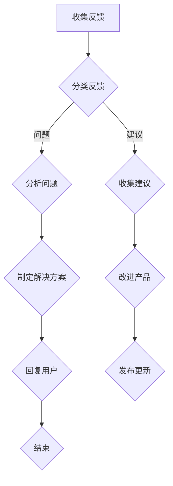

                 

## 程序员如何处理知识付费的客户反馈

> 关键词：知识付费、客户反馈、程序员、沟通技巧、问题解决、产品迭代、用户体验

## 1. 背景介绍

知识付费行业近年来蓬勃发展，程序员作为知识付费领域的优质内容提供者，通过线上课程、书籍、博客等形式分享技术经验和技能。然而，随着用户群体的扩大，如何有效处理客户反馈成为程序员面临的重要挑战。

客户反馈是宝贵的资源，它反映了用户对课程、产品或服务的真实感受，能够帮助程序员改进内容、优化体验，最终提升用户满意度和商业价值。然而，面对海量的客户反馈，程序员需要具备一定的技巧和策略，才能有效地收集、分析和处理这些信息。

## 2. 核心概念与联系

### 2.1  知识付费模式

知识付费模式是指通过提供有价值的知识和技能，向用户收取费用的一种商业模式。

### 2.2  客户反馈

客户反馈是指用户对产品、服务或内容的评价、建议和意见。

### 2.3  反馈处理流程

程序员处理客户反馈需要遵循一个清晰的流程，包括收集、分类、分析、回复和改进等环节。

**Mermaid 流程图：**



## 3. 核心算法原理 & 具体操作步骤

### 3.1  算法原理概述

处理客户反馈的核心算法原理是基于文本分析和机器学习。

* **文本分析:**  通过自然语言处理技术，对客户反馈进行分词、词性标注、情感分析等处理，提取关键信息和用户意图。
* **机器学习:**  利用机器学习算法，对历史客户反馈进行训练，建立知识库和模型，自动识别常见问题、预测用户需求，并提供相应的解决方案。

### 3.2  算法步骤详解

1. **数据收集:**  从各种渠道收集客户反馈数据，例如评论区、邮件、问卷调查等。
2. **数据预处理:**  对收集到的数据进行清洗、格式化、去噪等处理，去除无关信息，提高数据质量。
3. **文本分析:**  使用自然语言处理工具对预处理后的数据进行分析，提取关键词、主题、情感等信息。
4. **问题分类:**  根据提取的信息，将客户反馈进行分类，例如技术问题、功能需求、体验反馈等。
5. **解决方案生成:**  根据问题分类，从知识库中查找相应的解决方案，或者利用机器学习模型预测最佳解决方案。
6. **用户回复:**  将解决方案以简洁明了的语言回复给用户，并提供必要的帮助和支持。
7. **数据反馈:**  将用户回复和反馈信息反馈到系统中，不断更新知识库和模型，提高算法的准确性和效率。

### 3.3  算法优缺点

**优点:**

* 自动化处理大量反馈，提高效率。
* 基于数据分析，提供更精准的解决方案。
* 持续优化算法，提升用户体验。

**缺点:**

* 需要投入大量时间和资源进行数据收集和模型训练。
* 算法无法处理所有复杂和个性化的反馈。
* 需要人工进行监督和审核，确保解决方案的质量和准确性。

### 3.4  算法应用领域

* **在线教育:**  处理学生对课程内容、学习平台的反馈。
* **软件开发:**  收集用户对软件功能、性能的反馈，用于产品迭代和改进。
* **客户服务:**  自动处理常见客户问题，提高服务效率。

## 4. 数学模型和公式 & 详细讲解 & 举例说明

### 4.1  数学模型构建

处理客户反馈的数学模型可以基于概率论和统计学，例如：

* **贝叶斯分类:**  根据客户反馈的历史数据，计算不同问题类别出现的概率，并预测新反馈属于哪个类别。
* **朴素贝叶斯分类:**  假设特征之间相互独立，简化贝叶斯分类算法，提高计算效率。

### 4.2  公式推导过程

**贝叶斯公式:**

$$P(A|B) = \frac{P(B|A)P(A)}{P(B)}$$

其中:

* $P(A|B)$: 事件A在已知事件B发生条件下的概率。
* $P(B|A)$: 事件B在已知事件A发生条件下的概率。
* $P(A)$: 事件A发生的概率。
* $P(B)$: 事件B发生的概率。

**朴素贝叶斯分类公式:**

$$P(C_i|X) = \frac{P(C_i) \prod_{j=1}^{n} P(x_j|C_i)}{P(X)}$$

其中:

* $C_i$: 类别i。
* $X$: 特征向量。
* $x_j$: 特征j。
* $P(C_i)$: 类别i出现的概率。
* $P(x_j|C_i)$: 特征j在类别i下出现的概率。
* $P(X)$: 特征向量X出现的概率。

### 4.3  案例分析与讲解

假设我们有一个在线课程平台，收集到以下客户反馈数据:

* 用户1: “课程内容太难理解了。”
* 用户2: “课程讲解很清晰，受益匪浅。”
* 用户3: “平台界面不太友好。”

我们可以使用贝叶斯分类算法，根据用户反馈的历史数据，训练一个模型，预测新用户反馈属于哪个类别，例如“课程内容”、“课程讲解”、“平台界面”等。

## 5. 项目实践：代码实例和详细解释说明

### 5.1  开发环境搭建

* Python 3.x
* NLTK 自然语言处理库
* Scikit-learn 机器学习库

### 5.2  源代码详细实现

```python
import nltk
from nltk.corpus import stopwords
from sklearn.feature_extraction.text import TfidfVectorizer
from sklearn.naive_bayes import MultinomialNB

# 下载停用词列表
nltk.download('stopwords')

# 准备训练数据
train_data = [
    ("课程内容太难理解了", "课程内容"),
    ("课程讲解很清晰，受益匪浅", "课程讲解"),
    ("平台界面不太友好", "平台界面"),
    # ... 其他训练数据
]

# 分词和停用词过滤
def preprocess_text(text):
    tokens = nltk.word_tokenize(text)
    stop_words = set(stopwords.words('english'))
    filtered_tokens = [word for word in tokens if word.lower() not in stop_words]
    return " ".join(filtered_tokens)

# 将训练数据转换为TF-IDF向量
vectorizer = TfidfVectorizer(tokenizer=preprocess_text)
X_train = vectorizer.fit_transform([text for text, label in train_data])
y_train = [label for text, label in train_data]

# 训练朴素贝叶斯分类器
classifier = MultinomialNB()
classifier.fit(X_train, y_train)

# 对新数据进行预测
new_feedback = "课程进度太慢了"
new_feedback_vector = vectorizer.transform([new_feedback])
predicted_category = classifier.predict(new_feedback_vector)[0]
print(f"预测类别: {predicted_category}")
```

### 5.3  代码解读与分析

* 代码首先使用NLTK库进行文本预处理，包括分词和停用词过滤。
* 然后使用Scikit-learn库中的TfidfVectorizer将文本数据转换为TF-IDF向量，用于机器学习模型训练。
* 训练一个朴素贝叶斯分类器，并使用训练数据进行模型训练。
* 最后对新用户反馈进行预测，并输出预测类别。

### 5.4  运行结果展示

运行代码后，程序会输出预测类别，例如“课程内容”、“课程讲解”、“平台界面”等。

## 6. 实际应用场景

### 6.1  在线教育平台

* 处理学生对课程内容、学习平台的反馈，例如课程难度、学习进度、平台功能等。
* 根据反馈信息，优化课程内容、改进学习平台，提升用户学习体验。

### 6.2  软件开发公司

* 收集用户对软件功能、性能、用户界面等方面的反馈。
* 利用反馈信息，改进软件功能、修复bug、优化用户体验。

### 6.3  客户服务中心

* 自动处理常见客户问题，例如产品使用、订单查询、售后服务等。
* 通过机器学习模型，预测用户需求，提供更精准的解决方案。

### 6.4  未来应用展望

随着人工智能技术的不断发展，客户反馈处理将更加智能化和自动化。未来，我们可以期待：

* 更精准的文本分析和情感识别，能够更深入地理解用户的真实意图。
* 更强大的机器学习模型，能够自动生成更个性化的解决方案。
* 更智能的交互方式，例如语音助手、聊天机器人，能够提供更便捷的客户服务体验。

## 7. 工具和资源推荐

### 7.1  学习资源推荐

* **自然语言处理入门:**
    * NLTK Book: https://www.nltk.org/book/
    * Speech and Language Processing by Jurafsky and Martin: https://web.stanford.edu/~jurafsky/slp3/

* **机器学习入门:**
    * Andrew Ng's Machine Learning Course: https://www.coursera.org/learn/machine-learning
    * Scikit-learn Documentation: https://scikit-learn.org/stable/documentation.html

### 7.2  开发工具推荐

* **Python:** https://www.python.org/
* **NLTK:** https://www.nltk.org/
* **Scikit-learn:** https://scikit-learn.org/stable/

### 7.3  相关论文推荐

* **A Survey of Text Classification Algorithms**
* **Naive Bayes for Text Classification**
* **TF-IDF: A Simple and Effective Approach to Text Retrieval**

## 8. 总结：未来发展趋势与挑战

### 8.1  研究成果总结

处理客户反馈的算法和技术已经取得了显著的进展，能够有效地收集、分析和处理海量的客户反馈数据，为程序员提供宝贵的决策依据。

### 8.2  未来发展趋势

* **更精准的文本分析:**  利用深度学习等先进技术，实现更精准的文本分析和情感识别，能够更深入地理解用户的真实意图。
* **更个性化的解决方案:**  根据用户的个人特征和历史反馈，提供更个性化的解决方案，提升用户满意度。
* **更智能的交互方式:**  利用语音助手、聊天机器人等智能交互方式，提供更便捷的客户服务体验。

### 8.3  面临的挑战

* **数据质量问题:**  客户反馈数据可能存在噪声、不完整等问题，需要进行有效的数据清洗和预处理。
* **算法模型的复杂性:**  一些高级的机器学习模型需要大量的训练数据和计算资源，难以在实际应用中部署。
* **伦理和隐私问题:**  处理客户反馈数据需要考虑用户隐私和数据安全问题，确保数据的合法性和合规性。

### 8.4  研究展望

未来，我们需要继续探索更先进的算法和技术，解决数据质量问题、降低算法模型的复杂性，并关注伦理和隐私问题，推动客户反馈处理技术向更智能化、个性化、安全的方向发展。

## 9. 附录：常见问题与解答

**Q1: 如何收集客户反馈？**

A1: 可以通过多种渠道收集客户反馈，例如评论区、邮件、问卷调查、在线论坛等。

**Q2: 如何处理大量客户反馈？**

A2: 可以使用自动化工具和机器学习算法，对客户反馈进行分类、分析和回复。

**Q3: 如何确保客户反馈的质量？**

A3: 需要进行数据清洗和预处理，去除噪声和不完整信息，并对反馈内容进行审核和验证。

**Q4: 如何利用客户反馈改进产品？**

A4: 需要将客户反馈进行汇总和分析，找出常见问题和改进建议，并将其反馈到产品开发团队，用于产品迭代和改进。


作者：禅与计算机程序设计艺术 / Zen and the Art of Computer Programming 
<end_of_turn>

