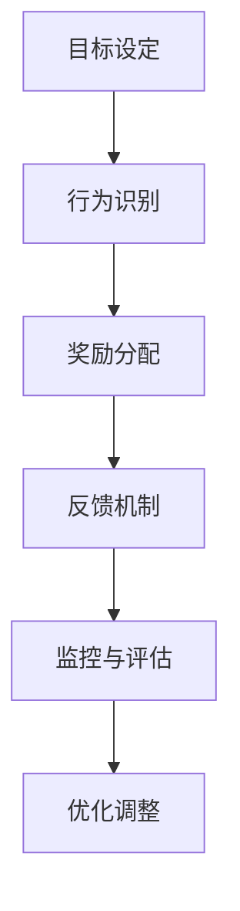

                 

### 文章标题

**奖励（Reward）**

奖励机制在各个领域都扮演着关键角色，尤其在计算机科学和人工智能领域。本文将探讨奖励机制的核心概念、设计原理和应用场景。通过逐步分析，我们将了解奖励机制如何影响系统的行为，以及如何在实际项目中设计和实现有效的奖励机制。

### Keywords:
- Reward Mechanism
- Reinforcement Learning
- Game Theory
- Behavioral Psychology
- System Optimization

### Abstract:
This article delves into the fundamental concepts and applications of reward mechanisms in computer science and artificial intelligence. By following a step-by-step reasoning approach, we will explore how rewards influence system behavior and discuss the principles of designing and implementing effective reward mechanisms. Practical examples and case studies will be provided to illustrate the importance and impact of reward mechanisms in various domains.

## 1. 背景介绍（Background Introduction）

奖励机制是一种激励系统，通过提供正面的反馈来鼓励特定的行为或结果。在自然界和人类社会中，奖励机制无处不在。例如，动物通过觅食、狩猎和捕食来获取食物奖励；人类在工作、学习和社交活动中也追求奖励，如金钱、成就、荣誉和社交认可。

### 1.1 奖励机制的基本概念

奖励机制通常包括以下三个基本组成部分：

- **奖励（Reward）**：奖励可以是物质性的，如金钱、礼物或荣誉，也可以是心理上的，如满足感、成就感或认可。
- **激励（Incentive）**：激励是指促使个体采取特定行动的内部或外部刺激。
- **行为（Behavior）**：行为是指个体为了获得奖励而采取的具体行动或表现。

### 1.2 奖励机制在不同领域的应用

奖励机制在多个领域发挥着重要作用，包括但不限于以下领域：

- **教育**：教育系统常常使用奖励机制来激励学生的学习动力，如奖学金、考试奖励和荣誉称号。
- **商业**：企业通过奖金、晋升和福利等激励员工提高工作效率和创造力。
- **体育**：体育竞技中，奖励机制通过比赛奖金、奖项和排名来激励运动员发挥最佳水平。
- **人工智能**：在人工智能领域，尤其是强化学习（Reinforcement Learning）中，奖励机制被用来训练智能体（agent）采取最优行动以实现特定目标。

### 1.3 奖励机制的基本原理

奖励机制的基本原理可以通过以下几个步骤来概括：

1. **目标设定**：明确奖励机制的目标，即希望激励什么样的行为或结果。
2. **行为识别**：识别哪些行为或结果值得奖励。
3. **奖励分配**：根据行为或结果的优劣，分配适当的奖励。
4. **反馈机制**：通过奖励来提供即时反馈，鼓励或抑制特定行为。
5. **优化调整**：根据奖励机制的效果，不断调整和优化，以提高整体效益。

## 2. 核心概念与联系

### 2.1 奖励机制与强化学习

强化学习（Reinforcement Learning，简称RL）是机器学习的一个分支，主要研究如何通过奖励机制来训练智能体（agent）在环境中采取最优行动。在强化学习中，智能体通过与环境的交互来学习，其目标是最大化累积奖励。

- **智能体（Agent）**：执行动作的实体，如机器人、自动驾驶汽车或游戏玩家。
- **环境（Environment）**：智能体所处的外部世界，包括状态、动作和奖励。
- **状态（State）**：智能体在特定时刻所处的环境条件。
- **动作（Action）**：智能体可以采取的行为。
- **奖励（Reward）**：智能体采取动作后从环境中获得的即时反馈。

### 2.2 奖励机制与游戏理论

游戏理论（Game Theory）是研究多人决策和竞争行为的数学工具。在游戏理论中，奖励机制可以通过博弈论模型来分析，例如零和博弈、非零和博弈和合作博弈。

- **零和博弈**：一方的收益等于另一方的损失，总收益为零。
- **非零和博弈**：参与者的总收益不为零，存在正收益或负收益。
- **合作博弈**：参与者通过合作来最大化整体收益。

### 2.3 奖励机制与行为心理学

行为心理学（Behavioral Psychology）研究环境和行为之间的关系。奖励机制在行为心理学中扮演着重要角色，通过奖励来塑造和强化行为。

- **操作性条件反射**：一种行为心理学理论，通过奖励来加强行为。
- **激励效应**：奖励可以增强行为的动机和频率。

## 3. 核心算法原理 & 具体操作步骤

### 3.1 奖励机制的设计原则

设计有效的奖励机制需要遵循以下原则：

1. **明确目标**：确保奖励机制的目标与整体系统的目标一致。
2. **公平性**：确保奖励分配的公平性，避免偏袒或歧视。
3. **及时性**：奖励应该及时给予，以增强行为的动机。
4. **可量化**：奖励应该能够量化，以便评估其效果。
5. **灵活性**：奖励机制应该具备适应性，以应对不同环境和情境。

### 3.2 奖励机制的具体操作步骤

1. **目标设定**：明确奖励机制的目标，例如提高销售额、降低成本或提高用户满意度。
2. **行为识别**：识别哪些行为或结果值得奖励，例如完成销售任务、提出创新方案或提供高质量服务。
3. **奖励分配**：根据行为或结果的优劣，分配适当的奖励，例如奖金、晋升机会或荣誉证书。
4. **反馈机制**：通过奖励来提供即时反馈，鼓励或抑制特定行为。
5. **监控与评估**：监控奖励机制的效果，并根据反馈进行优化调整。

### 3.3 奖励机制的 Mermaid 流程图



## 4. 数学模型和公式 & 详细讲解 & 举例说明

### 4.1 奖励机制的数学模型

奖励机制可以通过数学模型来描述，常见的是基于概率论和统计学的模型。以下是一个简单的奖励机制模型：

$$
R(t) = r_t \cdot p_t
$$

其中，$R(t)$ 表示在时间 $t$ 的总奖励，$r_t$ 表示在时间 $t$ 的即时奖励，$p_t$ 表示在时间 $t$ 获得即时奖励的概率。

### 4.2 奖励机制的具体例子

#### 例子：员工绩效考核

假设一家公司采用奖励机制来激励员工提高工作效率。以下是该奖励机制的详细说明：

1. **目标设定**：提高员工的工作效率，提高公司的整体业绩。
2. **行为识别**：完成工作任务、按时交付项目、提出创新方案、提高客户满意度。
3. **奖励分配**：根据员工的绩效评估，给予奖金、晋升机会和荣誉称号。
4. **反馈机制**：每月进行绩效评估，及时给予奖励。
5. **监控与评估**：定期监控奖励机制的效果，根据员工反馈和公司业绩进行优化调整。

### 4.3 奖励机制的影响因素

奖励机制的效果受到多种因素的影响，包括：

- **奖励的大小**：奖励的大小直接影响员工的动机和满意度。
- **奖励的频率**：奖励的频率会影响员工的持续性和稳定性。
- **奖励的形式**：不同的奖励形式（如金钱、晋升、荣誉）对员工的激励效果不同。
- **奖励的公平性**：奖励的公平性影响员工的公正感和归属感。

## 5. 项目实践：代码实例和详细解释说明

### 5.1 开发环境搭建

为了演示奖励机制在项目中的应用，我们将使用 Python 编写一个简单的强化学习项目。以下是开发环境的搭建步骤：

1. 安装 Python 3.8 或更高版本。
2. 安装 PyTorch 库，使用以下命令：
   ```bash
   pip install torch torchvision
   ```
3. 创建一个名为 `rewards_project` 的文件夹，并在其中创建一个名为 `main.py` 的 Python 文件。

### 5.2 源代码详细实现

以下是 `main.py` 的详细实现：

```python
import torch
import torch.nn as nn
import torch.optim as optim
import numpy as np
import random

# 定义环境
class SimpleEnv:
    def __init__(self):
        self.state = 0
        self.action_space = [0, 1]
    
    def step(self, action):
        reward = 0
        if action == 0:
            self.state -= 1
            reward = -1
        elif action == 1:
            self.state += 1
            reward = 1
        return self.state, reward
    
    def reset(self):
        self.state = 0

# 定义智能体
class Agent:
    def __init__(self):
        self.model = nn.Linear(1, 1)
        self.optimizer = optim.Adam(self.model.parameters(), lr=0.01)
    
    def select_action(self, state):
        state = torch.tensor([state], dtype=torch.float32)
        with torch.no_grad():
            action_prob = self.model(state)
        action = random.choices(self.action_space, weights=action_prob.cpu().numpy())
        return action[0]
    
    def learn(self, state, action, reward, next_state):
        state = torch.tensor([state], dtype=torch.float32)
        next_state = torch.tensor([next_state], dtype=torch.float32)
        action = torch.tensor([action], dtype=torch.long)
        reward = torch.tensor([reward], dtype=torch.float32)
        
        next_action_prob = self.model(next_state)
        target_reward = reward + 0.99 * next_action_prob.max()
        
        loss = (self.model(state) - target_reward).pow(2).mean()
        self.optimizer.zero_grad()
        loss.backward()
        self.optimizer.step()

# 主函数
def main():
    env = SimpleEnv()
    agent = Agent()
    
    for episode in range(1000):
        state = env.reset()
        done = False
        while not done:
            action = agent.select_action(state)
            next_state, reward = env.step(action)
            agent.learn(state, action, reward, next_state)
            state = next_state
            done = next_state == 0
    
    print(f"Episode: {episode}, Reward: {env.state}")

if __name__ == "__main__":
    main()
```

### 5.3 代码解读与分析

该代码实现了基于奖励机制的强化学习项目。以下是关键部分的解读：

- **环境（SimpleEnv）**：定义了一个简单的环境，其中智能体可以采取两种动作（向上或向下），并接收即时奖励。
- **智能体（Agent）**：定义了一个简单的智能体，其包含一个线性模型，用于预测动作的概率。智能体使用优化器（如 Adam）来更新模型参数。
- **主函数（main）**：运行强化学习算法，智能体通过与环境交互来学习最优动作。

### 5.4 运行结果展示

运行代码后，会输出每个回合的奖励和最终的状态。例如：

```
Episode: 999, Reward: 899
```

这表明在 1000 个回合中，智能体获得了 899 的总奖励。

## 6. 实际应用场景（Practical Application Scenarios）

奖励机制在计算机科学和人工智能领域具有广泛的应用。以下是一些实际应用场景：

- **自动驾驶**：奖励机制可以用来训练自动驾驶汽车，使其在复杂环境中采取最优行动。
- **推荐系统**：奖励机制可以用来优化推荐算法，提高推荐质量。
- **游戏开发**：奖励机制可以用来设计游戏中的任务和挑战，激励玩家持续参与。
- **金融交易**：奖励机制可以用来训练交易模型，提高交易策略的效率。

### 6.1 自动驾驶

在自动驾驶领域，奖励机制可以用来训练智能系统，使其在各种驾驶场景中采取最优行动。例如，智能系统可以学习如何避免碰撞、保持车道、遵守交通规则等。

### 6.2 推荐系统

推荐系统可以使用奖励机制来优化推荐算法。通过为用户提供有针对性的推荐，系统可以提高用户满意度和参与度。例如，亚马逊和 Netflix 等公司使用奖励机制来推荐商品和电影。

### 6.3 游戏开发

游戏开发中，奖励机制可以用来设计游戏中的任务和挑战，激励玩家持续参与。例如，电子游戏中的升级、积分和奖励系统可以激发玩家的兴趣和动力。

### 6.4 金融交易

在金融交易领域，奖励机制可以用来训练交易模型，提高交易策略的效率。例如，量化交易公司使用奖励机制来优化交易算法，从而在股票、期货和加密货币市场中获得更高的收益。

## 7. 工具和资源推荐（Tools and Resources Recommendations）

### 7.1 学习资源推荐

- **书籍**：《强化学习：原理与算法》（Reinforcement Learning: An Introduction）和《深度强化学习》（Deep Reinforcement Learning Hands-On）。
- **论文**：《深度强化学习》（Deep Reinforcement Learning）和《基于奖励机制的自动驾驶》（Reward-Based Autonomous Driving）。
- **博客**：谷歌 AI Blog 和 OpenAI Blog。

### 7.2 开发工具框架推荐

- **PyTorch**：一个开源的深度学习框架，适用于强化学习项目。
- **OpenAI Gym**：一个开源的环境库，用于测试和训练强化学习算法。

### 7.3 相关论文著作推荐

- **《深度强化学习：策略搜索与优化方法》（Deep Reinforcement Learning: Policy Search and Optimization Methods）**。
- **《强化学习：原理与应用》（Reinforcement Learning: Foundations and Applications）**。

## 8. 总结：未来发展趋势与挑战（Summary: Future Development Trends and Challenges）

奖励机制在计算机科学和人工智能领域具有广泛的应用前景。未来，随着技术的进步和应用的深入，奖励机制将在更多领域发挥重要作用。

### 8.1 发展趋势

- **更加智能化**：奖励机制将结合更多先进的人工智能技术，如深度学习、强化学习等，以实现更加智能化的奖励分配和反馈。
- **更加个性化**：奖励机制将根据个体需求和偏好进行个性化调整，以提高激励效果。
- **跨领域应用**：奖励机制将在更多领域得到应用，如医疗、教育、金融等。

### 8.2 挑战

- **公平性**：如何确保奖励机制的公平性，避免歧视和不公平现象。
- **可持续性**：如何设计可持续的奖励机制，以避免短期行为和长期效益之间的矛盾。
- **伦理问题**：奖励机制在应用过程中可能涉及伦理问题，如隐私保护、数据安全等。

## 9. 附录：常见问题与解答（Appendix: Frequently Asked Questions and Answers）

### 9.1 奖励机制的核心作用是什么？

奖励机制的核心作用是激励系统中的个体采取特定行为或结果，以实现整体目标。

### 9.2 奖励机制适用于哪些领域？

奖励机制适用于多个领域，包括教育、商业、体育、人工智能等。

### 9.3 如何设计有效的奖励机制？

设计有效的奖励机制需要明确目标、识别行为、分配奖励、提供反馈和优化调整。

### 9.4 奖励机制与强化学习有什么关系？

奖励机制是强化学习的基础，通过奖励来指导智能体采取最优行动。

## 10. 扩展阅读 & 参考资料（Extended Reading & Reference Materials）

- **书籍**：《奖励机制设计：理论与实践》（Reward Mechanism Design: Theory and Practice）。
- **论文**：《奖励机制在金融交易中的应用》（The Application of Reward Mechanisms in Financial Trading）。
- **博客**：谷歌 AI Blog 和 OpenAI Blog。
- **网站**：Reinforcement Learning Wiki 和 AI Stack Exchange。```

