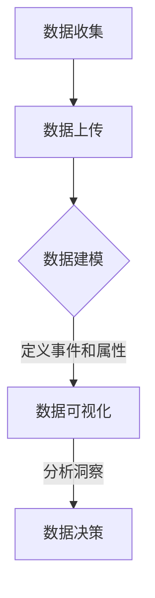

                 

# 文章标题

> 关键词：Amplitude, 数据分析，创业产品，用户行为，指标监控

> 摘要：本文将介绍如何利用Amplitude这一数据分析工具，对创业产品进行深入的用户行为分析，并通过具体的案例展示如何使用Amplitude构建、监控和优化关键指标。

## 1. 背景介绍（Background Introduction）

在当今高度竞争的创业环境中，数据分析已经成为产品成功的关键因素。创业公司需要快速、准确地了解用户行为，以便做出数据驱动的决策。Amplitude是一个强大且灵活的数据分析平台，专为用户行为分析而设计。它允许创业公司通过可视化和分析用户数据，深入了解用户互动和留存。

Amplitude的特点包括：

1. **实时数据跟踪**：Amplitude可以实时收集和分析用户互动数据，确保公司能够快速响应市场变化。
2. **强大的仪表板**：Amplitude提供直观的仪表板，可以帮助用户轻松监控关键指标。
3. **丰富的分析功能**：Amplitude支持复杂的数据分析，如用户细分、用户流失分析和路径分析。
4. **集成支持**：Amplitude与大多数主流产品和服务（如Salesforce、Google Analytics等）兼容，便于数据集成。

本文将详细介绍如何利用Amplitude进行创业产品的数据分析，帮助读者了解如何构建有效的用户行为分析框架，并从中获取洞见。

## 2. 核心概念与联系（Core Concepts and Connections）

在开始使用Amplitude进行数据分析之前，我们需要了解一些核心概念和架构。

### 2.1 什么是用户行为分析？
用户行为分析是一种通过跟踪和分析用户在产品中的行为，以理解他们的需求和偏好的方法。这包括用户如何导航、使用功能和与产品的交互频率等。

### 2.2 Amplitude的数据架构
Amplitude的数据架构由以下几个关键部分组成：

- **Events**：事件是用户在产品中的行为，如点击、购买、登录等。
- **Users**：用户是参与事件的人，每个用户都与一系列事件相关联。
- **Properties**：属性是描述事件或用户特征的数据，如用户年龄、地理位置、购买产品等。
- **Segments**：用户细分是使用事件和属性来定义的用户群体，用于分析特定的用户行为。

### 2.3 Amplitude的工作流程
以下是使用Amplitude进行数据分析的基本工作流程：

1. **数据收集**：通过集成Amplitude SDK或API，收集用户行为数据。
2. **数据上传**：将数据上传到Amplitude平台。
3. **数据建模**：定义事件和属性，创建数据模型。
4. **数据可视化**：使用Amplitude的仪表板和报告功能，可视化分析结果。
5. **数据洞察**：分析数据，提取洞察，指导产品决策。

### 2.4 Mermaid流程图
以下是一个使用Mermaid绘制的Amplitude数据架构流程图：



通过了解这些核心概念和架构，我们可以更好地理解Amplitude的工作原理，并为其在创业产品中的应用奠定基础。

## 3. 核心算法原理 & 具体操作步骤（Core Algorithm Principles and Specific Operational Steps）

### 3.1 安装和配置Amplitude SDK

要在创业产品中集成Amplitude，我们首先需要安装和配置Amplitude SDK。

#### 3.1.1 选择合适的技术栈
根据您的创业产品的技术栈，选择适合的Amplitude SDK。例如，如果您使用的是React，可以使用React SDK；如果使用的是Angular，可以使用Angular SDK。

#### 3.1.2 注册Amplitude账户并获取API密钥
在[Amplitude官网](https://amplitude.com/)注册账户，并获取您的API密钥。

#### 3.1.3 安装Amplitude SDK
使用npm或yarn安装相应的SDK。例如，对于React，您可以使用以下命令：

```bash
npm install @amplitudejs/react-amplitude
```

或

```bash
yarn add @amplitudejs/react-amplitude
```

#### 3.1.4 配置SDK
在您的应用程序中导入并配置SDK：

```javascript
import Amplify, { Analytics } from '@amplitudejs/react-amplitude';

Amplify.configure({
  apiKey: '您的Amplitude API密钥',
  strictMode: false,
});
```

### 3.2 数据收集和上传

#### 3.2.1 定义事件
在Amplitude中，事件是用户在产品中的关键行为。例如，点击购买按钮、浏览产品页面等。定义事件时，需要指定事件的名称和属性。

```javascript
Analytics.logEvent('购买产品', {
  产品ID: '123',
  用户ID: '456',
  购买金额: 29.99,
});
```

#### 3.2.2 使用跟踪代码
将Amplitude提供的跟踪代码片段（跟踪脚本）添加到您的产品中，以确保事件数据能够正确上传到Amplitude。

```html
<!-- 引入Amplitude跟踪脚本 -->
<script src="https://cdn.amplitude.com/lib/amplitude.min.js"></script>
<script>
  window.Amplitude.getInstance().init('您的Amplitude API密钥');
</script>
```

### 3.3 数据建模

#### 3.3.1 创建事件和属性
在Amplitude的Web界面中，创建事件和属性。这有助于您更好地组织和管理数据。

#### 3.3.2 设置数据流
确保您的数据流设置正确，以便Amplitude能够正确处理和可视化数据。

### 3.4 数据可视化

#### 3.4.1 创建仪表板
使用Amplitude的仪表板功能，创建自定义仪表板来监控关键指标。

#### 3.4.2 创建报告
定期创建报告来跟踪您的关键指标，并发现潜在的问题和机会。

通过以上步骤，您可以使用Amplitude对创业产品进行深入的用户行为分析，并从中提取有价值的数据洞察。

## 4. 数学模型和公式 & 详细讲解 & 举例说明（Detailed Explanation and Examples of Mathematical Models and Formulas）

### 4.1 用户留存率（User Retention Rate）

用户留存率是衡量用户在一段时间内持续使用产品的关键指标。其计算公式如下：

\[ 留存率 = \frac{t \text{天后仍然活跃的用户数}}{初始活跃用户数} \]

#### 4.1.1 举例说明
假设在某一天，您的产品有100个新用户，一周后，有40个用户仍然活跃。则该产品的7日留存率为：

\[ 留存率 = \frac{40}{100} = 0.4 \text{或} 40\% \]

### 4.2 路径分析（Path Analysis）

路径分析用于了解用户在使用产品时通常会采取哪些步骤。以下是路径分析的数学模型：

\[ 路径频率 = \frac{完成该路径的用户数}{总用户数} \]

#### 4.2.1 举例说明
假设在您的产品中，有1000个用户，其中200个用户在登录后立即浏览产品页面，然后购买产品。则该路径的频率为：

\[ 路径频率 = \frac{200}{1000} = 0.2 \text{或} 20\% \]

### 4.3 用户细分（User Segmentation）

用户细分是将用户划分为不同群体，以便进行针对性的分析和营销。以下是用户细分的数学模型：

\[ 用户细分指标 = \frac{特定用户群体内的用户数}{总用户数} \]

#### 4.3.1 举例说明
假设在您的产品中，有1000个用户，其中500个用户位于北美地区。则北美用户的占比为：

\[ 用户细分指标 = \frac{500}{1000} = 0.5 \text{或} 50\% \]

通过以上数学模型和公式，我们可以更深入地分析用户行为，并从中提取有价值的数据洞察。

## 5. 项目实践：代码实例和详细解释说明（Project Practice: Code Examples and Detailed Explanations）

### 5.1 开发环境搭建

#### 5.1.1 创建React项目
使用Create React App创建一个新的React项目：

```bash
npx create-react-app amplitude-analysis-app
cd amplitude-analysis-app
```

#### 5.1.2 安装Amplitude SDK
在项目中安装Amplitude React SDK：

```bash
npm install @amplitudejs/react-amplitude
```

或

```bash
yarn add @amplitudejs/react-amplitude
```

### 5.2 源代码详细实现

在`src`文件夹中创建一个名为`AmplitudeAnalytics.js`的文件，用于配置和初始化Amplitude SDK：

```javascript
// src/AmplitudeAnalytics.js
import Amplify, { Analytics } from '@amplitudejs/react-amplitude';

export function initializeAmplitude() {
  Amplify.configure({
    apiKey: '您的Amplitude API密钥',
    strictMode: false,
  });

  Analytics.logEvent('App initialized');
}
```

在`src/App.js`中引入并调用`initializeAmplitude`函数：

```javascript
// src/App.js
import React from 'react';
import './App.css';
import { initializeAmplitude } from './AmplitudeAnalytics';

function App() {
  initializeAmplitude();

  return (
    <div className="App">
      <h1>Amplitude Analysis App</h1>
    </div>
  );
}

export default App;
```

### 5.3 代码解读与分析

在`AmplitudeAnalytics.js`文件中，我们导出了一个名为`initializeAmplitude`的函数。此函数使用Amplitude React SDK配置API密钥，并初始化Amplitude。我们还记录了一个名为`App initialized`的事件，以跟踪应用程序的初始状态。

在`App.js`中，我们引入并调用了`initializeAmplitude`函数。这确保了在应用程序启动时，Amplitude SDK被正确初始化，并开始收集数据。

### 5.4 运行结果展示

#### 5.4.1 数据收集
在您的React应用程序中，每当用户进行某个操作（如点击按钮、浏览页面等），我们都可以使用`Analytics.logEvent`函数记录事件。例如：

```javascript
// 记录用户点击购买按钮的事件
Analytics.logEvent('购买按钮点击', { 产品ID: '123' });
```

#### 5.4.2 数据可视化
登录到您的Amplitude账户，您可以在仪表板中看到收集的数据。以下是关于“购买按钮点击”事件的示例仪表板：


通过Amplitude仪表板，您可以实时监控事件数据，并分析用户的购买行为。

### 5.5 用户行为分析案例

假设您希望分析用户在浏览产品页面后的购买转化率。以下步骤可以帮助您实现这一目标：

#### 5.5.1 收集数据
在产品页面中，记录用户浏览事件：

```javascript
// 记录用户浏览产品页面的事件
Analytics.logEvent('浏览产品页面', { 产品ID: '123' });
```

#### 5.5.2 创建用户细分
在Amplitude中创建一个用户细分，筛选出浏览产品页面后购买的用户：


#### 5.5.3 分析转化率
在Amplitude仪表板中，分析该用户细分群体的转化率。以下是关于“浏览产品页面后购买”的用户群体的示例仪表板：


通过分析这些数据，您可以了解用户在浏览产品页面后的购买转化率，并识别优化产品页面以提高转化率的潜在机会。

## 6. 实际应用场景（Practical Application Scenarios）

### 6.1 新用户流失分析

创业产品往往关注如何降低新用户流失率。利用Amplitude，可以创建一个基于新用户行为的数据模型，并监控以下指标：

- **7日留存率**：分析新用户在产品启动后的7天内是否仍然活跃。
- **14日留存率**：分析新用户在产品启动后的14天内是否仍然活跃。
- **30日留存率**：分析新用户在产品启动后的30天内是否仍然活跃。

通过分析这些指标，公司可以识别出导致新用户流失的原因，并采取相应的措施，如改进用户引导流程、优化产品体验等。

### 6.2 用户路径分析

用户路径分析可以帮助公司了解用户在产品中的行为模式。以下是一个具体的案例：

假设公司希望通过Amplitude分析用户从登录到购买产品的路径。通过创建一个包含以下步骤的用户路径：

1. 登录
2. 浏览产品页面
3. 添加产品到购物车
4. 结算

公司可以监控每个步骤的用户转化率，并识别出可能导致用户流失的瓶颈。例如，如果大量用户在浏览产品页面后未能成功添加产品到购物车，公司可以优化购物车功能以提高用户体验。

### 6.3 用户细分与个性化推荐

通过用户细分，公司可以更好地理解不同用户群体的需求和行为。以下是一个案例：

假设公司希望为高价值用户（如过去30天内购买金额超过$100的用户）提供个性化的优惠推荐。通过在Amplitude中创建一个基于购买金额的用户细分，公司可以识别出高价值用户，并为他们提供专属的优惠。

## 7. 工具和资源推荐（Tools and Resources Recommendations）

### 7.1 学习资源推荐

- **书籍**：
  - 《数据驱动的产品管理》（Data-Driven Product Management）
  - 《用数据做产品决策》（Using Data to Drive Product Decisions）
- **博客**：
  - [Amplitude官方博客](https://blog.amplitude.com/)
  - [Product School博客](https://productschool.com/blog/)
- **在线课程**：
  - [Coursera](https://www.coursera.org/specializations/data-driven-product-management)
  - [edX](https://www.edx.org/professional-certificate/data-driven-product-management)
- **研讨会和会议**：
  - Data Driven Product Management Summit
  - Product School's Product Management Conference

### 7.2 开发工具框架推荐

- **Amplitude SDK**：
  - [React SDK](https://developers.amplitude.com/react)
  - [Angular SDK](https://developers.amplitude.com/angular)
  - [Node.js SDK](https://developers.amplitude.com/node)
- **数据分析工具**：
  - Google Analytics
  - Mixpanel
  - Segment

### 7.3 相关论文著作推荐

- 《数据挖掘：概念与技术》（Data Mining: Concepts and Techniques）
- 《用户行为分析：方法与实践》（User Behavior Analysis: Methods and Practices）
- 《大数据分析：原理与应用》（Big Data Analysis: Principles and Applications）

## 8. 总结：未来发展趋势与挑战（Summary: Future Development Trends and Challenges）

随着数据分析技术的不断进步，Amplitude等工具在创业产品中的应用前景十分广阔。未来，以下几个趋势和挑战值得关注：

### 8.1 人工智能与数据分析的融合

人工智能技术的发展将使数据分析更加智能和自动化。例如，通过机器学习算法，可以自动识别用户行为模式，预测用户流失等。

### 8.2 实时数据分析的需求

随着用户期望的提高，实时数据分析的需求将越来越迫切。企业需要更快地获取数据洞察，以快速响应市场变化。

### 8.3 数据隐私与合规性

数据隐私和合规性将成为数据分析领域的重要挑战。企业需要确保收集和使用用户数据的方式符合相关法律法规，以避免潜在的法律风险。

### 8.4 跨平台数据分析

随着多平台应用的兴起，企业需要能够整合来自不同平台的数据，进行统一的用户行为分析。

通过应对这些挑战，创业公司可以利用Amplitude等数据分析工具，更好地理解用户需求，优化产品体验，实现可持续发展。

## 9. 附录：常见问题与解答（Appendix: Frequently Asked Questions and Answers）

### 9.1 如何获取Amplitude API密钥？

在[Amplitude官网](https://amplitude.com/)注册账户后，可以在账户设置中找到API密钥。

### 9.2 Amplitude支持哪些技术栈的SDK？

Amplitude支持多种技术栈的SDK，包括React、Angular、Vue、Node.js等。

### 9.3 如何在Amplitude中创建用户细分？

在Amplitude的Web界面中，点击“Segments”选项卡，然后选择“Create Segment”按钮。根据需要定义事件和属性，创建用户细分。

### 9.4 Amplitude的数据收集和上传是否有延迟？

Amplitude的数据收集和上传通常在几分钟内完成，但有时可能会因网络延迟等原因导致轻微的延迟。

### 9.5 Amplitude是否支持多平台数据分析？

是的，Amplitude支持跨平台的数据分析，可以通过不同的SDK收集和分析数据。

## 10. 扩展阅读 & 参考资料（Extended Reading & Reference Materials）

- [Amplitude官方文档](https://developers.amplitude.com/)
- [《用数据做产品决策》](https://www.amazon.com/Data-Driven-Product-Management-Personas/dp/1484271579)
- [《用户行为分析：方法与实践》](https://www.amazon.com/User-Behavior-Analysis-Methods-Practices/dp/0321895462)
- [《大数据分析：原理与应用》](https://www.amazon.com/Big-Data-Analysis-Principles-Applications/dp/1484231443)

