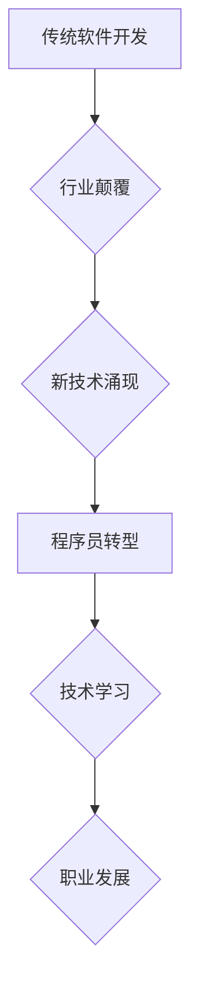

                 

## 程序员如何应对行业颠覆与新技术浪潮

> 关键词：人工智能、机器学习、云计算、区块链、程序员转型、技术学习、职业发展、未来趋势、行业颠覆

## 1. 背景介绍

科技发展日新月异，程序员这个职业也面临着前所未有的挑战和机遇。新兴技术如人工智能、机器学习、云计算、区块链等不断涌现，颠覆着传统的软件开发模式，也为程序员带来了新的发展方向。面对如此快速变化的行业环境，程序员需要不断学习和提升，才能保持竞争力，迎接未来的挑战。

### 1.1  行业颠覆的浪潮

近年来，我们目睹了互联网、移动互联网、大数据等技术的快速发展，这些技术带来的颠覆性改变，也深刻地影响着软件开发行业。传统的软件开发模式面临着挑战，例如：

* **自动化测试和部署:**  自动化工具和平台的普及，降低了人工测试和部署的成本和时间，对传统测试和部署人员提出了新的要求。
* **云计算的崛起:** 云计算平台提供了弹性、可扩展的计算资源，改变了软件开发的部署方式，也促进了容器化和微服务架构的应用。
* **人工智能的渗透:** 人工智能技术在软件开发中扮演越来越重要的角色，例如代码生成、代码审查、自动化测试等，对程序员的工作方式和技能提出了新的挑战。

### 1.2  新技术带来的机遇

尽管行业颠覆带来了挑战，但也为程序员带来了新的机遇。新兴技术的发展，为程序员提供了新的学习和发展方向，例如：

* **人工智能领域:**  机器学习、深度学习等人工智能技术正在快速发展，对程序员的需求量不断增加，例如数据科学家、机器学习工程师等。
* **云计算领域:** 云计算平台的建设和维护需要大量的程序员，例如云平台开发工程师、云安全工程师等。
* **区块链领域:** 区块链技术正在改变金融、供应链、医疗等多个领域的运作模式，对程序员的需求量也在不断增长，例如区块链开发工程师、智能合约开发工程师等。

## 2. 核心概念与联系

程序员应对行业颠覆与新技术浪潮的关键在于理解新技术背后的核心概念，并将其与自身工作实践相结合。

**2.1  人工智能 (AI)**

人工智能是指模拟人类智能的计算机系统。它涵盖了多个领域，例如机器学习、深度学习、自然语言处理、计算机视觉等。

**2.2  机器学习 (ML)**

机器学习是人工智能的一个子领域，它通过算法训练模型，使模型能够从数据中学习，并做出预测或决策。

**2.3  深度学习 (DL)**

深度学习是机器学习的一个子领域，它使用多层神经网络来模拟人类大脑的学习过程，能够处理更复杂的数据，并取得更优的性能。

**2.4  云计算 (Cloud Computing)**

云计算是指通过互联网提供计算资源、存储资源、网络资源等服务。它提供了弹性、可扩展、按需付费的计算资源，改变了传统的软件开发模式。

**2.5  区块链 (Blockchain)**

区块链是一种分布式账本技术，它可以记录和验证交易信息，并确保数据的安全性和不可篡改性。

**2.6  程序员转型**

面对行业颠覆和新技术浪潮，程序员需要不断学习和提升，才能保持竞争力。程序员转型是指程序员根据自身技能和兴趣，转向新的技术领域或职业方向。

**2.7  技术学习**

程序员需要不断学习新技术，才能跟上行业发展步伐。技术学习可以包括在线课程、书籍、研讨会、实践项目等多种形式。

**2.8  职业发展**

程序员需要规划自己的职业发展路径，并不断提升自身技能和经验，才能在竞争激烈的行业中脱颖而出。

**Mermaid 流程图**

## 3. 核心算法原理 & 具体操作步骤

### 3.1  算法原理概述

选择一个新兴技术领域的核心算法进行讲解，例如机器学习中的梯度下降算法。

**梯度下降算法**是一种迭代算法，用于最小化函数值。它通过不断更新参数，朝着函数梯度的反方向移动，最终找到函数的最小值。

### 3.2  算法步骤详解

1. **初始化参数:**  随机选择初始参数值。
2. **计算梯度:**  计算目标函数对参数的梯度。
3. **更新参数:**  根据梯度方向和学习率，更新参数值。
4. **重复步骤2-3:**  重复步骤2-3，直到参数收敛或达到最大迭代次数。

### 3.3  算法优缺点

**优点:**

* 简单易懂，易于实现。
* 能够找到函数的局部最小值。

**缺点:**

* 容易陷入局部最小值。
* 学习率的选择对收敛速度和结果有很大影响。

### 3.4  算法应用领域

梯度下降算法广泛应用于机器学习领域，例如：

* 线性回归
* Logistic回归
* 神经网络训练

## 4. 数学模型和公式 & 详细讲解 & 举例说明

### 4.1  数学模型构建

选择一个与核心算法相关的数学模型进行构建，例如梯度下降算法的数学模型。

**梯度下降算法的数学模型:**

$$
\theta_{t+1} = \theta_t - \alpha \nabla J(\theta_t)
$$

其中:

* $\theta$ 是参数向量。
* $t$ 是迭代次数。
* $\alpha$ 是学习率。
* $\nabla J(\theta_t)$ 是目标函数 $J(\theta)$ 在当前参数 $\theta_t$ 处的梯度。

### 4.2  公式推导过程

详细推导梯度下降算法的数学模型，解释每个变量的含义和作用。

### 4.3  案例分析与讲解

使用一个具体的例子，例如线性回归模型的梯度下降算法训练过程，来解释公式的应用和效果。

## 5. 项目实践：代码实例和详细解释说明

### 5.1  开发环境搭建

介绍项目所需的开发环境，例如 Python、TensorFlow 等。

### 5.2  源代码详细实现

提供一个使用梯度下降算法训练线性回归模型的 Python 代码实例，并进行详细的解释。

### 5.3  代码解读与分析

对代码进行逐行解读，解释每个代码块的功能和作用。

### 5.4  运行结果展示

展示代码运行的结果，例如模型的训练曲线、预测结果等。

## 6. 实际应用场景

### 6.1  机器学习应用场景

介绍梯度下降算法在机器学习领域的实际应用场景，例如图像识别、自然语言处理、推荐系统等。

### 6.2  其他应用场景

介绍梯度下降算法在其他领域的应用场景，例如优化问题、控制系统等。

### 6.3  未来应用展望

展望梯度下降算法在未来可能的发展方向和应用场景。

## 7. 工具和资源推荐

### 7.1  学习资源推荐

推荐一些学习人工智能、机器学习、深度学习的在线课程、书籍、网站等资源。

### 7.2  开发工具推荐

推荐一些用于开发人工智能、机器学习项目的开发工具，例如 Python、TensorFlow、PyTorch 等。

### 7.3  相关论文推荐

推荐一些与梯度下降算法相关的学术论文。

## 8. 总结：未来发展趋势与挑战

### 8.1  研究成果总结

总结梯度下降算法的研究成果，包括算法的改进、应用领域的扩展等。

### 8.2  未来发展趋势

展望梯度下降算法的未来发展趋势，例如算法的效率提升、应用场景的拓展等。

### 8.3  面临的挑战

分析梯度下降算法面临的挑战，例如局部最小值问题、参数选择问题等。

### 8.4  研究展望

展望梯度下降算法未来的研究方向，例如如何解决算法的局限性、如何将其应用于更复杂的问题等。

## 9. 附录：常见问题与解答

解答一些关于梯度下降算法的常见问题，例如如何选择学习率、如何避免陷入局部最小值等。

作者：禅与计算机程序设计艺术 / Zen and the Art of Computer Programming 
<end_of_turn>

