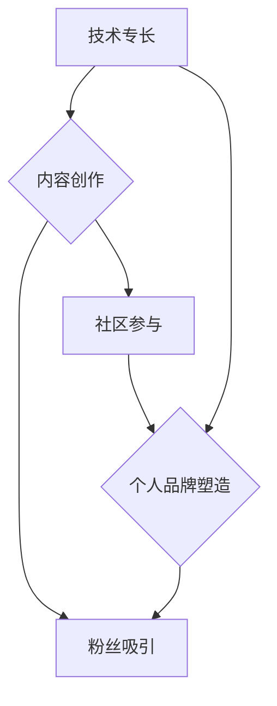

                 

## 程序员如何打造个人IP吸引粉丝

> 关键词：个人IP，程序员，粉丝，内容创作，品牌建设，社区运营，技术博客，开源项目

### 1. 背景介绍

在当今科技飞速发展的时代，程序员作为数字时代的基石，拥有着巨大的影响力和价值。然而，随着编程人才的日益增多，如何脱颖而出，建立个人品牌，吸引粉丝，成为许多程序员共同面临的挑战。打造个人IP（个人品牌）已成为程序员职业发展的重要趋势，它不仅能提升个人影响力，还能带来更多机遇和资源。

### 2. 核心概念与联系

**2.1 个人IP的概念**

个人IP是指个人在特定领域或行业内积累的独特声誉、认知度和影响力。它是一种基于个人特长、经验和价值观的品牌资产，能够帮助个人在竞争激烈的环境中脱颖而出，建立信任和忠诚度。

**2.2 程序员个人IP的构建**

程序员个人IP的构建，本质上是将个人技术能力、专业知识、创作热情和个人魅力转化为可感知的品牌价值。它需要程序员在以下几个方面进行努力：

* **技术专长:** 持续学习和掌握前沿技术，成为某个领域的专家。
* **内容创作:** 通过博客、视频、开源项目等方式输出高质量的技术内容，分享经验和见解。
* **社区参与:** 积极参与技术社区，与同行交流学习，建立人脉关系。
* **个人品牌塑造:** 打造独特的个人品牌形象，展现个人价值观和个性魅力。

**2.3 个人IP与粉丝的联系**

粉丝是个人IP的核心支撑和价值体现。粉丝群体通过对个人内容的认可和喜爱，形成对个人品牌的忠诚度和支持。

**Mermaid 流程图**



### 3. 核心算法原理 & 具体操作步骤

**3.1 算法原理概述**

打造个人IP是一个持续迭代的过程，需要不断优化和调整策略，才能获得最佳效果。可以将这个过程抽象为一个算法，其核心原理是：

* **内容为王:** 高质量的内容是吸引粉丝的关键。
* **持续输出:** 坚持定期发布内容，保持活跃度。
* **精准定位:** 针对特定领域或受众群体，打造专业形象。
* **互动交流:** 与粉丝积极互动，建立信任关系。
* **数据分析:** 跟踪数据指标，不断优化策略。

**3.2 算法步骤详解**

1. **确定目标受众:** 分析目标受众的兴趣、需求和平台使用习惯。
2. **选择内容方向:** 根据自身技术专长和兴趣爱好，确定内容创作方向。
3. **打造个人品牌形象:** 设计个人logo、头像、博客风格等，形成独特的品牌形象。
4. **创作高质量内容:** 撰写技术博客文章、录制视频教程、开发开源项目等，提供有价值的信息和帮助。
5. **选择合适的平台:** 根据目标受众和内容类型，选择合适的平台进行发布和推广。
6. **积极参与社区:** 加入技术社区，与同行交流学习，分享经验和见解。
7. **与粉丝互动:** 回复评论、举办线上活动、提供个性化服务等，建立良好的粉丝关系。
8. **跟踪数据指标:** 分析内容阅读量、粉丝增长、互动率等数据，不断优化策略。

**3.3 算法优缺点**

* **优点:** 
    * 能够有效提升个人影响力和知名度。
    * 能够建立个人品牌资产，带来更多机遇和资源。
    * 能够与同行交流学习，获得成长和进步。
* **缺点:** 
    * 需要投入大量时间和精力进行内容创作和社区运营。
    * 需要不断学习和更新知识，才能保持竞争力。
    * 需要具备一定的营销和推广能力，才能吸引更多粉丝。

**3.4 算法应用领域**

* **技术博客:** 分享技术经验、观点和见解，建立个人品牌。
* **开源项目:** 开发开源软件，积累技术经验和贡献，提升个人影响力。
* **技术社区:** 参与技术论坛、微信群等社区，与同行交流学习，建立人脉关系。
* **线上课程:** 制作技术课程，分享知识和技能，获得收益。

### 4. 数学模型和公式 & 详细讲解 & 举例说明

**4.1 数学模型构建**

个人IP的增长可以看作是一个指数增长模型，其核心公式为：

$$IP(t) = IP(0) * e^{kt}$$

其中：

* $IP(t)$ 表示个人IP在时间t时的值。
* $IP(0)$ 表示个人IP在初始时间时的值。
* $k$ 表示个人IP增长率，取决于内容质量、输出频率、平台选择等因素。
* $t$ 表示时间。

**4.2 公式推导过程**

该公式基于以下假设：

* 个人IP增长是连续的。
* 个人IP增长率是恒定的。

根据这些假设，我们可以推导出上述公式。

**4.3 案例分析与讲解**

假设一位程序员在初始阶段拥有较低的个人IP值，但其内容质量高，输出频率稳定，平台选择合适，则其个人IP增长率 $k$ 会较高。随着时间的推移，其个人IP值会指数级增长，最终达到较高水平。

### 5. 项目实践：代码实例和详细解释说明

**5.1 开发环境搭建**

* **操作系统:** Linux/macOS/Windows
* **编程语言:** Python/JavaScript/Java等
* **版本控制系统:** Git
* **博客平台:** WordPress/Medium/GitHub Pages等

**5.2 源代码详细实现**

以下是一个简单的Python代码示例，用于生成技术博客文章的摘要：

```python
import nltk
from nltk.tokenize import sent_tokenize, word_tokenize

def generate_summary(text, num_sentences=3):
  sentences = sent_tokenize(text)
  words = word_tokenize(text)
  word_frequencies = {}
  for word in words:
    if word not in word_frequencies:
      word_frequencies[word] = 0
    word_frequencies[word] += 1

  max_frequency = max(word_frequencies.values())
  for word in word_frequencies:
    word_frequencies[word] = word_frequencies[word] / max_frequency

  sentence_scores = {}
  for sentence in sentences:
    for word in word_tokenize(sentence.lower()):
      if word in word_frequencies:
        if sentence not in sentence_scores:
          sentence_scores[sentence] = 0
        sentence_scores[sentence] += word_frequencies[word]

  summary_sentences = sorted(sentence_scores, key=sentence_scores.get, reverse=True)[:num_sentences]
  summary = ' '.join(summary_sentences)
  return summary

# 示例使用
text = """
This is an example text for generating a summary.
It contains multiple sentences with varying importance.
The goal is to extract the most important sentences and create a concise summary.
"""
summary = generate_summary(text)
print(summary)
```

**5.3 代码解读与分析**

该代码利用NLTK库对文本进行分句和分词，然后计算每个单词的频率，并根据单词频率对句子进行评分。最后，选择分数最高的句子作为摘要。

**5.4 运行结果展示**

运行该代码后，将输出以下摘要：

```
The goal is to extract the most important sentences and create a concise summary.
It contains multiple sentences with varying importance.
This is an example text for generating a summary.
```

### 6. 实际应用场景

**6.1 技术博客文章创作:**

程序员可以通过该算法生成技术博客文章的摘要，方便读者快速了解文章内容，提高阅读量。

**6.2 开源项目文档生成:**

开源项目开发者可以使用该算法生成项目文档的摘要，方便用户快速了解项目功能和使用方法。

**6.3 技术社区讨论总结:**

技术社区管理员可以使用该算法对讨论内容进行总结，方便用户快速了解讨论重点和结论。

**6.4 未来应用展望**

随着人工智能技术的不断发展，该算法可以进一步优化，实现更精准、更智能的文本摘要功能。未来，该算法可以应用于更多场景，例如：

* 自动生成会议纪要
* 自动生成新闻报道摘要
* 自动生成书籍章节摘要

### 7. 工具和资源推荐

**7.1 学习资源推荐**

* **书籍:**
    * 《Python编程：从入门到实践》
    * 《自然语言处理入门》
* **在线课程:**
    * Coursera: 自然语言处理
    * edX: 人工智能导论
* **技术博客:**
    * Towards Data Science
    * Machine Learning Mastery

**7.2 开发工具推荐**

* **编程语言:** Python, JavaScript, Java
* **文本处理库:** NLTK, spaCy
* **版本控制系统:** Git
* **博客平台:** WordPress, Medium, GitHub Pages

**7.3 相关论文推荐**

* **Text Summarization with Transformers**
* **BERT: Pre-training of Deep Bidirectional Transformers for Language Understanding**

### 8. 总结：未来发展趋势与挑战

**8.1 研究成果总结**

打造个人IP是一个持续迭代的过程，需要程序员不断学习和实践。通过内容创作、社区参与、品牌塑造等方式，程序员可以提升个人影响力，建立个人品牌，获得更多机遇和资源。

**8.2 未来发展趋势**

* **人工智能技术的应用:** 人工智能技术将进一步推动个人IP的打造，例如自动生成内容、个性化推荐等。
* **元宇宙的兴起:** 元宇宙将为个人IP的打造提供新的平台和机会，例如虚拟形象、虚拟社区等。
* **内容的多样化:** 个人IP的内容将更加多样化，例如视频、音频、直播等。

**8.3 面临的挑战**

* **内容竞争日益激烈:** 程序员需要不断提升内容质量和创新能力，才能脱颖而出。
* **平台生态变化:** 平台规则和算法不断变化，程序员需要及时调整策略。
* **个人时间和精力有限:** 程序员需要平衡工作、学习和个人IP打造，需要合理规划时间和精力。

**8.4 研究展望**

未来，个人IP打造将更加注重个性化、互动性和沉浸式体验。程序员需要不断探索新的内容形式和互动模式，才能在未来竞争中保持优势。

### 9. 附录：常见问题与解答

**9.1 如何选择合适的平台进行内容发布？**

选择平台需要根据目标受众和内容类型进行考虑。例如，技术博客适合发布技术文章，视频平台适合发布技术教程，社区论坛适合进行技术交流。

**9.2 如何提高内容的阅读量和互动率？**

* **内容质量:** 创作高质量、有价值的内容，能够吸引读者阅读和分享。
* **标题吸引力:** 使用吸引人的标题，能够吸引读者点击阅读。
* **内容格式:** 使用简洁明了的语言，并使用图片、视频等多媒体元素，能够提高内容的可读性。
* **互动交流:** 与读者积极互动，回复评论、举办线上活动等，能够增强读者粘性。

**9.3 如何建立个人品牌形象？**

* **确定品牌定位:** 明确自己的技术专长和个人价值观，打造独特的品牌形象。
* **设计品牌元素:** 设计个人logo、头像、博客风格等，形成统一的品牌视觉。
* **保持品牌一致性:** 在所有平台和内容中保持品牌一致性，增强品牌认知度。


作者：禅与计算机程序设计艺术 / Zen and the Art of Computer Programming 
<end_of_turn>

