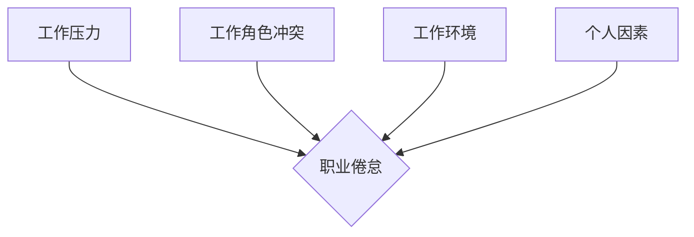

                 

## 程序员的职业倦怠：预防与应对

> 关键词：程序员倦怠、职业倦怠、心理健康、工作压力、技术行业、预防策略、应对措施

程序员，这个群体在现代社会中扮演着越来越重要的角色。他们用代码构建着我们生活的方方面面，从智能手机到云计算，从社交网络到自动驾驶，程序员的贡献无处不在。然而，这份看似光鲜的工作也伴随着巨大的压力和挑战。长时间面对电脑屏幕，处理复杂逻辑，应对不断变化的技术环境，容易导致程序员出现职业倦怠。

职业倦怠是一种持续的、对工作感到疲惫、空虚和缺乏成就感的状态。它会影响程序员的效率、创造力、甚至身心健康。本文将深入探讨程序员职业倦怠的成因、表现形式、预防策略和应对措施，帮助程序员们更好地理解和应对职业倦怠，保持工作热情和创造力。

## 1. 背景介绍

随着科技的快速发展，软件行业蓬勃发展，对程序员的需求量不断增加。然而，激烈的竞争、高强度的工作节奏、不断更新的技术知识，以及对工作成果的巨大压力，都加剧了程序员职业倦怠的风险。

根据一些调查数据，程序员的职业倦怠率远高于其他职业群体。长期处于高压状态下，程序员容易出现以下问题：

* **情绪低落、焦虑、抑郁:** 工作压力过大，导致情绪波动，难以放松，甚至出现焦虑、抑郁等心理问题。
* **缺乏动力、兴趣下降:** 对工作失去兴趣，缺乏动力，难以投入精力，工作效率下降。
* **身体健康问题:** 长时间久坐不动，缺乏运动，容易导致颈椎病、腰椎间盘突出等身体健康问题。
* **人际关系紧张:** 工作压力大，容易影响情绪，导致与同事、家人朋友的关系紧张。

## 2. 核心概念与联系

职业倦怠是一个复杂的心理状态，它与多个因素相互关联，形成一个复杂的系统。

**2.1 核心概念**

* **工作压力:** 工作量过大、工作节奏快、工作环境紧张等因素都会导致工作压力增加。
* **工作角色冲突:** 工作职责不清、工作目标不明确、工作与个人价值观冲突等都会导致工作角色冲突。
* **工作环境:** 工作场所的物理环境、文化氛围、领导风格等都会影响程序员的心理状态。
* **个人因素:** 个人的性格、心理素质、生活习惯等都会影响程序员对工作的适应能力。

**2.2  Mermaid 流程图**



## 3. 核心算法原理 & 具体操作步骤

职业倦怠的预防和应对需要系统性的方法和策略，就像算法一样，需要明确的步骤和逻辑。

### 3.1  算法原理概述

预防和应对职业倦怠的算法可以概括为以下几个步骤：

1. **识别风险因素:** 了解导致职业倦怠的各种因素，并针对自身情况进行评估。
2. **建立健康的工作习惯:** 调整工作节奏，合理安排工作时间，避免过度加班。
3. **加强心理调节:** 学习放松技巧，培养积极乐观的心态，学会处理压力。
4. **寻求社会支持:** 与家人、朋友、同事沟通交流，寻求帮助和支持。
5. **持续学习和成长:** 提升专业技能，拓展知识面，保持对工作的热情和动力。

### 3.2  算法步骤详解

**3.2.1 识别风险因素:**

* **自我评估:** 通过问卷调查、心理测试等方式，了解自身的工作压力、角色冲突、工作环境等方面的状况。
* **观察自身状态:** 注意观察自身的情绪、行为、睡眠、饮食等方面的变化，及时发现潜在的职业倦怠信号。
* **与他人交流:** 与同事、朋友、家人沟通，了解他们的工作经验和应对职业倦怠的策略。

**3.2.2 建立健康的工作习惯:**

* **合理安排工作时间:** 制定工作计划，明确工作目标和优先级，避免过度加班。
* **定期休息:** 每隔一段时间就起身活动一下，眺望远方，放松眼部，避免长时间盯着电脑屏幕。
* **保持良好的睡眠习惯:** 规律作息，保证充足的睡眠时间，提高工作效率和应对压力的能力。

**3.2.3 加强心理调节:**

* **学习放松技巧:** 练习深呼吸、冥想、瑜伽等放松技巧，缓解压力和焦虑。
* **培养积极乐观的心态:** 关注生活中的美好事物，保持积极的思考方式，增强抗压能力。
* **寻求专业帮助:** 如果感到压力过大，难以独自应对，可以寻求心理咨询师的帮助。

**3.2.4 寻求社会支持:**

* **与家人朋友沟通:** 将工作压力和情绪与家人朋友分享，获得他们的理解和支持。
* **参加社交活动:** 积极参加社交活动，拓展人际关系，获得情感支持。
* **加入专业社群:** 与其他程序员交流经验，互相帮助，共同应对职业倦怠。

**3.2.5 持续学习和成长:**

* **提升专业技能:** 学习新的编程语言、框架、技术，保持对工作的热情和动力。
* **拓展知识面:** 阅读技术书籍、文章、博客，了解行业发展趋势，保持学习的兴趣。
* **参与开源项目:** 参与开源项目，与其他程序员合作，提升团队协作能力和解决问题的能力。

### 3.3  算法优缺点

**优点:**

* 系统性强，能够从多个方面解决职业倦怠问题。
* 可操作性强，每个步骤都可具体实施。
* 针对性强，可以根据自身情况选择合适的策略。

**缺点:**

* 需要持续的努力和坚持，才能有效预防和应对职业倦怠。
* 每个人的情况不同，需要不断调整策略，才能达到最佳效果。

### 3.4  算法应用领域

该算法适用于所有程序员，无论工作经验、工作环境、个人性格等方面。

## 4. 数学模型和公式 & 详细讲解 & 举例说明

职业倦怠是一个复杂的心理状态，可以用数学模型来描述和分析。

**4.1  数学模型构建**

我们可以用一个简单的数学模型来表示职业倦怠的程度：

$$
倦怠程度 = f(工作压力, 角色冲突, 工作环境, 个人因素)
$$

其中：

* 倦怠程度：表示程序员对工作的满意度和投入程度，可以用数值表示，数值越低，表示倦怠程度越高。
* 工作压力、角色冲突、工作环境、个人因素：都是影响倦怠程度的因素，可以用数值表示，数值越高，表示该因素的影响越大。
* f()：是一个复杂的函数，代表这些因素之间的相互作用关系。

**4.2  公式推导过程**

由于职业倦怠是一个复杂的心理状态，其数学模型的推导过程非常复杂，需要结合心理学、社会学、经济学等多学科的知识。

**4.3  案例分析与讲解**

假设一个程序员的工作压力为5，角色冲突为3，工作环境为4，个人因素为2。我们可以将这些数值代入公式中，得到该程序员的倦怠程度。

$$
倦怠程度 = f(5, 3, 4, 2)
$$

根据具体的函数形式，我们可以得到该程序员的倦怠程度数值。

## 5. 项目实践：代码实例和详细解释说明

为了更好地理解和应对职业倦怠，我们可以开发一个简单的程序，帮助程序员进行自我评估和压力管理。

### 5.1  开发环境搭建

可以使用Python语言开发该程序，并使用Tkinter库进行图形界面设计。

### 5.2  源代码详细实现

```python
import tkinter as tk

def calculate_burnout():
    # 获取用户输入的数值
    work_pressure = int(work_pressure_entry.get())
    role_conflict = int(role_conflict_entry.get())
    work_environment = int(work_environment_entry.get())
    personal_factors = int(personal_factors_entry.get())

    # 计算倦怠程度
    burnout_score = work_pressure + role_conflict + work_environment + personal_factors

    # 显示结果
    result_label.config(text=f"您的倦怠程度为：{burnout_score}")

# 创建主窗口
window = tk.Tk()
window.title("职业倦怠评估")

# 创建输入框
work_pressure_label = tk.Label(window, text="工作压力:")
work_pressure_label.pack()
work_pressure_entry = tk.Entry(window)
work_pressure_entry.pack()

role_conflict_label = tk.Label(window, text="角色冲突:")
role_conflict_label.pack()
role_conflict_entry = tk.Entry(window)
role_conflict_entry.pack()

work_environment_label = tk.Label(window, text="工作环境:")
work_environment_label.pack()
work_environment_entry = tk.Entry(window)
work_environment_entry.pack()

personal_factors_label = tk.Label(window, text="个人因素:")
personal_factors_label.pack()
personal_factors_entry = tk.Entry(window)
personal_factors_entry.pack()

# 创建计算按钮
calculate_button = tk.Button(window, text="计算", command=calculate_burnout)
calculate_button.pack()

# 创建结果标签
result_label = tk.Label(window, text="")
result_label.pack()

# 启动主窗口
window.mainloop()
```

### 5.3  代码解读与分析

该程序首先创建了一个主窗口，并添加了四个输入框，用于获取用户输入的工作压力、角色冲突、工作环境和个人因素的数值。然后，程序定义了一个`calculate_burnout()`函数，用于计算用户的倦怠程度。该函数将用户输入的数值相加，得到一个总的倦怠程度数值。最后，程序将结果显示在结果标签上。

### 5.4  运行结果展示

当用户输入相关数值并点击“计算”按钮后，程序会计算出用户的倦怠程度，并显示在结果标签上。

## 6. 实际应用场景

该程序可以帮助程序员进行自我评估，了解自身的工作压力和倦怠程度。

### 6.4  未来应用展望

未来，可以将该程序扩展为更完善的职业倦怠管理工具，例如：

* 添加更多因素的评估，例如工作成就感、工作与生活平衡等。
* 提供个性化的建议和解决方案，例如放松技巧、时间管理方法、心理咨询资源等。
* 将程序与其他健康管理平台集成，形成更全面的健康管理体系。

## 7. 工具和资源推荐

### 7.1  学习资源推荐

* **书籍:**《程序员的自我救赎》、《高效能人士的七个习惯》、《积极心理学》
* **网站:**
    * **心理健康网站:** 心理咨询平台、心理健康知识网站
    * **职业发展网站:** 职业规划网站、技术学习网站

### 7.2  开发工具推荐

* **Python:** 
    * **Tkinter:** 图形界面开发库
    * **PyQt:** 跨平台图形界面开发库
* **其他语言:** Java、C#、JavaScript等

### 7.3  相关论文推荐

* **职业倦怠研究论文:** 可以通过学术数据库（如IEEE Xplore、ACM Digital Library）搜索相关论文。

## 8. 总结：未来发展趋势与挑战

职业倦怠是一个全球性的问题，对程序员的健康和工作效率都造成严重影响。随着科技的不断发展，程序员的工作压力和挑战只会越来越大，因此预防和应对职业倦怠变得更加重要。

### 8.1  研究成果总结

近年来，对职业倦怠的研究取得了显著进展，人们对职业倦怠的成因、表现形式、预防和应对措施有了更深入的了解。

### 8.2  未来发展趋势

未来，职业倦怠研究将朝着以下几个方向发展：

* **个性化预防和应对:** 基于人工智能和数据分析技术，开发个性化的职业倦怠预防和应对策略。
* **跨文化研究:** 探索不同文化背景下职业倦怠的差异，制定针对不同文化背景的预防和应对措施。
* **早期干预:** 开发早期干预方法，及时发现和解决职业倦怠的苗头。

### 8.3  面临的挑战

职业倦怠研究还面临着一些挑战：

* **复杂性:** 职业倦怠是一个复杂的心理状态，其成因和表现形式多种多样，难以用单一的模型解释。
* **数据获取:** 职业倦怠研究需要大量的数据支持，但获取高质量的职业倦怠数据仍然是一个挑战。
* **跨学科合作:** 职业倦怠研究需要跨学科合作，例如心理学、社会学、经济学、计算机科学等学科的专家共同参与。

### 8.4  研究展望

尽管面临着挑战，但职业倦怠研究的前景依然光明。随着科技的进步和跨学科合作的加强，相信未来我们将能够更好地理解和应对职业倦怠，帮助程序员们保持工作热情和创造力，为科技发展做出更大的贡献。

## 9. 附录：常见问题与解答

**Q1: 如何判断自己是否患有职业倦怠？**

**A1:** 职业倦怠的症状多种多样，包括情绪低落、焦虑、抑郁、缺乏动力、工作效率下降、身体健康问题等。如果您出现以上症状，建议及时寻求专业帮助。

**Q2: 如何预防职业倦怠？**

**A2:** 预防职业倦怠的方法有很多，例如建立健康的工作习惯、加强心理调节、寻求社会支持、持续学习和成长等。

**Q3: 如何应对职业倦怠？**

**A3:** 应对职业倦怠的方法包括：调整工作节奏、寻求心理咨询、参加社交活动、培养兴趣爱好等。

**Q4: 职业倦怠会有什么样的危害？**

**A4:** 职业倦怠会对程序员的健康、工作效率、人际关系等方面造成严重影响，甚至可能导致心理疾病。

**Q5: 如何寻求帮助？**

**A5:** 如果您感到压力过大，难以独自应对，可以寻求心理咨询师、医生、朋友、家人的帮助。


作者：禅与计算机程序设计艺术 / Zen and the Art of Computer Programming 
<end_of_turn>

