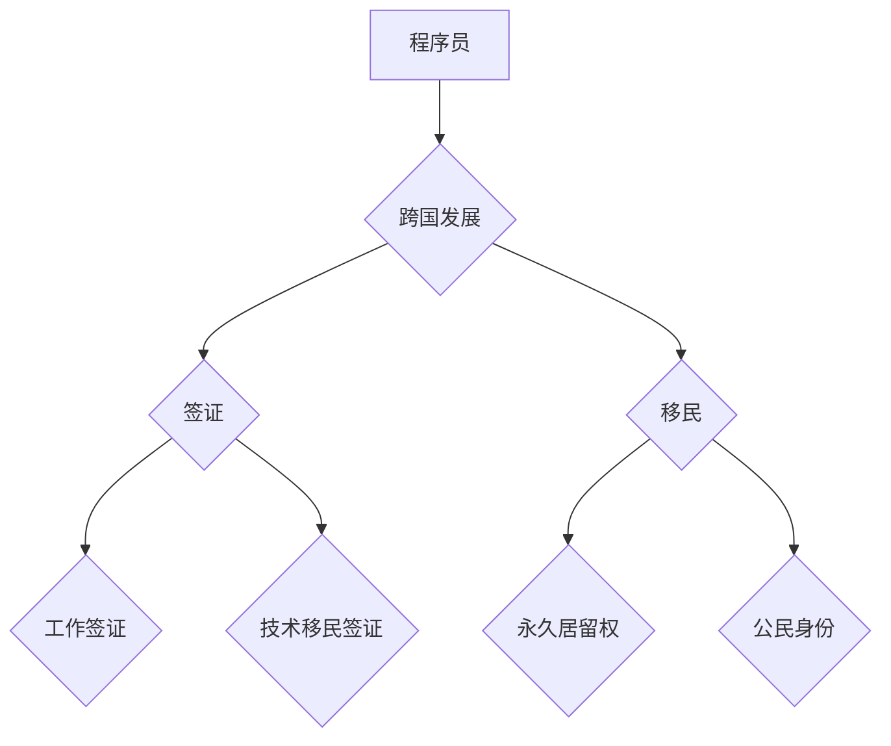

                 

## 程序员的跨国发展：签证与移民策略

> 关键词：程序员、跨国发展、签证、移民、技术移民、工作签证、绿卡、海外就业、职业规划

## 1. 背景介绍

在全球化时代，技术人才的需求日益增长，程序员作为科技领域的核心力量，拥有着广阔的职业发展空间。许多程序员渴望将职业生涯拓展到国际舞台，寻求更高的薪资、更丰富的经验和更广阔的视野。然而，跨国发展并非易事，签证和移民政策是程序员迈出这一步的重要门槛。

本文旨在为程序员提供一份关于跨国发展的指南，涵盖签证类型、移民策略、申请流程以及相关注意事项等方面，帮助程序员更好地规划海外职业生涯。

## 2. 核心概念与联系

**2.1 签证与移民**

* **签证**：是一种允许外国人短期或长期进入特定国家的许可证。程序员通常需要申请工作签证或技术移民签证才能在国外工作。
* **移民**：是指永久或长期定居在另一个国家的过程。程序员可以通过技术移民获得永久居留权，最终成为该国的公民。

**2.2 不同国家移民政策**

不同国家对技术移民的政策和要求各不相同。一些国家，如美国、加拿大、澳大利亚和新西兰，拥有相对完善的技术移民体系，吸引大量技术人才。其他国家，如欧洲国家，则更加注重欧盟公民的流动，对非欧盟公民的技术移民政策相对严格。

**2.3 核心概念关系图**

## 3. 核心算法原理 & 具体操作步骤

**3.1 算法原理概述**

跨国发展是一个复杂的系统工程，需要程序员根据自身情况和目标，制定合理的策略和计划。

**3.2 算法步骤详解**

1. **自我评估**: 评估自身的技术能力、语言水平、工作经验、学历背景等因素，确定目标国家和职业方向。
2. **国家政策研究**: 深入了解目标国家的技术移民政策、签证要求、生活成本、文化环境等信息。
3. **技能提升**: 针对目标国家和职业方向，提升自身的技术技能、语言能力和相关证书。
4. **网络资源利用**: 利用专业网站、论坛、社交平台等资源，获取最新的移民信息、经验分享和职业机会。
5. **申请准备**: 准备签证申请材料，包括学历证书、工作证明、语言考试成绩、推荐信等。
6. **面试准备**: 针对签证面试，进行模拟练习，熟悉常见问题和回答技巧。
7. **申请提交**: 正式提交签证申请，并耐心等待审批结果。
8. **落地准备**: 抵达目标国家后，办理相关手续，寻找住处、工作等。

**3.3 算法优缺点**

* **优点**: 

    * 能够帮助程序员系统地规划跨国发展路径。
    * 提供了具体的步骤和操作指南，提高成功率。
    * 强调了自我评估和技能提升的重要性，帮助程序员提升竞争力。

* **缺点**: 

    * 每个程序员的情况不同，算法步骤可能需要根据实际情况进行调整。
    * 移民政策变化频繁，需要持续关注最新信息。

**3.4 算法应用领域**

该算法适用于所有希望跨国发展的程序员，无论其技术水平、经验背景或目标国家。

## 4. 数学模型和公式 & 详细讲解 & 举例说明

**4.1 数学模型构建**

跨国发展是一个多因素决策问题，可以构建一个数学模型来评估不同方案的优劣。

**4.2 公式推导过程**

假设程序员有以下几个目标：

* **薪资**:  $S$
* **生活成本**: $C$
* **工作机会**: $O$
* **文化适应**: $A$

可以构建一个综合得分函数：

$Score = w_1 * S + w_2 * C + w_3 * O + w_4 * A$

其中，$w_1$, $w_2$, $w_3$, $w_4$ 是各个目标的权重，根据程序员的个人偏好进行设置。

**4.3 案例分析与讲解**

例如，程序员A希望前往美国工作，目标国家薪资高，生活成本也高，工作机会多，文化适应度中等。程序员B希望前往加拿大工作，目标国家薪资中等，生活成本中等，工作机会多，文化适应度高。

根据上述模型，可以计算出程序员A和程序员B前往不同国家的综合得分，并根据得分选择最优方案。

## 5. 项目实践：代码实例和详细解释说明

**5.1 开发环境搭建**

程序员需要根据目标国家的法律法规和技术要求，搭建相应的开发环境。例如，需要安装特定的操作系统、软件工具和编程语言环境。

**5.2 源代码详细实现**

程序员需要根据目标国家的技术需求，编写相应的源代码。例如，需要开发特定的应用程序、网站或软件系统。

**5.3 代码解读与分析**

程序员需要对自己的源代码进行解读和分析，确保代码的正确性、安全性、可维护性和可扩展性。

**5.4 运行结果展示**

程序员需要测试和运行自己的代码，并展示运行结果，以证明代码的功能和性能。

## 6. 实际应用场景

**6.1 海外求职平台**

程序员可以利用海外求职平台，例如LinkedIn、Indeed、Glassdoor等，寻找目标国家的招聘信息和职位机会。

**6.2 技术社区和论坛**

程序员可以加入技术社区和论坛，例如Stack Overflow、GitHub、Reddit等，与其他程序员交流经验、获取技术支持和寻找合作机会。

**6.3 海外实习和项目合作**

程序员可以申请海外实习或参与跨国项目合作，积累海外工作经验和人脉资源。

**6.4 未来应用展望**

随着全球化进程的加速，程序员的跨国发展将更加普遍和便捷。未来，人工智能、云计算和远程办公等技术将进一步推动程序员的跨国发展。

## 7. 工具和资源推荐

**7.1 学习资源推荐**

* **在线课程平台**: Coursera, edX, Udemy
* **技术博客和网站**: Hacker News, Medium, Dev.to
* **书籍**: 《The Pragmatic Programmer》、《Clean Code》

**7.2 开发工具推荐**

* **代码编辑器**: Visual Studio Code, Sublime Text, Atom
* **版本控制系统**: Git, GitHub
* **云计算平台**: AWS, Azure, Google Cloud

**7.3 相关论文推荐**

* **技术移民政策**: "The Impact of Skilled Migration on Innovation"
* **程序员职业发展**: "The Future of Work: How Technology Will Transform the Job Market"

## 8. 总结：未来发展趋势与挑战

**8.1 研究成果总结**

本文分析了程序员跨国发展的核心概念、算法原理、实际应用场景以及相关工具和资源。

**8.2 未来发展趋势**

* **技术驱动**: 人工智能、云计算和远程办公等技术将推动程序员跨国发展的趋势。
* **全球化加速**: 全球化进程的加速将进一步缩小地理距离，为程序员提供更多海外发展机会。
* **人才竞争加剧**: 技术人才的竞争将更加激烈，程序员需要不断提升自身技能和竞争力。

**8.3 面临的挑战**

* **签证政策**: 不同国家的签证政策复杂多样，程序员需要花费大量时间和精力进行申请。
* **文化差异**: 文化差异可能会导致程序员在海外工作和生活方面遇到挑战。
* **语言障碍**: 语言障碍可能会影响程序员的沟通和协作能力。

**8.4 研究展望**

未来研究可以进一步探讨以下问题：

* 如何利用人工智能技术优化程序员跨国发展的流程和效率？
* 如何帮助程序员更好地适应海外文化和工作环境？
* 如何促进跨国技术合作和人才交流？

## 9. 附录：常见问题与解答

**9.1 常见问题**

* 如何获得技术移民签证？
* 海外工作薪资水平如何？
* 海外生活成本如何？
* 如何适应海外文化？

**9.2 常见解答**

* 技术移民签证的申请流程和要求因国家而异，建议咨询专业的移民律师或机构。
* 海外工作薪资水平取决于国家、行业和个人经验等因素，一般来说，发达国家的薪资水平较高。
* 海外生活成本取决于国家、城市和生活方式等因素，建议提前做好预算规划。
* 适应海外文化需要时间和努力，建议提前了解目标国家的文化习俗和生活方式。

作者：禅与计算机程序设计艺术 / Zen and the Art of Computer Programming 
<end_of_turn>

