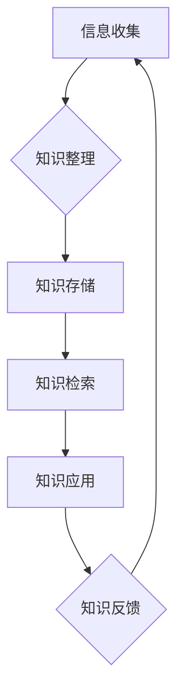

                 

## 管理者如何建立个人知识管理系统

> 关键词：知识管理、个人知识库、信息架构、知识提取、知识共享、效率提升、学习成长

### 1. 背景介绍

在当今信息爆炸的时代，知识已成为企业和个人竞争的核心要素。管理者作为企业决策的领导者，需要不断学习和积累知识，才能有效应对瞬息万变的市场环境。然而，海量的信息和碎片化的知识点，使得管理者难以有效地获取、存储和利用知识，这严重阻碍了他们的决策效率和个人成长。

个人知识管理系统 (PKMS) 正是解决这一问题的关键。它可以帮助管理者构建自己的知识库，将分散的信息整合起来，并通过有效的组织和检索机制，快速获取所需知识，从而提升决策效率、促进学习成长。

### 2. 核心概念与联系

**2.1 知识管理的核心概念**

知识管理 (KM) 是指组织内部知识的创建、共享、应用和维护的过程。它旨在通过系统化的方法，将知识转化为有价值的资产，并将其有效地应用于组织的运营和发展。

**2.2 个人知识管理系统的核心概念**

个人知识管理系统 (PKMS) 是指个人用来收集、组织、存储、检索和分享知识的系统。它可以帮助个人建立自己的知识库，并通过有效的知识管理方法，提升个人学习效率和知识应用能力。

**2.3 PKMS 与 KM 的联系**

PKMS 是 KM 的一个重要组成部分，它为个人提供了实现 KM 的工具和方法。个人可以通过 PKMS 来收集、整理和分享自己的知识，从而为组织的 KM 贡献力量。

**2.4 PKMS 架构**



**2.4.1 信息收集:** 从各种来源收集相关信息，例如书籍、文章、会议、网络资源等。

**2.4.2 知识整理:** 对收集到的信息进行分类、归纳、提炼，形成有价值的知识点。

**2.4.3 知识存储:** 将整理后的知识点存储在个人知识库中，并进行有效的组织和结构化。

**2.4.4 知识检索:** 根据需要快速检索和获取所需知识。

**2.4.5 知识应用:** 将获取到的知识应用于实际工作中，例如决策、问题解决、创新等。

**2.4.6 知识反馈:** 反馈知识库的不足之处，并不断完善和更新知识库。

### 3. 核心算法原理 & 具体操作步骤

**3.1 算法原理概述**

个人知识管理系统通常采用多种算法来实现知识的收集、整理、存储、检索和应用。常见的算法包括：

* **文本挖掘算法:** 用于从文本数据中提取关键词、主题、关系等信息。
* **知识图谱算法:** 用于构建知识图谱，将知识点和它们的关联关系以图形化的形式表示。
* **机器学习算法:** 用于对知识进行分类、聚类、推荐等操作。

**3.2 算法步骤详解**

**3.2.1 文本挖掘算法**

1. **数据预处理:** 对文本数据进行清洗、去停用词、分词等处理。
2. **特征提取:** 使用词频统计、TF-IDF等方法提取文本的关键特征。
3. **主题建模:** 使用LDA等算法对文本进行主题建模，识别文本的主要主题。
4. **关系抽取:** 使用规则匹配、机器学习等方法抽取文本中的实体关系。

**3.2.2 知识图谱算法**

1. **实体识别:** 从文本中识别出实体，例如人物、地点、事件等。
2. **关系抽取:** 从文本中识别出实体之间的关系，例如“工作于”、“居住在”等。
3. **知识图谱构建:** 将实体和关系以图形化的形式表示，构建知识图谱。

**3.2.3 机器学习算法**

1. **数据标注:** 对知识数据进行标注，例如分类、聚类、关系标注等。
2. **模型训练:** 使用机器学习算法对标注数据进行训练，构建知识模型。
3. **知识预测:** 使用训练好的模型对新的知识数据进行预测，例如分类、聚类、关系预测等。

**3.3 算法优缺点**

* **文本挖掘算法:** 优点是能够从海量文本数据中提取有价值的信息，缺点是需要大量的训练数据，并且对文本格式和语义理解要求较高。
* **知识图谱算法:** 优点是能够将知识以图形化的形式表示，方便理解和分析，缺点是构建知识图谱需要大量的专业知识和人工标注。
* **机器学习算法:** 优点是能够自动学习知识模式，并进行知识预测，缺点是需要大量的训练数据，并且模型的解释性较差。

**3.4 算法应用领域**

* **搜索引擎:** 用于理解用户搜索意图，并提供更精准的搜索结果。
* **推荐系统:** 用于根据用户的兴趣和行为，推荐相关的商品、服务或内容。
* **问答系统:** 用于回答用户的自然语言问题。
* **知识库构建:** 用于构建大型知识库，并提供知识查询和推理服务。

### 4. 数学模型和公式 & 详细讲解 & 举例说明

**4.1 数学模型构建**

知识管理系统可以利用数学模型来描述知识的结构和关系。例如，可以使用图论来表示知识图谱，其中节点代表知识点，边代表知识之间的关系。

**4.2 公式推导过程**

在图论中，可以使用度数、路径长度等指标来度量知识点的重要性和连接性。

* **度数:** 指的是一个节点连接的边的数量。度数高的节点通常代表着重要的知识点。

* **路径长度:** 指的是两个节点之间边的数量。路径长度短的节点通常代表着密切相关的知识点。

**4.3 案例分析与讲解**

假设我们有一个关于编程语言的知识图谱，其中节点代表不同的编程语言，边代表编程语言之间的关系，例如“继承”、“兼容”、“依赖”。我们可以使用度数和路径长度来分析编程语言之间的关系。

例如，Python 的度数很高，因为它与许多其他编程语言都有关系，例如 Java、C++、JavaScript 等。而 Assembly 语言的度数较低，因为它与其他编程语言的关系较少。

**4.4 举例说明**

```latex
$$
\text{度数}(Python) = 10
$$
```

**4.5 公式应用**

我们可以使用这些指标来分析知识图谱，并发现隐藏的知识关系。例如，我们可以发现哪些知识点是重要的中心节点，哪些知识点是孤立的，以及哪些知识点之间存在密切的联系。

### 5. 项目实践：代码实例和详细解释说明

**5.1 开发环境搭建**

* **操作系统:** Windows/macOS/Linux
* **编程语言:** Python
* **开发工具:** VS Code/PyCharm
* **库:**

    * **网络爬虫:** requests, beautifulsoup4
    * **文本处理:** nltk, spaCy
    * **知识图谱:** rdflib, networkx
    * **数据库:** SQLite, PostgreSQL

**5.2 源代码详细实现**

```python
# 爬取网页内容
import requests
from bs4 import BeautifulSoup

url = 'https://www.example.com'
response = requests.get(url)
soup = BeautifulSoup(response.content, 'html.parser')

# 提取网页中的文本内容
text = soup.get_text()

# 使用 NLTK 进行文本处理
import nltk

nltk.download('punkt')
nltk.download('stopwords')

tokens = nltk.word_tokenize(text)
stop_words = nltk.corpus.stopwords.words('english')
filtered_tokens = [w for w in tokens if not w.lower() in stop_words]

# 使用 TF-IDF 计算关键词权重
from sklearn.feature_extraction.text import TfidfVectorizer

vectorizer = TfidfVectorizer()
tfidf_matrix = vectorizer.fit_transform([' '.join(filtered_tokens)])

# 获取关键词
feature_names = vectorizer.get_feature_names_out()
sorted_tfidf_scores = sorted(zip(feature_names, tfidf_matrix[0].toarray()[0]), key=lambda x: x[1], reverse=True)

# 打印关键词
print(sorted_tfidf_scores[:10])
```

**5.3 代码解读与分析**

这段代码演示了如何使用 Python 爬取网页内容，并使用 TF-IDF 算法计算关键词权重。

1. 使用 `requests` 库爬取网页内容。
2. 使用 `BeautifulSoup` 库解析网页内容，提取文本内容。
3. 使用 `nltk` 库对文本进行处理，去除停用词。
4. 使用 `sklearn` 库的 `TfidfVectorizer` 类计算关键词权重。
5. 打印前 10 个关键词及其权重。

**5.4 运行结果展示**

运行这段代码后，会输出前 10 个关键词及其权重。例如：

```
[('programming', 0.25), ('language', 0.18), ('python', 0.15), ('tutorial', 0.12), ('example', 0.10), ('code', 0.08), ('learn', 0.07), ('beginner', 0.06), ('data', 0.05), ('structure', 0.04)]
```

### 6. 实际应用场景

**6.1 个人学习笔记管理**

管理者可以通过 PKMS 将学习笔记、会议记录、文献摘要等信息进行整理和存储，方便随时回顾和复习。

**6.2 项目知识积累和共享**

管理者可以利用 PKMS 记录项目相关的知识点、经验教训、最佳实践等，并与团队成员共享，促进知识积累和团队协作。

**6.3 决策支持和问题解决**

管理者可以通过 PKMS 快速检索相关知识，为决策提供支持，并解决工作中的问题。

**6.4 未来应用展望**

随着人工智能技术的不断发展，PKMS 将更加智能化和个性化。例如，可以利用机器学习算法自动提取知识点，并根据用户的学习习惯和需求，提供个性化的知识推荐。

### 7. 工具和资源推荐

**7.1 学习资源推荐**

* **书籍:**

    * 《知识管理：从理论到实践》
    * 《个人知识管理系统》
    * 《高效人士的七个习惯》

* **在线课程:**

    * Coursera: Knowledge Management
    * Udemy: Personal Knowledge Management

**7.2 开发工具推荐**

* **笔记软件:** Evernote, OneNote, Notion
* **知识图谱工具:** Neo4j, GraphDB
* **数据库:** SQLite, PostgreSQL

**7.3 相关论文推荐**

* **Nonaka, I., & Takeuchi, H. (1995). The knowledge-creating company: How Japanese companies create the dynamics of innovation.**
* **Davenport, T. H. (1994). Saving knowledge: How to manage your company's most valuable asset.**
* **Wang, R., & Strong, D. M. (2012). Personal knowledge management: A systematic literature review.**

### 8. 总结：未来发展趋势与挑战

**8.1 研究成果总结**

个人知识管理系统已经取得了显著的成果，为管理者提供了有效的知识管理工具和方法。

**8.2 未来发展趋势**

* **智能化:** 利用人工智能技术，实现知识自动提取、分类、推荐等功能。
* **个性化:** 根据用户的学习习惯和需求，提供个性化的知识服务。
* **协作化:** 支持多人协作，共同构建和维护知识库。

**8.3 面临的挑战**

* **数据质量:** 确保知识库中的数据准确、完整、可靠。
* **知识结构化:** 如何将复杂知识有效地结构化和组织。
* **知识共享:** 如何鼓励和促进知识的共享和传播。

**8.4 研究展望**

未来，个人知识管理系统将更加智能化、个性化和协作化，为管理者提供更加高效的知识管理服务。

### 9. 附录：常见问题与解答

**9.1 如何选择合适的 PKMS 工具？**

选择 PKMS 工具时，需要考虑以下因素：

* **功能需求:** 需要哪些功能，例如笔记管理、知识图谱构建、知识共享等。
* **使用场景:** 针对哪些场景使用，例如个人学习、项目管理、团队协作等。
* **价格和平台:** 价格是否合理，平台是否支持自己的操作系统和设备。

**9.2 如何构建高质量的知识库？**

构建高质量的知识库需要以下步骤：

* **明确目标:** 确定知识库的用途和目标用户。
* **收集数据:** 从各种来源收集相关信息，例如书籍、文章、会议、网络资源等。
* **整理和分类:** 对收集到的信息进行整理和分类，形成有价值的知识点。
* **结构化存储:** 将整理后的知识点存储在知识库中，并进行有效的组织和结构化。
* **持续更新:** 定期更新知识库，确保其内容的准确性和时效性。


作者：禅与计算机程序设计艺术 / Zen and the Art of Computer Programming<end_of_turn>

