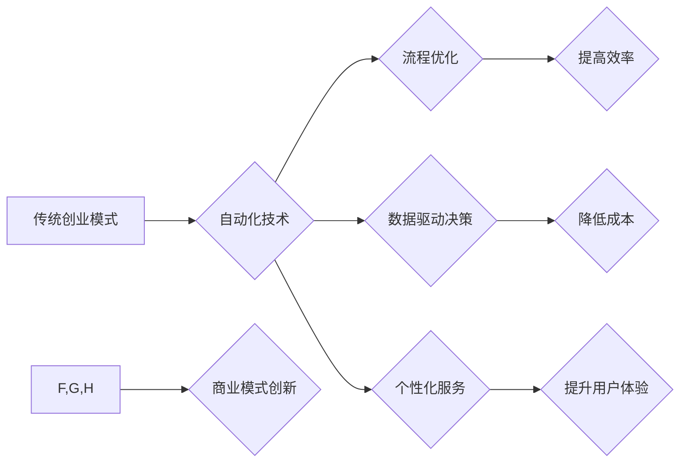

                 

## 自动化创业中的商业模式创新

> 关键词：自动化、创业、商业模式、人工智能、机器学习、流程优化、数据驱动、创新

## 1. 背景介绍

在当今科技飞速发展的时代，自动化技术正在深刻地改变着各行各业，创业领域也不例外。人工智能（AI）、机器学习（ML）等技术的快速发展，为创业者提供了前所未有的机遇，也带来了新的挑战。如何利用自动化技术，构建创新性的商业模式，成为创业者需要思考的关键问题。

传统创业模式往往依赖于人力、时间和资源投入，效率相对较低，难以应对市场竞争的激烈程度。而自动化创业则通过利用技术手段，实现流程的自动化、智能化，从而提高效率、降低成本、提升用户体验，最终实现可持续发展。

## 2. 核心概念与联系

### 2.1 自动化创业

自动化创业是指利用自动化技术，构建能够自我运营、持续增长的商业模式。其核心在于通过技术手段，替代或辅助人类完成重复性、规则性工作，从而提高效率、降低成本，并释放人力资源用于更具创造性和战略性的工作。

### 2.2 商业模式创新

商业模式创新是指企业在现有商业模式的基础上，通过改变产品、服务、价值主张、客户群体、盈利模式等方面，创造新的商业价值，并获得竞争优势。

### 2.3 自动化与商业模式创新的联系

自动化技术为商业模式创新提供了强大的工具和手段。通过自动化技术，企业可以：

* **优化流程:** 自动化可以替代或辅助人类完成重复性、规则性工作，从而提高效率、降低成本。
* **个性化服务:** 自动化可以根据用户的需求和行为，提供个性化的产品和服务，提升用户体验。
* **数据驱动决策:** 自动化可以收集和分析海量数据，为企业决策提供数据支持。
* **拓展新市场:** 自动化可以帮助企业进入新的市场，并开拓新的业务模式。

**Mermaid 流程图**



## 3. 核心算法原理 & 具体操作步骤

### 3.1 算法原理概述

自动化创业的核心算法原理主要包括：

* **机器学习:** 利用算法从数据中学习，不断提高预测和决策能力。
* **自然语言处理:** 理解和处理人类语言，实现人机交互。
* **计算机视觉:** 识别和理解图像和视频，实现视觉感知。
* **流程自动化:** 自动化执行重复性任务，提高效率。

### 3.2 算法步骤详解

**机器学习算法步骤:**

1. **数据收集:** 收集相关数据，并进行清洗和预处理。
2. **特征提取:** 从数据中提取特征，用于训练模型。
3. **模型选择:** 选择合适的机器学习算法，例如线性回归、决策树、支持向量机等。
4. **模型训练:** 利用训练数据，训练机器学习模型。
5. **模型评估:** 利用测试数据，评估模型的性能。
6. **模型部署:** 将训练好的模型部署到实际应用场景中。

**流程自动化步骤:**

1. **流程识别:** 识别需要自动化的业务流程。
2. **流程建模:** 建立流程模型，描述流程的各个步骤和条件。
3. **自动化工具选择:** 选择合适的自动化工具，例如 RPA、BPM 等。
4. **自动化脚本编写:** 根据流程模型，编写自动化脚本。
5. **测试和部署:** 测试自动化脚本，并部署到生产环境中。

### 3.3 算法优缺点

**机器学习算法:**

* **优点:** 能够从数据中学习，不断提高预测和决策能力。
* **缺点:** 需要大量的数据进行训练，训练过程复杂，模型解释性较差。

**流程自动化算法:**

* **优点:** 可以提高效率，降低成本，减少人为错误。
* **缺点:** 需要对流程进行详细的建模，自动化脚本编写难度较高。

### 3.4 算法应用领域

* **机器学习算法:** 
    * **电商推荐:** 根据用户的购买历史和浏览记录，推荐相关的商品。
    * **欺诈检测:** 检测信用卡交易中的欺诈行为。
    * **医疗诊断:** 辅助医生进行疾病诊断。
* **流程自动化算法:**
    * **客户服务:** 自动回复客户常见问题，提高服务效率。
    * **财务管理:** 自动处理账单和付款，降低财务成本。
    * **人力资源:** 自动化招聘流程，提高招聘效率。

## 4. 数学模型和公式 & 详细讲解 & 举例说明

### 4.1 数学模型构建

在自动化创业中，我们可以利用数学模型来描述和分析各种现象，例如用户行为、市场趋势、业务流程等。例如，我们可以使用贝叶斯网络来建模用户购买行为，使用线性回归来预测市场需求，使用马尔可夫链来模拟业务流程。

### 4.2 公式推导过程

以用户购买行为建模为例，我们可以使用贝叶斯网络来描述用户购买商品的概率。

假设我们有一个电商平台，有两种商品 A 和 B，用户购买商品 A 的概率为 P(A)，购买商品 B 的概率为 P(B)。

如果用户购买了商品 A，那么他购买商品 B 的概率会受到影响，我们可以用条件概率来表示：

$$P(B|A) = \frac{P(A \cap B)}{P(A)}$$

其中，P(A ∩ B) 表示用户同时购买商品 A 和 B 的概率。

通过收集用户购买数据，我们可以估计这些概率值，并构建一个贝叶斯网络模型。

### 4.3 案例分析与讲解

例如，我们可以发现用户购买商品 A 的概率为 0.6，同时购买商品 A 和 B 的概率为 0.2，那么根据公式，我们可以计算出用户购买了商品 A 后购买商品 B 的概率为：

$$P(B|A) = \frac{0.2}{0.6} = \frac{1}{3}$$

这个结果告诉我们，如果用户购买了商品 A，那么他购买商品 B 的概率为 1/3。

## 5. 项目实践：代码实例和详细解释说明

### 5.1 开发环境搭建

为了实现自动化创业的项目实践，我们需要搭建一个合适的开发环境。

* **操作系统:** Linux 或 macOS
* **编程语言:** Python
* **机器学习库:** TensorFlow、PyTorch
* **流程自动化工具:** RPA、BPM

### 5.2 源代码详细实现

以下是一个简单的机器学习项目代码实例，用于预测用户购买商品的概率。

```python
import pandas as pd
from sklearn.model_selection import train_test_split
from sklearn.linear_model import LogisticRegression
from sklearn.metrics import accuracy_score

# 加载数据
data = pd.read_csv("user_data.csv")

# 划分训练集和测试集
X_train, X_test, y_train, y_test = train_test_split(data.drop("purchase", axis=1), data["purchase"], test_size=0.2)

# 创建模型
model = LogisticRegression()

# 训练模型
model.fit(X_train, y_train)

# 预测测试集
y_pred = model.predict(X_test)

# 计算准确率
accuracy = accuracy_score(y_test, y_pred)
print("准确率:", accuracy)
```

### 5.3 代码解读与分析

这段代码首先加载用户数据，然后将数据划分成训练集和测试集。接着，创建了一个逻辑回归模型，并使用训练集训练模型。最后，使用测试集预测用户购买商品的概率，并计算模型的准确率。

### 5.4 运行结果展示

运行这段代码后，会输出模型的准确率。

## 6. 实际应用场景

### 6.1 自动化客服

利用自然语言处理技术，可以构建自动客服系统，自动回复客户常见问题，例如订单查询、退换货流程等，提高客服效率，降低人工成本。

### 6.2 个性化推荐

利用机器学习算法，可以分析用户的购买历史和浏览记录，推荐个性化的商品和服务，提升用户体验，提高转化率。

### 6.3 智能营销

利用数据分析和机器学习，可以进行智能营销，例如精准广告投放、个性化促销活动等，提高营销效果，降低营销成本。

### 6.4 未来应用展望

随着人工智能和自动化技术的不断发展，自动化创业将应用到更多领域，例如：

* **自动驾驶:** 利用机器学习和计算机视觉，实现自动驾驶汽车。
* **医疗诊断:** 利用机器学习和深度学习，辅助医生进行疾病诊断。
* **金融风控:** 利用机器学习和数据分析，提高金融风险控制能力。

## 7. 工具和资源推荐

### 7.1 学习资源推荐

* **在线课程:** Coursera、edX、Udacity 等平台提供丰富的机器学习和自动化相关课程。
* **书籍:** 《深度学习》、《机器学习实战》、《自动化测试》等书籍。
* **博客和论坛:** 机器学习和自动化相关的博客和论坛，例如 Kaggle、Stack Overflow 等。

### 7.2 开发工具推荐

* **Python:** 机器学习和自动化开发的常用语言。
* **TensorFlow:** 深度学习框架。
* **PyTorch:** 深度学习框架。
* **RPA:** 流程自动化工具，例如 UiPath、Automation Anywhere 等。
* **BPM:** 流程管理工具，例如 Bizagi、Activiti 等。

### 7.3 相关论文推荐

* **《ImageNet Classification with Deep Convolutional Neural Networks》**
* **《Attention Is All You Need》**
* **《BERT: Pre-training of Deep Bidirectional Transformers for Language Understanding》**

## 8. 总结：未来发展趋势与挑战

### 8.1 研究成果总结

自动化创业已经取得了显著的成果，例如：

* **提高效率:** 自动化可以提高业务流程的效率，降低成本。
* **个性化服务:** 自动化可以提供个性化的产品和服务，提升用户体验。
* **数据驱动决策:** 自动化可以收集和分析海量数据，为企业决策提供数据支持。

### 8.2 未来发展趋势

* **更智能的自动化:** 利用更先进的 AI 技术，实现更智能的自动化，例如：
    * **自学习型自动化:** 自动化系统能够根据数据不断学习和改进。
    * **协同型自动化:** 人工智能与人类协同工作，实现更高效的自动化。
* **更广泛的应用:** 自动化技术将应用到更多领域，例如：
    * **医疗保健:** 自动化诊断、治疗、药物研发等。
    * **教育:** 个性化学习、智能辅导等。
    * **制造业:** 智能制造、柔性生产等。

### 8.3 面临的挑战

* **技术挑战:** 
    * 如何开发更智能、更可靠的自动化系统。
    * 如何解决数据安全和隐私问题。
* **社会挑战:** 
    * 如何应对自动化带来的就业问题。
    * 如何确保自动化技术被用于良善的目的。

### 8.4 研究展望

未来，自动化创业将继续发展，并对社会产生深远的影响。我们需要不断研究和探索，以确保自动化技术能够为人类社会带来更多福祉。

## 9. 附录：常见问题与解答

### 9.1 如何选择合适的自动化工具？

选择合适的自动化工具需要根据具体的业务需求和场景进行评估。

* **流程自动化工具:** 需要考虑工具的功能、易用性、可扩展性等因素。
* **机器学习库:** 需要考虑库的功能、性能、社区支持等因素。

### 9.2 自动化创业需要哪些技能？

自动化创业需要具备以下技能：

* **编程技能:** 能够熟练使用 Python 或其他编程语言。
* **机器学习知识:** 了解机器学习算法和模型。
* **数据分析能力:** 能够收集、分析和解读数据。
* **商业思维:** 能够识别商业机会，并构建可行的商业模式。

### 9.3 自动化创业有哪些风险？

自动化创业也存在一些风险，例如：

* **技术风险:** 自动化技术可能无法满足预期需求。
* **市场风险:** 市场竞争激烈，难以获得用户认可。
* **运营风险:** 自动化系统可能出现故障，导致业务中断。


作者：禅与计算机程序设计艺术 / Zen and the Art of Computer Programming 
<end_of_turn>

