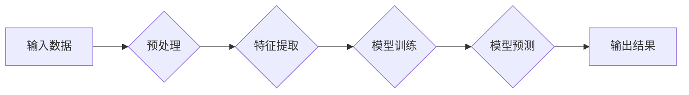

                 

## 自然语言处理创业：智能交互的未来

> 关键词：自然语言处理，NLP，智能交互，机器学习，深度学习，对话系统，语音识别，文本生成，创业机会

### 1. 背景介绍

自然语言处理（Natural Language Processing，NLP）作为人工智能（Artificial Intelligence，AI）的重要分支，致力于使计算机能够理解、理解和生成人类语言。近年来，随着深度学习技术的飞速发展，NLP取得了令人瞩目的进展，在语音识别、机器翻译、文本摘要、情感分析等领域展现出强大的应用潜力。

NLP创业正处于蓬勃发展的阶段，涌现出众多创新型公司，致力于利用NLP技术打造智能交互体验，改变人们与科技的互动方式。从智能客服到虚拟助手，从个性化教育到精准营销，NLP技术正在渗透到生活的方方面面，为企业和个人带来无限机遇。

### 2. 核心概念与联系

#### 2.1 自然语言处理概述

自然语言处理的核心目标是让计算机能够理解人类语言的复杂结构和语义，并能够以自然的方式与人类进行交流。这包括以下几个关键方面：

* **语音识别:** 将语音信号转换为文本。
* **文本分析:** 理解文本的含义，包括情感分析、主题提取、文本分类等。
* **机器翻译:** 将文本从一种语言翻译成另一种语言。
* **文本生成:** 生成自然流畅的文本，例如文章、对话、诗歌等。

#### 2.2 NLP技术架构

NLP技术架构通常包括以下几个模块：



* **输入数据:** 包括语音、文本等各种形式的数据。
* **预处理:** 对输入数据进行清洗、格式化、分词等处理，使其更适合模型训练。
* **特征提取:** 从预处理后的数据中提取有用的特征，例如词向量、语法结构等。
* **模型训练:** 利用训练数据训练NLP模型，例如深度神经网络、支持向量机等。
* **模型预测:** 将训练好的模型应用于新的数据，进行预测或分析。
* **输出结果:** 包括文本、语音、情感标签等各种形式的结果。

### 3. 核心算法原理 & 具体操作步骤

#### 3.1  算法原理概述

在NLP领域，深度学习算法在近年来取得了显著的进展，例如循环神经网络（RNN）、长短期记忆网络（LSTM）和Transformer等。这些算法能够学习语言的复杂模式和语义关系，从而实现更准确的文本理解和生成。

#### 3.2  算法步骤详解

以Transformer为例，其主要步骤如下：

1. **词嵌入:** 将每个词转换为一个向量表示，捕捉词的语义信息。
2. **多头注意力机制:** 计算每个词与其他词之间的注意力权重，学习词之间的依赖关系。
3. **前馈神经网络:** 对每个词的嵌入向量进行非线性变换，提取更深层的语义特征。
4. **堆叠多层:** 将注意力机制和前馈神经网络堆叠多层，学习更复杂的语言表示。
5. **解码:** 利用训练好的模型，根据输入序列生成目标序列。

#### 3.3  算法优缺点

**优点:**

* 能够学习长距离依赖关系，提高文本理解能力。
* 并行计算能力强，训练速度快。
* 在各种NLP任务上取得了state-of-the-art的性能。

**缺点:**

* 参数量大，需要大量的计算资源进行训练。
* 对训练数据的质量要求高。
* 训练过程复杂，需要专业的技术人员进行操作。

#### 3.4  算法应用领域

Transformer算法广泛应用于各种NLP任务，例如：

* **机器翻译:** Google Translate、DeepL等翻译工具。
* **文本摘要:** 自动生成文章的摘要。
* **对话系统:** 开发更自然、更智能的聊天机器人。
* **文本生成:** 生成小说、诗歌、新闻报道等各种文本。

### 4. 数学模型和公式 & 详细讲解 & 举例说明

#### 4.1  数学模型构建

Transformer模型的核心是多头注意力机制和前馈神经网络。

**注意力机制:**

注意力机制是一种机制，允许模型关注输入序列中与当前任务最相关的部分。

公式：

$$
Attention(Q, K, V) = softmax(\frac{QK^T}{\sqrt{d_k}})V
$$

其中：

* $Q$：查询矩阵
* $K$：键矩阵
* $V$：值矩阵
* $d_k$：键向量的维度

**多头注意力机制:**

多头注意力机制将注意力机制应用于多个不同的子空间，从而学习到更丰富的语义信息。

公式：

$$
MultiHead(Q, K, V) = Concat(head_1, head_2, ..., head_h)W^O
$$

其中：

* $head_i$：第i个注意力头的输出
* $h$：注意力头的数量
* $W^O$：输出权重矩阵

**前馈神经网络:**

前馈神经网络是一个多层感知机，用于对每个词的嵌入向量进行非线性变换。

公式：

$$
FFN(x) = max(0, xW_1 + b_1)W_2 + b_2
$$

其中：

* $x$：输入向量
* $W_1$、$W_2$：权重矩阵
* $b_1$、$b_2$：偏置项

#### 4.2  公式推导过程

注意力机制的公式推导过程可以参考相关文献，例如Vaswani et al. (2017)的论文《Attention Is All You Need》。

#### 4.3  案例分析与讲解

以机器翻译为例，Transformer模型可以将源语言文本转换为目标语言文本。

在训练过程中，模型会学习到源语言和目标语言之间的语义映射关系。

在预测过程中，模型会根据输入的源语言文本，利用注意力机制和前馈神经网络，生成目标语言文本。

### 5. 项目实践：代码实例和详细解释说明

#### 5.1  开发环境搭建

* Python 3.6+
* TensorFlow/PyTorch深度学习框架
* NLTK、spaCy等自然语言处理库

#### 5.2  源代码详细实现

以下是一个简单的文本分类示例代码，使用TensorFlow框架实现：

```python
import tensorflow as tf

# 定义模型
model = tf.keras.Sequential([
    tf.keras.layers.Embedding(input_dim=10000, output_dim=128),
    tf.keras.layers.LSTM(units=128),
    tf.keras.layers.Dense(units=2, activation='softmax')
])

# 编译模型
model.compile(optimizer='adam',
              loss='sparse_categorical_crossentropy',
              metrics=['accuracy'])

# 训练模型
model.fit(x_train, y_train, epochs=10)

# 预测结果
predictions = model.predict(x_test)
```

#### 5.3  代码解读与分析

* **Embedding层:** 将每个词转换为一个向量表示。
* **LSTM层:** 学习文本序列中的长距离依赖关系。
* **Dense层:** 将LSTM层的输出映射到分类结果。
* **编译模型:** 指定优化器、损失函数和评估指标。
* **训练模型:** 使用训练数据训练模型。
* **预测结果:** 使用训练好的模型预测测试数据的分类结果。

#### 5.4  运行结果展示

训练完成后，可以评估模型的性能，例如准确率、召回率、F1-score等。

### 6. 实际应用场景

#### 6.1  智能客服

NLP技术可以用于构建智能客服系统，自动处理客户的咨询和投诉，提高服务效率。

#### 6.2  虚拟助手

NLP技术可以用于开发虚拟助手，例如Siri、Alexa等，帮助用户完成各种任务，例如设置提醒、播放音乐、查询天气等。

#### 6.3  个性化教育

NLP技术可以用于个性化教育，根据学生的学习情况，提供定制化的学习内容和辅导。

#### 6.4  精准营销

NLP技术可以用于分析客户的语言数据，了解他们的需求和偏好，从而进行精准营销。

#### 6.5  未来应用展望

随着NLP技术的不断发展，其应用场景将更加广泛，例如：

* **医疗诊断:** 利用NLP技术分析患者的病历和症状，辅助医生进行诊断。
* **法律服务:** 利用NLP技术分析法律文件，帮助律师进行法律研究和案件分析。
* **金融分析:** 利用NLP技术分析市场数据和新闻报道，预测股票价格和风险。

### 7. 工具和资源推荐

#### 7.1  学习资源推荐

* **书籍:**
    * 《Speech and Language Processing》
    * 《Deep Learning》
    * 《Natural Language Processing with Python》
* **在线课程:**
    * Coursera: Natural Language Processing Specialization
    * edX: Artificial Intelligence
    * Udacity: Deep Learning Nanodegree

#### 7.2  开发工具推荐

* **TensorFlow:** 开源深度学习框架
* **PyTorch:** 开源深度学习框架
* **NLTK:** 自然语言处理库
* **spaCy:** 自然语言处理库

#### 7.3  相关论文推荐

* 《Attention Is All You Need》
* 《BERT: Pre-training of Deep Bidirectional Transformers for Language Understanding》
* 《GPT-3: Language Models are Few-Shot Learners》

### 8. 总结：未来发展趋势与挑战

#### 8.1  研究成果总结

近年来，NLP技术取得了显著的进展，例如：

* **模型规模的扩大:** Transformer模型的规模不断扩大，参数量达到数十亿甚至千亿级别。
* **预训练模型的普及:** 预训练模型，例如BERT、GPT-3等，可以用于各种NLP任务，降低了模型训练的门槛。
* **多模态理解的突破:** NLP技术开始与其他模态，例如图像、音频等，进行融合，实现多模态理解。

#### 8.2  未来发展趋势

* **更强大的模型:** 模型规模将继续扩大，模型能力将进一步提升。
* **更广泛的应用:** NLP技术将应用于更多领域，例如医疗、法律、金融等。
* **更智能的交互:** 人机交互将更加自然、智能，例如对话系统将更加逼真、理解能力更强。

#### 8.3  面临的挑战

* **数据质量:** NLP模型的性能依赖于高质量的数据，数据标注和清洗工作仍然是一个挑战。
* **计算资源:** 大型NLP模型的训练需要大量的计算资源，成本较高。
* **伦理问题:** NLP技术可能带来一些伦理问题，例如偏见、隐私等，需要引起重视和解决。

#### 8.4  研究展望

未来，NLP研究将继续探索更强大的模型、更广泛的应用和更智能的交互，为人类社会带来更多价值。

### 9. 附录：常见问题与解答

#### 9.1  什么是NLP？

NLP（自然语言处理）是人工智能的一个分支，致力于使计算机能够理解、理解和生成人类语言。

#### 9.2  NLP有哪些应用场景？

NLP的应用场景非常广泛，例如：

* 智能客服
* 虚拟助手
* 个性化教育
* 精准营销
* 医疗诊断
* 法律服务
* 金融分析

#### 9.3  如何学习NLP？

学习NLP可以参考以下资源：

* 书籍：《Speech and Language Processing》、《Deep Learning》、《Natural Language Processing with Python》
* 在线课程：Coursera: Natural Language Processing Specialization, edX: Artificial Intelligence, Udacity: Deep Learning Nanodegree
* 开发工具：TensorFlow, PyTorch, NLTK, spaCy

#### 9.4  NLP的未来发展趋势是什么？

NLP的未来发展趋势包括：

* 模型规模的扩大
* 预训练模型的普及
* 多模态理解的突破
* 更广泛的应用
* 更智能的交互


作者：禅与计算机程序设计艺术 / Zen and the Art of Computer Programming 
<end_of_turn>

