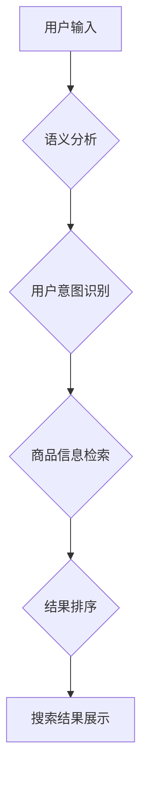

                 

## 自然语言处理技术在电商搜索中的突破

> 关键词：自然语言处理，电商搜索，推荐系统，语义理解，用户意图，信息检索，机器学习，深度学习

## 1. 背景介绍

电商平台作为现代商业的重要组成部分，其搜索引擎扮演着至关重要的角色。用户通过搜索引擎输入关键词，期望快速找到心仪商品。传统的基于关键词匹配的搜索方式，往往难以准确理解用户真实需求，导致搜索结果不精准，用户体验下降。

近年来，随着自然语言处理（NLP）技术的飞速发展，电商搜索迎来了新的突破。NLP技术能够理解和处理人类语言，赋予搜索引擎更强大的语义理解能力，从而提升搜索结果的准确性和用户体验。

## 2. 核心概念与联系

### 2.1  电商搜索的核心问题

电商搜索的核心问题在于如何准确理解用户搜索意图，并将其映射到商品信息中，从而返回最相关的搜索结果。

### 2.2  NLP技术在电商搜索中的应用

NLP技术在电商搜索中主要应用于以下几个方面：

* **语义理解:**  理解用户搜索词背后的真实含义，识别关键词之间的关系和上下文信息。
* **用户意图识别:**  判断用户搜索的目的是寻找商品信息、比较价格、了解产品评价等。
* **商品信息提取:**  从商品描述、属性等信息中提取关键信息，构建商品的语义表示。
* **搜索结果排序:**  根据用户搜索意图和商品信息，对搜索结果进行排序，返回最相关的商品。

### 2.3  NLP技术与电商搜索架构

NLP技术与电商搜索架构的结合，构建了一个更加智能化的搜索系统。



## 3. 核心算法原理 & 具体操作步骤

### 3.1  算法原理概述

在电商搜索中，常用的NLP算法包括：

* **词嵌入:** 将词语映射到低维向量空间，捕捉词语之间的语义关系。
* **BERT:** 基于Transformer架构的预训练语言模型，能够理解上下文信息，提升语义理解能力。
* **深度神经网络:** 用于用户意图识别、商品信息提取等任务，能够学习复杂的特征表示。

### 3.2  算法步骤详解

**词嵌入算法步骤:**

1. **构建词语词典:** 将所有出现的词语收集起来，并建立一个唯一的词语索引。
2. **计算词语向量:** 使用词频、共现关系等信息，计算每个词语的向量表示。
3. **训练词嵌入模型:** 使用训练数据，训练词嵌入模型，使得相似的词语拥有相似的向量表示。

**BERT算法步骤:**

1. **预训练:** 在大量的文本数据上预训练BERT模型，学习语言的语法和语义知识。
2. **微调:** 将预训练的BERT模型微调到特定的电商搜索任务，例如用户意图识别、商品信息提取等。
3. **预测:** 使用微调后的BERT模型，对用户搜索词进行分析，预测用户意图或提取商品信息。

### 3.3  算法优缺点

**词嵌入算法:**

* **优点:** 能够捕捉词语之间的语义关系，提升搜索结果的准确性。
* **缺点:** 无法理解上下文信息，对于长文本的语义理解能力有限。

**BERT算法:**

* **优点:** 能够理解上下文信息，提升语义理解能力，适用于各种电商搜索任务。
* **缺点:** 计算量大，训练成本高。

### 3.4  算法应用领域

* **商品搜索:** 理解用户搜索意图，返回最相关的商品结果。
* **个性化推荐:** 根据用户的搜索历史和偏好，推荐个性化的商品。
* **商品分类:** 自动识别商品类别，提高商品管理效率。
* **用户问答:** 回答用户关于商品的疑问。

## 4. 数学模型和公式 & 详细讲解 & 举例说明

### 4.1  数学模型构建

词嵌入模型通常使用神经网络结构，例如Word2Vec或GloVe，将词语映射到低维向量空间。

**Word2Vec模型:**

Word2Vec模型使用神经网络结构，将词语表示为向量。模型训练目标是预测上下文词语，从而学习词语之间的语义关系。

**GloVe模型:**

GloVe模型基于全局词共现矩阵，使用矩阵分解的方法学习词语向量。

### 4.2  公式推导过程

**Word2Vec模型的损失函数:**

$$
L = -\sum_{i=1}^{N} \sum_{j \in C(w_i)} \log p(w_j | w_i)
$$

其中：

* $N$ 是训练语料库中词语总数。
* $w_i$ 是当前词语。
* $C(w_i)$ 是当前词语的上下文词语集合。
* $p(w_j | w_i)$ 是给定当前词语 $w_i$，预测上下文词语 $w_j$ 的概率。

**GloVe模型的损失函数:**

$$
L = \sum_{i,j} f(|w_i - w_j|) \cdot (X_{ij} - \hat{X}_{ij})^2
$$

其中：

* $w_i$ 和 $w_j$ 是词语 $i$ 和 $j$ 的向量表示。
* $X_{ij}$ 是词语 $i$ 和 $j$ 的全局共现计数。
* $\hat{X}_{ij}$ 是模型预测的共现计数。
* $f(x)$ 是一个非线性函数，用于对共现计数进行归一化。

### 4.3  案例分析与讲解

**词嵌入模型案例:**

使用Word2Vec模型训练词语向量，可以发现“国王”和“女王”之间的语义关系。

**BERT模型案例:**

使用BERT模型微调到电商搜索任务，可以提升商品搜索的准确性。例如，对于用户搜索“红色长裙”，BERT模型可以理解用户意图是寻找红色长裙，并返回相关的商品结果。

## 5. 项目实践：代码实例和详细解释说明

### 5.1  开发环境搭建

* Python 3.6+
* TensorFlow 或 PyTorch
* NLTK、spaCy 等 NLP 库

### 5.2  源代码详细实现

```python
# 使用BERT模型进行商品搜索

from transformers import AutoTokenizer, AutoModelForSequenceClassification

# 加载预训练模型和词典
tokenizer = AutoTokenizer.from_pretrained("bert-base-uncased")
model = AutoModelForSequenceClassification.from_pretrained("bert-base-uncased")

# 用户输入
query = "红色长裙"

# 将用户输入转换为BERT模型输入格式
inputs = tokenizer(query, return_tensors="pt")

# 使用BERT模型进行预测
outputs = model(**inputs)

# 获取预测结果
predicted_class = outputs.logits.argmax().item()

# 根据预测结果返回相关商品
# ...
```

### 5.3  代码解读与分析

* 使用`transformers`库加载预训练的BERT模型和词典。
* 将用户输入转换为BERT模型输入格式，并使用模型进行预测。
* 根据预测结果，返回相关商品。

### 5.4  运行结果展示

运行代码后，模型将预测用户搜索意图，并返回相关的商品结果。

## 6. 实际应用场景

### 6.1  电商搜索引擎

NLP技术在电商搜索引擎中应用广泛，例如：

* **精准搜索:** 理解用户搜索意图，返回更精准的搜索结果。
* **个性化推荐:** 根据用户的搜索历史和偏好，推荐个性化的商品。
* **语音搜索:** 支持语音输入，提升用户体验。

### 6.2  智能客服

NLP技术可以用于构建智能客服系统，例如：

* **自动回复:** 自动回复用户的常见问题。
* **问题分类:** 将用户的疑问分类到不同的类别，并进行相应的处理。
* **对话理解:** 理解用户的对话意图，提供更精准的帮助。

### 6.3  商品描述生成

NLP技术可以用于自动生成商品描述，例如：

* **关键词提取:** 从商品信息中提取关键词，用于生成商品描述。
* **文本生成:** 使用生成式模型，自动生成商品描述文本。

### 6.4  未来应用展望

随着NLP技术的不断发展，其在电商领域的应用将更加广泛，例如：

* **多模态搜索:** 支持图片、视频等多模态输入，提升搜索体验。
* **跨语言搜索:** 支持多种语言的搜索，满足全球用户的需求。
* **个性化商品设计:** 根据用户的需求，自动设计个性化的商品。

## 7. 工具和资源推荐

### 7.1  学习资源推荐

* **Stanford NLP Group:** https://nlp.stanford.edu/
* **ACL Anthology:** https://aclanthology.org/
* **Hugging Face:** https://huggingface.co/

### 7.2  开发工具推荐

* **TensorFlow:** https://www.tensorflow.org/
* **PyTorch:** https://pytorch.org/
* **spaCy:** https://spacy.io/

### 7.3  相关论文推荐

* **BERT: Pre-training of Deep Bidirectional Transformers for Language Understanding:** https://arxiv.org/abs/1810.04805
* **Word2Vec Parameter Learning Explained:** https://arxiv.org/abs/1301.3781
* **GloVe: Global Vectors for Word Representation:** https://nlp.stanford.edu/projects/glove/

## 8. 总结：未来发展趋势与挑战

### 8.1  研究成果总结

NLP技术在电商搜索领域取得了显著的成果，例如：

* **语义理解能力提升:** BERT等模型能够更好地理解用户搜索意图。
* **搜索结果准确性提高:** NLP技术能够返回更精准的搜索结果。
* **用户体验提升:** 语音搜索、个性化推荐等功能提升了用户体验。

### 8.2  未来发展趋势

* **多模态搜索:** 支持图片、视频等多模态输入，提升搜索体验。
* **跨语言搜索:** 支持多种语言的搜索，满足全球用户的需求。
* **个性化商品设计:** 根据用户的需求，自动设计个性化的商品。

### 8.3  面临的挑战

* **数据标注:** 训练高质量的NLP模型需要大量的标注数据，标注成本高。
* **模型解释性:** 许多NLP模型是黑盒模型，难以解释其决策过程。
* **公平性与偏见:** NLP模型可能存在公平性与偏见问题，需要进行相应的解决。

### 8.4  研究展望

未来研究方向包括：

* **开发更强大的NLP模型:** 提升模型的语义理解能力和泛化能力。
* **提高模型解释性:** 研究可解释的NLP模型，使得模型决策过程更加透明。
* **解决公平性与偏见问题:** 开发公平、无偏的NLP模型，确保模型的公正性。

## 9. 附录：常见问题与解答

**Q1: 如何选择合适的NLP模型？**

**A1:** 选择合适的NLP模型需要根据具体的应用场景和数据特点进行选择。例如，对于商品搜索任务，BERT模型通常效果较好。

**Q2: 如何评估NLP模型的性能？**

**A2:** 常见的评估指标包括准确率、召回率、F1-score等。

**Q3: 如何解决NLP模型的公平性与偏见问题？**

**A3:** 可以通过数据预处理、模型训练方法等方式来解决NLP模型的公平性与偏见问题。


作者：禅与计算机程序设计艺术 / Zen and the Art of Computer Programming 
<end_of_turn>

