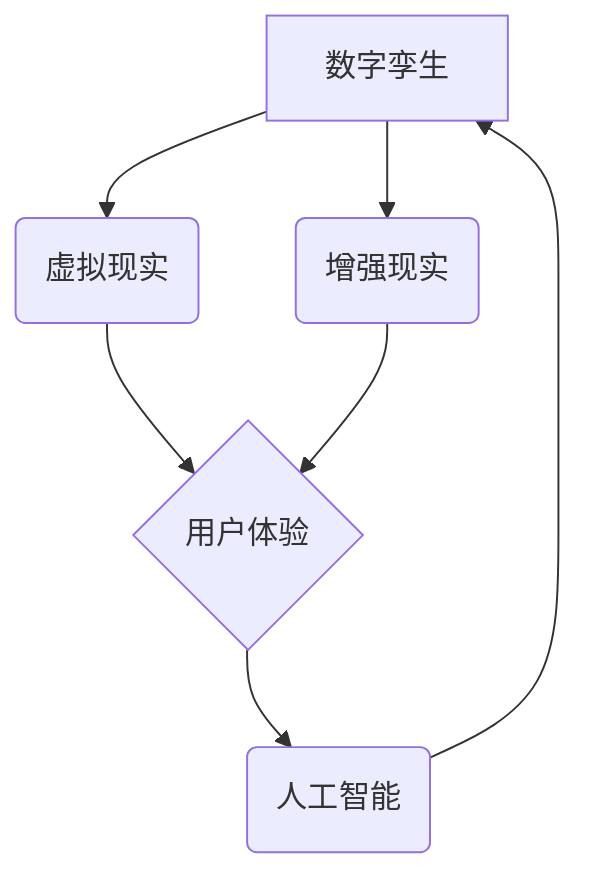

                 

## 虚拟博物馆:全球文化遗产的数字化展示

> 关键词：虚拟现实、增强现实、数字孪生、文化遗产、博物馆数字化、3D建模、人工智能、云计算

## 1. 背景介绍

随着科技的飞速发展，虚拟现实 (VR)、增强现实 (AR) 和数字孪生等技术的不断成熟，数字博物馆的概念逐渐从科幻小说走向现实。虚拟博物馆作为一种全新的文化展示形式，利用数字技术对传统博物馆进行革新，打破了时间和空间的限制，为用户提供更加沉浸式、互动性和个性化的体验。

传统博物馆面临着诸多挑战，例如：

* **空间限制:**  博物馆的展厅面积有限，无法容纳所有文物和艺术品。
* **参观体验单一:**  传统的参观方式较为被动，缺乏互动性和趣味性。
* **文物保护:**  文物长期暴露在空气中容易受到损害，需要严格的保护措施。
* **信息传递有限:**  博物馆的讲解往往局限于文字和语音，难以深入地展现文物背后的故事和文化内涵。

虚拟博物馆通过数字化手段，可以有效解决这些问题，为用户提供更加丰富、便捷、安全的文化体验。

## 2. 核心概念与联系

虚拟博物馆的核心概念包括：

* **数字孪生:**  利用3D建模技术，构建文物和展厅的虚拟模型，实现与现实世界的实时同步。
* **虚拟现实 (VR):**  通过头戴式设备，将用户沉浸到虚拟博物馆的环境中，体验身临其境的感觉。
* **增强现实 (AR):**  通过手机或平板电脑摄像头，将虚拟元素叠加到现实世界中，例如在文物上显示相关信息或历史背景。
* **人工智能 (AI):**  利用AI技术，实现虚拟博物馆的智能化服务，例如语音识别、个性化推荐、文物识别等。

**核心概念架构**



## 3. 核心算法原理 & 具体操作步骤

### 3.1  算法原理概述

虚拟博物馆的核心算法主要包括：

* **3D建模算法:**  用于构建文物和展厅的虚拟模型。常用的算法包括扫描建模、手绘建模、参数建模等。
* **纹理贴图算法:**  用于给虚拟模型添加材质和纹理，使其更加逼真。
* **光照渲染算法:**  用于模拟光线照射虚拟模型，使其更加生动。
* **路径规划算法:**  用于规划用户在虚拟博物馆中的移动路线。
* **自然语言处理算法:**  用于理解用户的语音指令和文本输入，并提供相应的服务。

### 3.2  算法步骤详解

**3D建模算法步骤:**

1. **数据采集:**  使用3D扫描仪、相机或其他设备采集文物和展厅的真实数据。
2. **数据处理:**  对采集到的数据进行预处理，例如去除噪声、修复缺失部分等。
3. **模型构建:**  根据处理后的数据，使用3D建模软件构建虚拟模型。
4. **模型优化:**  对虚拟模型进行优化，例如简化模型复杂度、提高模型精度等。

**纹理贴图算法步骤:**

1. **纹理采集:**  使用相机或其他设备采集文物和展厅的纹理图像。
2. **纹理处理:**  对采集到的纹理图像进行处理，例如调整颜色、对比度等。
3. **纹理贴图:**  将处理后的纹理图像贴到虚拟模型上。

### 3.3  算法优缺点

**优点:**

* **逼真度高:**  利用3D建模技术，可以构建逼真的虚拟模型，还原文物和展厅的真实细节。
* **互动性强:**  用户可以自由地探索虚拟博物馆，与文物进行互动，体验更加沉浸式的参观体验。
* **信息丰富:**  虚拟博物馆可以嵌入丰富的文字、图像、视频等信息，为用户提供更加全面的文物知识。
* **文物保护:**  虚拟博物馆可以保护文物免受物理损害，延长文物寿命。

**缺点:**

* **技术门槛高:**  构建虚拟博物馆需要专业的3D建模、纹理贴图、光照渲染等技术，技术门槛较高。
* **成本高昂:**  3D建模、数据处理、服务器租赁等环节都需要投入大量资金。
* **网络依赖:**  虚拟博物馆需要依赖网络环境，网络不稳定可能会影响用户体验。

### 3.4  算法应用领域

虚拟博物馆的算法技术可以应用于以下领域:

* **文化遗产保护:**  对文物进行数字化保存，防止文物丢失或损坏。
* **教育教学:**  为学生提供更加生动的学习体验，帮助他们更好地理解历史文化。
* **旅游业:**  打造虚拟旅游景点，吸引更多游客。
* **艺术展示:**  为艺术家提供新的展示平台，让艺术作品更加广泛地传播。

## 4. 数学模型和公式 & 详细讲解 & 举例说明

### 4.1  数学模型构建

虚拟博物馆的构建需要利用多种数学模型，例如：

* **3D空间坐标系:**  用于描述文物和展厅的位置和姿态。
* **光线追踪算法:**  用于模拟光线在虚拟环境中的传播，实现逼真的光照效果。
* **纹理映射算法:**  用于将纹理图像映射到虚拟模型表面，使其更加逼真。

### 4.2  公式推导过程

**光线追踪算法:**

光线追踪算法的核心是模拟光线在虚拟环境中的传播路径。

假设一个光线从光源出发，经过物体表面反射或折射，最终到达用户的眼睛。我们可以用以下公式描述光线的传播路径:

$$
\mathbf{d} = \mathbf{o} + t \mathbf{v}
$$

其中:

* $\mathbf{d}$ 是光线在空间中的位置向量。
* $\mathbf{o}$ 是光线的发射点位置向量。
* $t$ 是光线传播距离。
* $\mathbf{v}$ 是光线的方向向量。

### 4.3  案例分析与讲解

**纹理映射算法:**

纹理映射算法可以将纹理图像映射到虚拟模型表面，使其更加逼真。

假设一个虚拟模型的表面是一个三角形网格，每个三角形都对应一个纹理坐标。我们可以用以下公式计算每个三角形顶点的纹理坐标:

$$
\mathbf{u} = \frac{\mathbf{p} - \mathbf{p}_0}{\mathbf{p}_1 - \mathbf{p}_0}
$$

其中:

* $\mathbf{u}$ 是纹理坐标。
* $\mathbf{p}$ 是三角形顶点的空间坐标。
* $\mathbf{p}_0$ 和 $\mathbf{p}_1$ 是纹理图像的左上角和右下角的坐标。

## 5. 项目实践：代码实例和详细解释说明

### 5.1  开发环境搭建

虚拟博物馆的开发环境需要包含以下软件:

* **3D建模软件:**  例如Blender、Maya、3ds Max等。
* **纹理编辑软件:**  例如Photoshop、GIMP等。
* **游戏引擎:**  例如Unity、Unreal Engine等。
* **编程语言:**  例如C#、C++等。

### 5.2  源代码详细实现

以下是一个简单的Unity游戏引擎中实现虚拟博物馆场景的代码示例:

```csharp
using UnityEngine;

public class VirtualMuseum : MonoBehaviour
{
    public GameObject museumModel; // 虚拟博物馆模型
    public GameObject artifactModel; // 文物模型

    void Start()
    {
        // 加载虚拟博物馆模型
        museumModel = Instantiate(Resources.Load("MuseumModel") as GameObject);
        museumModel.transform.position = Vector3.zero;

        // 加载文物模型
        artifactModel = Instantiate(Resources.Load("ArtifactModel") as GameObject);
        artifactModel.transform.position = new Vector3(5, 0, 0);
    }
}
```

### 5.3  代码解读与分析

这段代码实现了虚拟博物馆场景的基本功能:

* `museumModel` 和 `artifactModel` 变量分别存储虚拟博物馆模型和文物模型的GameObject对象。
* `Start()` 函数在游戏开始时执行，用于加载模型并设置其位置。
* `Instantiate()` 函数用于实例化预加载的模型资源。
* `Resources.Load()` 函数用于加载预加载的资源。

### 5.4  运行结果展示

运行这段代码后，虚拟博物馆场景将显示虚拟博物馆模型和文物模型，用户可以自由地移动视角，观察模型。

## 6. 实际应用场景

虚拟博物馆已经开始在一些博物馆和文化机构中得到应用，例如:

* **故宫博物院:**  利用VR技术，打造了故宫虚拟博物馆，用户可以身临其境地体验故宫的建筑风格和历史文化。
* **英国大英博物馆:**  利用AR技术，为文物添加互动信息，用户可以通过手机或平板电脑扫描文物，查看其历史背景、制作工艺等信息。
* **美国纽约大都会艺术博物馆:**  利用数字孪生技术，构建了博物馆的虚拟模型，用户可以在线上浏览博物馆的藏品和展览信息。

### 6.4  未来应用展望

未来，虚拟博物馆将更加智能化、个性化和交互式。例如:

* **AI驱动的虚拟导游:**  利用AI技术，虚拟博物馆可以提供个性化的导游服务，根据用户的兴趣爱好推荐相应的文物和展览。
* **沉浸式体验:**  利用VR和AR技术，虚拟博物馆可以提供更加沉浸式的体验，例如用户可以身临其境地体验古代文明的场景。
* **跨越时空的文化交流:**  虚拟博物馆可以打破地域和时间限制，让用户可以随时随地访问全球的文化遗产。

## 7. 工具和资源推荐

### 7.1  学习资源推荐

* **Unity官方文档:**  https://docs.unity3d.com/
* **Unreal Engine官方文档:**  https://docs.unrealengine.com/
* **Blender官方文档:**  https://docs.blender.org/

### 7.2  开发工具推荐

* **Unity:**  https://unity.com/
* **Unreal Engine:**  https://www.unrealengine.com/
* **Blender:**  https://www.blender.org/

### 7.3  相关论文推荐

* **Virtual Reality in Museums: A Review of the Literature**
* **Augmented Reality in Museums: A Review of the Literature**
* **Digital Twins for Cultural Heritage Preservation**

## 8. 总结：未来发展趋势与挑战

### 8.1  研究成果总结

虚拟博物馆作为一种新型的文化展示形式，已经取得了显著的成果，为文化遗产的保护、教育教学和艺术展示提供了新的途径。

### 8.2  未来发展趋势

未来，虚拟博物馆将朝着更加智能化、个性化和交互式的方向发展，例如:

* **AI驱动的虚拟导游:**  利用AI技术，虚拟博物馆可以提供更加个性化的导游服务，根据用户的兴趣爱好推荐相应的文物和展览。
* **沉浸式体验:**  利用VR和AR技术，虚拟博物馆可以提供更加沉浸式的体验，例如用户可以身临其境地体验古代文明的场景。
* **跨越时空的文化交流:**  虚拟博物馆可以打破地域和时间限制，让用户可以随时随地访问全球的文化遗产。

### 8.3  面临的挑战

虚拟博物馆的发展也面临着一些挑战，例如:

* **技术门槛高:**  构建虚拟博物馆需要专业的3D建模、纹理贴图、光照渲染等技术，技术门槛较高。
* **成本高昂:**  3D建模、数据处理、服务器租赁等环节都需要投入大量资金。
* **网络依赖:**  虚拟博物馆需要依赖网络环境，网络不稳定可能会影响用户体验。

### 8.4  研究展望

未来，我们需要继续加强虚拟博物馆技术的研发，降低技术门槛，降低成本，提高用户体验，让虚拟博物馆成为更加普及的文化展示形式。

## 9. 附录：常见问题与解答

**常见问题:**

* **虚拟博物馆和传统博物馆有什么区别?**

虚拟博物馆利用数字技术，打破了时间和空间的限制，可以提供更加沉浸式、互动性和个性化的体验。传统博物馆则以实体文物为主，参观体验相对单一。

* **如何构建虚拟博物馆?**

构建虚拟博物馆需要专业的3D建模、纹理贴图、光照渲染等技术，以及相应的软件和硬件设备。

* **虚拟博物馆的应用场景有哪些?**

虚拟博物馆可以应用于文化遗产保护、教育教学、旅游业、艺术展示等领域。

**解答:**

* 虚拟博物馆和传统博物馆各有优缺点，两者可以相互补充，共同促进文化传承和发展。
* 构建虚拟博物馆需要专业的技术和资源，建议寻求专业的技术团队或机构的帮助。
* 虚拟博物馆的应用场景非常广泛，未来将会有更多新的应用场景出现。


作者：禅与计算机程序设计艺术 / Zen and the Art of Computer Programming 
<end_of_turn>

