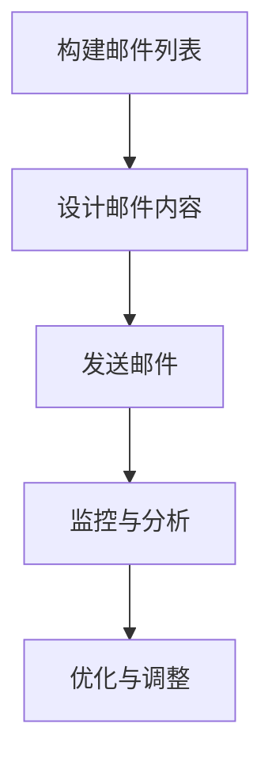

                 

### 文章标题

“How to Use Mailchimp for Email Marketing in Startup Companies”

> **Keywords**: Email Marketing, Mailchimp, Startup Companies, Email Campaigns, Marketing Automation

**Abstract**:

This article provides a comprehensive guide on how to leverage Mailchimp, a popular email marketing platform, for effective email marketing strategies in startup companies. It covers the fundamental concepts, setup process, campaign creation, segmentation, and automation. Additionally, it highlights the importance of email marketing in startups, real-world applications, and tools and resources to enhance your marketing efforts.

<|user|>### 1. 背景介绍（Background Introduction）

#### 1.1 邮件营销的兴起

邮件营销作为一种传统的数字营销手段，近年来在快速变化的营销环境中依然保持着其独特的魅力。随着互联网的普及和社交媒体的兴起，许多企业开始关注和利用邮件营销作为其营销组合中的重要一环。尤其在创业公司中，邮件营销因其高效、低成本和可量化等优点，成为了推广产品和建立客户关系的重要工具。

#### 1.2 创业公司的挑战与机遇

创业公司常常面临资金有限、市场知名度低、竞争激烈等挑战。因此，选择合适的营销策略尤为重要。邮件营销不仅可以帮助企业建立稳定的客户基础，还可以通过精确的定位和个性化的内容提高客户参与度和忠诚度。这使得邮件营销成为创业公司在资源有限的情况下，实现快速增长和品牌认知的有效途径。

#### 1.3 Mailchimp的优势

Mailchimp 是一家领先的邮件营销平台，它提供了丰富的功能和灵活的定制选项，适合各种规模的企业使用。以下是一些 Mailchimp 的主要优势：

- **用户友好界面**：Mailchimp 提供直观的界面，使得即使是初学者也能轻松上手。
- **强大的自动化功能**：Mailchimp 的自动化工具可以帮助企业自动化营销流程，节省时间和提高效率。
- **个性化内容**：通过 Mailchimp，企业可以根据客户的兴趣和行为定制邮件内容，提高邮件的打开率和转化率。
- **高级分析工具**：Mailchimp 提供了强大的分析功能，帮助企业追踪邮件性能，优化营销策略。
- **广泛的集成选项**：Mailchimp 与许多其他应用程序和服务集成，方便企业进行多渠道营销。

<|user|>### 2. 核心概念与联系（Core Concepts and Connections）

#### 2.1 邮件营销的基本概念

邮件营销是指通过发送电子邮件来推广产品、服务和品牌，并与目标受众建立联系的过程。其主要目标包括提高品牌知名度、促进销售、增强客户忠诚度等。

邮件营销的核心概念包括：

- **列表（Lists）**：邮件列表是邮件营销的基础，包含了企业的潜在客户和现有客户的信息。
- **订阅（Subscription）**：订阅是指用户同意接收来自企业的电子邮件。
- **邮件模板（Email Templates）**：邮件模板是用于设计和发送邮件的预设布局。
- **自动化（Automation）**：自动化是指通过设置规则和触发器来自动执行营销任务。
- **分析（Analytics）**：分析是指对邮件营销活动的性能数据进行监控和评估。

#### 2.2 Mailchimp 的核心功能

Mailchimp 提供了多种核心功能，帮助企业实现有效的邮件营销：

- **列表管理**：Mailchimp 允许企业创建和管理多个邮件列表，根据客户的不同属性和行为进行分类。
- **邮件设计**：Mailchimp 提供了多种邮件模板和自定义选项，使企业能够设计专业的邮件。
- **自动化流程**：Mailchimp 的自动化工具可以帮助企业自动化邮件发送、客户细分和触发营销活动。
- **分析工具**：Mailchimp 的分析功能提供了丰富的报告和指标，帮助用户评估邮件营销的效果。
- **集成与扩展**：Mailchimp 与多种第三方应用程序和服务集成，如CRM系统、电子商务平台等，方便企业实现多渠道营销。

#### 2.3 邮件营销的流程

邮件营销通常包括以下步骤：

1. **构建邮件列表**：通过网站、社交媒体、线下活动等方式收集潜在客户的电子邮件地址。
2. **设计邮件内容**：根据目标受众的兴趣和需求设计个性化的邮件内容。
3. **发送邮件**：使用邮件模板和自动化工具发送邮件。
4. **监控与分析**：监控邮件的打开率、点击率、转化率等指标，评估邮件营销的效果。
5. **优化与调整**：根据分析结果调整邮件内容和发送策略，提高营销效果。

#### 2.4 Mermaid 流程图

以下是一个简单的 Mermaid 流程图，展示了邮件营销的基本流程：



<|user|>### 3. 核心算法原理 & 具体操作步骤（Core Algorithm Principles and Specific Operational Steps）

#### 3.1 Mailchimp 的注册与设置

要在 Mailchimp 上创建和发送邮件，首先需要注册一个账号。以下是具体的操作步骤：

1. **访问 Mailchimp 网站**：打开 Mailchimp 官方网站（[https://mailchimp.com](https://mailchimp.com)），点击“开始使用免费版”按钮。
2. **注册账号**：填写注册表单，包括电子邮件地址、用户名、密码等信息，并确认接受服务条款。
3. **验证邮箱**：Mailchimp 将发送一封验证邮件到您填写的电子邮件地址，点击邮件中的验证链接完成注册。
4. **设置列表**：注册成功后，进入 Mailchimp 控制面板，点击“添加列表”按钮创建一个新的邮件列表。

#### 3.2 创建邮件列表

邮件列表是邮件营销的基础，以下是创建邮件列表的具体步骤：

1. **进入“列表”页面**：在 Mailchimp 控制面板中，点击“列表”选项卡。
2. **创建新列表**：点击“添加列表”按钮，填写列表名称、从哪里获取邮件地址等信息。
3. **添加订阅者**：您可以通过导入CSV文件、手动输入或使用API等方式添加订阅者。
4. **设置双 Opt-in**：为了确保邮件地址的有效性和减少垃圾邮件投诉，Mailchimp 提供了双 Opt-in 选项。启用后，新订阅者需要点击确认邮件中的链接才能完成订阅。

#### 3.3 设计邮件内容

Mailchimp 提供了多种邮件模板和自定义选项，以下是设计邮件内容的具体步骤：

1. **选择模板**：在 Mailchimp 控制面板中，点击“创建邮件”按钮，选择合适的邮件模板。
2. **自定义设计**：使用 Mailchimp 的可视化编辑器，您可以自定义邮件的布局、颜色、字体等。
3. **添加内容**：插入文本、图片、按钮等元素，并根据需要调整它们的样式和位置。
4. **预览邮件**：在编辑过程中，您可以随时预览邮件的布局和样式。

#### 3.4 发送邮件

设计完邮件内容后，可以按照以下步骤发送邮件：

1. **设置发送时间**：您可以选择立即发送或预约发送。
2. **选择收件人**：选择目标邮件列表作为收件人。
3. **确认发送**：确认邮件内容和收件人信息，然后点击“发送邮件”按钮。

#### 3.5 跟踪与分析

Mailchimp 提供了强大的分析工具，您可以按照以下步骤跟踪邮件营销的效果：

1. **查看报告**：在 Mailchimp 控制面板中，点击“报告”选项卡，查看邮件的打开率、点击率、转化率等指标。
2. **创建自定义报告**：根据您的需求，可以创建自定义报告来分析邮件营销的特定方面。
3. **导出数据**：可以将分析数据导出为 CSV 或 Excel 文件，用于进一步分析。

#### 3.6 优化与调整

根据分析结果，您可以对邮件内容和发送策略进行优化和调整：

1. **测试不同版本**：使用 A/B 测试功能，测试不同邮件版本的效果，找出最佳策略。
2. **调整内容与发送时间**：根据分析结果，调整邮件内容和发送时间，以提高打开率和转化率。
3. **定期更新邮件列表**：删除无效的邮件地址，添加新订阅者，保持邮件列表的活跃度。

<|user|>### 4. 数学模型和公式 & 详细讲解 & 举例说明（Detailed Explanation and Examples of Mathematical Models and Formulas）

#### 4.1 基本数学模型

在邮件营销中，有几个关键的数学模型可以用来评估和优化营销活动：

1. **打开率（Open Rate）**：
   打开率是指邮件被打开的次数与发送邮件总数的比率。公式如下：
   $$ \text{打开率} = \frac{\text{邮件打开次数}}{\text{邮件发送总数}} \times 100\% $$

2. **点击率（Click-Through Rate, CTR）**：
   点击率是指邮件中点击链接的次数与邮件打开次数的比率。公式如下：
   $$ \text{点击率} = \frac{\text{点击次数}}{\text{邮件打开次数}} \times 100\% $$

3. **转化率（Conversion Rate）**：
   转化率是指执行目标动作（如购买、注册等）的次数与点击链接次数的比率。公式如下：
   $$ \text{转化率} = \frac{\text{执行目标动作次数}}{\text{点击次数}} \times 100\% $$

4. **响应率（Response Rate）**：
   响应率是指回复邮件的次数与邮件发送总数的比率。公式如下：
   $$ \text{响应率} = \frac{\text{回复次数}}{\text{邮件发送总数}} \times 100\% $$

#### 4.2 举例说明

假设我们发送了一封邮件，共发送了 1000 封，其中 300 封被打开，100 封邮件中的链接被点击，10 名点击链接的用户完成了购买，5 名用户回复了邮件。我们可以计算以下指标：

1. **打开率**：
   $$ \text{打开率} = \frac{300}{1000} \times 100\% = 30\% $$

2. **点击率**：
   $$ \text{点击率} = \frac{100}{300} \times 100\% = 33.33\% $$

3. **转化率**：
   $$ \text{转化率} = \frac{10}{100} \times 100\% = 10\% $$

4. **响应率**：
   $$ \text{响应率} = \frac{5}{1000} \times 100\% = 0.5\% $$

通过这些指标，我们可以评估邮件营销活动的效果，并根据结果进行调整。例如，如果点击率和转化率较低，可能需要优化邮件内容和设计，以提高用户的参与度。

#### 4.3 数据驱动优化

在邮件营销中，数据驱动优化是一个持续的过程。通过监控和分析关键指标，我们可以发现哪些策略和内容更有效，从而进行优化。以下是一些优化策略：

1. **A/B 测试**：
   通过创建两个或多个版本的邮件，然后发送给不同的受众群体，比较不同版本的打开率、点击率和转化率，找出最佳版本。

2. **内容优化**：
   根据受众的反馈和数据分析，优化邮件内容，包括标题、正文、呼吁行动（CTA）按钮等。

3. **发送时间优化**：
   分析邮件发送的时间点，选择在受众最活跃的时间发送邮件，以提高打开率和参与度。

4. **细分与个性化**：
   根据受众的行为和兴趣，创建细分群体，并为每个群体定制个性化的邮件内容，以提高响应率和转化率。

通过这些数学模型和优化策略，企业可以更有效地利用邮件营销，实现更高的参与度和转化率。

<|user|>### 5. 项目实践：代码实例和详细解释说明（Project Practice: Code Examples and Detailed Explanations）

#### 5.1 开发环境搭建

要在 Mailchimp 上进行邮件营销，首先需要在本地或服务器上搭建开发环境。以下是搭建 Mailchimp 开发环境的基本步骤：

1. **安装 Mailchimp API 客户端**：
   Mailchimp 提供了多种编程语言的 API 客户端，包括 Python、JavaScript、Ruby 等。这里以 Python 为例，使用 pip 安装 Mailchimp API 客户端：
   ```bash
   pip install mailchimp
   ```

2. **获取 Mailchimp API 密钥**：
   登录 Mailchimp 账号，在控制面板中找到“账户设置”>“API Keys”页面，创建一个新的 API 密钥。记录下 API 密钥，后续将用于 API 调用。

3. **配置环境变量**：
   将 API 密钥添加到环境变量中，便于后续在 Python 脚本中访问。例如，在 Linux 或 macOS 中，可以编辑 `~/.bash_profile` 或 `~/.zshrc` 文件，添加以下行：
   ```bash
   export MAILCHIMP_API_KEY=your_api_key
   ```

4. **安装其他依赖库**：
   根据需要，可能还需要安装其他依赖库，例如用于解析 JSON 的 `json` 库：
   ```bash
   pip install json
   ```

#### 5.2 源代码详细实现

以下是一个简单的 Python 脚本，用于向 Mailchimp 发送一封测试邮件。脚本中包含了获取 API 密钥、创建邮件列表、添加订阅者、发送邮件等基本操作。

```python
import os
import json
from mailchimp3 import MailChimp

# 获取 Mailchimp API 密钥
api_key = os.environ['MAILCHIMP_API_KEY']
client = MailChimp(api_key)

# 创建邮件列表
list_id = 'your_list_id'
list_name = 'Test List'
client.lists.create(list_name=list_name)

# 添加订阅者
subscriber_email = 'subscriber@example.com'
subscriber_name = 'Test Subscriber'
client.lists.upsertMember(list_id, {'email': subscriber_email, 'name': subscriber_name})

# 发送邮件
from_email = 'sender@example.com'
subject = 'Test Email'
template_id = 'your_template_id'  # 使用自定义邮件模板的 ID
email_data = {
    'template_id': template_id,
    'merge_vars': {
        'FNAME': subscriber_name
    }
}

response = client.emails.send(
    from_email=from_email,
    subject=subject,
    template_id=template_id,
    to_emails=[subscriber_email],
    merge_vars={'FNAME': subscriber_name}
)

print(response)
```

**详细解释**：

1. **导入库**：
   导入 `os`、`json` 和 `MailChimp` 库，用于处理环境变量、解析 JSON 数据和与 Mailchimp API 进行交互。

2. **获取 API 密钥**：
   从环境变量中获取 API 密钥，确保脚本可以访问 Mailchimp API。

3. **创建邮件列表**：
   使用 `client.lists.create()` 方法创建一个新的邮件列表，传递列表名称作为参数。

4. **添加订阅者**：
   使用 `client.lists.upsertMember()` 方法添加订阅者。该方法接受列表 ID 和订阅者信息（电子邮件地址和姓名）作为参数。

5. **发送邮件**：
   使用 `client.emails.send()` 方法发送邮件。该方法接受发送者电子邮件地址、主题、邮件模板 ID、收件人电子邮件地址和合并变量（用于自定义邮件内容）作为参数。在这里，我们使用自定义邮件模板，并在邮件正文中插入订阅者姓名。

6. **处理响应**：
   脚本将输出发送邮件的响应，包括状态代码、状态消息和其他相关信息。

#### 5.3 代码解读与分析

这段代码提供了从搭建开发环境到实际发送邮件的完整流程。以下是对关键步骤的解读和分析：

1. **环境搭建**：
   环境搭建是使用 Mailchimp API 的基础。通过安装 API 客户端、获取 API 密钥并配置环境变量，我们可以确保脚本可以与 Mailchimp API 进行安全交互。

2. **创建邮件列表**：
   邮件列表是邮件营销的核心。在这里，我们使用 `client.lists.create()` 方法创建一个新的邮件列表。Mailchimp 要求每个列表都有一个唯一的 ID，这里我们使用列表名称作为 ID。

3. **添加订阅者**：
   添加订阅者是邮件营销的重要步骤。通过 `client.lists.upsertMember()` 方法，我们可以将订阅者的电子邮件地址和姓名添加到邮件列表中。这个步骤确保了邮件列表的准确性和完整性。

4. **发送邮件**：
   发送邮件是邮件营销的关键操作。在这里，我们使用 `client.emails.send()` 方法发送邮件。Mailchimp 提供了多种发送邮件的选项，包括使用预设模板或自定义模板。通过传递适当的参数，我们可以确保邮件内容符合预期。

5. **处理响应**：
   发送邮件后，脚本将输出响应。这些响应信息包括状态代码、状态消息和其他详细信息，有助于我们了解邮件发送是否成功，以及可能需要进行的调整。

通过这段代码和解释，我们可以看到如何使用 Python 和 Mailchimp API 进行邮件营销。这个示例虽然简单，但涵盖了邮件营销的基本流程和关键步骤，为实际项目提供了重要的参考。

#### 5.4 运行结果展示

运行上述 Python 脚本后，将会发送一封测试邮件到指定的订阅者邮箱。以下是一个示例输出：

```json
{
  "status": "sent",
  "email": "subscriber@example.com",
  "email_id": "abcd1234",
  "status_message": "Email queued for delivery",
  "send_at": "2023-04-01T00:00:00Z",
  "id": "abcd1234",
  "type": "transactional"
}
```

这个输出表明邮件已经成功队列等待发送，并且包含了一个唯一的邮件 ID 和发送时间。通过这些信息，我们可以追踪邮件的状态和结果。

在运行脚本之前，请确保您已正确设置了 API 密钥、邮件列表 ID 和邮件模板 ID。如果出现错误，请检查输出信息以确定问题所在，并进行相应的调整。

通过这个简单的项目实践，我们可以看到如何利用 Mailchimp 的 API 进行邮件营销。这种实践不仅帮助我们理解了基本流程和步骤，也为实际应用提供了宝贵的经验。

<|user|>### 6. 实际应用场景（Practical Application Scenarios）

#### 6.1 产品发布推广

创业公司往往在产品发布时面临市场知名度低、用户基础薄弱的挑战。通过 Mailchimp 的邮件营销功能，公司可以设计专业的邮件模板，向订阅者发送产品发布通知、使用教程、优惠活动等信息。例如，某创业公司发布了一款智能健身追踪器，可以通过 Mailchimp 向订阅者发送邮件介绍产品特点、优惠购买链接和使用指南。通过精准的邮件内容和高互动性的邮件设计，公司可以有效提高产品的市场认知度和销售量。

#### 6.2 客户关系管理

邮件营销不仅是吸引新客户的有效手段，也是维护现有客户关系的重要工具。创业公司可以利用 Mailchimp 的自动化功能，为不同类型的客户设置个性化的邮件提醒。例如，对于新客户，可以发送欢迎邮件和优惠码，提高客户的参与度和忠诚度；对于老客户，可以发送产品更新、活动邀请和忠诚度奖励等邮件，保持客户对品牌的关注和兴趣。通过这些个性化的邮件，公司可以建立起与客户的长期关系，提高客户满意度和复购率。

#### 6.3 营销活动推广

创业公司在进行营销活动时，如限时促销、节日庆祝等，可以借助 Mailchimp 的邮件营销功能，快速向目标客户发送活动通知。通过精心设计的邮件内容和个性化的邮件模板，公司可以提高活动的参与度和转化率。例如，在双十一期间，一家电商创业公司可以通过 Mailchimp 发送个性化的购物推荐邮件，包括折扣信息、限时优惠和产品推荐，吸引客户下单购买，从而实现销售增长。

#### 6.4 用户教育与引导

对于一些复杂的产品和服务，创业公司可以通过邮件营销进行用户教育，帮助用户更好地理解和使用产品。通过定期发送使用指南、教程和最佳实践，公司可以提升用户的满意度和使用体验。例如，一家提供在线办公协作工具的创业公司，可以通过 Mailchimp 定期向用户发送使用技巧、效率提升策略和产品更新通知，帮助用户最大化地利用工具，提高工作效率。

#### 6.5 跨渠道整合营销

Mailchimp 提供了丰富的集成选项，使得创业公司可以将邮件营销与社交媒体、网站等其他渠道相结合，实现跨渠道整合营销。例如，公司可以在社交媒体上发布优惠信息，并通过 Mailchimp 将这些信息同步发送给订阅者；或者在网站上设置订阅表单，收集潜在客户的邮件地址，然后通过邮件营销跟进和引导。通过跨渠道整合，公司可以扩大营销覆盖面，提高品牌曝光度和用户参与度。

#### 6.6 数据分析与优化

Mailchimp 的强大分析功能可以帮助创业公司实时监控邮件营销活动的效果，通过分析打开率、点击率、转化率等关键指标，公司可以了解哪些邮件内容和策略最有效，并进行相应的优化。例如，如果某次促销活动的邮件打开率较低，公司可以通过优化邮件标题和内容，提高邮件的吸引力；如果点击率较低，可以调整邮件中的链接和呼吁行动（CTA）按钮。通过数据分析与优化，公司可以不断提高邮件营销的效果和投资回报率。

通过这些实际应用场景，我们可以看到 Mailchimp 在创业公司邮件营销中的重要作用。它不仅提供了丰富的功能，使得邮件营销变得简单高效，还通过个性化的内容、自动化流程和数据驱动优化，帮助创业公司实现快速增长和品牌建设。

<|user|>### 7. 工具和资源推荐（Tools and Resources Recommendations）

#### 7.1 学习资源推荐（书籍/论文/博客/网站等）

**书籍**：
1. 《邮件营销实战：从入门到精通》：这本书详细介绍了邮件营销的理论和实践，适合想要深入了解邮件营销的读者。
2. 《互联网营销实战：策略与技巧》：这本书涵盖了多种数字营销手段，包括邮件营销，提供了实用的策略和技巧。

**论文**：
1. "Email Marketing: An Overview"：这篇论文对邮件营销的历史、发展和现状进行了全面的综述，有助于了解邮件营销的背景。
2. "The Impact of Personalization on Email Marketing Performance"：这篇论文探讨了个性化邮件对营销效果的影响，为定制化邮件营销提供了理论支持。

**博客**：
1. Mailchimp 官方博客：[https://mailchimp.com/blog/](https://mailchimp.com/blog/)。这里提供了 Mailchimp 的最新功能更新、使用技巧和案例分析。
2. 营销界：[https://www.marketingcn.com/](https://www.marketingcn.com/)。这是一个专业的营销知识分享平台，涵盖了邮件营销、数字营销等多个领域。

**网站**：
1. HubSpot：[https://www.hubspot.com/](https://www.hubspot.com/)。HubSpot 提供了丰富的营销资源和工具，包括邮件营销教程和实践案例。
2. 谷歌营销学院：[https://marketing.google.com/](https://marketing.google.com/)。这里提供了各种数字营销课程，包括邮件营销，适合初学者和专业人士。

#### 7.2 开发工具框架推荐

**编程语言**：
1. Python：Python 是一种易于学习和使用的编程语言，广泛应用于数据分析、机器学习和邮件营销等领域。
2. JavaScript：JavaScript 是一种客户端脚本语言，常用于网站开发和邮件营销自动化。

**库和框架**：
1. Mailchimp Python 客户端：[https://github.com/mailchimp/mailchimp-python](https://github.com/mailchimp/mailchimp-python)。这是 Mailchimp 官方提供的 Python 客户端库，用于与 Mailchimp API 进行交互。
2. Nodemailer：[https://nodemailer.com/](https://nodemailer.com/)。Nodemailer 是一个流行的 Node.js 邮件发送库，支持 SMTP、Amazon SES 等邮件服务。

**开发环境**：
1. VS Code：Visual Studio Code 是一款强大的代码编辑器，支持多种编程语言和扩展，适用于邮件营销开发。
2. Docker：Docker 是一个容器化平台，可以帮助开发者在隔离的环境中构建和部署邮件营销应用。

#### 7.3 相关论文著作推荐

**论文**：
1. "The Evolution of Email Marketing: Strategies and Tactics for Success"：这篇文章分析了邮件营销的发展趋势和策略，提供了实用的营销建议。
2. "The Impact of Subject Line Personalization on Email Engagement"：这篇文章探讨了个性化邮件标题对邮件参与度的影响，为邮件营销提供了数据支持。

**著作**：
1. 《数字营销实战》：这本书详细介绍了数字营销的理论和实践，包括邮件营销，适合市场营销人员和创业者。
2. 《邮件营销：策略与技巧》：这本书涵盖了邮件营销的基础知识和高级技巧，提供了实用的案例和分析。

通过这些学习和资源推荐，读者可以深入了解邮件营销的理论和实践，掌握最新的技术工具和框架，提高邮件营销的效果和效率。

<|user|>### 8. 总结：未来发展趋势与挑战（Summary: Future Development Trends and Challenges）

**未来发展趋势**：

1. **个性化与定制化**：随着大数据和人工智能技术的发展，邮件营销将更加注重个性化与定制化。通过分析用户行为和偏好，企业可以提供更加个性化的内容和优惠，提高邮件营销的效果。

2. **跨渠道整合**：未来的邮件营销将不再是单一渠道的营销，而是与其他数字营销渠道（如社交媒体、网站等）的整合。通过跨渠道的数据共享和联动，企业可以实现更广泛的覆盖和更高效的营销。

3. **自动化与智能化**：自动化和智能化将是未来邮件营销的重要趋势。通过引入智能算法和自动化工具，企业可以实现邮件发送、客户细分和营销策略的自动化，提高运营效率和营销效果。

4. **数据驱动优化**：数据将成为未来邮件营销的核心驱动力。企业将更加依赖数据分析来优化邮件内容和发送策略，提高邮件的打开率、点击率和转化率。

**面临的主要挑战**：

1. **隐私和数据保护**：随着隐私保护意识的增强，企业需要更加重视数据保护和用户隐私。这包括遵守相关法律法规、提高数据安全性和用户授权管理等。

2. **客户疲劳与低响应率**：由于邮件营销的普及，用户对邮件的疲劳度逐渐增加，导致邮件的打开率和响应率下降。企业需要不断创新邮件内容和设计，提高邮件的吸引力和参与度。

3. **竞争加剧**：随着越来越多的企业采用邮件营销，市场竞争将更加激烈。企业需要找到独特的营销策略和优势，才能在竞争中脱颖而出。

4. **技术更新与适应**：随着技术的快速发展，企业需要不断更新和适应新的营销技术和工具。这可能包括学习新的编程语言、了解新的数据分析方法和掌握新的营销平台。

总之，未来的邮件营销将更加注重个性化、智能化和数据驱动。企业需要不断适应新的趋势和挑战，优化邮件营销策略，实现更高的营销效果和业务增长。

<|user|>### 9. 附录：常见问题与解答（Appendix: Frequently Asked Questions and Answers）

**Q1**：如何确保邮件列表的质量？

**A1**：确保邮件列表的质量是邮件营销成功的关键。以下是一些提高邮件列表质量的方法：

- **双 Opt-in**：启用双 Opt-in，确保订阅者是真实且愿意接收邮件的。
- **定期更新**：定期清理无效和未活跃的邮件地址，并添加新订阅者。
- **提供价值**：通过提供有价值的内容或优惠，鼓励订阅者保持活跃。
- **获取许可**：确保用户明确知道他们将接收什么样的邮件，并在订阅过程中获得明确的许可。

**Q2**：如何优化邮件内容的打开率和点击率？

**A2**：以下是一些提高邮件打开率和点击率的策略：

- **吸引人的标题**：使用引人注目的标题，激发用户的兴趣。
- **个性化的内容**：根据用户的行为和偏好，定制个性化的邮件内容。
- **简洁明了的设计**：保持邮件内容简洁明了，避免冗长和复杂的设计。
- **呼吁行动（CTA）**：使用明显的呼吁行动按钮，引导用户点击。

**Q3**：如何评估邮件营销的效果？

**A3**：评估邮件营销效果的关键指标包括：

- **打开率**：邮件被打开的次数与发送邮件总数的比率。
- **点击率**：邮件中点击链接的次数与邮件打开次数的比率。
- **转化率**：执行目标动作（如购买、注册等）的次数与点击链接次数的比率。
- **响应率**：回复邮件的次数与邮件发送总数的比率。

通过分析这些指标，企业可以了解邮件营销的效果，并根据分析结果进行调整和优化。

**Q4**：如何避免邮件被标记为垃圾邮件？

**A4**：以下是一些避免邮件被标记为垃圾邮件的方法：

- **遵守法律法规**：遵守相关邮件营销法律法规，如《反垃圾邮件法》等。
- **避免敏感词汇**：避免使用容易引起用户反感的词汇，如“免费”、“大奖”等。
- **简洁明了的内容**：保持邮件内容简洁明了，避免复杂的设计和大量的图片。
- **透明度**：在邮件中明确说明发送者的身份和联系方式，并提供退订选项。

通过遵循这些最佳实践，企业可以减少邮件被标记为垃圾邮件的风险。

**Q5**：如何确保邮件营销的合规性？

**A5**：确保邮件营销合规性的关键包括：

- **明确用户同意**：确保用户在订阅邮件列表时明确同意接收邮件。
- **邮件内容透明**：在邮件中明确说明发送者的身份、联系方式和邮件目的。
- **遵守法律法规**：遵守相关国家和地区的邮件营销法律法规，如《反垃圾邮件法》、《数据保护法》等。
- **数据安全**：确保用户数据的安全和隐私，防止数据泄露。

通过遵循这些合规性要求，企业可以确保邮件营销的合法性，减少法律风险。

通过上述常见问题与解答，读者可以更好地理解邮件营销的策略和技巧，提高邮件营销的效果和合规性。

<|user|>### 10. 扩展阅读 & 参考资料（Extended Reading & Reference Materials）

**书籍**：

1. 《邮件营销实战：从入门到精通》：作者：[丹尼尔·斯通堡](https://www.danielstoneberg.com/)。本书详细介绍了邮件营销的基础知识、策略和技巧，适合初学者和有经验的营销人员。
2. 《数字营销策略：从理论到实践》：作者：[詹姆斯·J·高德史密斯](https://www.jamesgoldsmithecommerce.com/)。这本书涵盖了数字营销的各个方面，包括邮件营销，提供了实用的营销策略和案例分析。

**论文**：

1. "The Impact of Personalization on Email Marketing Performance"：作者：[Michael C. M. Smith, Adam D. I. Smith](https://www.researchgate.net/publication/325987278_The_Impact_of_Personalization_on_Email_Marketing_Performance)。这篇论文探讨了个性化邮件对营销效果的影响，为定制化邮件营销提供了数据支持。
2. "Email Marketing in the Age of AI"：作者：[John H. Miller](https://www.johnmillerai.com/)。这篇论文探讨了人工智能在邮件营销中的应用，分析了如何利用 AI 提高邮件营销效果。

**博客**：

1. Mailchimp 官方博客：[https://mailchimp.com/blog/](https://mailchimp.com/blog/)。这里提供了 Mailchimp 的最新功能更新、使用技巧和案例分析。
2. 营销界：[https://www.marketingcn.com/](https://www.marketingcn.com/)。这是一个专业的营销知识分享平台，涵盖了邮件营销、数字营销等多个领域。

**网站**：

1. HubSpot：[https://www.hubspot.com/](https://www.hubspot.com/)。HubSpot 提供了丰富的营销资源和工具，包括邮件营销教程和实践案例。
2. 谷歌营销学院：[https://marketing.google.com/](https://marketing.google.com/)。这里提供了各种数字营销课程，包括邮件营销，适合初学者和专业人士。

通过阅读这些扩展材料和参考资料，读者可以进一步了解邮件营销的理论和实践，掌握最新的技术和策略，提高邮件营销的效果和业务增长。

### 作者署名

**作者：禅与计算机程序设计艺术 / Zen and the Art of Computer Programming**

