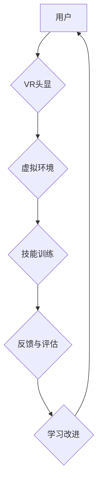

                 

## 虚拟现实职业培训创业：沉浸式技能学习

> 关键词：虚拟现实、职业培训、沉浸式学习、技能训练、人工智能、游戏化学习、元宇宙

## 1. 背景介绍

随着科技的飞速发展，虚拟现实（VR）技术已经从科幻小说走向现实，并逐渐渗透到各个领域。其中，VR在职业培训领域展现出巨大的潜力，为传统培训模式带来了革命性的变革。

传统的职业培训模式往往存在着以下问题：

* **成本高昂：** 现实环境下的培训需要租用场地、配备设备、邀请专家等，成本较高。
* **安全性不足：** 一些职业培训需要进行危险操作，例如医疗手术、高空作业等，存在安全隐患。
* **缺乏互动性：** 传统培训模式通常是单向的，缺乏互动性，难以激发学员的学习兴趣。
* **学习效果有限：** 理论学习与实际操作之间存在着脱节，难以真正掌握技能。

VR技术可以有效解决上述问题，为职业培训提供更加沉浸式、互动性强、安全可靠的学习环境。

## 2. 核心概念与联系

**2.1 虚拟现实（VR）**

VR是一种利用计算机技术模拟真实环境的技术，通过头戴式显示器、手柄等设备，让用户身临其境地体验虚拟世界。

**2.2 沉浸式学习**

沉浸式学习是指通过将学习内容融入到虚拟环境中，让用户身临其境地体验学习内容，从而提高学习兴趣和效果。

**2.3 职业培训**

职业培训是指为特定职业提供技能培训和知识学习的活动，旨在提高员工的职业技能和竞争力。

**2.4 核心概念联系**

VR技术为沉浸式学习提供了技术基础，而沉浸式学习可以有效提升职业培训的效率和效果。

**2.5 架构流程图**



## 3. 核心算法原理 & 具体操作步骤

**3.1 算法原理概述**

VR职业培训的核心算法主要包括：

* **3D建模与场景渲染：** 利用3D建模软件创建虚拟环境，并通过渲染引擎将虚拟场景呈现给用户。
* **用户交互与动作捕捉：** 利用手柄、传感器等设备捕捉用户的动作，并将动作映射到虚拟环境中。
* **人工智能与虚拟角色：** 利用人工智能技术创建虚拟角色，并赋予虚拟角色一定的智能行为，与用户进行互动。
* **反馈与评估：** 收集用户在虚拟环境中的操作数据，并进行分析和评估，提供个性化的学习建议。

**3.2 算法步骤详解**

1. **环境建模：** 根据培训需求，使用3D建模软件创建虚拟环境，包括场景、物体、人物等。
2. **动作捕捉：** 使用手柄、传感器等设备捕捉用户的动作，并将其转换为虚拟环境中的动作指令。
3. **虚拟角色交互：** 利用人工智能技术创建虚拟角色，并根据用户的动作指令进行相应的反应，与用户进行互动。
4. **技能训练：** 在虚拟环境中进行技能训练，例如操作机器、进行手术、处理突发事件等。
5. **反馈与评估：** 收集用户在虚拟环境中的操作数据，并进行分析和评估，提供个性化的学习建议。

**3.3 算法优缺点**

**优点：**

* **沉浸式体验：** VR技术可以创造出逼真的虚拟环境，让用户身临其境地体验学习内容。
* **互动性强：** 用户可以与虚拟环境和虚拟角色进行互动，提高学习兴趣和参与度。
* **安全性高：** 在虚拟环境中进行危险操作，可以避免现实环境中的安全隐患。
* **可重复性强：** 用户可以反复练习，直到掌握技能。

**缺点：**

* **成本高昂：** VR设备和软件成本较高。
* **技术门槛高：** 开发VR培训内容需要一定的技术能力。
* **眩晕感：** 一些用户在使用VR设备时可能会出现眩晕感。

**3.4 算法应用领域**

VR职业培训可以应用于各个行业，例如：

* **医疗行业：** 虚拟手术模拟、急救培训、疾病诊断培训等。
* **制造业：** 机器操作培训、设备维护培训、安全操作培训等。
* **航空航天行业：** 飞行模拟、维修培训、安全操作培训等。
* **教育行业：** 沉浸式教学、技能培训、职业体验等。

## 4. 数学模型和公式 & 详细讲解 & 举例说明

**4.1 数学模型构建**

VR职业培训的数学模型可以基于以下几个方面构建：

* **3D空间建模：** 利用坐标系、向量、矩阵等数学工具构建虚拟环境的3D模型。
* **用户交互模型：** 利用数学模型描述用户与虚拟环境的交互行为，例如手势识别、动作捕捉等。
* **虚拟角色行为模型：** 利用状态机、决策树等数学模型描述虚拟角色的行为逻辑。
* **学习效果评估模型：** 利用统计学、机器学习等方法评估用户的学习效果。

**4.2 公式推导过程**

例如，在3D空间建模中，可以使用以下公式计算两个点的距离：

$$
d = \sqrt{(x_2 - x_1)^2 + (y_2 - y_1)^2 + (z_2 - z_1)^2}
$$

其中：

* $d$ 表示两个点的距离。
* $(x_1, y_1, z_1)$ 表示第一个点的坐标。
* $(x_2, y_2, z_2)$ 表示第二个点的坐标。

**4.3 案例分析与讲解**

在虚拟手术模拟中，可以使用数学模型模拟手术工具的运动轨迹，并根据用户的操作指令调整工具的姿态和位置。

例如，可以使用欧拉角表示手术工具的姿态，并利用旋转矩阵将欧拉角转换为工具的旋转变换矩阵。

## 5. 项目实践：代码实例和详细解释说明

**5.1 开发环境搭建**

VR职业培训项目可以使用Unity3D、Unreal Engine等游戏引擎进行开发。

**5.2 源代码详细实现**

以下是一个简单的VR场景代码示例，使用Unity3D引擎实现：

```csharp
using UnityEngine;

public class VRController : MonoBehaviour
{
    public GameObject vrCamera;

    void Update()
    {
        // 获取VR手柄的输入
        float horizontalInput = Input.GetAxis("Horizontal");
        float verticalInput = Input.GetAxis("Vertical");

        // 移动VR相机
        vrCamera.transform.Translate(horizontalInput, 0, verticalInput);
    }
}
```

**5.3 代码解读与分析**

这段代码定义了一个VRController脚本，用于控制VR相机的移动。

* `vrCamera`变量存储了VR相机的GameObject引用。
* `Update()`方法在每一帧执行，获取VR手柄的水平和垂直输入值，并根据输入值移动VR相机。

**5.4 运行结果展示**

运行该代码后，用户可以使用VR手柄控制VR相机的移动，在虚拟环境中自由探索。

## 6. 实际应用场景

**6.1 医疗行业**

* **虚拟手术模拟：** 医生可以在虚拟环境中进行手术模拟，练习各种手术操作，提高手术技能。
* **急救培训：** 护士和医护人员可以在虚拟环境中模拟急救场景，学习急救知识和技能。
* **疾病诊断培训：** 学生可以在虚拟环境中学习各种疾病的症状和诊断方法，提高诊断能力。

**6.2 制造业**

* **机器操作培训：** 工人可以在虚拟环境中学习操作各种机器设备，提高操作效率和安全性。
* **设备维护培训：** 维修人员可以在虚拟环境中学习设备的结构和维护方法，提高维修效率。
* **安全操作培训：** 员工可以在虚拟环境中学习安全操作规程，提高工作安全意识。

**6.3 航空航天行业**

* **飞行模拟：** 飞行员可以在虚拟环境中进行飞行模拟，练习各种飞行操作，提高飞行技能。
* **维修培训：** 维修人员可以在虚拟环境中学习飞机的结构和维修方法，提高维修效率。
* **安全操作培训：** 员工可以在虚拟环境中学习安全操作规程，提高工作安全意识。

**6.4 未来应用展望**

随着VR技术的不断发展，VR职业培训将会有更加广泛的应用场景，例如：

* **个性化学习：** 根据用户的学习进度和能力，提供个性化的学习内容和训练方案。
* **游戏化学习：** 将学习内容融入到游戏场景中，提高学习兴趣和参与度。
* **元宇宙融合：** 将VR职业培训融入到元宇宙环境中，创造更加沉浸式和交互式的学习体验。

## 7. 工具和资源推荐

**7.1 学习资源推荐**

* **Unity3D官方文档：** https://docs.unity3d.com/
* **Unreal Engine官方文档：** https://docs.unrealengine.com/
* **VR开发教程网站：** https://www.vrdeveloper.com/

**7.2 开发工具推荐**

* **Unity3D：** https://unity.com/
* **Unreal Engine：** https://www.unrealengine.com/
* **SteamVR：** https://store.steampowered.com/app/353380/SteamVR/

**7.3 相关论文推荐**

* **Immersive Virtual Reality Training for Healthcare Professionals: A Systematic Review**
* **The Impact of Virtual Reality Training on Skill Acquisition and Performance**
* **A Review of Virtual Reality Applications in Education**

## 8. 总结：未来发展趋势与挑战

**8.1 研究成果总结**

VR职业培训技术已经取得了显著的成果，在医疗、制造、航空航天等行业得到了广泛应用。VR技术可以为用户提供更加沉浸式、互动性强、安全可靠的学习环境，提高学习效率和效果。

**8.2 未来发展趋势**

未来，VR职业培训将朝着以下方向发展：

* **更加沉浸式和交互式的体验：** 利用更先进的VR硬件和软件技术，创造更加逼真的虚拟环境，并提供更加丰富的交互方式。
* **更加个性化和智能化的学习：** 利用人工智能技术，根据用户的学习进度和能力，提供个性化的学习内容和训练方案。
* **更加广泛的应用场景：** 将VR职业培训应用到更多行业和领域，例如教育、金融、零售等。

**8.3 面临的挑战**

VR职业培训技术还面临着一些挑战：

* **成本高昂：** VR设备和软件成本较高，限制了其普及率。
* **技术门槛高：** 开发VR培训内容需要一定的技术能力，需要专业人才进行开发。
* **内容匮乏：** 目前VR职业培训内容相对匮乏，需要更多的优质内容开发。

**8.4 研究展望**

未来，需要进一步研究VR职业培训技术的应用场景、开发方法、评估指标等方面，推动VR职业培训技术的发展和应用。


## 9. 附录：常见问题与解答

**9.1 Q：VR职业培训的成本高昂吗？**

A：VR设备和软件成本较高，但随着技术的进步和市场竞争的加剧，成本将会逐渐降低。

**9.2 Q：VR职业培训的安全性如何？**

A：VR职业培训可以在虚拟环境中进行危险操作，避免现实环境中的安全隐患。

**9.3 Q：VR职业培训的学习效果如何？**

A：VR职业培训可以提供更加沉浸式和互动式的学习体验，提高学习效率和效果。

**9.4 Q：如何开发VR职业培训内容？**

A：需要学习VR开发技术，并利用专业的VR开发工具进行开发。

**9.5 Q：VR职业培训的未来发展趋势如何？**

A：VR职业培训将朝着更加沉浸式、个性化、智能化和广泛应用的方向发展。


作者：禅与计算机程序设计艺术 / Zen and the Art of Computer Programming 
<end_of_turn>

