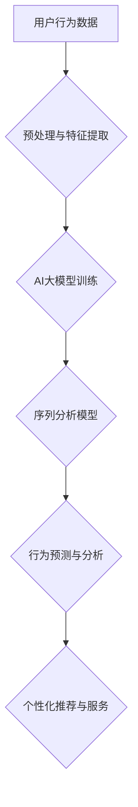

                 

## 融合AI大模型的用户行为序列分析

> 关键词：AI大模型、用户行为序列、序列分析、深度学习、推荐系统、个性化体验

## 1. 背景介绍

在数字时代，用户行为数据已成为企业获取洞察、优化产品和服务的重要资源。用户行为序列，即用户在特定时间段内执行的一系列交互动作，蕴含着丰富的潜在信息，例如用户偏好、需求和行为模式。传统的序列分析方法往往局限于统计模型，难以捕捉用户行为的复杂性和非线性关系。

近年来，大规模语言模型（LLM）的快速发展为用户行为序列分析带来了新的机遇。LLM 具备强大的文本理解和生成能力，能够从用户行为序列中学习到更深层的语义和结构信息，从而实现更精准的分析和预测。

## 2. 核心概念与联系

### 2.1 用户行为序列

用户行为序列是指用户在特定时间段内执行的一系列交互动作，例如：

* **电商平台:** 浏览商品、加入购物车、下单购买、评价商品
* **社交媒体:** 关注用户、点赞评论、转发帖子、发送私信
* **新闻网站:** 阅读文章、点击链接、分享内容、订阅频道

这些序列数据反映了用户的兴趣、需求和行为模式，蕴含着丰富的价值信息。

### 2.2 AI大模型

AI大模型是指训练规模庞大、参数数量众多的深度学习模型，例如 GPT-3、BERT、LaMDA 等。它们通过学习海量文本数据，掌握了丰富的语言知识和理解能力，能够进行文本生成、翻译、问答、总结等多种任务。

### 2.3 融合分析

融合AI大模型的用户行为序列分析是指利用AI大模型的强大能力，对用户行为序列进行更深入的理解和分析。

**核心架构:**



## 3. 核心算法原理 & 具体操作步骤

### 3.1 算法原理概述

融合AI大模型的用户行为序列分析主要基于以下算法原理：

* **Transformer模型:** Transformer模型是一种基于注意力机制的深度学习模型，能够有效捕捉序列数据中的长距离依赖关系，适用于处理用户行为序列的复杂性。
* **序列到序列模型:** 序列到序列模型能够将输入序列映射到输出序列，例如将用户行为序列映射到用户兴趣标签或未来行为预测。
* **强化学习:** 强化学习可以训练模型学习最优的行为策略，例如根据用户行为序列推荐最合适的商品或服务。

### 3.2 算法步骤详解

1. **数据收集与预处理:** 收集用户行为数据，并进行清洗、格式化和特征提取。例如，将用户行为序列转换为数字表示，提取时间戳、用户ID、商品ID等特征。
2. **模型训练:** 利用Transformer模型等深度学习模型，对预处理后的用户行为序列进行训练。训练目标可以是预测用户下一个行为、分类用户兴趣标签、生成用户行为轨迹等。
3. **模型评估:** 使用测试数据评估模型的性能，例如准确率、召回率、F1-score等指标。
4. **模型部署:** 将训练好的模型部署到生产环境中，用于实时分析用户行为序列并提供个性化推荐或服务。

### 3.3 算法优缺点

**优点:**

* 能够捕捉用户行为序列的复杂性和非线性关系。
* 能够学习到更深层的语义和结构信息。
* 能够实现更精准的分析和预测。

**缺点:**

* 需要海量数据进行训练。
* 模型训练和部署成本较高。
* 算法解释性较弱，难以理解模型的决策过程。

### 3.4 算法应用领域

* **电商推荐:** 根据用户的浏览、购买和评价历史，推荐个性化的商品。
* **社交媒体个性化:** 根据用户的关注、点赞和评论行为，推荐个性化的内容和用户。
* **新闻推荐:** 根据用户的阅读历史和兴趣标签，推荐个性化的新闻内容。
* **用户画像构建:** 从用户行为序列中构建用户画像，了解用户的兴趣、需求和行为模式。

## 4. 数学模型和公式 & 详细讲解 & 举例说明

### 4.1 数学模型构建

用户行为序列分析模型通常基于序列到序列模型，例如循环神经网络（RNN）或Transformer模型。

**RNN模型:**

RNN模型利用循环结构，能够捕捉序列数据中的时间依赖关系。其核心是隐藏状态，隐藏状态在每个时间步都会更新，并传递给下一个时间步，从而学习到序列的上下文信息。

**Transformer模型:**

Transformer模型基于注意力机制，能够更有效地捕捉序列数据中的长距离依赖关系。它由多头注意力层和前馈神经网络组成，能够学习到序列数据的全局信息。

### 4.2 公式推导过程

**RNN模型的隐藏状态更新公式:**

$$h_t = f(W_{xh}x_t + W_{hh}h_{t-1} + b_h)$$

其中:

* $h_t$ 是时间步 $t$ 的隐藏状态。
* $x_t$ 是时间步 $t$ 的输入。
* $W_{xh}$ 和 $W_{hh}$ 是权重矩阵。
* $b_h$ 是偏置项。
* $f$ 是激活函数。

**Transformer模型的注意力机制公式:**

$$Attention(Q, K, V) = softmax(\frac{Q K^T}{\sqrt{d_k}}) V$$

其中:

* $Q$, $K$, $V$ 分别是查询矩阵、键矩阵和值矩阵。
* $d_k$ 是键向量的维度。
* $softmax$ 函数将注意力权重归一化。

### 4.3 案例分析与讲解

**案例:**

假设我们有一个电商平台的用户行为序列数据，包含用户浏览商品、加入购物车、下单购买等行为。

**分析:**

我们可以利用Transformer模型对用户行为序列进行分析，学习到用户的兴趣偏好和购买模式。例如，我们可以预测用户下一个行为，推荐个性化的商品，或者构建用户画像，了解用户的消费习惯。

## 5. 项目实践：代码实例和详细解释说明

### 5.1 开发环境搭建

* Python 3.7+
* TensorFlow 或 PyTorch 深度学习框架
* Jupyter Notebook 或 VS Code 开发环境

### 5.2 源代码详细实现

```python
# 使用 TensorFlow 框架实现 Transformer 模型

import tensorflow as tf

# 定义 Transformer 模型
class Transformer(tf.keras.Model):
    def __init__(self, vocab_size, embedding_dim, num_heads, num_layers):
        super(Transformer, self).__init__()
        self.embedding = tf.keras.layers.Embedding(vocab_size, embedding_dim)
        self.transformer_layers = tf.keras.layers.StackedRNNCells([
            tf.keras.layers.MultiHeadAttention(num_heads=num_heads, key_dim=embedding_dim)
            for _ in range(num_layers)
        ])
        self.fc = tf.keras.layers.Dense(vocab_size)

    def call(self, inputs):
        x = self.embedding(inputs)
        x = self.transformer_layers(x)
        x = self.fc(x)
        return x

# 实例化 Transformer 模型
model = Transformer(vocab_size=10000, embedding_dim=128, num_heads=8, num_layers=6)

# 训练模型
model.compile(optimizer='adam', loss='sparse_categorical_crossentropy', metrics=['accuracy'])
model.fit(train_data, train_labels, epochs=10)
```

### 5.3 代码解读与分析

* **模型定义:** 代码定义了一个 Transformer 模型，包含嵌入层、多头注意力层和全连接层。
* **数据处理:** 需要将用户行为序列数据转换为数字表示，例如使用词嵌入技术将行为转换为向量。
* **模型训练:** 使用 TensorFlow 的 `fit` 方法训练模型，输入训练数据和标签，输出模型权重。
* **模型评估:** 使用测试数据评估模型的性能，例如计算准确率、召回率等指标。

### 5.4 运行结果展示

训练完成后，可以将模型应用于实际场景，例如预测用户下一个行为、推荐个性化商品等。

## 6. 实际应用场景

### 6.1 电商推荐

融合AI大模型的用户行为序列分析可以帮助电商平台更精准地推荐商品，提高用户转化率。例如，根据用户的浏览、购买和评价历史，推荐个性化的商品，或者预测用户下一个购买行为。

### 6.2 社交媒体个性化

社交媒体平台可以利用用户行为序列分析，个性化推荐内容和用户。例如，根据用户的关注、点赞和评论行为，推荐个性化的新闻、视频和用户。

### 6.3 新闻推荐

新闻网站可以利用用户行为序列分析，推荐个性化的新闻内容。例如，根据用户的阅读历史和兴趣标签，推荐相关的新闻文章。

### 6.4 未来应用展望

* **更精准的个性化推荐:** 随着AI大模型的不断发展，用户行为序列分析将能够提供更精准的个性化推荐，满足用户的个性化需求。
* **更深入的用户洞察:** AI大模型能够从用户行为序列中学习到更深层的用户洞察，帮助企业更好地了解用户的需求和行为模式。
* **更智能的交互体验:** AI大模型可以帮助构建更智能的交互体验，例如通过自然语言交互，提供更个性化的服务。

## 7. 工具和资源推荐

### 7.1 学习资源推荐

* **书籍:**
    * Deep Learning by Ian Goodfellow, Yoshua Bengio, and Aaron Courville
    * Natural Language Processing with Python by Steven Bird, Ewan Klein, and Edward Loper
* **在线课程:**
    * Stanford CS224N: Natural Language Processing with Deep Learning
    * DeepLearning.AI TensorFlow Specialization

### 7.2 开发工具推荐

* **TensorFlow:** 开源深度学习框架，支持多种模型类型和硬件平台。
* **PyTorch:** 开源深度学习框架，以其灵活性和易用性而闻名。
* **Hugging Face Transformers:** 提供预训练的 Transformer 模型和工具，方便用户快速应用。

### 7.3 相关论文推荐

* **Attention Is All You Need:** https://arxiv.org/abs/1706.03762
* **BERT: Pre-training of Deep Bidirectional Transformers for Language Understanding:** https://arxiv.org/abs/1810.04805

## 8. 总结：未来发展趋势与挑战

### 8.1 研究成果总结

融合AI大模型的用户行为序列分析取得了显著成果，能够更精准地分析和预测用户行为，为企业提供更个性化的服务。

### 8.2 未来发展趋势

* **模型规模和能力提升:** 未来AI大模型将更加强大，能够处理更复杂的用户行为序列，提供更深入的分析和预测。
* **跨模态融合:** 将文本、图像、音频等多种模态数据融合到用户行为序列分析中，获得更全面的用户洞察。
* **解释性增强:** 研究更可解释的AI模型，帮助用户理解模型的决策过程。

### 8.3 面临的挑战

* **数据隐私和安全:** 用户行为数据涉及隐私信息，需要采取有效措施保护数据安全。
* **算法公平性:** 确保AI模型的公平性和不歧视性，避免算法偏见对用户造成负面影响。
* **模型可解释性:** 提高AI模型的解释性，帮助用户理解模型的决策过程，增强用户信任。

### 8.4 研究展望

未来，融合AI大模型的用户行为序列分析将继续发展，为企业提供更精准、更个性化的服务，提升用户体验。


## 9. 附录：常见问题与解答

**Q1: 如何处理用户行为序列中的缺失数据？**

**A1:** 可以使用多种方法处理缺失数据，例如：

* **删除缺失数据:** 如果缺失数据量较少，可以删除包含缺失数据的样本。
* **填充缺失数据:** 使用平均值、中位数或其他填充策略填充缺失数据。
* **使用机器学习模型预测缺失数据:** 利用已有的数据训练模型，预测缺失数据的取值。

**Q2: 如何评估用户行为序列分析模型的性能？**

**A2:** 可以使用多种指标评估模型性能，例如：

* **准确率:** 模型预测正确样本的比例。
* **召回率:** 模型预测出所有正样本的比例。
* **F1-score:** 准确率和召回率的调和平均值。
* **AUC:** 曲线下面积，衡量模型的区分能力。

**Q3: 如何部署用户行为序列分析模型？**

**A3:** 可以使用多种方式部署模型，例如：

* **云端部署:** 将模型部署到云平台，例如 AWS、Azure 或 Google Cloud。
* **本地部署:** 将模型部署到本地服务器。
* **边缘部署:** 将模型部署到边缘设备，例如手机或物联网设备。


作者：禅与计算机程序设计艺术 / Zen and the Art of Computer Programming 
<end_of_turn>

