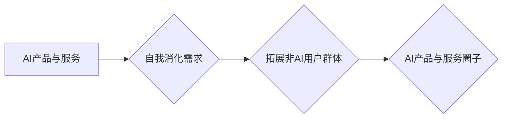

                 

## AI产品与服务的圈子：自我消化需求，拓展非AI用户群体

> 关键词：人工智能、AI产品、AI服务、用户需求、非AI用户、市场拓展、产品设计、技术落地

## 1. 背景介绍

人工智能（AI）技术近年来发展迅速，已渗透到生活的方方面面。从智能手机的语音助手到自动驾驶汽车，AI产品和服务正在改变着我们的生活方式。然而，当前AI市场仍面临着一些挑战，其中之一就是如何有效地将AI技术应用于更广泛的用户群体，特别是那些不熟悉AI技术的非AI用户。

目前，许多AI产品和服务的设计往往过于技术化，缺乏对非AI用户的理解和考虑。这导致了以下问题：

* **用户体验差:** 非AI用户可能难以理解AI产品的功能和使用方法，从而导致使用体验不佳。
* **市场渗透率低:** 由于缺乏对非AI用户的吸引力，AI产品的市场渗透率相对较低。
* **技术价值难以体现:**  AI技术的强大功能无法被非AI用户充分利用，导致其技术价值难以体现。

为了解决这些问题，我们需要从用户需求出发，设计更易于理解和使用的AI产品和服务，并将其推广到更广泛的非AI用户群体。

## 2. 核心概念与联系

**2.1 AI产品与服务的定义**

AI产品是指利用人工智能技术开发的软件或硬件产品，能够自动完成特定任务或提供智能化服务。AI服务是指利用人工智能技术为用户提供个性化、智能化的服务，例如语音识别、图像识别、自然语言处理等。

**2.2 非AI用户群体**

非AI用户是指那些不熟悉AI技术，对AI产品和服务缺乏了解的用户群体。他们可能对AI技术的原理和应用场景不了解，也可能对AI产品的安全性、隐私等问题感到担忧。

**2.3 自我消化需求**

自我消化需求是指AI产品和服务在设计和开发过程中，需要充分理解非AI用户的需求和痛点，并将其融入到产品的设计和功能中。

**2.4 拓展非AI用户群体**

拓展非AI用户群体是指通过优化产品设计、提升用户体验、加强用户教育等方式，将AI产品和服务推广到更广泛的非AI用户群体。

**2.5  AI产品与服务圈子**

AI产品与服务圈子是指围绕AI产品和服务展开的生态系统，包括AI技术开发者、产品设计师、市场营销人员、用户体验专家、监管机构等。

**Mermaid 流程图**



## 3. 核心算法原理 & 具体操作步骤

**3.1 算法原理概述**

为了更好地理解非AI用户的需求，我们可以采用一些AI算法，例如：

* **自然语言处理（NLP）:**  用于分析用户文本数据，例如用户评论、反馈、问答等，从中提取用户需求和痛点。
* **机器学习（ML）:**  用于预测用户行为和偏好，例如用户可能感兴趣的产品、服务或功能。
* **深度学习（DL）:**  用于识别用户画像，例如用户年龄、性别、职业、兴趣爱好等，以便提供更个性化的服务。

**3.2 算法步骤详解**

1. **数据收集:** 收集用户相关数据，例如用户评论、反馈、问答、浏览记录、购买记录等。
2. **数据预处理:** 对收集到的数据进行清洗、转换、格式化等处理，使其适合算法训练。
3. **模型训练:** 选择合适的AI算法模型，并利用预处理后的数据进行模型训练。
4. **模型评估:** 对训练好的模型进行评估，例如准确率、召回率、F1-score等指标，并根据评估结果进行模型优化。
5. **模型部署:** 将训练好的模型部署到实际应用场景中，例如AI客服系统、个性化推荐系统等。

**3.3 算法优缺点**

* **优点:** 能够有效地分析用户需求，提供个性化服务，提升用户体验。
* **缺点:** 需要大量的训练数据，模型训练成本较高，算法解释性较差。

**3.4 算法应用领域**

* **电商:** 个性化推荐、智能客服、商品搜索
* **金融:** 风险评估、欺诈检测、客户服务
* **医疗:** 疾病诊断、药物研发、患者管理
* **教育:** 个性化学习、智能辅导、考试批改

## 4. 数学模型和公式 & 详细讲解 & 举例说明

**4.1 数学模型构建**

我们可以使用数学模型来描述用户需求和AI产品的交互关系。例如，我们可以使用贝叶斯网络来表示用户对不同产品或服务的偏好，以及用户行为和产品特征之间的关系。

**4.2 公式推导过程**

贝叶斯网络中的概率计算可以使用贝叶斯公式进行推导。例如，假设我们想要预测用户是否会购买某个产品，我们可以使用以下公式：

$$P(购买|特征) = \frac{P(特征|购买) * P(购买)}{P(特征)}$$

其中：

* $P(购买|特征)$ 是用户在给定特征的情况下购买产品的概率。
* $P(特征|购买)$ 是用户购买产品的情况下具有特定特征的概率。
* $P(购买)$ 是用户购买产品的概率。
* $P(特征)$ 是用户具有特定特征的概率。

**4.3 案例分析与讲解**

假设我们有一个电商平台，想要预测用户是否会购买某个商品。我们可以收集用户浏览记录、购买记录、商品特征等数据，并构建一个贝叶斯网络模型。

例如，我们可以将用户浏览记录作为特征，将用户购买记录作为目标变量。然后，我们可以使用贝叶斯公式来计算用户在给定浏览记录的情况下购买商品的概率。

## 5. 项目实践：代码实例和详细解释说明

**5.1 开发环境搭建**

* Python 3.x
* TensorFlow 或 PyTorch
* Jupyter Notebook

**5.2 源代码详细实现**

```python
# 导入必要的库
import tensorflow as tf

# 定义模型结构
model = tf.keras.models.Sequential([
    tf.keras.layers.Dense(64, activation='relu', input_shape=(10,)),
    tf.keras.layers.Dense(32, activation='relu'),
    tf.keras.layers.Dense(1, activation='sigmoid')
])

# 编译模型
model.compile(optimizer='adam',
              loss='binary_crossentropy',
              metrics=['accuracy'])

# 训练模型
model.fit(X_train, y_train, epochs=10)

# 评估模型
loss, accuracy = model.evaluate(X_test, y_test)
print('Loss:', loss)
print('Accuracy:', accuracy)
```

**5.3 代码解读与分析**

这段代码实现了基于深度学习的分类模型。

* `tf.keras.models.Sequential` 定义了一个顺序模型，即层级结构的模型。
* `tf.keras.layers.Dense` 定义了一个全连接层，每个神经元都连接到上一层的每个神经元。
* `activation='relu'` 指定了激活函数为ReLU函数，用于引入非线性。
* `input_shape=(10,)` 指定了输入数据的形状为10维向量。
* `optimizer='adam'` 指定了优化算法为Adam算法，用于更新模型参数。
* `loss='binary_crossentropy'` 指定了损失函数为二分类交叉熵函数，用于衡量模型预测结果与真实标签之间的差异。
* `metrics=['accuracy']` 指定了评估指标为准确率，用于衡量模型预测结果的正确率。

**5.4 运行结果展示**

训练完成后，我们可以使用`model.evaluate()`函数评估模型的性能，并打印出损失值和准确率。

## 6. 实际应用场景

**6.1 个性化推荐系统**

AI产品可以根据用户的浏览记录、购买记录、兴趣爱好等数据，推荐个性化的商品、服务或内容。例如，电商平台可以推荐用户可能感兴趣的商品，音乐平台可以推荐用户可能喜欢的歌曲，视频平台可以推荐用户可能想看的视频。

**6.2 智能客服系统**

AI产品可以作为智能客服，自动回答用户常见问题，提供24小时在线服务。例如，银行可以利用AI客服系统处理客户的账户查询、转账等业务，航空公司可以利用AI客服系统解答乘客的航班信息、行李托运等问题。

**6.3 自动化办公工具**

AI产品可以自动化一些重复性的办公任务，例如邮件分类、文档整理、会议纪要生成等，提高工作效率。例如，企业可以利用AI工具自动处理员工的请假申请、出差报销等流程，减轻人力资源部门的工作负担。

**6.4 未来应用展望**

随着AI技术的不断发展，AI产品和服务的应用场景将会更加广泛，例如：

* **医疗诊断:** AI可以辅助医生进行疾病诊断，提高诊断准确率。
* **个性化教育:** AI可以根据学生的学习进度和能力，提供个性化的学习方案。
* **智能交通:** AI可以用于自动驾驶汽车、交通流量管理等，提高交通效率和安全性。

## 7. 工具和资源推荐

**7.1 学习资源推荐**

* **在线课程:** Coursera、edX、Udacity等平台提供丰富的AI课程。
* **书籍:** 《深度学习》、《人工智能：一个现代方法》等书籍。
* **开源项目:** TensorFlow、PyTorch等开源项目提供丰富的代码示例和学习资源。

**7.2 开发工具推荐**

* **Python:** 作为AI开发的主要编程语言，Python拥有丰富的AI库和工具。
* **Jupyter Notebook:** 用于编写和运行Python代码的交互式环境。
* **TensorFlow/PyTorch:** 深度学习框架，用于构建和训练AI模型。

**7.3 相关论文推荐**

* **《ImageNet Classification with Deep Convolutional Neural Networks》:** 介绍了AlexNet模型，标志着深度学习在图像识别领域的突破。
* **《Attention Is All You Need》:** 介绍了Transformer模型，在自然语言处理领域取得了重大进展。
* **《BERT: Pre-training of Deep Bidirectional Transformers for Language Understanding》:** 介绍了BERT模型，在自然语言理解任务中取得了优异的性能。

## 8. 总结：未来发展趋势与挑战

**8.1 研究成果总结**

近年来，AI技术取得了长足的进步，在各个领域都取得了突破性进展。例如，在图像识别、语音识别、自然语言处理等领域，AI模型的性能已经超过了人类水平。

**8.2 未来发展趋势**

* **模型规模化:** AI模型的规模将继续扩大，训练数据量和模型参数量将不断增加。
* **算法创新:** 新的AI算法将不断涌现，例如强化学习、联邦学习等，推动AI技术的进一步发展。
* **边缘计算:** AI计算将逐渐向边缘设备转移，实现更低延迟、更高效率的AI应用。

**8.3 面临的挑战**

* **数据安全和隐私:** AI模型的训练需要大量数据，如何保证数据安全和隐私是一个重要的挑战。
* **算法可解释性:** 许多AI模型的决策过程难以解释，如何提高算法的可解释性是一个重要的研究方向。
* **伦理问题:** AI技术的应用可能会带来一些伦理问题，例如算法偏见、工作岗位替代等，需要引起社会广泛关注和讨论。

**8.4 研究展望**

未来，AI技术将继续发展，并应用于更多领域。我们需要加强对AI技术的理解和研究，并积极应对AI技术带来的挑战，确保AI技术能够造福人类社会。

## 9. 附录：常见问题与解答

**9.1 如何选择合适的AI算法？**

选择合适的AI算法需要根据具体应用场景和数据特点进行选择。例如，对于分类问题，可以考虑使用决策树、支持向量机、神经网络等算法；对于回归问题，可以考虑使用线性回归、逻辑回归、支持向量回归等算法。

**9.2 如何评估AI模型的性能？**

AI模型的性能可以通过多种指标进行评估，例如准确率、召回率、F1-score、AUC等。选择合适的评估指标需要根据具体应用场景和任务目标进行选择。

**9.3 如何解决AI模型的过拟合问题？**

过拟合是指AI模型在训练数据上表现很好，但在测试数据上表现较差。解决过拟合问题的方法包括：

* 增加训练数据量
* 使用正则化技术
* 使用交叉验证技术
* 减少模型复杂度


作者：禅与计算机程序设计艺术 / Zen and the Art of Computer Programming 
<end_of_turn>

