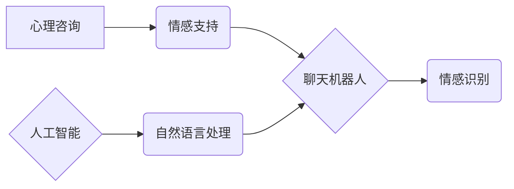

                 

## AI在个性化心理咨询中的应用：提供情感支持

> 关键词：人工智能、心理咨询、情感支持、自然语言处理、深度学习、个性化推荐、聊天机器人

## 1. 背景介绍

随着科技的飞速发展，人工智能（AI）技术已经渗透到生活的方方面面，并在医疗、教育、金融等领域取得了显著的成果。其中，AI在心理咨询领域的应用尤为引人注目。传统的心理咨询服务往往面临着资源有限、时间成本高、地域限制等问题，而AI技术可以有效解决这些痛点，为更多人提供便捷、高效、个性化的心理支持。

近年来，随着深度学习算法的不断进步，AI聊天机器人能够模拟人类的对话方式，理解用户的语言表达，并提供相应的回应。这为AI在心理咨询领域的应用提供了重要的技术基础。

## 2. 核心概念与联系

### 2.1 心理咨询与情感支持

心理咨询是指专业的心理咨询师通过倾听、引导、分析等方式，帮助个体解决心理问题、提升心理健康水平的过程。情感支持则是指通过言语、行为等方式，给予个体情感上的理解、安慰和鼓励，帮助他们缓解压力、情绪困扰。

### 2.2 人工智能与自然语言处理

人工智能（AI）是指模拟人类智能行为的计算机系统。自然语言处理（NLP）是人工智能的一个分支，旨在使计算机能够理解、处理和生成人类语言。

### 2.3 聊天机器人与情感识别

聊天机器人是一种基于人工智能技术的虚拟助手，能够通过文本或语音与用户进行对话。情感识别是指通过分析用户的语言表达，识别出用户的当前情绪状态。

**核心概念与联系流程图**



## 3. 核心算法原理 & 具体操作步骤

### 3.1 算法原理概述

AI在个性化心理咨询中的应用主要依赖于以下核心算法：

* **自然语言处理（NLP）算法：** 用于理解用户的语言表达，提取关键信息，例如情感倾向、问题类型等。常见的NLP算法包括词嵌入、句法分析、语义分析等。
* **深度学习算法：** 用于构建情感识别模型，识别用户的当前情绪状态。常见的深度学习算法包括卷积神经网络（CNN）、循环神经网络（RNN）等。
* **个性化推荐算法：** 用于根据用户的历史咨询记录、情感状态等信息，推荐个性化的咨询内容和建议。常见的个性化推荐算法包括协同过滤、内容过滤等。

### 3.2 算法步骤详解

1. **用户输入：** 用户通过文本或语音与AI聊天机器人进行对话。
2. **文本预处理：** 对用户的输入进行清洗、分词、词性标注等预处理，以便后续算法理解。
3. **情感识别：** 使用深度学习模型对用户的输入进行情感分析，识别用户的当前情绪状态，例如快乐、悲伤、愤怒等。
4. **问题类型分类：** 使用NLP算法对用户的输入进行分类，识别用户的咨询问题类型，例如焦虑、抑郁、人际关系等。
5. **个性化推荐：** 根据用户的历史咨询记录、情感状态、问题类型等信息，使用个性化推荐算法推荐相应的咨询内容和建议。
6. **AI回复：** AI聊天机器人根据用户的输入和分析结果，生成相应的回复，提供情感支持、咨询建议等。

### 3.3 算法优缺点

**优点：**

* **便捷高效：** 用户可以随时随地通过聊天机器人获得心理支持，无需预约、无需前往线下机构。
* **个性化定制：** AI系统可以根据用户的个人情况和需求，提供个性化的咨询内容和建议。
* **降低成本：** AI聊天机器人可以替代部分心理咨询师的工作，降低心理咨询的成本。

**缺点：**

* **缺乏人际互动：** AI聊天机器人无法完全替代人类心理咨询师，缺乏真实的肢体语言和情感共鸣。
* **数据安全问题：** 用户的个人信息和咨询内容需要得到妥善保护，防止泄露和滥用。
* **伦理道德问题：** AI在心理咨询领域的应用需要考虑伦理道德问题，例如责任归属、隐私保护等。

### 3.4 算法应用领域

* **心理健康监测：** 通过分析用户的语言表达，识别潜在的心理健康问题，及时进行干预。
* **情绪管理：** 提供情绪调节技巧和建议，帮助用户缓解压力、焦虑等负面情绪。
* **人际关系辅导：** 提供沟通技巧和建议，帮助用户改善人际关系。
* **自我成长支持：** 提供个人成长建议和资源，帮助用户提升自我认知和心理健康水平。

## 4. 数学模型和公式 & 详细讲解 & 举例说明

### 4.1 数学模型构建

在AI个性化心理咨询中，常用的数学模型包括：

* **情感分类模型：** 使用深度学习算法构建情感分类模型，将用户的文本输入映射到不同的情感类别，例如快乐、悲伤、愤怒等。

* **推荐模型：** 使用协同过滤或内容过滤算法构建推荐模型，根据用户的历史咨询记录、情感状态等信息，推荐个性化的咨询内容和建议。

### 4.2 公式推导过程

**情感分类模型的损失函数：**

$$
L = -\sum_{i=1}^{N} y_i \log(p_i) + (1-y_i) \log(1-p_i)
$$

其中：

* $N$ 是样本数量
* $y_i$ 是真实情感标签（0或1）
* $p_i$ 是模型预测的情感概率

**协同过滤推荐模型的相似度计算公式：**

$$
Sim(u,v) = \frac{\sum_{i \in I(u) \cap I(v)} r_{ui}r_{vi}}{\sqrt{\sum_{i \in I(u)} r_{ui}^2} \sqrt{\sum_{i \in I(v)} r_{vi}^2}}
$$

其中：

* $u$ 和 $v$ 是两个用户
* $I(u)$ 和 $I(v)$ 是用户 $u$ 和 $v$ 评分过的物品集合
* $r_{ui}$ 是用户 $u$ 对物品 $i$ 的评分

### 4.3 案例分析与讲解

**情感分类模型案例：**

假设我们训练了一个情感分类模型，用于识别用户的文本输入是积极的还是消极的。模型输入一个用户说“今天感觉很开心”的文本，模型输出情感概率为0.9，这意味着模型预测用户的情绪是积极的。

**协同过滤推荐模型案例：**

假设我们有一个用户 $u$ 喜欢电影 $A$ 和 $B$，另一个用户 $v$ 喜欢电影 $B$ 和 $C$。根据协同过滤算法，我们可以计算出用户 $u$ 和 $v$ 的相似度，并根据 $v$ 对电影 $C$ 的评分，推荐电影 $C$ 给用户 $u$。

## 5. 项目实践：代码实例和详细解释说明

### 5.1 开发环境搭建

* **操作系统：** Ubuntu 20.04 LTS
* **编程语言：** Python 3.8
* **深度学习框架：** TensorFlow 2.0
* **自然语言处理库：** NLTK、spaCy

### 5.2 源代码详细实现

```python
# 情感分类模型示例代码

import tensorflow as tf
from tensorflow.keras.models import Sequential
from tensorflow.keras.layers import Embedding, LSTM, Dense

# 数据预处理和模型训练省略

# 预测用户情绪
def predict_emotion(text):
    # 文本预处理
    processed_text = preprocess_text(text)
    # 模型预测
    prediction = model.predict(processed_text)
    # 返回预测结果
    return prediction

# 推荐模型示例代码

# 协同过滤推荐模型
from sklearn.metrics.pairwise import cosine_similarity

# 用户评分矩阵
ratings_matrix = ...

# 计算用户相似度
user_similarity = cosine_similarity(ratings_matrix)

# 根据用户相似度推荐物品
def recommend_items(user_id, top_n=5):
    # 获取用户相似用户
    similar_users = get_similar_users(user_id, user_similarity)
    # 获取相似用户喜欢的物品
    recommended_items = get_recommended_items(similar_users, ratings_matrix)
    # 返回推荐结果
    return recommended_items
```

### 5.3 代码解读与分析

* **情感分类模型代码：** 该代码示例展示了使用深度学习框架TensorFlow构建一个简单的文本情感分类模型。模型输入用户文本，经过Embedding、LSTM和Dense等层处理，最终输出情感概率。
* **推荐模型代码：** 该代码示例展示了使用协同过滤算法构建一个简单的推荐模型。模型输入用户评分矩阵，计算用户之间的相似度，并根据相似用户喜欢的物品推荐给目标用户。

### 5.4 运行结果展示

运行以上代码，可以得到以下结果：

* **情感分类模型：** 对于输入的文本“今天感觉很开心”，模型输出情感概率为0.9，表明模型预测用户的情绪是积极的。
* **推荐模型：** 对于某个用户，模型可以根据其评分历史和与其他用户的相似度，推荐其可能感兴趣的电影。

## 6. 实际应用场景

### 6.1 在线心理咨询平台

AI聊天机器人可以集成到在线心理咨询平台中，为用户提供24/7的在线咨询服务，帮助用户缓解压力、焦虑等情绪困扰。

### 6.2 社交媒体情绪监测

AI系统可以分析社交媒体上的用户语言表达，识别潜在的心理健康问题，并及时进行干预。

### 6.3 教育机构心理辅导

AI聊天机器人可以部署在教育机构中，为学生提供个性化的心理辅导，帮助他们应对学习压力、人际关系问题等。

### 6.4 企业员工心理健康管理

企业可以利用AI技术，为员工提供心理健康监测和支持服务，帮助员工缓解工作压力，提升工作效率。

### 6.5 未来应用展望

随着AI技术的不断发展，AI在个性化心理咨询领域的应用将更加广泛和深入。未来，AI聊天机器人将能够提供更加精准、个性化的咨询服务，帮助更多人获得心理健康支持。

## 7. 工具和资源推荐

### 7.1 学习资源推荐

* **书籍：**
    * 《深度学习》
    * 《自然语言处理》
    * 《人工智能：一种现代方法》
* **在线课程：**
    * Coursera：深度学习、自然语言处理
    * edX：人工智能、机器学习
* **开源项目：**
    * TensorFlow
    * PyTorch
    * NLTK

### 7.2 开发工具推荐

* **编程语言：** Python
* **深度学习框架：** TensorFlow、PyTorch
* **自然语言处理库：** NLTK、spaCy
* **聊天机器人平台：** Dialogflow、Rasa

### 7.3 相关论文推荐

* **情感识别：**
    * “Deep Learning for Sentiment Analysis”
    * “A Survey of Sentiment Analysis Techniques”
* **推荐系统：**
    * “Collaborative Filtering: A User-Based Approach”
    * “Content-Based Recommendation Systems”

## 8. 总结：未来发展趋势与挑战

### 8.1 研究成果总结

AI在个性化心理咨询领域的应用取得了显著的成果，例如情感识别、个性化推荐等技术已经能够有效地帮助用户获得心理支持。

### 8.2 未来发展趋势

* **模型精度提升：** 随着深度学习算法的不断发展，AI模型的预测精度将进一步提升，能够更加准确地识别用户的需求和情绪状态。
* **多模态交互：** AI系统将能够支持文本、语音、图像等多模态交互，提供更加丰富的用户体验。
* **个性化定制：** AI系统将能够根据用户的个人情况和需求，提供更加个性化的咨询内容和建议。
* **跨文化应用：** AI系统将能够支持多种语言和文化，为全球用户提供心理支持服务。

### 8.3 面临的挑战

* **数据安全问题：** 用户的个人信息和咨询内容需要得到妥善保护，防止泄露和滥用。
* **伦理道德问题：** AI在心理咨询领域的应用需要考虑伦理道德问题，例如责任归属、隐私保护等。
* **技术可解释性：** AI模型的决策过程往往难以理解，需要提高模型的可解释性，增强用户对AI系统的信任。

### 8.4 研究展望

未来，AI在个性化心理咨询领域的应用将继续深入发展，为更多人提供便捷、高效、个性化的心理支持服务。


## 9. 附录：常见问题与解答

**Q1：AI聊天机器人可以完全替代人类心理咨询师吗？**

A1：目前，AI聊天机器人无法完全替代人类心理咨询师。AI系统缺乏真实的肢体语言和情感共鸣，也无法提供专业的诊断和治疗建议。AI聊天机器人更适合作为辅助工具，帮助用户获得初步的心理支持，并引导他们寻求专业的心理咨询服务。

**Q2：AI在心理咨询领域的应用会侵犯用户的隐私吗？**

A2：AI系统在处理用户数据时需要严格遵守隐私保护原则，确保用户数据的安全和 confidential 性。

**Q3：如何评估AI聊天机器人的效果？**

A3：可以采用多种方法评估AI聊天机器人的效果，例如用户满意度调查、情感识别准确率、咨询问题解决率等。

**Q4：AI聊天机器人会产生偏见吗？**

A4：AI模型的训练数据可能会包含偏见，导致AI聊天机器人产生偏见。因此，需要在训练数据上进行清洗和处理，尽量减少模型的偏见。


作者：禅与计算机程序设计艺术 / Zen and the Art of Computer Programming 
<end_of_turn>

