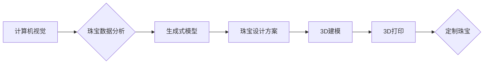

                 

## AI在珠宝设计中的应用：创新与定制

> 关键词：人工智能、珠宝设计、个性化定制、计算机视觉、生成式模型、3D打印

## 1. 背景介绍

珠宝设计，作为一项既古老又充满创意的艺术，历经数千年，从原始的装饰品演变为精致的艺术品，承载着人们对美、财富和身份的追求。传统珠宝设计依赖于设计师的经验、灵感和手工技艺，过程耗时且成本高昂。随着人工智能技术的飞速发展，AI开始在珠宝设计领域崭露头角，为传统设计模式注入新的活力，赋予珠宝设计更强大的创新力和定制化能力。

## 2. 核心概念与联系

AI在珠宝设计中的应用主要围绕着以下核心概念展开：

* **计算机视觉 (Computer Vision):**  AI可以通过计算机视觉技术识别和理解珠宝的形状、材质、颜色等特征，并将其转化为可供算法处理的数字数据。
* **生成式模型 (Generative Models):**  生成式模型能够根据已有的珠宝数据，学习珠宝设计规律，并生成新的、原创的珠宝设计方案。
* **3D建模和打印 (3D Modeling and Printing):**  AI生成的珠宝设计方案可以被直接转化为3D模型，并通过3D打印技术快速制作成实体珠宝。

**核心概念架构图:**



## 3. 核心算法原理 & 具体操作步骤

### 3.1  算法原理概述

在AI珠宝设计中，常用的算法包括卷积神经网络 (CNN)、生成对抗网络 (GAN) 和变分自编码器 (VAE)。

* **CNN:**  用于识别和分类珠宝的形状、材质、颜色等特征。
* **GAN:**  由生成器和鉴别器组成，生成器生成新的珠宝设计方案，鉴别器判断方案的真实性，两者相互竞争，最终生成逼真的珠宝设计。
* **VAE:**  通过编码器将珠宝数据压缩成低维表示，然后通过解码器将其恢复成原始数据，可以用于珠宝风格迁移和数据增强。

### 3.2  算法步骤详解

以GAN为例，其具体操作步骤如下：

1. **数据准备:** 收集大量珠宝图片数据，并进行预处理，例如裁剪、缩放、增强等。
2. **模型训练:**  训练生成器和鉴别器模型。生成器试图生成逼真的珠宝设计，鉴别器试图区分真实珠宝和生成珠宝。
3. **生成新设计:**  将训练好的生成器模型用于生成新的珠宝设计方案。
4. **方案评估:**  评估生成方案的质量，例如逼真度、原创性、美观度等。
5. **方案优化:**  根据评估结果，对生成器模型进行调整，优化生成方案的质量。

### 3.3  算法优缺点

**优点:**

* **创新性:**  能够生成全新的珠宝设计方案，突破传统设计模式的局限。
* **定制化:**  可以根据用户的需求和喜好，定制个性化的珠宝设计。
* **效率:**  相比传统手工设计，AI设计效率更高，可以快速生成多个设计方案供选择。

**缺点:**

* **数据依赖:**  AI算法需要大量的数据进行训练，数据质量直接影响算法性能。
* **艺术性:**  AI生成的珠宝设计方案可能缺乏艺术性和情感表达，需要设计师进行后期调整和完善。
* **伦理问题:**  AI设计可能导致设计版权问题和过度商业化等伦理问题。

### 3.4  算法应用领域

AI珠宝设计算法可以应用于以下领域:

* **珠宝设计公司:**  帮助设计师快速生成设计方案，提高设计效率。
* **珠宝零售商:**  提供个性化定制服务，满足客户多样化的需求。
* **珠宝爱好者:**  通过AI工具，实现自己设计珠宝的梦想。

## 4. 数学模型和公式 & 详细讲解 & 举例说明

### 4.1  数学模型构建

在AI珠宝设计中，常用的数学模型包括：

* **卷积神经网络 (CNN):**  CNN使用卷积核对图像进行特征提取，并通过多个卷积层和池化层，逐步学习珠宝的特征表示。

* **生成对抗网络 (GAN):**  GAN由生成器和鉴别器组成，生成器使用神经网络生成珠宝设计，鉴别器使用神经网络判断生成的珠宝是否真实。

* **变分自编码器 (VAE):**  VAE使用编码器将珠宝数据压缩成低维表示，然后使用解码器将其恢复成原始数据。

### 4.2  公式推导过程

由于篇幅限制，这里只列举CNN中常用的激活函数ReLU的公式：

$$
f(x) = max(0, x)
$$

ReLU函数可以有效地解决神经网络训练中的梯度消失问题，提高训练效率。

### 4.3  案例分析与讲解

以GAN为例，其训练过程可以理解为一个博弈过程。生成器试图生成逼真的珠宝设计，而鉴别器试图区分真实珠宝和生成珠宝。两者相互竞争，最终生成器能够生成逼真的珠宝设计，而鉴别器能够准确地区分真实和生成珠宝。

## 5. 项目实践：代码实例和详细解释说明

### 5.1  开发环境搭建

* **操作系统:**  Windows/macOS/Linux
* **编程语言:**  Python
* **深度学习框架:**  TensorFlow/PyTorch
* **其他工具:**  VS Code/Jupyter Notebook

### 5.2  源代码详细实现

由于篇幅限制，这里只提供一个简单的GAN模型的代码框架：

```python
import tensorflow as tf

# 定义生成器模型
def generator(latent_dim, output_dim):
    # ...

# 定义鉴别器模型
def discriminator(input_dim):
    # ...

# 训练循环
for epoch in range(num_epochs):
    # ...
```

### 5.3  代码解读与分析

* **生成器模型:**  负责生成新的珠宝设计方案。
* **鉴别器模型:**  负责判断生成的珠宝设计是否真实。
* **训练循环:**  迭代训练生成器和鉴别器模型，直到生成器能够生成逼真的珠宝设计。

### 5.4  运行结果展示

训练完成后，可以使用生成器模型生成新的珠宝设计方案，并将其可视化展示。

## 6. 实际应用场景

AI珠宝设计已经开始在一些珠宝公司和零售商中得到应用，例如：

* **个性化定制:**  根据用户的喜好和需求，生成定制化的珠宝设计方案。
* **设计灵感:**  为设计师提供新的设计灵感，帮助他们突破传统设计模式。
* **快速原型制作:**  快速生成珠宝设计方案的3D模型，方便设计师进行修改和完善。

### 6.4  未来应用展望

随着人工智能技术的不断发展，AI珠宝设计将在以下方面得到更广泛的应用:

* **更逼真的设计:**  AI算法能够生成更逼真的珠宝设计，更加接近手工制作的艺术效果。
* **更个性化的定制:**  AI能够更加精准地理解用户的需求，提供更个性化的定制服务。
* **更便捷的体验:**  用户可以通过手机APP或其他平台，轻松地进行珠宝设计和定制。

## 7. 工具和资源推荐

### 7.1  学习资源推荐

* **书籍:**  《Deep Learning》 by Ian Goodfellow, Yoshua Bengio, and Aaron Courville
* **在线课程:**  Coursera、edX、Udacity 等平台提供深度学习相关的课程。
* **博客和论坛:**  机器之心、AI科技大本营等网站提供AI相关资讯和讨论。

### 7.2  开发工具推荐

* **深度学习框架:**  TensorFlow、PyTorch、Keras 等。
* **图像处理库:**  OpenCV、Pillow 等。
* **3D建模软件:**  Blender、Maya 等。

### 7.3  相关论文推荐

* **Generative Adversarial Networks** by Ian Goodfellow et al. (2014)
* **Deep Convolutional Generative Adversarial Networks for Image Synthesis** by Radford et al. (2015)
* **StyleGAN2-ADA: Adapting StyleGAN2 for High-Resolution Image Synthesis** by Karras et al. (2020)

## 8. 总结：未来发展趋势与挑战

### 8.1  研究成果总结

AI珠宝设计已经取得了显著的成果，能够生成逼真的珠宝设计方案，并满足用户的个性化定制需求。

### 8.2  未来发展趋势

* **更强大的生成能力:**  AI算法将能够生成更加复杂、更加逼真的珠宝设计。
* **更精准的个性化定制:**  AI能够更加精准地理解用户的需求，提供更加个性化的定制服务。
* **更广泛的应用场景:**  AI珠宝设计将应用于更多领域，例如珠宝教育、珠宝拍卖等。

### 8.3  面临的挑战

* **数据质量:**  AI算法需要大量高质量的数据进行训练，数据质量直接影响算法性能。
* **艺术性:**  AI生成的珠宝设计可能缺乏艺术性和情感表达，需要设计师进行后期调整和完善。
* **伦理问题:**  AI设计可能导致设计版权问题和过度商业化等伦理问题。

### 8.4  研究展望

未来，AI珠宝设计将继续朝着更智能、更个性化、更可持续的方向发展。


## 9. 附录：常见问题与解答

* **Q1: AI珠宝设计是否会取代设计师？**

A1:  AI珠宝设计可以帮助设计师提高效率，提供新的设计灵感，但不会完全取代设计师。设计师仍然需要发挥自己的创意和审美能力，对AI生成的方案进行调整和完善。

* **Q2: AI珠宝设计是否会降低珠宝的价值？**

A2:  AI珠宝设计可以帮助珠宝公司提供更个性化的定制服务，满足用户的多样化需求，从而提高珠宝的价值。

* **Q3: 如何学习AI珠宝设计？**

A3:  可以通过学习深度学习、计算机视觉、3D建模等相关知识，并结合实践经验，逐步掌握AI珠宝设计技能。


作者：禅与计算机程序设计艺术 / Zen and the Art of Computer Programming 
<end_of_turn>

