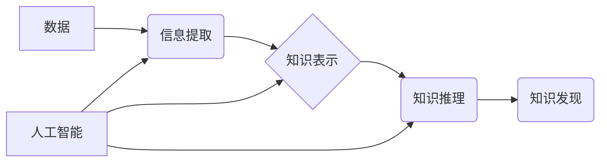

                 

## AI在知识获取中的角色转变

> 关键词：人工智能、知识获取、机器学习、深度学习、知识图谱、自然语言处理、迁移学习

### 1. 背景介绍

人类文明的进步离不开对知识的不断获取和积累。从古至今，人类一直在探索如何更有效地获取和利用知识。随着计算机技术的飞速发展，人工智能（AI）应运而生，并逐渐成为知识获取领域的新兴力量。传统的知识获取方式主要依赖于人类的经验和智慧，而AI则通过学习和分析海量数据，自动发现知识规律，并将其转化为可利用的知识形式。

早期的人工智能研究主要集中在规则式人工智能，即通过人工设定规则来实现智能。然而，规则式人工智能的局限性在于难以处理复杂、模糊的知识，并且需要大量的专家知识进行规则设计。随着机器学习和深度学习技术的突破，AI在知识获取领域取得了显著进展。

### 2. 核心概念与联系

**2.1 知识获取概述**

知识获取是指从各种数据源中提取、整理、加工和组织知识的过程。它是一个复杂的过程，涉及到信息检索、数据分析、知识表示和推理等多个环节。

**2.2 AI在知识获取中的作用**

AI通过学习和分析海量数据，可以自动发现知识规律，并将其转化为可利用的知识形式。AI在知识获取中的作用主要体现在以下几个方面：

* **自动信息提取:** AI可以从文本、图像、音频等多种数据源中自动提取关键信息，例如实体、关系、事件等。
* **知识推理和推导:** AI可以根据已有的知识库和规则，进行逻辑推理和推导，发现新的知识。
* **知识表示和组织:** AI可以将提取的知识表示为知识图谱、语义网络等形式，方便知识的存储、检索和利用。
* **知识发现和洞察:** AI可以从海量数据中发现隐藏的知识规律和模式，为人类提供新的洞察。

**2.3 核心概念关系图**



### 3. 核心算法原理 & 具体操作步骤

**3.1 算法原理概述**

在AI知识获取领域，常用的算法包括机器学习、深度学习、自然语言处理（NLP）等。

* **机器学习:** 机器学习算法通过学习数据中的模式，建立预测模型，从而实现知识获取。常见的机器学习算法包括支持向量机（SVM）、决策树、随机森林等。
* **深度学习:** 深度学习算法利用多层神经网络，可以学习更复杂的知识表示，并实现更精准的知识获取。常见的深度学习算法包括卷积神经网络（CNN）、循环神经网络（RNN）等。
* **自然语言处理:** 自然语言处理算法可以理解和处理人类语言，从而从文本数据中提取知识。常见的NLP算法包括词嵌入、句法分析、语义分析等。

**3.2 算法步骤详解**

以机器学习算法为例，其知识获取步骤可以概括为以下几个阶段：

1. **数据收集和预处理:** 收集相关数据，并进行清洗、格式化等预处理操作。
2. **特征提取:** 从数据中提取特征，例如文本中的关键词、图像中的物体等。
3. **模型训练:** 使用机器学习算法对数据进行训练，建立预测模型。
4. **模型评估:** 使用测试数据评估模型的性能，并进行调参优化。
5. **知识提取和表示:** 将模型预测结果转化为可利用的知识形式，例如知识图谱、规则等。

**3.3 算法优缺点**

* **优点:**

    * 自动化程度高，可以处理海量数据。
    * 能够发现人类难以发现的知识规律。
    * 能够不断学习和改进，提高知识获取效率。

* **缺点:**

    * 需要大量的训练数据，数据质量直接影响算法性能。
    * 算法解释性较差，难以理解模型的决策过程。
    * 难以处理复杂、模糊的知识。

**3.4 算法应用领域**

* **医疗领域:** 辅助诊断、药物研发、患者个性化治疗等。
* **金融领域:** 风险评估、欺诈检测、投资决策等。
* **教育领域:** 个性化学习、智能辅导、知识问答等。
* **制造业:** 故障预测、生产优化、质量控制等。

### 4. 数学模型和公式 & 详细讲解 & 举例说明

**4.1 数学模型构建**

在AI知识获取中，常用的数学模型包括概率模型、逻辑模型、图模型等。

* **概率模型:** 概率模型将知识表示为概率分布，例如贝叶斯网络、隐马尔可夫模型等。
* **逻辑模型:** 逻辑模型使用逻辑规则和推理来表示知识，例如描述逻辑、规则引擎等。
* **图模型:** 图模型将知识表示为节点和边构成的图结构，例如知识图谱、语义网络等。

**4.2 公式推导过程**

以贝叶斯网络为例，其核心公式为贝叶斯定理：

$$P(A|B) = \frac{P(B|A)P(A)}{P(B)}$$

其中：

* $P(A|B)$ 表示在已知事件B发生的情况下，事件A发生的概率。
* $P(B|A)$ 表示在已知事件A发生的情况下，事件B发生的概率。
* $P(A)$ 表示事件A发生的概率。
* $P(B)$ 表示事件B发生的概率。

**4.3 案例分析与讲解**

假设我们有一个贝叶斯网络，用于预测是否患有某疾病。该网络包含以下节点：

* $S$: 症状
* $D$: 疾病

我们知道，如果患有疾病，则出现症状的概率为0.8，而如果没有患有疾病，则出现症状的概率为0.1。我们还知道，患有疾病的概率为0.01。

如果患者出现症状，那么根据贝叶斯定理，我们可以计算出患者患有疾病的概率：

$$P(D|S) = \frac{P(S|D)P(D)}{P(S)}$$

其中：

* $P(S|D) = 0.8$
* $P(D) = 0.01$
* $P(S) = P(S|D)P(D) + P(S|¬D)P(¬D) = (0.8 * 0.01) + (0.1 * 0.99) = 0.107$

因此，患者患有疾病的概率为：

$$P(D|S) = \frac{0.8 * 0.01}{0.107} \approx 0.075$$

### 5. 项目实践：代码实例和详细解释说明

**5.1 开发环境搭建**

* Python 3.x
* TensorFlow 或 PyTorch
* Jupyter Notebook

**5.2 源代码详细实现**

以下是一个使用TensorFlow实现文本分类的简单代码示例：

```python
import tensorflow as tf

# 定义模型
model = tf.keras.models.Sequential([
  tf.keras.layers.Embedding(input_dim=10000, output_dim=128),
  tf.keras.layers.LSTM(128),
  tf.keras.layers.Dense(1, activation='sigmoid')
])

# 编译模型
model.compile(optimizer='adam',
              loss='binary_crossentropy',
              metrics=['accuracy'])

# 训练模型
model.fit(x_train, y_train, epochs=10)

# 评估模型
loss, accuracy = model.evaluate(x_test, y_test)
print('Loss:', loss)
print('Accuracy:', accuracy)
```

**5.3 代码解读与分析**

* 该代码定义了一个简单的文本分类模型，使用Embedding层将单词表示为向量，LSTM层提取文本特征，Dense层进行分类。
* 模型使用Adam优化器，损失函数为二分类交叉熵，评估指标为准确率。
* 模型训练了10个 epochs，并使用测试数据评估模型性能。

**5.4 运行结果展示**

运行结果会显示模型的损失值和准确率。

### 6. 实际应用场景

**6.1 知识图谱构建**

AI可以从文本、图像、音频等数据源中自动提取知识，并构建知识图谱。知识图谱可以用于知识检索、推理、问答等应用。

**6.2 智能问答系统**

AI可以理解和处理自然语言，并根据知识库回答用户的问题。智能问答系统可以用于客服、教育、搜索等领域。

**6.3 个性化推荐系统**

AI可以分析用户的行为数据，并推荐个性化的商品、服务或内容。个性化推荐系统可以用于电商、娱乐、新闻等领域。

**6.4 未来应用展望**

随着AI技术的不断发展，其在知识获取领域的应用将更加广泛和深入。例如：

* **跨模态知识获取:** AI将能够从多种模态数据中获取知识，例如文本、图像、音频、视频等。
* **迁移学习:** AI将能够将已有的知识迁移到新的领域，从而提高知识获取效率。
* **解释性AI:** AI将能够解释自己的决策过程，从而提高人类对AI的信任和理解。

### 7. 工具和资源推荐

**7.1 学习资源推荐**

* **书籍:**
    * 《深度学习》
    * 《机器学习》
    * 《自然语言处理》
* **在线课程:**
    * Coursera
    * edX
    * Udacity

**7.2 开发工具推荐**

* **TensorFlow:** 开源深度学习框架
* **PyTorch:** 开源深度学习框架
* **spaCy:** 自然语言处理库
* **NLTK:** 自然语言处理库

**7.3 相关论文推荐**

* **Attention Is All You Need**
* **BERT: Pre-training of Deep Bidirectional Transformers for Language Understanding**
* **Graph Convolutional Networks**

### 8. 总结：未来发展趋势与挑战

**8.1 研究成果总结**

AI在知识获取领域取得了显著进展，例如：

* 自动信息提取、知识推理、知识表示和组织等能力得到提升。
* 能够处理海量数据，发现人类难以发现的知识规律。
* 广泛应用于医疗、金融、教育、制造等领域。

**8.2 未来发展趋势**

* 跨模态知识获取
* 迁移学习
* 解释性AI
* 人机协作知识获取

**8.3 面临的挑战**

* 数据质量问题
* 算法解释性问题
* 知识可信度问题
* 伦理和安全问题

**8.4 研究展望**

未来，AI知识获取领域的研究将更加注重：

* 开发更鲁棒、更解释性强的算法。
* 构建更丰富、更准确的知识表示形式。
* 探索人机协作知识获取的新模式。
* 解决AI知识获取带来的伦理和安全问题。

### 9. 附录：常见问题与解答

**9.1 如何评估AI知识获取的性能？**

常用的评估指标包括准确率、召回率、F1-score、BLEU等。

**9.2 如何解决数据质量问题？**

可以通过数据清洗、格式化、标注等方法提高数据质量。

**9.3 如何提高AI知识获取的解释性？**

可以通过使用可解释的机器学习算法、可视化模型决策过程等方法提高解释性。


作者：禅与计算机程序设计艺术 / Zen and the Art of Computer Programming 
<end_of_turn>

