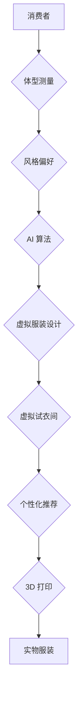

                 

## AI在虚拟服装定制中的应用：个性化时尚

> 关键词：人工智能、虚拟服装、定制化、深度学习、计算机视觉、人体建模、时尚设计

## 1. 背景介绍

时尚行业一直以来都以其个性化和不断变化的趋势著称。传统的服装定制流程通常需要繁琐的测量、设计和制作环节，耗时且成本高昂。随着人工智能 (AI) 技术的快速发展，虚拟服装定制逐渐成为一种新兴的趋势，它利用 AI 算法和虚拟现实 (VR) 技术，为消费者提供更便捷、个性化和可持续的服装定制体验。

近年来，AI 在多个领域取得了突破性进展，尤其是计算机视觉、深度学习和自然语言处理等领域。这些技术为虚拟服装定制提供了强大的工具和技术支持。例如，计算机视觉可以用于分析人体尺寸和体型，深度学习可以用于生成个性化的服装设计，自然语言处理可以用于理解消费者的需求和偏好。

## 2. 核心概念与联系

虚拟服装定制的核心概念包括：

* **虚拟试衣间:** 利用 3D 人体建模和计算机图形学技术，模拟消费者穿着虚拟服装的效果，无需实际试穿。
* **个性化设计:** 基于消费者的体型、喜好和风格，AI 算法可以生成定制化的服装设计方案。
* **智能推荐:** AI 算法可以根据消费者的历史购买记录、浏览行为和个人偏好，推荐个性化的服装款式和搭配方案。
* **3D 打印:** 利用 3D 打印技术，将虚拟服装设计转化为实物服装，实现个性化定制的最终目标。

**核心概念架构:**



## 3. 核心算法原理 & 具体操作步骤

### 3.1  算法原理概述

虚拟服装定制的核心算法主要包括：

* **人体建模:** 利用计算机视觉技术，从图像或视频中提取人体关键点，构建 3D 人体模型。
* **服装生成:** 利用深度学习算法，从大量服装图像数据中学习服装风格和结构，生成个性化的服装设计。
* **虚拟试衣:** 利用计算机图形学技术，将虚拟服装与 3D 人体模型叠加，模拟穿着效果。

### 3.2  算法步骤详解

**1. 人体建模:**

* **数据采集:** 使用摄像头或扫描仪采集消费者的身体图像数据。
* **关键点检测:** 利用计算机视觉算法，从图像数据中检测人体关键点，例如头部、肩膀、肘部、手腕、躯干、臀部、膝盖和脚踝等。
* **3D 模型构建:** 将检测到的关键点连接起来，构建 3D 人体模型。

**2. 服装生成:**

* **数据预处理:** 从大量服装图像数据中提取服装特征，例如颜色、纹理、形状和结构等。
* **模型训练:** 利用深度学习算法，例如生成对抗网络 (GAN) 或变分自编码器 (VAE)，训练服装生成模型。
* **服装设计:** 根据消费者的体型、喜好和风格，输入模型生成个性化的服装设计。

**3. 虚拟试衣:**

* **服装渲染:** 将生成的虚拟服装模型渲染成逼真的图像或视频。
* **人体模型叠加:** 将虚拟服装与 3D 人体模型叠加，模拟穿着效果。
* **交互体验:** 提供用户交互功能，例如调整服装尺寸、颜色和款式等。

### 3.3  算法优缺点

**优点:**

* **个性化定制:** 可以根据消费者的独特需求和喜好，生成个性化的服装设计。
* **便捷体验:** 无需实际试穿，消费者可以在虚拟环境中体验不同服装的效果。
* **可持续发展:** 减少服装浪费，促进可持续时尚发展。

**缺点:**

* **技术复杂性:** 需要整合多种 AI 技术，例如计算机视觉、深度学习和计算机图形学。
* **数据依赖:** 需要大量服装图像数据进行模型训练，数据质量直接影响算法性能。
* **交互体验:** 虚拟试衣体验仍需进一步提升，以更好地模拟真实穿着感受。

### 3.4  算法应用领域

虚拟服装定制算法的应用领域广泛，包括：

* **服装零售:** 为消费者提供个性化服装定制服务。
* **时尚设计:** 帮助设计师快速生成服装设计方案，并进行虚拟试衣和效果展示。
* **游戏开发:** 为游戏角色创建个性化的服装。
* **虚拟偶像:** 为虚拟偶像设计虚拟服装。

## 4. 数学模型和公式 & 详细讲解 & 举例说明

### 4.1  数学模型构建

人体建模通常采用基于关键点的 3D 模型构建方法。每个关键点用三维坐标表示，模型通过连接关键点构建骨架，并使用三角形网格填充表面。

**人体关键点坐标:**

$$
\mathbf{P} = \begin{bmatrix}
x_1, y_1, z_1 \\
x_2, y_2, z_2 \\
\vdots \\
x_n, y_n, z_n
\end{bmatrix}
$$

其中，$\mathbf{P}$ 是人体关键点坐标矩阵，$n$ 是关键点数量。

**三角形网格:**

三角形网格由一系列三角形组成，每个三角形由三个关键点构成。

### 4.2  公式推导过程

3D 人体模型的构建过程涉及以下公式：

* **关键点检测:** 利用计算机视觉算法，例如深度学习模型，从图像数据中检测人体关键点坐标。
* **骨架构建:** 将检测到的关键点连接起来，构建人体骨架。
* **表面填充:** 使用三角形网格填充人体骨架，构建完整的 3D 模型。

### 4.3  案例分析与讲解

例如，可以使用深度学习模型检测人体关键点坐标，然后将这些关键点连接起来构建骨架，最后使用三角形网格填充骨架，构建一个逼真的 3D 人体模型。

## 5. 项目实践：代码实例和详细解释说明

### 5.1  开发环境搭建

虚拟服装定制项目通常需要以下开发环境：

* **操作系统:** Windows、macOS 或 Linux
* **编程语言:** Python
* **深度学习框架:** TensorFlow 或 PyTorch
* **计算机图形学库:** OpenGL 或 Vulkan
* **3D 建模软件:** Blender 或 Maya

### 5.2  源代码详细实现

以下是一个简单的 Python 代码示例，演示如何使用 OpenCV 库检测人体关键点坐标：

```python
import cv2

# 加载人体关键点检测模型
net = cv2.dnn.readNet("yolov3.weights", "yolov3.cfg")

# 读取图像
image = cv2.imread("image.jpg")

# 获取图像尺寸
height, width, _ = image.shape

# 创建 blob
blob = cv2.dnn.blobFromImage(image, 1/255, (416, 416), (0, 0, 0), True, crop=False)

# 设置输入
net.setInput(blob)

# 获取输出
output_layers_names = net.getUnconnectedOutLayersNames()
outputs = net.forward(output_layers_names)

# 处理输出
# ...

# 绘制关键点
for detection in detections:
    confidence = detection[2]
    if confidence > 0.5:
        x, y, w, h = detection[3:7] * np.array([width, height, width, height])
        (centerX, centerY) = (int(x + w / 2), int(y + h / 2))
        cv2.circle(image, (centerX, centerY), 5, (0, 255, 0), -1)

# 显示图像
cv2.imshow("Image", image)
cv2.waitKey(0)
```

### 5.3  代码解读与分析

这段代码演示了如何使用 OpenCV 库检测人体关键点坐标。首先，加载人体关键点检测模型，然后读取图像并创建 blob。将 blob 设置为模型的输入，获取模型的输出，并处理输出结果。最后，绘制关键点并显示图像。

### 5.4  运行结果展示

运行这段代码后，将显示一张带有关键点标记的图像。每个关键点都用一个圆圈表示，圆圈的颜色为绿色。

## 6. 实际应用场景

虚拟服装定制技术已在多个实际应用场景中得到应用，例如：

* **在线服装零售:** 许多在线服装零售商已经开始提供虚拟试衣间服务，消费者可以在线选择服装并虚拟试穿，从而提高购物体验和减少退货率。
* **个性化服装设计:** 一些设计师利用虚拟服装定制技术，为客户提供个性化的服装设计服务，例如根据客户的体型、喜好和风格，生成定制化的服装款式。
* **虚拟偶像服装:** 虚拟偶像的服装设计也开始采用虚拟服装定制技术，为虚拟偶像创建更逼真的服装造型。

### 6.4  未来应用展望

未来，虚拟服装定制技术将更加成熟和普及，应用场景也将更加广泛。例如：

* **增强现实 (AR) 试衣:** 将虚拟服装与 AR 技术结合，消费者可以在现实世界中体验虚拟服装的效果。
* **个性化服装定制平台:** 建立专门的虚拟服装定制平台，提供更丰富的服装款式、材质和设计功能。
* **虚拟服装租赁:** 利用虚拟服装定制技术，提供虚拟服装租赁服务，消费者可以租用虚拟服装，体验不同的风格和款式。

## 7. 工具和资源推荐

### 7.1  学习资源推荐

* **书籍:**
    * "Deep Learning" by Ian Goodfellow, Yoshua Bengio, and Aaron Courville
    * "Computer Vision: Algorithms and Applications" by Richard Szeliski
* **在线课程:**
    * Coursera: Deep Learning Specialization
    * Udacity: Computer Vision Nanodegree
* **博客和论坛:**
    * Towards Data Science
    * Reddit: r/MachineLearning

### 7.2  开发工具推荐

* **编程语言:** Python
* **深度学习框架:** TensorFlow, PyTorch
* **计算机图形学库:** OpenGL, Vulkan
* **3D 建模软件:** Blender, Maya

### 7.3  相关论文推荐

* "Generative Adversarial Networks" by Ian Goodfellow et al.
* "Deep Learning for Computer Vision" by Yann LeCun et al.
* "3D Human Pose Estimation" by Andrew Zisserman et al.

## 8. 总结：未来发展趋势与挑战

### 8.1  研究成果总结

虚拟服装定制技术近年来取得了显著进展，从人体建模、服装生成到虚拟试衣，各个环节都取得了突破性进展。深度学习算法的应用使得服装生成更加个性化和逼真，虚拟试衣体验也更加沉浸式。

### 8.2  未来发展趋势

未来，虚拟服装定制技术将朝着以下方向发展：

* **更逼真的虚拟试衣体验:** 利用 AR 和 VR 技术，将虚拟服装与现实世界更加融合，提供更逼真的试衣体验。
* **更个性化的服装设计:** 利用 AI 算法，更加深入地理解消费者的需求和喜好，生成更加个性化的服装设计。
* **更可持续的服装生产:** 利用虚拟服装定制技术，减少服装浪费，促进可持续时尚发展。

### 8.3  面临的挑战

虚拟服装定制技术也面临着一些挑战：

* **数据质量:** 虚拟服装定制算法依赖于大量高质量的服装图像数据，数据质量直接影响算法性能。
* **交互体验:** 虚拟试衣体验仍需进一步提升，以更好地模拟真实穿着感受。
* **技术成本:** 虚拟服装定制技术需要整合多种先进技术，技术成本较高。

### 8.4  研究展望

未来，需要进一步研究以下问题：

* 如何提高虚拟服装定制算法的准确性和效率。
* 如何设计更逼真的虚拟试衣体验。
* 如何降低虚拟服装定制技术的成本，使其更加普及。


## 9. 附录：常见问题与解答

**Q1: 虚拟服装定制技术与传统服装定制有什么区别？**

**A1:** 虚拟服装定制技术利用 AI 和虚拟现实技术，提供更加便捷、个性化和可持续的服装定制体验。传统服装定制需要繁琐的测量、设计和制作环节，耗时且成本高昂。

**Q2: 虚拟服装定制技术是否会取代传统服装定制？**

**A2:** 虚拟服装定制技术和传统服装定制各有优缺点，两者并不会完全取代对方。虚拟服装定制技术更适合个性化定制和快速迭代，而传统服装定制更适合高品质定制和复杂设计。

**Q3: 虚拟服装定制技术有哪些应用场景？**

**A3:** 虚拟服装定制技术应用场景广泛，包括在线服装零售、个性化服装设计、虚拟偶像服装等。

**作者：禅与计算机程序设计艺术 / Zen and the Art of Computer Programming**<end_of_turn>

