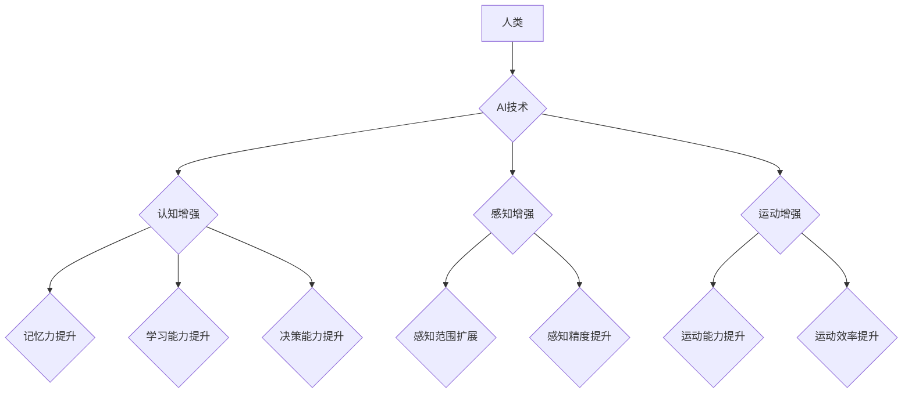

                 

## AI时代的人类增强：道德考虑与身体增强的未来发展机遇分析机遇挑战机遇

> 关键词：人工智能、人类增强、身体增强、道德伦理、未来趋势、技术挑战

## 1. 背景介绍

人类文明自诞生以来，就一直在探索如何超越自身的局限性。从使用工具到发明火，从农业革命到工业革命，每一次进步都标志着人类对自身能力的提升。如今，人工智能（AI）的快速发展为人类增强带来了前所未有的机遇。

AI技术能够分析海量数据，识别模式，并做出决策，这为增强人类认知、感知、运动能力等方面提供了强大的工具。例如，脑机接口技术可以将人类大脑与计算机连接，实现思想控制设备，增强人类的认知能力；基因编辑技术可以修改人类基因，增强身体素质，提高寿命；机器人技术可以为人类提供辅助，增强人类的体力和效率。

然而，人类增强也引发了广泛的伦理和社会争议。如何确保AI技术安全可靠？如何避免技术落入不法之手？如何分配增强带来的利益？这些问题都需要认真思考和探讨。

## 2. 核心概念与联系

### 2.1 人类增强

人类增强是指利用科技手段提升人类的生理、认知和社会能力，使其超越自然界限制，达到更高水平的性能。

### 2.2 AI技术在人类增强的应用

AI技术在人类增强领域扮演着至关重要的角色，它为增强人类能力提供了强大的工具和平台。

* **认知增强:** AI可以帮助人类提高记忆力、学习能力、决策能力等认知功能。例如，AI驱动的学习平台可以个性化学习方案，帮助学生更高效地掌握知识；AI辅助决策系统可以分析大量数据，为人类提供更精准的决策建议。
* **感知增强:** AI可以帮助人类扩展感知范围，提高感知精度。例如，AI驱动的增强现实（AR）技术可以将虚拟信息叠加到现实世界中，为人类提供更丰富的感知体验；AI驱动的智能眼镜可以识别物体、翻译语言，帮助人类更便捷地获取信息。
* **运动增强:** AI可以帮助人类增强运动能力，提高运动效率。例如，AI驱动的运动辅助设备可以帮助残疾人进行运动，提高生活质量；AI驱动的运动训练系统可以根据用户的身体状况，制定个性化的训练方案，帮助用户更快地达到目标。

**Mermaid 流程图**



## 3. 核心算法原理 & 具体操作步骤

### 3.1 算法原理概述

人类增强领域涉及多种算法，例如机器学习、深度学习、自然语言处理、计算机视觉等。这些算法通过训练数据，学习人类行为模式，并生成相应的输出，从而实现对人类能力的增强。

* **机器学习:** 是一种算法，通过训练数据，学习数据之间的模式，并根据模式进行预测或分类。
* **深度学习:** 是一种更高级的机器学习算法，利用多层神经网络，模拟人类大脑的学习过程，能够处理更复杂的数据，并获得更准确的结果。
* **自然语言处理:** 是一种处理自然语言的算法，能够理解和生成人类语言，例如机器翻译、文本摘要、对话系统等。
* **计算机视觉:** 是一种处理图像和视频的算法，能够识别物体、场景、人脸等，例如自动驾驶、医疗影像分析等。

### 3.2 算法步骤详解

以机器学习为例，其基本步骤如下：

1. **数据收集:** 收集大量相关数据，例如图像、文本、音频等。
2. **数据预处理:** 对数据进行清洗、转换、特征提取等处理，使其适合算法训练。
3. **模型选择:** 选择合适的机器学习模型，例如线性回归、逻辑回归、决策树、支持向量机等。
4. **模型训练:** 使用训练数据，训练机器学习模型，使其能够学习数据之间的模式。
5. **模型评估:** 使用测试数据，评估模型的性能，例如准确率、召回率、F1-score等。
6. **模型调优:** 根据评估结果，调整模型参数，提高模型性能。
7. **模型部署:** 将训练好的模型部署到实际应用场景中。

### 3.3 算法优缺点

**优点:**

* **自动化:** 机器学习算法可以自动学习数据模式，无需人工干预。
* **精准度:** 经过训练的机器学习模型能够达到很高的预测精度。
* **可扩展性:** 机器学习算法可以处理海量数据，并扩展到不同的应用场景。

**缺点:**

* **数据依赖:** 机器学习算法需要大量数据进行训练，否则性能会下降。
* **黑盒效应:** 一些复杂的机器学习模型难以解释其决策过程，导致缺乏透明度。
* **偏见问题:** 如果训练数据存在偏见，则模型也会产生偏见，导致不公平的结果。

### 3.4 算法应用领域

机器学习算法广泛应用于各个领域，例如：

* **医疗保健:** 疾病诊断、药物研发、个性化治疗等。
* **金融:** 欺诈检测、风险评估、投资决策等。
* **零售:** 商品推荐、客户画像、库存管理等。
* **交通:** 自动驾驶、交通预测、路线规划等。

## 4. 数学模型和公式 & 详细讲解 & 举例说明

### 4.1 数学模型构建

在人类增强领域，数学模型常用于描述和预测人类能力的提升。例如，可以使用线性回归模型来预测学习效率对认知能力的影响，可以使用神经网络模型来模拟人类大脑的学习过程。

### 4.2 公式推导过程

以线性回归模型为例，其目标是找到一条直线，使得预测值与真实值之间的误差最小。

假设我们有n个数据点，每个数据点包含一个输入特征x和一个输出特征y。线性回归模型的公式如下：

$$y = wx + b$$

其中，w和b分别是模型的参数，需要通过训练数据进行估计。

为了找到最佳的w和b值，可以使用最小二乘法。最小二乘法的目标是找到一条直线，使得所有数据点到直线的距离之和最小。

最小二乘法的公式如下：

$$J(w, b) = \sum_{i=1}^{n}(y_i - wx_i - b)^2$$

其中，J(w, b)是损失函数，表示模型预测值与真实值之间的误差。

通过求解损失函数的最小值，可以得到最佳的w和b值。

### 4.3 案例分析与讲解

假设我们想预测学生的学习时间对考试成绩的影响。我们可以收集n个学生的学习时间和考试成绩数据，并使用线性回归模型进行预测。

通过训练数据，我们可以得到最佳的w和b值。例如，假设我们得到w = 0.8和b = 60。

这意味着，学生的学习时间每增加1小时，考试成绩预计会提高0.8分。

## 5. 项目实践：代码实例和详细解释说明

### 5.1 开发环境搭建

为了实现人类增强相关的项目，需要搭建相应的开发环境。

* **操作系统:** Linux、macOS、Windows等。
* **编程语言:** Python、C++、Java等。
* **深度学习框架:** TensorFlow、PyTorch、Keras等。
* **硬件:** GPU、CPU、内存等。

### 5.2 源代码详细实现

以使用Python和TensorFlow实现一个简单的图像识别模型为例：

```python
import tensorflow as tf

# 定义模型结构
model = tf.keras.models.Sequential([
  tf.keras.layers.Conv2D(32, (3, 3), activation='relu', input_shape=(28, 28, 1)),
  tf.keras.layers.MaxPooling2D((2, 2)),
  tf.keras.layers.Conv2D(64, (3, 3), activation='relu'),
  tf.keras.layers.MaxPooling2D((2, 2)),
  tf.keras.layers.Flatten(),
  tf.keras.layers.Dense(10, activation='softmax')
])

# 编译模型
model.compile(optimizer='adam',
              loss='sparse_categorical_crossentropy',
              metrics=['accuracy'])

# 训练模型
model.fit(x_train, y_train, epochs=5)

# 评估模型
loss, accuracy = model.evaluate(x_test, y_test)
print('Loss:', loss)
print('Accuracy:', accuracy)
```

### 5.3 代码解读与分析

这段代码定义了一个简单的卷积神经网络模型，用于识别手写数字。

* `tf.keras.models.Sequential`：定义一个顺序模型，即层级结构。
* `tf.keras.layers.Conv2D`：定义一个卷积层，用于提取图像特征。
* `tf.keras.layers.MaxPooling2D`：定义一个最大池化层，用于降低特征图尺寸。
* `tf.keras.layers.Flatten`：将多维特征图转换为一维向量。
* `tf.keras.layers.Dense`：定义一个全连接层，用于分类。
* `model.compile`：编译模型，指定优化器、损失函数和评价指标。
* `model.fit`：训练模型，使用训练数据进行训练。
* `model.evaluate`：评估模型，使用测试数据进行评估。

### 5.4 运行结果展示

训练完成后，可以将模型应用于新的图像数据，进行预测。

## 6. 实际应用场景

### 6.1 医疗保健

* **疾病诊断:** AI算法可以分析患者的医疗影像数据，例如X光片、CT扫描、MRI等，辅助医生诊断疾病。
* **药物研发:** AI算法可以分析大量的生物数据，加速药物研发过程。
* **个性化治疗:** AI算法可以根据患者的基因信息、生活习惯等数据，制定个性化的治疗方案。

### 6.2 教育

* **个性化学习:** AI算法可以根据学生的学习进度和能力，提供个性化的学习方案。
* **智能辅导:** AI算法可以作为学生的智能辅导员，解答学生的疑问，提供学习建议。
* **自动批改:** AI算法可以自动批改学生的作业，节省教师的时间。

### 6.3 娱乐

* **虚拟现实:** AI算法可以增强虚拟现实体验，例如生成更逼真的虚拟环境，提供更智能的虚拟角色。
* **增强现实:** AI算法可以将虚拟信息叠加到现实世界中，例如在购物时提供商品信息，在旅游时提供景点介绍。
* **游戏:** AI算法可以生成更智能的游戏对手，提供更丰富的游戏体验。

### 6.4 未来应用展望

随着AI技术的不断发展，人类增强将在更多领域得到应用，例如：

* **脑机接口:** 将人类大脑与计算机连接，实现思想控制设备，增强人类认知能力。
* **基因编辑:** 修改人类基因，增强身体素质，提高寿命。
* **机器人辅助:** 利用机器人辅助人类完成各种任务，提高人类效率。

## 7. 工具和资源推荐

### 7.1 学习资源推荐

* **在线课程:** Coursera、edX、Udacity等平台提供丰富的AI课程。
* **书籍:** 《深度学习》、《人工智能：一个现代方法》等书籍。
* **博客:** TensorFlow博客、PyTorch博客等。

### 7.2 开发工具推荐

* **编程语言:** Python、C++、Java等。
* **深度学习框架:** TensorFlow、PyTorch、Keras等。
* **云计算平台:** AWS、Google Cloud、Azure等。

### 7.3 相关论文推荐

* **《ImageNet Classification with Deep Convolutional Neural Networks》**
* **《Attention Is All You Need》**
* **《Generative Adversarial Networks》**

## 8. 总结：未来发展趋势与挑战

### 8.1 研究成果总结

近年来，AI技术在人类增强领域取得了显著进展，例如：

* **图像识别:** AI算法能够识别各种物体、场景、人脸等，应用于医疗诊断、自动驾驶等领域。
* **自然语言处理:** AI算法能够理解和生成人类语言，应用于聊天机器人、机器翻译等领域。
* **语音识别:** AI算法能够识别语音，应用于语音助手、语音搜索等领域。

### 8.2 未来发展趋势

未来，人类增强领域将朝着以下趋势发展：

* **更智能的AI算法:** AI算法将更加智能，能够更好地理解和模拟人类行为。
* **更广泛的应用场景:** 人类增强技术将应用于更多领域，例如教育、医疗、娱乐等。
* **更个性化的体验:** 人类增强技术将更加个性化，能够根据用户的需求提供定制化的服务。

### 8.3 面临的挑战

人类增强技术也面临着一些挑战：

* **伦理问题:** 人类增强技术可能会带来伦理问题，例如公平性、隐私性、安全问题等。
* **技术挑战:** 人类增强技术还处于发展初期，需要克服许多技术挑战，例如算法精度、数据安全等。
* **社会接受度:** 人类增强技术可能会引发社会争议，需要提高公众的认知和接受度。

### 8.4 研究展望

未来，我们需要加强对人类增强技术的伦理研究，制定相应的规范和政策，确保其安全、公平、可持续地发展。同时，还需要加大对基础研究的投入，突破技术瓶颈，推动人类增强技术向更智能、更广泛、更个性化的方向发展。


## 9. 附录：常见问题与解答

**Q1: 人类增强技术会取代人类吗？**

A1: 人类增强技术旨在增强人类的能力，而不是取代人类。AI技术可以帮助人类完成更复杂的任务，提高效率，但人类的创造力、情感、伦理判断等能力仍然是不可替代的。

**Q2: 人类增强技术会带来哪些伦理问题？**

A2: 人类增强技术可能会带来一些伦理问题，例如：

* **公平性:** 人类增强技术可能导致社会分化，富人更容易获得增强带来的好处，而穷人则难以负担。
* **隐私性:** 人类增强技术可能会收集和使用大量的个人数据，侵犯用户的隐私。
* **安全问题:** 人类增强技术可能会被用于恶意目的，例如控制他人、制造假新闻等。

**Q3: 如何确保人类增强技术的安全和可控性？**

A3: 为了确保人类增强技术的安全和可控性，我们需要采取以下措施：

* **加强伦理研究:** 对人类增强技术的伦理问题进行深入研究，制定相应的规范和政策。
* **加强技术监管:** 对人类增强技术的研发和应用进行监管，防止其被用于非法目的。
* **提高公众认知:** 加强对公众的科普宣传，提高公众对人类增强技术的认知和接受度。


作者：禅与计算机程序设计艺术 / Zen and the Art of Computer Programming<end_of_turn>

